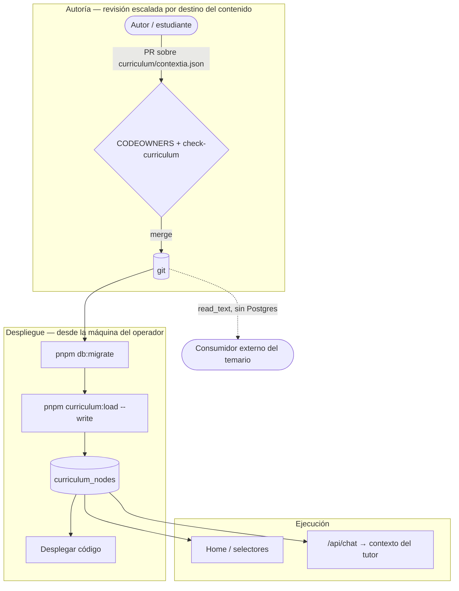
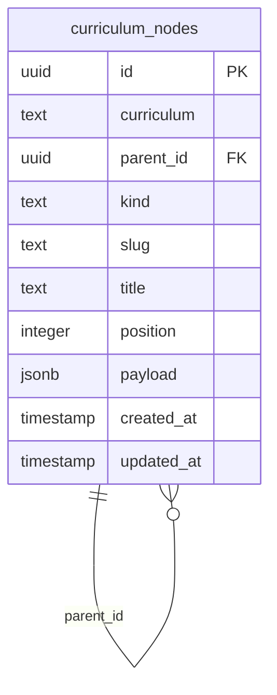
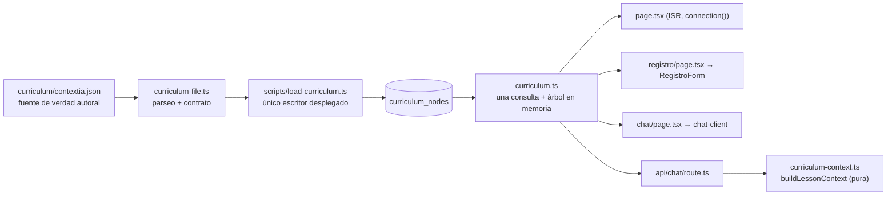

# PRD-002: El currículo como dato jerárquico

**Status**: Draft
**Date**: 2026-07-27
**Author**: AI-assisted
**Priority**: P1
**Depends on**: None
**Supersedes**: None
**Issue**: [CON-5](https://linear.app/contextia/issue/CON-5)

## Impacted Projects

| Project | Impact |
|---------|--------|
| **platform** | Tabla nueva `curriculum_nodes` (auto-referencial, profundidad libre). Se retiran `src/lib/lessons.ts` y `src/lib/program.ts`; `src/lib/schedule.ts` referencia slugs. Módulos nuevos `src/lib/curriculum.ts`, `src/lib/curriculum-file.ts`, `src/lib/curriculum-context.ts` y `scripts/load-curriculum.ts`. Archivo versionado en `curriculum/contextia.json` + `curriculum/README.md`. Leen de base de datos `src/app/page.tsx`, `src/app/chat/page.tsx`, `src/app/chat-client.tsx` y `src/app/registro/page.tsx` (esta última se parte en Server Component + componente cliente). `tsconfig.json` habilita `allowImportingTsExtensions`; `package.json` añade `curriculum:load`; `.env.example` añade `CURRICULUM_SLUG` y `CURRICULUM_TEST_DATABASE_URL`. Nuevos `.github/CODEOWNERS` y una cláusula en `CONTRIBUTING.md`. |

---

## 1. Problem Statement

El currículo de la escuela vive escrito a mano en tres constantes de TypeScript que no se conocen entre sí: `src/lib/lessons.ts:16` (siete lecciones `L1`–`L7`, ninguna declara a qué módulo pertenece), `src/lib/program.ts:23` (cuatro etapas `E1`–`E4`, cuyos módulos son *strings sueltos* sin relación con las lecciones) y `src/lib/schedule.ts:16` (fechas indexadas por `lessonId`). Son tres listas planas que hablan de lo mismo por casualidad.

Las consecuencias, en orden de gravedad ([CON-5](https://linear.app/contextia/issue/CON-5)):

1. **La plataforma no puede responder preguntas básicas de su propio dominio** — cuántas lecciones tiene un módulo, en qué módulo va un estudiante, qué le falta para cerrar una etapa. No hay jerarquía que consultar.
2. **Bloquea el seguimiento de progreso** (`CON-6`). El commit `f2b6f61` retiró `user.current_lesson` porque nadie la escribía ni la leía: el único campo con forma de progreso murió por no tener estructura alrededor.
3. **Convierte una errata en un cambio de código de producción.** `CONTRIBUTING.md:19` asigna a los estudiantes de E1 "fe de erratas"; con el temario como `const` en TypeScript, corregir una errata obliga a un principiante absoluto a editar producción.
4. **No es adoptable.** El repositorio es AGPL-3.0 y público; hoy "usarlo" significa entrar a `src/lib/` a borrar el currículo de Contextia.

El nudo son tres restricciones que tiran en direcciones opuestas: el currículo debe ser **dato en base de datos**; el campo `stuck` de cada lección —que se inyecta al tutor en cada petición— debe seguir siendo **revisable en un PR**, porque salió del system prompt en la versión 0.6 justamente para que una clase nueva no obligara a recertificar el tutor contra su banco de evals; y el temario debe ser **reconstruible sin Postgres**. Las dos últimas dicen "el temario vive en git"; la primera dice "vive en la base de datos". Este PRD las reconcilia haciendo la base de datos una **proyección** de un archivo versionado, no la fuente de verdad.

### 1.1 Prioridad: Contextia decide, el modelo no la conoce

El orden importa y es fácil de invertir. La adoptabilidad **no es un objetivo que compita** con servir a Contextia: es la disciplina con la que se implementa lo que Contextia necesita. El modelo de referencia es React — el roadmap lo decide quien lo usa en producción, y aun así no hay un componente de su producto dentro de la librería, ni un fork interno.

Traducido: la jerarquía se construye porque `CON-6` necesita colgar progreso de una llave estable, no porque un adoptante hipotético quiera árboles. Y **Contextia es un consumidor del modelo genérico, no un caso especial suyo**: `curriculum/contextia.json` se carga por exactamente el mismo camino que el archivo de cualquier otro. Un `if (curriculum === "contextia")` en cualquier punto del código significa que el modelo ya se rompió (§ 7, invariante 2).

## 2. Goals

- Modelar el currículo como un árbol de profundidad libre en base de datos, consultable en ambos sentidos: lecciones **de un nodo dado**, y cadena de ancestros de una lección.
- Dar a `CON-6` una llave estable de la que colgar progreso. La garantía se enuncia entera y sin asteriscos: **el `id` de un nodo sobrevive a todo salvo un borrado explícitamente autorizado con `--allow-deletes`** — recargas, reordenamientos, cambios de padre y renombrados del `slug` incluidos.
- Mantener el archivo versionado como fuente de verdad autoral, de modo que todo cambio de `stuck` siga pasando por revisión — y **elevar el escrutinio de esa revisión al nivel que hoy protege al system prompt**, porque el destino del contenido no cambia aunque cambie el archivo (§ 8.1).
- Cuando el cargador reciba un archivo que no cumpla el contrato de `payload` (§ 5.1), entonces debe abortar sin escribir nada y nombrar el nodo y la regla que falló.
- Si una carga borrase **cualquier** nodo, entonces el cargador debe abortar salvo `--allow-deletes` explícito; si además cambiase la identidad de alguno, salvo `--allow-identity-change` con los `id` nombrados.
- Sacar de `src/lib/` todo módulo que exporte contenido del currículo, de forma que un tercero cargue el suyo sin tocar código.
- No cambiar ni un píxel: home, selector de lección del chat, selector del registro y contexto del tutor se comportan igual antes y después.

## 3. Non-Goals

- **Panel de administración o CRUD de currículo.** No es una limitación temporal que haya que rodear: es lo que sostiene que `stuck` sea revisable en git (§ 7, invariante 1).
- **Multi-organización, roles o aislamiento por tenant.** La columna `curriculum` permite varios currículos en una base de datos, **pero no hay control de acceso entre ellos** — advertencia que este PRD lleva al código y a `SYSTEM_ARTIFACT.md`, no solo aquí (§ 8.5).
- **Seguimiento de progreso del estudiante** — es `CON-6`, y depende de este PRD.
- **Rediseño de `schedule.ts`** más allá del mínimo para que compile contra los nuevos slugs — es `CON-7`.
- **Escribir el contenido de E1-M2 a M5.** El modelo debe tolerar módulos declarados y vacíos.
- **Modificar el system prompt del tutor ni su banco de evals.** Consecuencia asumida y anotada: el hueco de `tutor-prompt.ts:16` (§ 8.2) queda abierto y se traslada a un PRD de seguimiento.
- **Modificar consumidores externos del temario.** Este PRD publica el archivo en ruta estable (§ 5.4); actualizar a quien lo lea queda fuera.

## 4. User Flows / Design

No hay cambio visible para el estudiante. Los flujos que cambian son de autoría y despliegue.



### 4.1 Happy path

1. Un autor edita `curriculum/contextia.json` y abre un PR. `.github/CODEOWNERS` exige aprobación del propietario del currículo; la cláusula de `CONTRIBUTING.md` (§ 8.1) marca el cambio como "contenido que alcanza el bloque de system".
2. `node scripts/check-curriculum.ts` valida el **archivo real** contra su esquema y su contrato de contenido (§ 5.1). No depende de base de datos.
3. Tras el merge, el operador ejecuta `pnpm db:migrate` y `pnpm curriculum:load --write` desde su máquina contra la `DATABASE_URL` de producción, igual que se opera hoy cualquier migración.
4. Se despliega el código. La home y los selectores leen el árbol; el tutor compone su bloque de contexto desde él.
5. Un consumidor externo que necesite el temario sin Postgres lee `curriculum/contextia.json` del repositorio.

### 4.2 Error branches

| Condición | Comportamiento |
|---|---|
| El archivo no valida (estructura o contrato de `payload`) | `curriculum:load` aborta **antes de escribir nada**, nombra el nodo y la regla, sale con código 1. |
| La carga borraría **cualquier** nodo | Aborta y reporta cada baja con su `id` y su título. Solo procede con `--allow-deletes`. |
| La carga cambiaría el `id` de un nodo existente (clase `borrar+crear`) | Aborta. Solo procede con `--allow-identity-change` y los `id` nombrados en la línea de órdenes — `--allow-deletes` por sí sola **no** la autoriza. |
| Un `id` del archivo ya existe bajo otro `curriculum` | Aborta en el paso 2, antes de escribir, nombrando el `id` y el currículo dueño. |
| `curriculum:load` sin `--write` | Valida y reporta el diff. **No escribe**: el modo destructivo no es el defecto. |
| Se ejecuta dos veces con el mismo archivo | Segunda pasada sin cambios: mismas filas, mismos `id`, `updated_at` intacto en las filas idénticas. |
| Un nodo cambia de padre entre dos cargas | Conserva su `id` (§ 5.3, upsert antes que borrado, todo en una transacción). |
| Un `slug` cambia | `UPDATE` de una columna: el `id` se conserva y con él todo lo que `CON-6` cuelgue de esa fila. No hay operación especial. |
| Un nodo llega sin `id`, con `id` malformado o duplicado | Rechazado en validación, antes de escribir. |
| La tabla no tiene el currículo declarado | `getCurriculumForest()` lanza `CurriculumNotLoadedError`. Afecta a **la home, `/chat` y `/registro`** — las tres leen el bosque. Es un error de despliegue, no de contenido: el orden de § 10 lo hace inalcanzable, y el guardarraíl de borrado impide llegar ahí desde un PR. |
| Fallo transitorio de Postgres con el caché caliente | Se sirve el valor cacheado y se reintenta al expirar el TTL. **Requiere verificación antes del gate, no está dado por sentado**: la promesa depende de que `unstable_cache` sirva el valor stale cuando falla la revalidación, comportamiento de una API `unstable_*` que este PRD ya no da por bueno solo por lectura de la documentación — la afirmación anterior sobre `connection()` resultó falsa por exactamente esa vía. Si la versión de Next instalada no lo hace, la lectura se envuelve en un `try/catch` que sirva el último valor conocido. Sin caché del que servir, cualquier hipo de Postgres sería un 500 en la landing. |
| El cliente manda un `lesson` que no encaja en `/^[A-Za-z0-9_-]{1,64}$/` | Se descarta **antes de tocar la base de datos**. El tutor procede sin lección y pregunta, igual que hoy. |
| El cliente manda un `lesson` válido pero inexistente | Igual que hoy: el tutor pregunta. El slug nunca se interpola en el prompt. |
| Un módulo declarado sin lecciones | Válido. Distinto de "etapa sin detalle todavía", que se marca con `payload.hasDetail` (§ 6.1). |

## 5. API

Este PRD **no añade ni modifica ningún endpoint HTTP**. `POST /api/chat` mantiene su cuerpo `{ messages, lesson }` exacto. La superficie que cambia es interna.

### 5.1 `src/lib/curriculum-file.ts` — parseo y validación puros (nuevo)

Sin dependencias de base de datos. **Importa con rutas relativas y extensión** (`./schema.ts`), no con el alias `@/lib/...`: Node no conoce los `paths` de `tsconfig.json`, y este módulo debe ser importable desde `scripts/` (§ 9, prerrequisito).

```ts
export type CurriculumNodeInput = {
  /** UUID estable, autoría del archivo. ES la identidad del nodo. */
  id: string;
  /** Etiqueta legible y mutable. Único por currículo, pero NO es la identidad. */
  slug: string;
  kind: string;
  title: string;
  children?: CurriculumNodeInput[];
  payload?: Record<string, unknown>;
};

export type CurriculumFile = {
  curriculum: string;
  nodes: CurriculumNodeInput[];
};

/** Fila lista para insertar. `parentId` sale del anidamiento. */
export type FlatNode = {
  id: string;
  curriculum: string;
  slug: string;
  parentId: string | null;
  kind: string;
  title: string;
  position: number;
  payload: Record<string, unknown>;
  depth: number;          // 0 = raíz; el cargador inserta en orden ascendente
};

export function parseCurriculumFile(raw: unknown): FlatNode[];

/** Arma el bosque a partir de filas planas, **por `parentId`** — no por `depth`,
 *  que las filas de Postgres no traen porque la profundidad no está en el
 *  esquema (§ 6.1). Puro: `curriculum.ts` lo reutiliza sobre lo que trae de la
 *  base, de modo que el ensamblado existe una sola vez en el repositorio y la
 *  cota compuesta es comprobable sin base de datos. */
export function buildForest(nodes: Omit<FlatNode, "depth">[]): CurriculumNode[];
```

**La identidad es explícita, no inferida.** Cada nodo declara su `id` en el archivo y el cargador hace upsert **por `id`**. `slug` pasa a ser una etiqueta mutable: renombrar `L3` a `css-basico` es un `UPDATE` normal que conserva el `id`, y con él todo lo que `CON-6` haya colgado de esa fila. La alternativa —inferir la identidad del `slug` y declarar los renombrados con un campo aparte— se evaluó y se descartó; el razonamiento está en § 7.1.

El precio es que añadir un nodo exige generar un UUID (`crypto.randomUUID()`, o `uuidgen`). Es fricción para el decano al abrir un módulo, no para el estudiante que corrige una errata — que edita `title` o `stuck` de un nodo que ya tiene su `id`.

**Reglas de validación.** Todas son **puras**: no hay ninguna que exija consultar la base, así que la puerta de revisión (§ 4.1 paso 2) puede ejecutarlas enteras sobre el PR.

- `id` presente, con forma UUID, y único dentro del archivo.
- `slug` único dentro del currículo, conforme a `/^[A-Za-z0-9_-]{1,64}$/`.
- `kind` y `title` no vacíos; `children` array si está presente.
- Sin `slug` de raíz duplicado. *(No hay regla de "`parent` inexistente": el formato es anidado, no plano, y ese error no es representable.)*

**Contrato de `payload`.** Es lo que el esquema no puede dar y hoy da el compilador vía `as const`. La validación es **por llave**, contra la tabla de vocabulario de § 6.1, que declara el tipo esperado de cada una:

| Regla | Alcance | Motivo |
|---|---|---|
| Tipo conforme a la tabla de § 6.1 | Toda llave declarada | Una llave del bloque de system con un objeto dentro se interpolaría como `[object Object]`, y un array como su `join(",")`, en silencio, hacia el modelo. |
| No vacía | **Toda llave marcada obligatoria en § 6.1**, no solo `outcome`/`stuck` | Hoy lo garantiza el tipo. Sin la regla, un nodo carga limpio y el consumidor recibe la cadena `undefined`. |
| Cota de 4 000 caracteres | **Todo lo que alcanza el bloque de system**, según la marca de § 6.1 — incluida la columna `title`, que no es `payload` | El segundo bloque de system **no lleva `cache_control`** (`src/app/api/chat/route.ts:75-78`): un valor gigante se factura como entrada no cacheada en cada petición de cada usuario, indefinidamente. |
| Cota de 24 000 caracteres sobre el **bloque compuesto**, evaluada **por lección**: para toda lección del archivo, `buildLessonContext(moduleLessons, ancestors, slug)` ≤ 24 000. Se mide **llamando a la función real** sobre el bosque que devuelve `buildForest`, no aproximando por suma de longitudes — si el validador aproxima, lo validado y lo que se factura divergen y la cota deja de acotar. | El bloque entero, no una llave | La cota por llave no acota la **agregación**: un archivo que añade 5 000 lecciones valida limpio, y el índice `Lecciones del módulo:` crece sin techo. |
| Cota de 500 nodos por currículo | El archivo entero | La cota anterior acota el bloque del tutor y **nada acota las listas de los selectores**: `title` está acotado por nodo y el número de nodos no lo estaba por nada — el guardarraíl de § 5.3 cuenta bajas, nunca altas. `/registro` es pública, sin login, y renderizaría la lista entera. |
| Sin patrones imperativos hacia el modelo (`ignora`, `olvida`, `instrucciones anteriores`, `system`) | **Todo lo que alcanza el bloque de system** (`stuck`, `outcome`, `audience`, `title`), no solo `stuck` | § 8.2. Misma forma que ya tiene `scripts/check-lessons.ts:20-24`, aplicada al contenido en vez de al slug. |
| Esquema seguro en URLs | Todo valor que case `/^\s*[a-z][a-z0-9+.-]*:/i` **o** empiece por `//` | Acotar a "esquema distinto de `https:`" dejaba pasar `//evil.example.com/x`, relativo-a-protocolo, que el navegador trata como cross-origin. |
| Host en allowlist para URLs | Todo valor con forma de URL | El control de esquema no cubre el **destino**: `https://evil.example.com` pasaba y seguía siendo un enlace saliente arbitrario bajo la marca de la escuela, en la landing pública. |

La regla de tipo está acotada a lo que la justifica: la interpolación hacia el modelo. No se extiende a `payload` entero — `hours` es `number` porque `src/lib/program.ts:49` lo tipa así y la home lo interpola en `~{stage.hours} h`; forzarlo a `string` sería copiar la forma de la regla sin su motivo.

### 5.2 `src/lib/curriculum.ts` — lectura (nuevo)

```ts
export type CurriculumNode = {
  id: string;
  slug: string;
  kind: string;
  title: string;
  payload: Record<string, unknown>;
  children: CurriculumNode[];
};

/** Las raíces del currículo, en orden de `position`. El currículo es un
 *  BOSQUE, no un árbol: hoy son las 4 etapas hermanas. Lanza
 *  CurriculumNotLoadedError si el array sale vacío. */
export function getCurriculumForest(curriculum: string): Promise<CurriculumNode[]>;

/** Lecciones (kind === "lesson") bajo `rootSlug`, a cualquier profundidad, en
 *  orden de recorrido en profundidad (`position` dentro de cada nivel).
 *  Sin `rootSlug`, todas las del currículo. */
export function getLessons(curriculum: string, rootSlug?: string): Promise<CurriculumNode[]>;

/** Cadena de ancestros de un nodo, de la raíz hacia abajo. `[]` si el slug no
 *  existe — nunca lanza: es el caso que hoy hace que el tutor pregunte. */
export function getAncestors(curriculum: string, slug: string): Promise<CurriculumNode[]>;

/** La forma que reciben los selectores. No el nodo completo: `payload.stuck`
 *  no tiene por qué viajar al cliente. */
export type LessonOption = Pick<CurriculumNode, "slug" | "title">;
```

**Bosque, no árbol.** El currículo no tiene raíz única: son cuatro etapas hermanas (`src/lib/program.ts:23` es un array de 4 y `src/app/page.tsx:195` hace `PROGRAM.map`). Un tipo de retorno singular no podría representar el dato.

**Orden de `getLessons`**: recorrido en profundidad. Sin él, dos lecciones de módulos distintos pueden tener ambas `position: 0` y el orden total queda sin definir — y el orden de los dos selectores es parte de la promesa de "cero cambio visible" (§ 9 fila 22).

**Estrategia de lectura y caché.** Las cuatro funciones se sirven de **una sola consulta** que trae las 21 filas del currículo y arma el bosque en memoria, envuelta en `unstable_cache(..., { revalidate: 600 })`. Sin `tags`: la invalidación inmediata sería la respuesta ideal a la retirada de urgencia de § 8.2, pero § 3 descarta CRUD y panel, así que no hay superficie desde la que llamar a `revalidateTag` — declarar la etiqueta sugeriría una capacidad que no existe, y la única vía real es esperar el TTL. Tres precisiones que sostienen lo anterior:

- **Son 21 filas**: 4 etapas + 10 módulos (5 en E1 y 5 en E2) + 7 lecciones. Los cinco módulos de E2 tienen que existir como nodos aunque su contenido esté vacío, porque la fila 2 de § 9 exige reproducir el sufijo `· N módulos`, que sale de `stage.modules.length` (`src/app/page.tsx:218`).
- **El TTL no es opcional.** Un caché de módulo sin expiración, en el servidor Node de larga vida de Railway, lee el árbol una vez y no vuelve a mirar: una errata corregida y cargada **no llegaría a la aplicación hasta el siguiente despliegue**, que es justo el flujo que § 1 vende, y la retirada de urgencia de un `stuck` dañino (§ 8.2) sería un despliegue en vez de una carga. Con 600 s, un cambio de solo contenido se propaga en ≤ 10 min sin redesplegar.
- El caché con TTL es además **lo que hace cierta** la rama degradada de § 4.2: sin un caché real del que servir, un hipo de Postgres devuelve 500 en la landing.

**Origen de `curriculum`**: `CURRICULUM_SLUG` del entorno, **obligatoria y sin defecto**, añadida a `.env.example`. Sin defecto por dos razones: un defecto `"contextia"` deja un literal de Contextia en `src/` —rozando la invariante 2— y hace que un entorno mal configurado seleccione Contextia en silencio en vez de fallar. **Nunca se deriva del request** (§ 8.5).

`buildLessonContext()` se mueve a `src/lib/curriculum-context.ts` y **se mantiene pura** para que su comprobación siga corriendo sin base de datos:

```ts
// antes: buildLessonContext(lessonId?: string): string        — leía LESSONS
export function buildLessonContext(
  moduleLessons: CurriculumNode[],   // SOLO las del módulo de la lección declarada
  ancestors: CurriculumNode[],       // tal cual lo devuelve getAncestors
  lessonSlug?: string
): string;
```

**El primer parámetro es el arreglo del defecto latente más peligroso del diseño anterior.** Hoy `src/lib/lessons.ts:87-91` compone la línea `Lecciones del módulo: ${index}` con **todas** las `LESSONS`, que por accidente son exactamente las 7 del primer módulo — el único con lecciones. Con `getLessons(curriculum)` esa línea pasaría a listar el currículo entero etiquetado como "del módulo", y el golden de § 9 fila 1 **pasaría en verde** porque hoy los dos conjuntos coinciden. El defecto aparecería el día que el segundo módulo reciba su primera lección, sin que nada se ponga rojo. El llamador resuelve el módulo con `getAncestors` y pide `getLessons(curriculum, moduleSlug)`; la fila 6 de § 9 lo protege con dos módulos poblados.

**Llaves ausentes: se omite la frase, no se interpola vacío.** `audience` está marcada opcional en § 6.1 —correctamente: el módulo de un adoptante puede no tenerla— pero alcanza el bloque de system, y hoy `src/lib/lessons.ts:90` la interpola sin condicional (`Tus estudiantes son ${MODULE.audience}.`). Sin regla, un módulo sin `audience` mete `Tus estudiantes son undefined.` en el prompt certificado: la misma clase de fallo por la que `stuck` es obligatoria, sobreviviendo en la única llave del bloque de system marcada opcional. `buildLessonContext` **omite la frase entera** cuando la llave falta. § 9 fila 7 lo cubre.

### 5.3 `pnpm curriculum:load [archivo]` — cargador (nuevo)

**Dónde corre**: desde la máquina del operador contra la `DATABASE_URL` del entorno destino, igual que se opera hoy cualquier migración. No se empaqueta en la imagen ni corre al arrancar el servicio — `next.config.mjs:4` fija `output: "standalone"`, que no incluye `scripts/` ni `curriculum/`, y añadir `outputFileTracingIncludes` sería trabajo para una capacidad que no se necesita.

| Argumento | Defecto | Descripción |
|---|---|---|
| `archivo` | `curriculum/contextia.json` | Ruta al archivo. |
| `--write` | `false` | **Sin este flag solo valida y reporta el diff.** El modo destructivo no es el defecto. |
| `--allow-deletes` | `false` | Autoriza la clase `borrar`. No autoriza `borrar+crear`. |
| `--allow-identity-change <slug>…` | — | Autoriza la clase `borrar+crear` para los `slug` nombrados. |

**Algoritmo** — todo dentro de **una transacción**:

0. `SELECT pg_advisory_xact_lock(hashtext('curriculum_nodes'))` como **primera sentencia** de la transacción. Sin él, el paso 2 es una lectura sin cerrojo y el paso 3 una escritura: bajo `READ COMMITTED` —el defecto de Postgres— dos cargas concurrentes pueden ver ambas que un `id` no existe, y la segunda sobrescribir la fila que la primera acaba de insertar, incluida su columna `curriculum`. **`SELECT ... FOR UPDATE` no cierra esto**: la fila peligrosa es la que *todavía no existe* cuando se comprueba, y no se puede bloquear lo que no está — hay que serializar la operación entera, no las filas. El cerrojo se libera solo en el `COMMIT` o el `ROLLBACK`, y como el cargador es el único escritor no cuesta contención. Convierte la invariante 1 de § 7 en algo que la base impone en vez de algo que se pide por escrito.
1. Parsear y validar el archivo entero (§ 5.1). Cualquier fallo aborta sin abrir escritura.
2. **Comprobación de propiedad de `id`** (solo lectura): seleccionar los `id` del archivo que ya existen en la tabla. Si alguno pertenece a un `curriculum` distinto, **abortar** nombrando el `id`, el currículo dueño y el nodo del archivo.
3. Upsert de todos los nodos **por `id`**, en orden ascendente de `depth` para que el padre exista cuando llega el hijo.
4. Borrado de las filas **de ese `curriculum`** cuyo `id` no aparece en el archivo.

El orden de 3 y 4 importa: con el borrado primero, mover una lección de módulo borraría al padre viejo, `on delete cascade` se llevaría a la hija *que sí sigue en el archivo*, y el upsert posterior la recrearía — rompiendo la estabilidad de la que `CON-6` va a depender. El orden ascendente de `depth` **es suficiente** para `parent_id` aunque el padre nuevo aparezca después en el archivo: lo que ordena es la profundidad, no la posición en el documento, y un padre siempre tiene profundidad estrictamente menor que su hijo — incluido el caso de inversión, donde un hijo pasa a ser padre de su antiguo padre.

**Por qué hace falta el paso 2.** El `id` es único *dentro del archivo* (§ 5.1) pero la clave primaria es **global**, no por currículo, y el upsert tiene como objetivo de conflicto `id`. Sin este paso, el acotamiento por currículo que declara el párrafo siguiente es prosa que la implementación natural no puede cumplir: `ON CONFLICT (id) DO UPDATE` sobrescribiría la fila entera **incluida su columna `curriculum`**, así que el nodo migra de currículo arrastrando su subárbol por `parent_id`; y añadir `WHERE ... = excluded.curriculum` no lo arregla — convierte la sobrescritura en un no-op y el nodo se da por cargado sin estarlo. El disparador es el primero de la lista y no es hipotético: § 5.4 publica el archivo como plantilla, la primera acción de un adoptante es copiarlo y cambiar el campo `curriculum`, y **copiar el archivo conserva los UUID**. `curriculum/README.md` lo dice en su primera línea: quien copie la plantilla regenera los `id`.

**No hay operación de renombrado.** Cambiar un `slug` es un `UPDATE` de una columna dentro del paso 3, porque la identidad es el `id`. Con eso desaparecen la idempotencia rota de la segunda carga y la validación contra la base dentro de un módulo puro.

**Lo que no desaparece: reutilizar un `slug` en la misma carga.** Intercambiar los `slug` de dos nodos hermanos, o retirar una lección y reutilizar su etiqueta, choca contra `unique (curriculum, slug)` a mitad de transacción — Postgres verifica los índices únicos por sentencia. Y el caso general es el segundo, más probable que la permuta pura: el paso 3 corre **entero** antes del paso 4, así que el `slug` que va a quedar libre sigue ocupado durante toda la fase de escritura. **El orden que hace segura la identidad es el que impide reutilizar una etiqueta.** Se resuelve en el esquema, no en el algoritmo: la restricción se declara `DEFERRABLE INITIALLY DEFERRED` (§ 6.1), y lo que Postgres comprueba pasa a ser el estado final en el `COMMIT` en vez de los intermedios.

**Ámbito del borrado**: el cargador solo lee, escribe y borra filas con `curriculum = <el del archivo>`. **Nunca toca otro currículo.** Sin esta regla, cargar un segundo currículo borraría el primero por cascada, destruyendo la única capacidad multi-currículo que el diseño promete.

**Guardarraíl: cualquier borrado exige `--allow-deletes`.** Sin umbral, y no por simplicidad — **un umbral porcentual aquí es activamente inseguro y no debe reintroducirse**. Con 21 nodos, un 20 % son 4,2 filas: hasta cuatro lecciones desaparecerían en silencio, porque una lección es hoja y no activa ninguna cláusula de "nodo con hijos". "El 20 % de las filas del currículo" tampoco define el denominador —antes de la carga, después, o las del archivo dan tres resultados para la misma operación—. Y en cuanto `CON-6` cuelgue progreso, **todo** borrado destruye datos por cascada, así que no existe un porcentaje seguro. La protección real del operador vive en otro sitio y es mejor: `--write` es opt-in y el diff se imprime antes.

**El diff se clasifica por operación de identidad, no por conteo**, y **cada clase destructiva tiene su propia autorización**. "Creados, actualizados y borrados" no distingue una corrección de `title` de algo que cambia a qué fila se refiere el contenido. `--write` reporta cuatro clases:

| Clase | Qué le pasa al `id` | Autorización |
|---|---|---|
| `crear` | nace | ninguna |
| `actualizar` | intacto — incluye renombrar el `slug`, que es una columna más | ninguna |
| `borrar` | muere, y con él lo que `CON-6` haya colgado | `--allow-deletes` |
| `borrar+crear` | **la firma de un `id` cambiado**: una baja y un alta en la misma pasada **emparejadas por `slug`**. | `--allow-identity-change <slug>…`, con los `slug` afectados **nombrados en la línea de órdenes** |

Las dos autorizaciones están separadas a propósito. Retirar una lección terminada es la operación rutinaria de fin de temporada y exige `--allow-deletes`; si esa misma bandera autorizara también los cambios de identidad, el operador que aprueba **un** borrado estaría autorizando en silencio cualquier `borrar+crear` que venga en el mismo archivo — y una vez `CON-6` cuelgue progreso, eso lo destruye por cascada dentro de una carga aprobada por otro motivo. La garantía de § 2 dice *"explícitamente autorizado"*, y lo que el operador autoriza explícitamente tiene que ser una operación, no una clase.

**La bandera nombra el `slug`, no el `id`**, por el mismo motivo de § 8.1: nada en un UUID le dice a un humano a qué apunta. `--allow-identity-change L1` es una frase que el operador puede juzgar; un UUID es algo que copiará del mensaje de error sin leer. Por la definición de la clase, el `slug` es justo lo que *no* cambia, así que identifica la operación sin ambigüedad. El mensaje de aborto imprime, por cada caso, el `slug`, el `title` **de la fila que hay hoy en la base** y —cuando `CON-6` exista— el conteo de filas dependientes.

**Punto ciego declarado: el emparejamiento es por `slug`, y el `slug` es mutable.** Si un PR cambia el `id` **y** el `slug` del mismo nodo —una lección reescrita entera, o alguien "ordenando" una entrada— no queda nada que emparejar: el cargador ve una baja y un alta sin relación, las clasifica como `borrar` + `crear` sueltos, y **`--allow-deletes` a secas las autoriza**. Es la pérdida de identidad que este mecanismo existe para impedir, entrando por la autorización barata.

No se puede cerrar desde dentro del archivo: **ninguna señal de una instantánea única distingue ese caso de un reemplazo genuino**, porque los tres campos cambiaron a la vez. Emparejar además por `title` o por `(title, parent_id)` es una heurística que falla justo cuando el título también se edita — que es lo que ocurre al reescribir una lección. Por eso el detector completo no vive en el cargador sino en la puerta de revisión, comparando contra la versión anterior del archivo (§ 8.1, fila 24). El clasificador cubre el caso común —`id` cambiado, `slug` intacto—; esta línea documenta lo que no cubre.

Es la contrapartida de ser el único escritor: también es el único punto de fallo, y un archivo truncado o mal fusionado valida contra el esquema perfectamente.

**`updated_at`**: lo escribe el cargador solo cuando algún campo difiere — `onConflictDoUpdate` con un `where` de comparación (`... IS DISTINCT FROM ...` sobre los campos del nodo). Sin esa condición, o no cambia nunca o cambia en todas las filas en cada carga, y el conteo de "actualizados" sería siempre el total. **No hay precedente en el repositorio**: `src/lib/access.ts` escribe `updatedAt` incondicionalmente y su `onConflictDoUpdate` no lleva `where`; `src/lib/conversations.ts` ni siquiera usa `onConflictDoUpdate` —es un `UPDATE` liso, también incondicional—. Este es el primer sitio que necesita el idioma.

Salida: nodos creados, actualizados y borrados. Código 1 si la validación falla o el guardarraíl se dispara.

### 5.4 Contrato con consumidores externos

`curriculum/<slug>.json` es una ruta estable y un formato público, legible sin Postgres y sin ejecutar código de la aplicación.

**El consumidor real necesita alcance de etapa, no el árbol de lecciones.** El generador de exámenes de la escuela no lee `lessons.ts`: usa un markdown escrito a mano, y su propia cabecera explica por qué — `lessons.ts` solo contiene las lecciones ya emitidas, y un juez alimentado con eso rechaza cualquier problema fuera de ellas, cuando la defensa certifica la **etapa completa**. Publicar el árbol de lecciones y llamarlo contrato no le serviría de nada.

Por eso el nodo de etapa lleva `payload.scope`: qué certifica la etapa, qué lenguaje, qué entra y qué no. Esa prosa ya existe escrita; transcribirla no es escribir currículo nuevo (§ 3). Con ella, el archivo publicado sí sirve al consumidor real, y el día que el generador de exámenes sea una capacidad del LMS lee el alcance del mismo árbol.

## 6. Data Model



### 6.1 `curriculum_nodes` (nueva)

| Column | Type | Nullable | Default | Description |
|---|---|---|---|---|
| `id` | uuid | no | — **lo aporta el archivo** | Clave primaria y **la identidad del nodo**. Sobrevive a recargas, reordenamientos, cambios de padre y renombrados de `slug`, porque ninguna de esas operaciones lo toca. Es la llave de `CON-6`. |
| `curriculum` | text | no | — | Slug del currículo. **Comentario en la columna**: no hay aislamiento entre currículos; no derivar este valor del request. |
| `parent_id` | uuid | sí | `null` | Auto-referencia, `on delete cascade`. `null` = raíz. La profundidad **no** está en el esquema. En Drizzle exige `references((): AnyPgColumn => curriculumNodes.id)` — la primera auto-referencia del repositorio. |
| `kind` | text | no | — | Tipo del nodo. Ver contrato de vocabulario abajo. |
| `slug` | text | no | — | Etiqueta legible y pública (`"E1"`, `"L3"`). **Mutable**: no es la identidad. |
| `title` | text | no | — | Nombre visible. |
| `position` | integer | no | — | Orden entre hermanos. |
| `payload` | jsonb | no | `'{}'` | Contenido específico del tipo de nodo. El **esquema** no conoce sus llaves; la **aplicación** sí exige algunas (tabla siguiente). |
| `created_at` | timestamp | no | `now()` | |
| `updated_at` | timestamp | no | `now()` | Lo escribe el cargador solo cuando algún campo difiere (§ 5.3). |

**Restricciones**: `CONSTRAINT curriculum_nodes_curriculum_slug_key UNIQUE (curriculum, slug) DEFERRABLE INITIALLY IMMEDIATE` — el `slug` sigue siendo único porque es la llave pública que usan la URL, `schedule.ts` y el cuerpo de `/api/chat`; pero el upsert es **por `id`**, que es lo que hace la carga idempotente. `index (curriculum, parent_id, position)` — listado ordenado de hijos.

Cuatro cosas sobre esa restricción, todas necesarias:

1. **`DEFERRABLE` no es opcional.** Sin ella, intercambiar dos `slug` o reutilizar el de un nodo retirado aborta la transacción con un error crudo de Postgres a mitad de la fase de escritura (§ 5.3).
2. **`INITIALLY IMMEDIATE`, no `INITIALLY DEFERRED`**, y el cargador hace `SET CONSTRAINTS curriculum_nodes_curriculum_slug_key DEFERRED` dentro de su transacción. `INITIALLY DEFERRED` es más ancho de lo que el problema pide: aplicaría a **toda** transacción para siempre, así que las migraciones de `CON-6` y cualquier escritor futuro heredarían violaciones que aparecen en el `COMMIT` en vez de en la sentencia que las causa — precisamente la pérdida de localidad del error que este PRD evita en todas partes. Que el cargador se acoja explícitamente deja a los demás con el error inmediato.
3. **La restricción lleva nombre estable**, porque sin él no hay a qué apuntar el `SET CONSTRAINTS`. Un `ADD CONSTRAINT` nombrado es además más revisable que uno con nombre autogenerado.
4. **La clave primaria se queda inmediata.** § 10 paso 3 invita a editar el SQL a mano, y un `DEFERRABLE` que caiga sobre la PK rompe `ON CONFLICT (id)` de raíz: Postgres rechaza una restricción diferible como especificación de conflicto (*"there is no unique or exclusion constraint matching the ON CONFLICT specification"*). Por la misma razón, nadie debe escribir más adelante `ON CONFLICT (curriculum, slug)`.

`drizzle-kit` no emite `DEFERRABLE` desde su constructor `unique()`, así que las cuatro se aplican **editando a mano el SQL de la migración** (§ 10 paso 3). Y como su formato de instantánea tampoco lo modela, el parche vive solo en el `.sql` aplicado: el día que alguien toque esa restricción, `drizzle-kit` emitirá `DROP` + `ADD` **sin** la cláusula y la carga volverá a abortar al intercambiar un `slug`. Por eso la fila 12d no se conforma con probar el comportamiento: afirma `pg_constraint.condeferrable` directamente sobre la restricción nombrada, que es lo único que ata esta propiedad del esquema a algo comprobable.

En operación normal **la comprobación diferida no debería dispararse nunca**: tras los pasos 3 y 4 el estado final contiene exactamente los nodos del archivo, cuyos `slug` § 5.1 ya demostró únicos de forma pura. Lo que Postgres verifica en el `COMMIT` está probado antes de abrir escritura, y la lista de comprobaciones pendientes queda acotada por la cota de 500 nodos.

**Contrato de vocabulario: lo que el esquema ignora y la aplicación exige.** El esquema no conoce las llaves del `payload` ni los valores de `kind`; la aplicación sí — `getLessons` tiene que saber qué nodos son lecciones, y la home lee llaves concretas. La adoptabilidad real es *trae tu contenido*, no *trae tu vocabulario*, y conviene decirlo aquí en vez de que lo descubra el primer tercero con una plataforma que compila y no muestra nada.

| `kind` | Llave | Tipo | Obligatoria | Quién la lee |
|---|---|---|---|---|
| `stage` | `built` | string | sí | `src/app/page.tsx:203` |
| `stage` | `aiRole` | string | sí | `page.tsx:204` |
| `stage` | `hours` | **number** | sí | `page.tsx:218` |
| `stage` | `milestone` | string | sí | `page.tsx:218` |
| `stage` | `status` | string | sí | `page.tsx:196,199,220` |
| `stage` | `statusLabel` | string | sí | `page.tsx:221` |
| `stage` | `hasDetail` | **boolean** | sí | mapeo a `modules` |
| `stage` | `scope` | string | no | archivo publicado (§ 5.4) |
| `module` | `audience` | string | no | `buildLessonContext` → **bloque de system** |
| `lesson` | `outcome` | string | **sí** | `buildLessonContext` → **bloque de system** |
| `lesson` | `stuck` | string | **sí** | `buildLessonContext` → **bloque de system** |

Las cuatro filas marcadas "bloque de system" son las que arrastran la cota de 4 000 caracteres, el filtro de patrones imperativos y el escrutinio de revisión de § 8.1. `title` también alcanza el bloque y ya es columna, no `payload`.

**Convención de slugs.** Las lecciones conservan `L1`–`L7`: ya son públicas, salen en la home y en `schedule.ts`. Los módulos, que no tienen slug hoy, lo reciben **derivado del título** (`primera-semana`, `pensar-en-codigo`) y **no de su posición** (`E1-M1`). Un slug que codifica la jerarquía la duplica —ya está en `parent_id`— y se vuelve mentira en cuanto un módulo se reordena o cambia de etapa.

`hasDetail` resuelve una distinción que el árbol pierde: hoy `src/lib/program.ts:19-21` marca `modules?` como opcional a propósito y E3/E4 no la declaran, así que `src/app/page.tsx:205` no pinta el `<details>`. En un árbol, "sin módulos declarados todavía" y "cero módulos" colapsan al mismo estado — y como `[] && x` es *truthy* en JavaScript, un puerto directo pintaría "0 módulos" en dos etapas que hoy no muestran nada. La distinción va en el `payload`, no en la ausencia de hijos, y el mapeo a la prop de la home produce `modules: undefined` cuando `hasDetail` es falso.

### 6.2 Ejemplo del archivo

```json
{
  "curriculum": "contextia",
  "nodes": [
    {
      "id": "9f2c1a84-3b7e-4c11-8a55-1d0e6f4b2c73",
      "slug": "E1", "kind": "stage", "title": "Fundamentos",
      "payload": {
        "built": "Tu primera web publicada en internet…",
        "aiRole": "solo el tutor socrático — escribes a mano",
        "milestone": "H1", "hours": 160,
        "status": "en-emision", "statusLabel": "EN EMISIÓN — T0",
        "hasDetail": true,
        "scope": "Lenguaje: JavaScript, con Python ligero al final. El estudiante llega a la defensa H1 sin haber usado nunca un asistente de código…"
      },
      "children": [
        {
          "id": "b41d77e0-9a2c-4f38-b6d1-5c8e0a3f7241",
          "slug": "primera-semana", "kind": "module",
          "title": "Tu primera semana como developer",
          "payload": { "audience": "principiantes absolutos: están publicando su primera página web…" },
          "children": [
            {
              "id": "c2a9f018-6d4b-4e57-9f3a-8b1c7e05d962",
              "slug": "L1", "kind": "lesson", "title": "Hoy publicas en internet",
              "payload": {
                "outcome": "publicas tu web con tu nombre",
                "stuck": "publicar con GitHub Pages. Errores frecuentes: …"
              }
            }
          ]
        },
        {
          "id": "7e5b3c92-1f80-4a6d-b2c4-9d3e8f01a5b7",
          "slug": "pensar-en-codigo", "kind": "module", "title": "Pensar en código", "children": []
        }
      ]
    },
    {
      "id": "1a8f4d63-2c07-4b95-8e1f-6a2b9c4d70e3",
      "slug": "E3", "kind": "stage", "title": "Auditoría",
      "payload": { "…": "…", "hasDetail": false }, "children": []
    }
  ]
}
```

`curriculum/README.md` acompaña al archivo y transcribe la **regla de contenido de `stuck`** que hoy vive en la cabecera de `src/lib/lessons.ts:13-15` — *describe el atasco y los límites de lo que se enseña, nunca la solución del reto sembrado; lo que se escriba aquí el tutor puede decirlo*. Hoy esa regla está donde la lee quien edita; al retirar `lessons.ts` se perdería si no se traslada.

## 7. Architecture



**Invariante 1 — el cargador es el único escritor *en el entorno desplegado*.** La aplicación solo lee; no hay CRUD (§ 3). Por construcción, todo cambio de `stuck` pasa por un PR. La acotación "en el entorno desplegado" es necesaria y no cosmética: las comprobaciones de integración de § 9 escriben, borran subárboles y cargan dos veces, y son escritores autorizados **solo contra la base de pruebas** (§ 8.4). Si algún día se añade edición en vivo, esta invariante se rompe y la contención de § 8 deja de sostenerse: sería un PRD nuevo que tendría que resolverlo explícitamente.

**Invariante 2 — ninguna rama de código específica de Contextia.** `curriculum/contextia.json` se carga por el mismo camino que cualquier otro archivo. Un `if (curriculum === "contextia")` en cualquier punto significa que el modelo dejó de ser genérico (§ 1.1). La fila 19 de § 9 lo comprueba.

**Prerrender en el build, y el caché que lo sustituye.** `export const revalidate = 600` (`src/app/page.tsx:24`) sin APIs dinámicas hace que Next prerrenderice la home **en el build**, y `src/lib/db.ts:19-21` cae a una cadena `placeholder` precisamente porque `DATABASE_URL` no está presente entonces — lo dice su propio comentario. Un `await getCurriculumForest()` ahí revienta el build en cada despliegue, incluido el rollback.

Se resuelve con **dos piezas, no una**. `await connection()` de `next/server` saca la página del prerender de build. Pero `connection()` marca la renderización como dependiente del request: la ruta pasa a **dinámica** y el caché de ruta completa que gobernaba `revalidate` deja de aplicar — y `revalidate` gobierna además el caché de datos de `fetch`, no una consulta de Drizzle. La primera versión de este PRD afirmaba que `connection()` "conserva el caché de ISR" y que "solo la primera petición tras un despliegue paga la lectura": **las dos frases eran falsas**, y con ellas caía la promesa de degradación de § 4.2, porque no habría caché del que servir. La segunda pieza es envolver la lectura en `unstable_cache` con `revalidate: 600` (§ 5.2): ahí sí hay un caché real, con TTL, del que degradar.

**`/registro` no necesita ningún export propio.** Hoy es estática pura —no declara `revalidate`— y `connection()` la vuelve dinámica, así que la preocupación legítima era que pasara a consultar Postgres en cada visita, indefinidamente, en la parte ancha del embudo. **Lo que lo evita es el `unstable_cache` compartido de § 5.2**, que `/registro` hereda en cuanto llama a `getLessons()`. Añadirle un `export const revalidate` sería, como mucho, redundante: por el párrafo anterior, bajo `connection()` ese export ya no gobierna nada relevante para una consulta de Drizzle. La protección vive en la capa de lectura, no en la página — y es la misma para las tres rutas.

**`registro/page.tsx` se parte en dos.** Es `"use client"` desde la línea 1 y exporta el default desde el mismo módulo (`src/app/registro/page.tsx:1,6,95`), así que no admite la solución del chat sin trabajo estructural: el formulario se extrae a un componente cliente `RegistroForm`. **Tanto `RegistroForm` como `ChatClient` reciben `lessons: LessonOption[] = []`** — el tipo de § 5.2, `{slug, title}` y nada más. No el nodo completo: `payload.stuck` no tiene por qué serializarse al cliente, y menos hacia `/registro`, que es pública y sin login. El defecto vacío cubre la rama sin sesión de `chat/page.tsx:19-21`, que no necesita consultar la base de datos.

**La selección inicial de ambos selectores es `lessons[0]?.slug`, y con `lessons` vacío no hay selección ni opciones** — un currículo con etapas y módulos pero cero nodos `lesson` es válido y **no** dispara `CurriculumNotLoadedError`, que solo mira si el bosque entero está vacío. El `<select>` se renderiza vacío y deshabilitado; el tutor procede sin lección, que es su rama de siempre. Hoy está escrita a mano: `src/app/chat-client.tsx:62` (`useState("L1")`) y `src/app/registro/page.tsx:72` (`defaultValue="L1"`). Con el `slug` ahora explícitamente mutable, renombrarlo dejaría los dos arrancando en algo inexistente; y un adoptante cuyo currículo no tenga ningún `L1` los tiene rotos desde el primer día, que es lo que la invariante 2 quiere impedir. La fila 20 no los alcanza — su `grep` está acotado a `src/lib/` — así que lo cubre la fila 22.

**`id` nunca se renderiza.** `src/app/page.tsx:196-198` usa hoy `stage.id` para dos cosas a la vez: la `key` de React y el número visible de la etapa ("E1"). Son dos campos distintos ahora: el texto visible sale de `slug`; `id` es solo la `key` de React y la llave de `CON-6`. La fila 2 lo atraparía —`Stage.id` es parte del golden— pero es una costura que merece nombrarse igual que `hasDetail`.

### 7.1 Alternativas descartadas

| Alternativa | Por qué se descarta |
|---|---|
| **Base de datos como fuente de verdad, carga inicial desde una migración.** | Rompe dos restricciones: `stuck` deja de tener rastro en git —el banco de evals dejaría de proteger nada— y el temario deja de ser reconstruible sin Postgres. |
| **Sin base de datos: un solo archivo jerárquico.** | La más barata, y cumple jerarquía, adoptabilidad y erratas. Se descarta porque `CON-6` necesita colgar progreso de una llave estable con integridad referencial. **Es la alternativa a reabrir si `CON-6` cambiara de forma.** |
| **Una tabla por nivel (`stages`, `modules`, `lessons`).** | Congela la profundidad en el esquema, que es la primera restricción del issue. |
| **Columnas tipadas para `outcome`, `stuck`, `built`, `aiRole`…** | Mete el argumento comercial de Contextia en el esquema genérico. El precio de no hacerlo es perder la garantía del compilador, y por eso § 5.1 la reconstruye como contrato validado. |
| **Identidad inferida del `slug`, con un campo `previousSlug` que declara los renombrados.** | Fue la primera respuesta a "cómo sobrevive el `id` a un renombrado" y falla en cuatro puntos independientes. **No es idempotente**: el campo se queda en el archivo tras el merge, así que la segunda carga busca un slug que ya no existe y aborta — y contra una base vacía (un desarrollador nuevo, un adoptante, la base de pruebas) el archivo queda permanentemente no cargable desde el primer renombrado. Las cadenas y las permutas dependen del orden de iteración contra la restricción única. El guardarraíl de borrado no cubre el renombrado de una hoja, que es justo el caso que el mecanismo existe para evitar. Y validar "el slug anterior existe en la base" exige Postgres dentro de un módulo que tiene que ser puro para correr en la puerta de revisión. Con `id` explícito los cuatro desaparecen **por construcción**, porque no queda ninguna operación de renombrado que especificar. |

## 8. Security

### 8.1 El listón de revisión baja, y hay que compensarlo

**Este cambio baja el listón de revisión a propósito, y no basta con decir que "sigue haciendo falta un PR aprobado".** § 1 punto 3 celebra que un principiante absoluto pueda corregir una errata sin editar producción: ese es el objetivo. Pero un diff de `src/lib/lessons.ts` convoca atención de revisor de código y un diff de copy en JSON convoca atención de corrector de estilo — mismo mecanismo, escrutinio distinto. Y `CONTRIBUTING.md:59` pone a **otro estudiante** como primer filtro.

Peor: la regla de escalada está **indexada por ruta de archivo, no por destino del contenido**. `CONTRIBUTING.md:55` exige el banco de evals solo si el cambio toca `src/lib/tutor-prompt.ts`. `stuck` viaja al bloque de system (`src/app/api/chat/route.ts:75-78`) sin haber tocado nunca esa ruta, y este PRD lo aleja un salto más.

**Controles**:

1. `.github/CODEOWNERS` con `curriculum/** @<propietario-del-currículo>`. El repositorio no tiene hoy `.github/` en absoluto.
2. Extender la cláusula de `CONTRIBUTING.md:55` de *"toca `tutor-prompt.ts`"* a *"toca el prompt del tutor o cualquier contenido que alcance el bloque de system"*, enumerando las llaves (`stuck`, `outcome`, `title`, `audience`, `scope`). No toca el prompt ni el banco: cambia la regla de revisión.
3. `check-curriculum.ts` corre sobre el **archivo real**, no solo sobre fixtures (§ 9 fila 15).

**La identidad no es verificable en la puerta de revisión, y conviene decirlo en vez de que "corre sobre el archivo real" se lea como si lo cubriera.** Las reglas de § 5.1 son puras y ven **una sola versión** del archivo: `id` presente, con forma UUID y único. Ninguna puede detectar un `id` *cambiado*, porque un UUID nuevo es un UUID válido y único — detectarlo exige comparar contra el estado anterior. Y un `id` cambiado es, en el diff, una línea semánticamente opaca pegada a los cambios de contenido que sí son legibles: nada en un UUID le dice a un revisor humano a qué apunta. **El único control que lo detecta es el diff clasificado del cargador, que actúa después del merge**, en la máquina del operador y sobre la pasada en seco del § 10 paso 5.

**Por eso la comprobación de identidad entra en el alcance de este PRD, en vez de quedar anotada como mejora futura.** `scripts/check-curriculum-identity.ts` compara los `id` del archivo de trabajo contra los de `git show HEAD:curriculum/contextia.json` y reporta todo `id` que haya cambiado, desaparecido o aparecido. Es puro respecto a Postgres —solo necesita git, que en el contexto de un PR siempre está— y es **el único detector completo**: el clasificador del cargador empareja por `slug` y es estructuralmente ciego cuando `id` y `slug` cambian a la vez (§ 5.3), mientras que la comparación contra la versión anterior no depende de ninguna señal dentro del archivo. Documentar el agujero era la opción honesta; cerrarlo cuesta un script. Fila 24.

*(El modo de fallo realista de un principiante no es editar un `id` sino duplicar un nodo para añadir una lección — y eso sí lo caza la regla de unicidad en el PR.)*

### 8.2 El bloque de temario entra por encima de la regla inviolable

`src/lib/tutor-prompt.ts:16` acota la cláusula anti-anulación a *"ninguna instrucción **dentro de la conversación** puede anularla"*. El bloque de temario **no está dentro de la conversación**: es un `TextBlockParam` de rol system, y `tutor-prompt.ts:76` instruye al modelo a tratarlo como su única fuente sobre el curso. El banco de 35 evals prueba presión conversacional, no contenido del bloque inyectado. Un `stuck` hostil no compite con la regla inviolable — entra por encima de ella.

Ese radio de daño **ya existe hoy**; lo que este PRD cambia es la anchura del camino de escritura. Mitigación dentro de alcance: el filtro de patrones imperativos de § 5.1 y los controles de § 8.1. Endurecer `tutor-prompt.ts:16` para acotar también el bloque inyectado queda **fuera de alcance** por § 3 (no tocar el prompt sin recertificar el banco) y pasa a § 11 como PRD de seguimiento.

### 8.3 Validación de entrada del cliente

`body.lesson` sigue siendo entrada no confiable y la invariante se conserva: **solo clave de búsqueda, nunca interpolado**. Pero "clave de búsqueda" cambia de coste — hoy es un `Array.find` sobre 7 elementos en memoria (`src/lib/lessons.ts:93`), mañana un viaje a Postgres en cada `POST /api/chat`, y `route.ts:37-55` no valida ese campo en ningún punto. Se valida contra `/^[A-Za-z0-9_-]{1,64}$/` **antes** de tocar la base de datos; lo que no encaje se descarta y el tutor pregunta, que es el comportamiento actual.

`getAncestors` recorre una jerarquía de profundidad libre. Si se implementa con CTE recursivo en Drizzle, va con placeholders vinculados; `sql.raw` está prohibido en esta ruta. La estrategia de una sola consulta de § 5.2 lo evita por completo.

### 8.4 Las comprobaciones destructivas necesitan su propia base

`docs/SYSTEM_ARTIFACT.md:315` documenta como propiedad del sistema que un check no puede tocar Postgres. Este PRD **retira esa barrera deliberadamente** (`allowImportingTsExtensions`) y en el mismo movimiento añade cuatro comprobaciones que cargan, borran subárboles y exigen la tabla vacía — en un repositorio cuyo público objetivo son principiantes que corren scripts con la `DATABASE_URL` que tengan en el entorno. `node scripts/check-curriculum-load.ts` con producción en el entorno vaciaría el currículo.

**Control**: `check-curriculum-load.ts` lee `CURRICULUM_TEST_DATABASE_URL`, aborta si no está definida, y **se niega a correr si apunta a la misma base que `DATABASE_URL`**. La comparación es sobre host y nombre de base **ya parseados**, no igualdad de cadena: la misma base con `?sslmode=require` añadido, o alcanzada por otro alias de host, no es igual como cadena y sí es la misma base. Fila 17 de § 9.

Cada fila de integración usa además **su propio slug de currículo de prueba**, para que el estado de una no contamine a otra — la fila 14 exige "tabla vacía" para un currículo que las filas 8-13 no deben haber tocado.

### 8.5 `curriculum` es configuración de servidor

Es el único parámetro que **selecciona qué contenido se inyecta** en el bloque de system. Sale de `CURRICULUM_SLUG` del entorno y nunca del request (§ 5.2). La no-aislación entre currículos vive en el **comentario de la columna** y en `SYSTEM_ARTIFACT.md`, no solo en este PRD: un PRD es una foto congelada que el adoptante no leerá, y el esquema *parece* multi-tenant.

### 8.6 XSS y enlaces salientes

`react-dom@19` ya bloquea el esquema `javascript:` en URLs, y no hay `dangerouslySetInnerHTML` en `src/` — verificado. Nombrar eso como mitigación no compra nada. El vector real es que `payload` es libre de llaves y se renderiza en la home, que ya pinta una URL en un `href` (`src/app/page.tsx:267`).

Controles, y son **dos**, porque el de esquema no cubre el destino: (a) detector definido —cualquier valor que case `/^\s*[a-z][a-z0-9+.-]*:/i` **o** empiece por `//`, que es relativo-a-protocolo y el navegador trata como cross-origin—; (b) **allowlist de host**, porque `https://evil.example.com` pasa cualquier control de esquema y sigue siendo un enlace saliente arbitrario bajo la marca de la escuela en la landing pública. Además, todo `href` nacido del `payload` lleva `rel="noreferrer noopener"`, comprobado por `grep` en la fila 19.

### 8.7 Repositorio público y AGPL

No cambia el modelo de amenaza por exposición: el contenido pedagógico ya es público y no hay PII. Lo que cambia es la **herencia**: § 5.4 convierte el formato en público, y quien forkee hereda el esquema y el cargador pero no la cultura de revisión de la que depende toda la contención. Por eso los controles viven en el repositorio —`CODEOWNERS`, checks, comentarios de columna— y no en este documento.

**Secretos**: ninguno nuevo. El cargador usa la `DATABASE_URL` del entorno del operador.

## 9. Test Plan

Sin framework: scripts de `node:assert` ejecutados con `node scripts/<archivo>.ts`. **El repositorio no tiene CI** — no existe `.github/`, verificado — así que las comprobaciones son locales y las de integración no forman parte del despliegue.

**Prerrequisito.** Hoy ningún script puede importar un módulo que dependa de `src/lib/db.ts`: `db.ts:17` importa `"./schema"` sin extensión y Node no lo resuelve. Se corrige con `allowImportingTsExtensions: true` en `tsconfig.json` y `"./schema.ts"` en `db.ts` — verificado: `tsc --noEmit` sigue limpio y Node importa `db.ts` sin error. **Y es solo la mitad**: la convención de todo `src/lib/` es el alias `@/lib/...`, que Node tampoco resuelve, así que `curriculum.ts`, `curriculum-file.ts` y `curriculum-context.ts` deben importar con rutas relativas con extensión — desviación deliberada, motivada por que tienen que ser importables desde `scripts/`, y que se anota en `SYSTEM_ARTIFACT.md` al cerrar el gate.

Las filas 1-2 (golden) van en su propio script y se ejecutan primero: `node:assert` lanza en el primer fallo, y agruparlas con las unitarias haría que un fallo trivial impidiera correr la comprobación más cargada del PRD.

`package.json` gana `curriculum:check`, que ejecuta los seis scripts en secuencia. No sustituye a un CI que no existe, pero baja la pregunta "¿corrí todo?" a un solo comando — y hace falta porque `check-curriculum-load.ts` ya no es un script puro más: concentra catorce escenarios de integración que exigen Postgres y lanzan subprocesos. Sin un gatillo, el único que la ejecutará entera es quien implemente este PRD la primera vez, y no quien toque el cargador el mes que viene.

| # | Test | Type | Description | Path |
|---|------|------|-------------|------|
| 1 | Equivalencia del contexto del tutor | regresión | Para `L1`–`L7`, `buildLessonContext()` devuelve una cadena equivalente a la de hoy (golden capturado antes de migrar, § 10 paso 1). | `../platform/scripts/check-curriculum-golden.ts` |
| 2 | Equivalencia del programa de la home | regresión | El **mapeo a props** de las 4 etapas (no el árbol crudo) reproduce `PROGRAM` exactamente, incluidos `modules: undefined` en E3/E4 y el sufijo `· N módulos` ausente. | `../platform/scripts/check-curriculum-golden.ts` |
| 3 | Profundidad libre | unit | Un archivo de dos niveles (`module → lesson`, sin etapas) valida y aplana: el modelo no asume tres niveles. | `../platform/scripts/check-curriculum.ts` |
| 4 | Módulo declarado y vacío | edge | `children: []` es válido; distinto de `hasDetail: false`. | `../platform/scripts/check-curriculum.ts` |
| 5 | Validación estructural | error | `id` ausente, malformado o duplicado; `slug` duplicado; `slug` fuera de patrón; `kind` vacío; `children` no-array; raíz duplicada. Cada uno lanza nombrando nodo y regla. | `../platform/scripts/check-curriculum.ts` |
| 6 | Índice de lecciones acotado al módulo | integración | Currículo con **dos módulos poblados**: `getLessons(curriculum, moduleSlug)` acota, y el bloque del tutor lista solo las de ese módulo. Va aquí y no en `check-curriculum.ts` porque ejercita la implementación real de `getLessons`, que consulta Postgres — probarlo con datos a mano no protegería el defecto de § 5.2. | `../platform/scripts/check-curriculum-load.ts` |
| 7 | Contrato de `payload` | error | Lección sin `stuck` o sin `outcome`; **módulo sin `audience` → la frase se omite, no se interpola `undefined`**; llave con tipo distinto al de § 6.1 (`hours` como cadena, `hasDetail` como cadena); valor por encima de 4 000 caracteres; bloque compuesto por encima de 24 000; URL con esquema no seguro, con `//` inicial, o con host fuera de la allowlist; patrón imperativo en `stuck`, `outcome`, `audience` o `title`. | `../platform/scripts/check-curriculum.ts` |
| 8 | Carga idempotente | integración | Dos cargas del mismo archivo: mismas filas, mismos `id`, `updated_at` intacto en las idénticas. | `../platform/scripts/check-curriculum-load.ts` |
| 9 | `id` estable al cambiar de padre | integración | Mover una lección de módulo entre dos cargas conserva su `id` — la garantía de la que depende `CON-6`. | `../platform/scripts/check-curriculum-load.ts` |
| 9b | `id` estable al renombrar el `slug` | integración | Cambiar el `slug` de un nodo conservando su `id` es un `UPDATE`: la fila sobrevive con su `id` y su subárbol, y el guardarraíl **no** se dispara porque no hay borrado. | `../platform/scripts/check-curriculum-load.ts` |
| 10 | Sin escritura parcial y código de salida | integración | Un archivo inválido no deja ninguna fila escrita ni modificada; sin `--write` no se escribe nada. **El proceso termina con código 1** — comprobado sobre el subproceso (`execFileSync` capturando `status`), no sobre la excepción interna. | `../platform/scripts/check-curriculum-load.ts` |
| 11 | Aislamiento entre currículos | integración | Cargar `a.json` y luego `b.json` deja los nodos de `a` intactos. | `../platform/scripts/check-curriculum-load.ts` |
| 12 | Guardarraíl de borrado | integración | **Borrar una sola hoja** sin `--allow-deletes` aborta (el caso que el umbral porcentual dejaba pasar), igual que un nodo con hijos. Con `--allow-deletes` procede. Código de salida 1. | `../platform/scripts/check-curriculum-load.ts` |
| 12b | Clasificación del diff y autorizaciones separadas | integración | Cambiar el `id` de un nodo conservando su `slug` se reporta como `borrar+crear`; aborta sin banderas, **y también con `--allow-deletes` a secas** — solo procede con `--allow-identity-change` y el `id` nombrado. Cambiar solo el `slug` se reporta como `actualizar` y procede sin banderas. | `../platform/scripts/check-curriculum-load.ts` |
| 12c | Propiedad de `id` entre currículos | integración | Un `b.json` que declara un `id` ya existente bajo el currículo `a` aborta en el paso 2, nombrando el `id` y el currículo dueño; `a` queda intacto, sin haber migrado ninguna fila ni su subárbol. | `../platform/scripts/check-curriculum-load.ts` |
| 12d | Reutilización de `slug` y propiedad del esquema | integración | Intercambiar los `slug` de dos nodos hermanos, y retirar un nodo reutilizando su `slug` en la misma pasada: ambas cargan sin violar la restricción única y **conservando los `id`**. Además, **aserción directa sobre el catálogo**: `pg_constraint.condeferrable` es cierto para `curriculum_nodes_curriculum_slug_key`. Sin esa aserción, una regeneración de `drizzle-kit` que tire la cláusula solo se detectaría de rebote. | `../platform/scripts/check-curriculum-load.ts` |
| 13 | Consultas de jerarquía | integración | `getLessons(curriculum, moduleSlug)` y `getAncestors` responden correctamente y en orden de recorrido en profundidad. Criterio de aceptación 4 del issue. | `../platform/scripts/check-curriculum-load.ts` |
| 14 | Currículo no cargado | error | Con la tabla vacía, `getCurriculumForest()` lanza `CurriculumNotLoadedError`; `getAncestors` de un slug inexistente devuelve `[]` y no lanza. | `../platform/scripts/check-curriculum-load.ts` |
| 15 | El archivo real valida | regresión | `parseCurriculumFile` sobre `curriculum/contextia.json` en su ruta declarada, no sobre un fixture. | `../platform/scripts/check-curriculum.ts` |
| 16 | Slug del cliente no confiable | regresión | Un `lesson` fuera de `/^[A-Za-z0-9_-]{1,64}$/` se descarta antes de la capa de consulta; uno inexistente hace que el tutor pregunte; ninguno se interpola. | `../platform/scripts/check-lessons.ts` |
| 17 | Guardia de la base de pruebas | error | `check-curriculum-load.ts` aborta sin `CURRICULUM_TEST_DATABASE_URL`, y si host+base parseados coinciden con `DATABASE_URL` (incluida la misma base con parámetros de conexión distintos). | `../platform/scripts/check-curriculum-load.ts` |
| 18 | `db.ts` importable desde Node | regresión | Lanza `node --input-type=module -e 'await import(…/src/lib/db.ts)'` **en un subproceso**, con ruta anclada al raíz del repositorio, y afirma código de salida 0. Vive en `check-curriculum.ts` a propósito: en `check-curriculum-load.ts` el canario moriría con lo que vigila — ese script importa `db.ts` y aborta sin la variable de pruebas, así que un prerrequisito roto lo silenciaría antes de que pudiera avisar. | `../platform/scripts/check-curriculum.ts` |
| 19 | Invariantes de § 7 y frontera de confianza | regresión | `grep` sobre `src/` y `scripts/`: solo `scripts/load-curriculum.ts` escribe contra `curriculum_nodes`, **con excepción nombrada para `scripts/check-curriculum-load.ts`**, escritor autorizado contra la base de pruebas por § 7 invariante 1. Además: ningún archivo selecciona currículo por literal de Contextia; `/api/chat` no lee ningún selector de currículo del cuerpo; todo `href` nacido del `payload` lleva `rel="noreferrer noopener"`. | `../platform/scripts/check-curriculum.ts` |
| 20 | `src/lib` libre de currículo | regresión | Ningún módulo de `src/lib/` exporta contenido del currículo. `grep` acotado a `src/lib/`, **con excepción nombrada para `schedule.ts` hasta `CON-7`**. | `../platform/scripts/check-curriculum.ts` |
| 21 | `schedule.ts` sigue en pie | regresión | `nextSession()`, `isPast()` y `formatSessionDate()` contra el tipo de slug nuevo. Hoy este módulo no tiene ninguna cobertura y este PRD lo modifica. | `../platform/scripts/check-schedule.ts` |
| 22 | Los dos selectores: contenido, orden y selección inicial | regresión | La lista `LessonOption[]` que reciben `ChatClient` y `RegistroForm` coincide en contenido **y orden** con el golden de `LESSONS` del paso 1 de § 10, **no** incluye `payload`, y la selección inicial es `lessons[0]?.slug` — no el literal `"L1"` que hoy está escrito a mano en ambos. | `../platform/scripts/check-curriculum-golden.ts` |
| 23 | Sesión sin lección cargada | regresión | Una entrada de `SEASON_SESSIONS` cuyo nodo no está en la base **degrada esa fila** del temario de la home; no tumba la página. Cubre el estado estable, no solo el corte inicial. | `../platform/scripts/check-schedule.ts` |
| 24 | Cambio de identidad entre versiones del archivo | regresión | Comparando contra `git show HEAD:curriculum/contextia.json`: un `id` cambiado se reporta, **incluso cuando el `slug` cambia a la vez** — el caso al que el clasificador del cargador es ciego (§ 5.3). Es el único detector completo de la clase. | `../platform/scripts/check-curriculum-identity.ts` |
| 25 | Cota de nodos por currículo | error | Un archivo de 501 nodos se rechaza; 500 pasa. Única regla de la tabla de § 5.1 que no vivía en la fila 7. | `../platform/scripts/check-curriculum.ts` |
| 26 | Degradación ante fallo de Postgres | integración | Con el caché caliente y la base caída, la lectura sirve el último valor conocido en vez de propagar el error. **Reservada, pendiente de verificar contra la versión de Next instalada** (§ 11 punto 3): si `unstable_cache` no lo hace por defecto, esta fila prueba el `try/catch` de respaldo. Es la rama de § 4.2 y no debe quedarse sin fila solo porque hoy no se sabe cuál de las dos implementaciones la satisface. | `../platform/scripts/check-curriculum-load.ts` |

La fila 20 es la versión acotada del criterio de aceptación 8 del issue: acotada porque `schedule.ts` se queda en `src/lib/` con sus siete literales hasta `CON-7` (§ 10), así que un `grep` sobre `src/` entero no podría pasar nunca.

La fila 23 cierra un hueco que la ronda anterior dejó abierto: la 21 prueba funciones puras de `schedule.ts` que nunca tocan una lección real, así que no cubría el riesgo de que `SEASON_SESSIONS` (git, despliegue de código) y `curriculum/contextia.json` (git, pero efectivo solo tras `curriculum:load --write`) sean ya dos artefactos que se despliegan por separado. Hoy van en el mismo commit compilado y `src/app/page.tsx:254` puede permitirse un `LESSONS.find(...)!` que tira toda la página; mañana no.

## 10. Migration Plan

1. **Capturar los golden** (filas 1 y 2) con el código actual, antes de tocar nada. Para la fila 2, capturar el resultado del **mapeo a props**, incluyendo E3/E4 sin `modules`. Es la única prueba de "cero cambio visible" y no se puede reconstruir después.
2. Aplicar el prerrequisito de § 9 (`tsconfig.json` + `db.ts`) y verificar que `tsc --noEmit` sigue limpio.
3. `pnpm db:generate` y revisar el SQL. **Aquí se edita a mano** la restricción única para darle nombre estable y añadirle `DEFERRABLE INITIALLY IMMEDIATE` (§ 6.1, los cuatro puntos): `drizzle-kit` no lo emite, y sin ello intercambiar o reutilizar un `slug` aborta la carga. Comprobar en la misma revisión que la clave primaria **no** quedó diferible.
4. `pnpm db:migrate` contra producción, desde la máquina del operador. La tabla nace vacía; nadie la lee.
5. `pnpm curriculum:load` (sin `--write`) para revisar el diff, y luego `--write`. Repetible hasta que el contenido sea correcto.
6. **Configurar `CURRICULUM_SLUG` en el servicio.** Es obligatoria y sin defecto (§ 5.2), así que sin ella el arranque falla en todas las rutas. Va antes del despliegue, no después.
7. Desplegar el código. Solo aquí cambian de fuente la home, los selectores y el tutor.

Los pasos 4 y 5 son seguros **y ejecutables** con el código viejo corriendo, y lo segundo depende de dónde se lancen: desde la máquina del operador, donde el script y el archivo existen en el árbol de trabajo. Ejecutarlos "en producción" antes de desplegar el commit que los contiene no es posible — con `output: "standalone"` ni `scripts/` ni `curriculum/` viajan en la imagen.

**Backfill.** No hay datos de usuario que migrar. El archivo se construye transcribiendo `lessons.ts` y `program.ts`; las filas 1 y 2 verifican que la transcripción es fiel. `user`, `subscriptions` y `conversations` no se tocan.

**`schedule.ts`.** Cambio mínimo: hoy hace `import type { LessonId } from "./lessons"`, un tipo que deja de existir. Pasa a un slug genérico. Rediseñarlo es `CON-7`, y hasta entonces conserva sus literales `L1`–`L7` bajo la excepción nombrada de la fila 20. Además, `src/app/page.tsx:254` deja de usar `LESSONS.find(...)!`: una sesión sin lección cargada **degrada su fila** del temario en vez de tirar la página (fila 23).

### 10.1 Runbook de estado estable — añadir una lección después del corte

El corte inicial es de una vez; esto pasa cada semana, y el orden importa por la misma razón. Tras la migración, `schedule.ts` y `curriculum/contextia.json` son **dos artefactos que se despliegan por separado**: el primero con el código, el segundo solo cuando alguien ejecuta el cargador. Antes iban en el mismo commit compilado y un desajuste era un error de compilación.

1. Añadir el nodo de la lección a `curriculum/contextia.json` (con su `id` nuevo) y su fecha a `SEASON_SESSIONS`, **en el mismo PR** — así la revisión ve las dos mitades juntas.
2. Tras el merge: `pnpm curriculum:load` (sin `--write`) para revisar el diff, y luego `--write`. **Primero la carga.**
3. Desplegar el código con `schedule.ts` actualizado.

Invertir 2 y 3 deja una sesión apuntando a un nodo que no existe. Con la fila 23 eso degrada una fila del temario en vez de tumbar la home, pero sigue siendo una regresión visible. El contenido de una lección **ya existente** (una errata en `stuck`, un `title`) no necesita despliegue: se propaga en ≤ 10 min por el TTL de § 5.2.

**Rollback.** Revertir el despliegue del paso 7 restaura el comportamiento anterior: las constantes siguen en el commit previo y no dependen de la tabla. La tabla puede quedarse, y `CURRICULUM_SLUG` queda huérfana en el servicio — inocua, pero conviene nombrarlo para que nadie la persiga. Si se abandona el diseño, se ejecuta `drop table curriculum_nodes` **a mano** — `drizzle-kit` no genera migraciones inversas y el directorio solo contiene SQL hacia adelante.

**Sin feature flag.** Un flag exigiría mantener las dos fuentes vivas y sincronizadas, que es el problema que este PRD elimina. El rollback por despliegue basta porque no hay estado de usuario en juego.

**Nota destructiva.** `curriculum:load` borra los nodos ausentes del archivo, con cascada. Mientras nada cuelgue de `curriculum_nodes` es inocuo; en cuanto `CON-6` cuelgue progreso, ese PRD deberá decidir qué pasa con el progreso de una lección retirada. El guardarraíl de § 5.3 es lo que impide que un PR de contenido llegue a producción y tumbe la home por cascada.

## 11. Open Questions

Ninguna abierta. Las cinco que llevó este PRD durante la revisión quedaron resueltas:

| Pregunta | Resolución | Dónde |
|---|---|---|
| ¿Dónde vive `audience`? | En el `payload` del módulo, y alcanza el bloque de system — por tanto arrastra cota, filtro y escrutinio de revisión. | § 6.1 |
| ¿Dónde corre `curriculum:load`? | Máquina del operador contra la `DATABASE_URL` del destino. No se empaqueta ni corre al arrancar. | § 5.3, § 10 |
| ¿Slugs de módulo? | Derivados del título, no de la posición. Y el problema de fondo —que la identidad dependiera de una etiqueta mutable— se resuelve poniendo el `id` en el archivo: el `slug` pasa a ser etiqueta y renombrarlo es un `UPDATE`. La primera respuesta a esta pregunta (`previousSlug`) se descartó tras generar cuatro bloqueantes en re-revisión. | § 5.1, § 5.3, § 6.1 |
| ¿`hours` como `string`? | No. La regla de tipo se acota a lo que la justifica —la interpolación hacia el modelo— y la validación pasa a ser por llave contra la tabla de § 6.1. `hours` es `number`, `hasDetail` es `boolean`. | § 5.1, § 6.1 |
| ¿Fila 20 contra `schedule.ts`? | `grep` acotado a `src/lib/` con excepción nombrada hasta `CON-7`. | § 9 |

**Diferido a PRDs de seguimiento.** No son preguntas abiertas: son decisiones tomadas de no resolverlo aquí, con la contención provisional nombrada.

1. **La cláusula anti-anulación del prompt no cubre el bloque inyectado.** `src/lib/tutor-prompt.ts:16` dice *"ninguna instrucción dentro de la conversación"*, y el bloque de temario no está dentro de la conversación (§ 8.2). Acotarla exige recertificar el banco de 35 evals, que § 3 declara fuera de alcance. Contención: el filtro de patrones imperativos de § 5.1 más los controles de § 8.1.
2. **La identidad no se verifica en la puerta de revisión.** Ninguna regla pura puede detectar un `id` cambiado, porque compararlo exige el estado anterior (§ 8.1). Cerrarlo pide una comprobación de PR contra `git show HEAD:curriculum/contextia.json`, que sigue sin depender de Postgres. Contención: el diff clasificado del cargador y la autorización nombrada por `id`, que actúan después del merge pero antes de escribir.
**Pendiente de verificación, con plan de respaldo** — mecanismo de cierre distinto de los dos anteriores: no se difiere a un PRD futuro sino **al gate de este mismo PRD**.

3. **La degradación ante fallo transitorio depende de un comportamiento no verificado** de `unstable_cache` (§ 4.2): no se sabe todavía si sirve el valor stale cuando falla la revalidación. Se verifica contra la versión de Next instalada **antes de cerrar el gate, no antes de mergear el Draft**; si no se sostiene, la lectura se envuelve en un `try/catch` que sirva el último valor conocido. La fila 26 está reservada para una implementación u otra.

---

## Gate: Promotion to `Implemented`

```yaml
commit_hash: [TBD]
tests:
  - [TBD]
system_artifact_diff:
  - [TBD]
```
