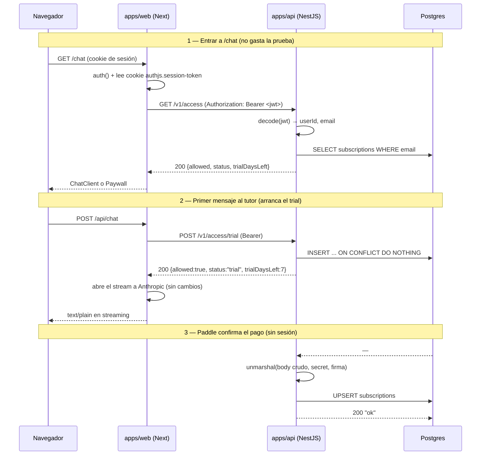
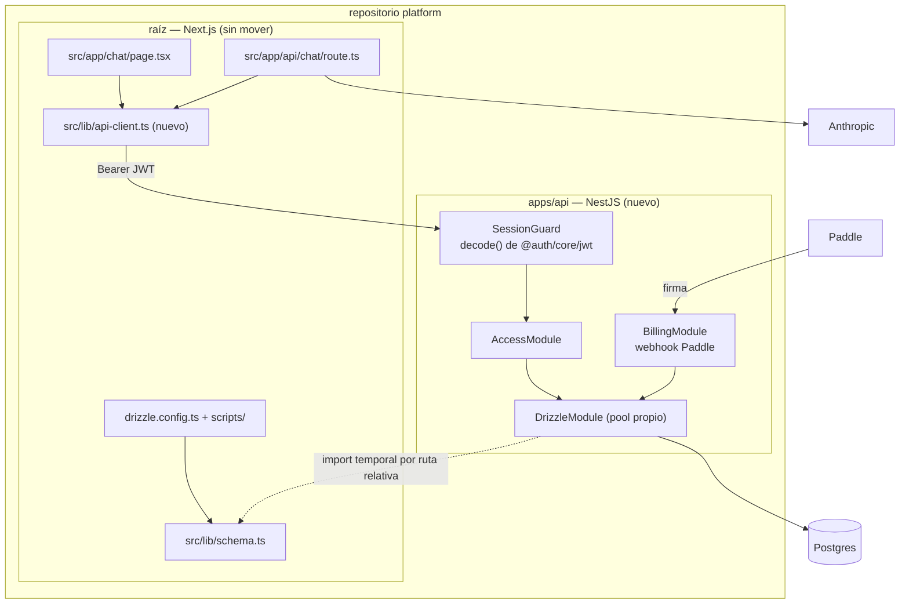

# PRD-003 (fase 1): `apps/api` en NestJS — el dominio de acceso y cobro

**Status**: Draft
**Date**: 2026-07-28
**Author**: AI-assisted
**Priority**: P1
**Depends on**: ADR-001
**Supersedes**: None
**Issue**: —

## Impacted Projects

| Project | Impact |
|---------|--------|
| **platform** | `pnpm-workspace.yaml` declara `packages: ["apps/*"]`. Paquete nuevo `apps/api` (NestJS): módulos `session`, `access`, `billing`, endpoint `/health`, y suite de tests en **Vitest** (`apps/api/vitest.config.ts`, `*.spec.ts` junto al código, `test/*.e2e-spec.ts`), con `vitest`, `unplugin-swc` y `@swc/core` como devDependencies del paquete. El servicio Next se queda en la raíz sin moverse. Se retiran de la raíz `src/lib/access.ts` y `src/app/api/paddle/webhook/route.ts` al final de la migración; `src/app/chat/page.tsx:26` y `src/app/api/chat/route.ts:39` pasan a llamar a `apps/api` a través de un cliente nuevo `src/lib/api-client.ts`. `.env.example` añade `API_BASE_URL`, `ACCESS_VIA_API` y `AUTH_COOKIE_NAME`. `drizzle.config.ts`, `src/lib/schema.ts`, `scripts/` y `curriculum/` **no se tocan**. Segundo servicio en Railway. |

---

## 1. Problem Statement

[ADR-001](ADR-001-backend-nestjs-front-nextjs.md) decidió partir `platform` en `apps/web` (Next), `apps/api` (NestJS) y `packages/shared`. Esta es la primera fase, y su trabajo no es entregar capacidad de producto: es **descubrir si el puente de sesión funciona antes de que nada importante dependa de él**.

El ADR deja dos zonas marcadas como caras o irreversibles, y esta fase no entra en ninguna. La primera es `packages/shared`: `drizzle.config.ts:9` y seis checks de `scripts/` importan `src/lib/schema.ts` **con extensión**, un arreglo deliberado que depende de `allowImportingTsExtensions` (PRD-002 § 9); moverlo es el punto de no retorno y va en la última fase (ADR-001 § 7). La segunda es el stream del tutor: `src/app/api/chat/route.ts` construye un `ReadableStream` sobre `client.messages.stream` y es la ruta más sensible a latencia del producto (ADR-001 § 6).

Queda un dominio que sirve exactamente para esto. **Acceso y cobro** es pequeño y está cerrado sobre sí mismo:

- `src/lib/access.ts` son 123 LOC con tres funciones exportadas y exactamente tres puntos de llamada: `src/app/chat/page.tsx:26` (`getAccess`), `src/app/api/chat/route.ts:39` (`ensureTrial`) y `src/app/api/paddle/webhook/route.ts:52,72` (`setSubscriptionStatus`).
- Es dueño de una sola tabla, `subscriptions` (`src/lib/schema.ts:107`), y ninguna otra parte del código la escribe.
- El webhook de Paddle **no lleva sesión**: se autentica por firma sobre el body crudo. Puede mudarse sin depender del puente de auth, lo que da un camino de despliegue que se valida solo.
- No toca el stream: `ensureTrial` es una llamada JSON que ocurre **antes** de abrir el stream (`route.ts:39`, el stream se construye en la línea 102).

La pregunta que esta fase responde es concreta: hoy `auth()` es una llamada de función en el mismo proceso (`src/auth.ts:38`) y la sesión es un JWT en cookie (`src/auth.ts:53`). ¿Puede otro servicio verificar esa misma identidad por su cuenta, sin un segundo sistema de identidad y sin que `apps/web` tenga que ser creído? Si la respuesta es no, se descubre aquí, con 211 LOC en juego y un `git revert` de vuelta.

## 2. Goals

1. Desplegar `apps/api` como servicio NestJS en Railway, con `/health` respondiendo 200 y su propio pool contra la misma Postgres.
2. Cuando `apps/api` reciba una petición con un JWT de sesión de Auth.js válido, el sistema deberá resolver `userId` y `email` **sin consultar a `apps/web` ni a Postgres**.
3. Si el JWT falta, no verifica, o está caducado, el sistema deberá responder 401 **antes de abrir conexión a Postgres**.
4. Mover las tres funciones de `src/lib/access.ts` a `apps/api` sin cambio observable en la frontera gratis/pago: mismos estados, mismos días de trial, mismo momento de arranque de la prueba.
5. Mover el webhook de Paddle a `apps/api` conservando la verificación de firma sobre el **body crudo**.
6. Dejar `drizzle.config.ts`, `src/lib/schema.ts`, `scripts/` y `curriculum/` sin modificar (ADR-001 § 7).
7. Si el puente falla en producción, el sistema deberá poder volver al camino anterior cambiando una variable de entorno, sin desplegar código.

## 3. Non-Goals

- **`packages/shared`.** Va en la última fase. En esta, `apps/api` importa el esquema desde la raíz por ruta relativa (§ Design Decisions).
- **Mover el stream del tutor.** `src/app/api/chat/route.ts` sigue en Next y sigue hablando con Anthropic desde ahí.
- **Navegador → `apps/api` directo.** Esta fase es solo servidor-a-servidor: sin CORS, sin dominio de cookie compartido. El navegador sigue hablando únicamente con Next.
- **Mover el repositorio Next a `apps/web`.** Deliberadamente aplazado (§ Design Decisions).
- **Worker, colas, trabajo diferido.** El ADR los contempla; no son esta fase.
- **Currículo, conversaciones, telemetría, Auth.js.** Auth.js sigue emitiendo la sesión desde Next; `apps/api` solo la verifica.

## 4. User Flows

Ningún flujo cambia para el estudiante. Lo que cambia es quién ejecuta cada paso.



## 5. API

Todos los endpoints son **nuevos**, servidos por `apps/api`.

### 5.1 Autenticación

`apps/web` lee la cookie de sesión con `cookies()` de `next/headers` y la reenvía como `Authorization: Bearer <token>`. `apps/api` la verifica con `decode()` de `@auth/core/jwt` (versión `0.41.2`, ya presente como dependencia transitiva de `next-auth`; en `apps/api` se declara explícita):

```ts
decode({ token, secret: process.env.AUTH_SECRET, salt: cookieName })
```

**El `salt` es el nombre de la cookie**, no un valor libre — es como Auth.js v5 deriva la clave de cifrado. Auth.js usa el prefijo `__Secure-` cuando las cookies son seguras, así que el nombre difiere entre entornos: `authjs.session-token` en local y `__Secure-authjs.session-token` en producción. `apps/api` lo lee de `AUTH_COOKIE_NAME`, con el mismo criterio por defecto que Auth.js. **Un desajuste aquí produce 401 en todas las peticiones, y es el fallo más probable de esta fase** (§ 9, filas 6 y 7).

`apps/api` **no acepta identidad por ninguna otra vía**: ni cabeceras `X-User-Id`, ni un secreto compartido que declare al usuario. Verifica el token o devuelve 401 (§ 8).

### 5.2 Endpoints

| Método | Ruta | Auth | Respuesta |
|---|---|---|---|
| `GET` | `/health` | — | `200 {"status":"ok"}` |
| `GET` | `/v1/access` | Bearer | `200 Access` · `401` |
| `POST` | `/v1/access/trial` | Bearer | `200 Access` · `401` |
| `POST` | `/v1/webhooks/paddle` | firma Paddle | `200 "ok"` · `400` |

`Access` es el tipo que ya existe en `src/lib/access.ts:16`, sin cambios:

```ts
type Access = {
  allowed: boolean;
  status: "none" | "trial" | "active" | "canceled";
  trialDaysLeft: number | null;
};
```

- `GET /v1/access` — solo lee (equivale a `getAccess`). Nunca crea trial.
- `POST /v1/access/trial` — crea el trial si no existe y devuelve el acceso (equivale a `ensureTrial`). Idempotente: la segunda llamada no crea nada ni reemite telemetría.
- `POST /v1/webhooks/paddle` — cuerpo crudo. `400` con `"firma inválida"` si `paddle.webhooks.unmarshal` lanza. Igual que hoy, un error **posterior** a la verificación devuelve `200` para que Paddle no reintente en bucle, y se registra.

**Sin límite de tasa en esta fase.** `/v1/access*` exige JWT válido antes de tocar Postgres (goal 3), y el webhook exige firma. Se anota como riesgo aceptado en § 8.

## 6. Data Model

**No hay migración.** `subscriptions` (`src/lib/schema.ts:107-115`) queda exactamente como está: `id`, `email` (único), `status`, `trial_ends_at`, `paddle_subscription_id`, `created_at`, `updated_at`. Ningún `drizzle-kit generate` en esta fase, y `drizzle.config.ts` no se toca.

Lo que sí cambia es **la propiedad y las conexiones**:

- Al terminar la fase, `subscriptions` la escribe **solo** `apps/api`. Durante la migración la escriben los dos (§ 10); el `onConflictDoUpdate` de `setSubscriptionStatus` y el `onConflictDoNothing` de `ensureTrial` ya hacen esa convivencia segura — son las mismas sentencias, contra la misma fila única por `email`.
- Aparece un **segundo pool de `pg`** contra la misma base. `src/lib/db.ts:26` abre uno para el servidor Next de larga vida; `apps/api` abre el suyo. Hay que fijar `max` explícito en ambos y comprobarlo contra el límite de conexiones del plugin de Postgres de Railway antes de flipar el flag (§ 10).

## 7. Architecture



Tres piezas nuevas en `apps/api`:

- **`SessionGuard`** — un `CanActivate` de NestJS que decodifica el Bearer y pone `{ userId, email }` en el request. Es la única puerta de entrada de identidad.
- **`AccessModule`** — `access.service.ts` con las tres funciones portadas tal cual desde `src/lib/access.ts`, incluida la relectura tras la carrera del `onConflictDoNothing` (`access.ts:112-119`), que se conserva porque el escenario no desaparece al mudarse.
- **`BillingModule`** — el webhook. `NestFactory.create(AppModule, { rawBody: true })` y lectura del `rawBody`: NestJS parsea JSON por defecto y eso rompería la verificación de firma exactamente igual que `req.json()` rompe la de hoy (`webhook/route.ts:5`).

## 8. Security

**El puente de sesión es la superficie nueva.** Tres reglas, todas verificables:

1. **`apps/api` nunca confía en `apps/web`.** No existe cabecera de identidad (`X-User-Id`, `X-User-Email`) ni secreto compartido que sustituya al token. Si existiera, cualquiera que alcance `apps/api` —que es públicamente alcanzable, porque Paddle tiene que llegar al webhook— podría declararse cualquier estudiante. La identidad sale de `decode()` o no sale.
2. **401 antes de Postgres** (goal 3). El guard corre antes que el servicio, así que una avalancha de peticiones sin token no genera carga de base de datos.
3. **`AUTH_SECRET` pasa a vivir en dos servicios.** Es el mismo secreto, no uno derivado: rotarlo obliga a redesplegar los dos a la vez, y hacerlo en uno solo tumba todas las sesiones. Queda anotado en `.env.example` y en el runbook de rotación.

**PII.** El `email` es la llave de `subscriptions` (`schema.ts:109`) y ahora viaja por red entre servicios. Solo sobre TLS (Railway lo termina), nunca en query string —va en el cuerpo o se deriva del token—, y no se registra en logs: hoy `console.error` del webhook (`webhook/route.ts:78`) imprime el error, no el correo, y esa propiedad se conserva.

**Firma de Paddle.** `PADDLE_WEBHOOK_SECRET` y `PADDLE_API_KEY` se mueven a `apps/api` y **se retiran del servicio Next** al terminar la migración. Mientras las dos rutas convivan, ambos servicios las tienen.

**Riesgo aceptado**: sin límite de tasa en `/v1/access*` ni en el webhook. El coste de una petición no autenticada es una operación de `decode()` sin E/S; el del webhook es una verificación de firma. Si `apps/api` acaba expuesto a tráfico no autenticado sostenido, se añade rate limiting entonces y no antes.

## 9. Test Plan

`apps/api` usa **Vitest** con `unplugin-swc`. La justificación y el compromiso que asume están en § Design Decisions; lo operativo:

- Unitarios en `*.spec.ts` junto al código; de integración en `apps/api/test/*.e2e-spec.ts` levantando la app con `Test.createTestingModule` de `@nestjs/testing`.
- **`unplugin-swc` no es opcional.** El transformador por defecto de Vitest (esbuild) no emite metadatos de decorador, y la inyección de dependencias de NestJS los necesita: sin el plugin, `Test.createTestingModule` no resuelve los providers. La fila 1 existe para que esa configuración falle de forma explícita si alguien la toca.
- Los dos tests del lado Next (filas 21 y 22) se quedan en el estilo de checks de la raíz (`node scripts/check-*.ts` con `node:assert/strict`, ver `scripts/check-schedule.ts`). Unificar los trece checks existentes de la raíz en Vitest es un cambio aparte y no entra en este PRD.

| # | Test | Type | Description | Path |
|---|---|---|---|---|
| 1 | La DI de NestJS resuelve bajo Vitest | Regresión | `Test.createTestingModule` instancia `AccessService` con sus dependencias. Falla si se pierde `unplugin-swc` o `emitDecoratorMetadata`; es la trampa de configuración de esta suite. | `../platform/apps/api/test/di-metadata.e2e-spec.ts` |
| 2 | JWT válido resuelve identidad | Unit | `decode()` con secreto y salt correctos devuelve `userId` y `email`; el guard los expone en el request. | `../platform/apps/api/src/session/session.guard.spec.ts` |
| 3 | Sin cabecera `Authorization` → 401 | Unit | El guard rechaza antes de instanciar el servicio de acceso. | `../platform/apps/api/src/session/session.guard.spec.ts` |
| 4 | Secreto incorrecto → 401 | Unit | Token firmado con otro `AUTH_SECRET`. | `../platform/apps/api/src/session/session.guard.spec.ts` |
| 5 | Token caducado → 401 | Unit | `exp` en el pasado. | `../platform/apps/api/src/session/session.guard.spec.ts` |
| 6 | Salt equivocado → 401 | Regresión | Token emitido con salt `__Secure-authjs.session-token`, verificado con `authjs.session-token`. Es el fallo de despliegue más probable (§ 5.1). | `../platform/apps/api/src/session/session.guard.spec.ts` |
| 7 | `AUTH_COOKIE_NAME` por defecto según entorno | Unit | Sin la variable, resuelve `__Secure-authjs.session-token` en producción y `authjs.session-token` fuera. | `../platform/apps/api/src/session/session.guard.spec.ts` |
| 8 | 401 no abre conexión a Postgres | Integración | Con `DATABASE_URL` apuntando a un puerto muerto, una petición sin token sigue devolviendo 401 y no lanza. | `../platform/apps/api/test/access.e2e-spec.ts` |
| 9 | Sin fila → `{allowed:true, status:"none"}` | Unit | Paridad con `access.ts:56`. Entrar a mirar no gasta la prueba. | `../platform/apps/api/src/access/access.service.spec.ts` |
| 10 | Trial vigente devuelve días restantes | Unit | `Math.ceil` sobre la diferencia; paridad con `access.ts:34`. | `../platform/apps/api/src/access/access.service.spec.ts` |
| 11 | Trial vencido → `allowed:false` | Edge | `trialEndsAt` en el pasado. | `../platform/apps/api/src/access/access.service.spec.ts` |
| 12 | `canceled` → `allowed:false` | Edge | Paridad con `access.ts:41`. | `../platform/apps/api/src/access/access.service.spec.ts` |
| 13 | `active` → `allowed:true`, `trialDaysLeft:null` | Unit | Paridad con `access.ts:26`. | `../platform/apps/api/src/access/access.service.spec.ts` |
| 14 | `POST /v1/access/trial` crea la fila y emite `trial_started` una sola vez | Integración | Dos llamadas concurrentes: una fila, un evento. Cubre la carrera de `access.ts:104-119`. | `../platform/apps/api/test/access.e2e-spec.ts` |
| 15 | `GET /v1/access` nunca crea trial | Regresión | Tras la llamada no hay fila en `subscriptions`. La frontera del producto depende de esto. | `../platform/apps/api/test/access.e2e-spec.ts` |
| 16 | Webhook con firma inválida → 400 | Error | `unmarshal` lanza; no se toca la base. | `../platform/apps/api/test/billing.e2e-spec.ts` |
| 17 | Body crudo preservado bajo NestJS | Regresión | Con `rawBody: true`, la firma de un cuerpo real verifica. Sin él, falla — es la regresión que introduce el cambio de framework. | `../platform/apps/api/test/billing.e2e-spec.ts` |
| 18 | `SubscriptionActivated` sin fila previa hace UPSERT | Edge | El caso que motivó el upsert (`access.ts:61-64`): checkout público, sin paso previo por el tutor. | `../platform/apps/api/test/billing.e2e-spec.ts` |
| 19 | `SubscriptionCanceled` → `canceled` sin pisar el `paddle_subscription_id` | Edge | Paridad con `access.ts:73-75`. | `../platform/apps/api/test/billing.e2e-spec.ts` |
| 20 | Error posterior a la firma devuelve 200 | Error | Paddle no debe reintentar en bucle. Paridad con `webhook/route.ts:76-80`. | `../platform/apps/api/test/billing.e2e-spec.ts` |
| 21 | `ACCESS_VIA_API=false` usa el camino antiguo | Regresión | El rollback por variable de entorno (goal 7) funciona sin desplegar. | `../platform/scripts/check-access-bridge.ts` |
| 22 | Cookie de sesión troceada falla ruidosamente | Error | Si aparece `<cookie>.0`, el cliente de `apps/web` lanza en vez de enviar un token truncado (que daría un 401 indistinguible de un fallo de secreto). | `../platform/scripts/check-access-bridge.ts` |
| 23 | `GET /health` → 200 | Smoke | Healthcheck de Railway. | `../platform/apps/api/test/access.e2e-spec.ts` |

## 10. Migration Plan

Cinco pasos. Los cuatro primeros son reversibles sin desplegar.

1. **Levantar `apps/api` sin tráfico.** `pnpm-workspace.yaml` gana `packages: ["apps/*"]`; se crea `apps/api`; segundo servicio en Railway con `DATABASE_URL`, `AUTH_SECRET`, `AUTH_COOKIE_NAME`, `PADDLE_*` y `POSTHOG_*`. Se verifica `/health` y se comprueba el `max` de los dos pools contra el límite de conexiones de Postgres (§ 6). Nadie lo llama todavía. *Rollback: borrar el servicio.*

2. **Cablear `apps/web` detrás de un flag.** `src/lib/api-client.ts` (nuevo) y `ACCESS_VIA_API`, por defecto `false`. Con el flag apagado, `chat/page.tsx` y `api/chat/route.ts` siguen importando `src/lib/access.ts` exactamente como hoy. Se despliega con el flag apagado: cero cambio de comportamiento en producción. *Rollback: ya está apagado.*

3. **Encender el flag.** `ACCESS_VIA_API=true` en el servicio Next. Aquí es donde el puente de sesión se prueba de verdad. Se vigilan: tasa de 401 en `apps/api` (un desajuste de salt los pone al 100 %), el embudo `trial_started` en PostHog, y la latencia de `/chat` y del primer token de `/api/chat`. *Rollback: `ACCESS_VIA_API=false`, sin desplegar.*

4. **Repuntar el webhook de Paddle.** Cambiar la URL de destino en el panel de Paddle a `apps/api`. **La ruta de Next se deja viva** durante el soak: las dos hacen el mismo upsert idempotente sobre la misma fila única por `email`, así que un evento que llegue por cualquiera de las dos produce el mismo estado. *Rollback: devolver la URL en el panel de Paddle.*

5. **Soak y limpieza.** Tras 7 días —una vuelta completa del ciclo de trial— sin 401 anómalos ni eventos de Paddle perdidos: se borran `src/lib/access.ts` y `src/app/api/paddle/webhook/route.ts`, se retiran `PADDLE_API_KEY` y `PADDLE_WEBHOOK_SECRET` del servicio Next, y se elimina el flag `ACCESS_VIA_API` junto con la rama muerta. *Este paso sí exige `git revert` para deshacerse.*

**Sin backfill de datos**: no hay migración de esquema y la tabla no se mueve de base.

## 11. Open Questions

- [ ] **Cookies troceadas.** Auth.js parte la cookie de sesión en `<nombre>.0`, `.1` cuando excede el límite del navegador. Nuestro JWT lleva solo `id`, `email`, `name` y `exp`, así que no debería trocearse. La fila 22 de § 9 hace que el caso falle ruidosamente en vez de en silencio; **reensamblar los trozos queda diferido** hasta que se observe uno. Si aparece, es una función de ~6 líneas en `api-client.ts`.
- [ ] **`AUTH_SECRET` compartido.** Esta fase lo replica en los dos servicios. Si más adelante se prefiere que `apps/api` verifique con una clave pública en vez de un secreto simétrico, es un cambio de `decode()` por verificación JWKS y no afecta a nada de lo que este PRD mueve. **Diferido**: no se decide hasta que haya un tercer consumidor.

---

## Design Decisions

**Next se queda en la raíz; no se mueve a `apps/web` en esta fase.** El estado final del ADR-001 tiene tres paquetes, pero mover el repositorio Next entero es un cambio mecánico que toca `tsconfig.json`, `drizzle.config.ts:9`, las trece rutas de `scripts/`, la configuración de Railway y `next.config.mjs` — todo lo que ADR-001 § 7 marca como caro de revertir, y nada de ello necesario para responder la pregunta de esta fase. Se aplaza a la fase que crea `packages/shared`, donde esos ficheros hay que tocar de todas formas. En esta fase, la raíz sigue siendo el paquete Next y `apps/api` es el único paquete del workspace.

**`apps/api` importa `src/lib/schema.ts` por ruta relativa, temporalmente.** Consecuencia directa de lo anterior: sin `packages/shared`, `apps/api` alcanza el esquema Drizzle subiendo a la raíz. Es feo y es deuda declarada: se marca en el código con un comentario `ponytail:` que nombra el techo y la salida (`// ponytail: import temporal a la raíz; lo cierra la fase de packages/shared, ver ADR-001 §7`). La alternativa —duplicar el esquema— introduce deriva entre dos definiciones de la misma tabla, que es exactamente el fallo que `packages/shared` existe para evitar.

**Vitest, no Jest, y no el estilo de checks de la raíz.** NestJS 11 trae Jest preconfigurado, pero el roadmap de NestJS v12 ([PR #16391](https://github.com/nestjs/nest/pull/16391), en draft, objetivo *early Q3 2026*) mueve todos los repositorios y proyectos de ejemplo de Jest a Vitest, y hace que los proyectos ESM generados por el CLI usen Vitest por defecto; Jest queda para los proyectos CJS. `apps/api` nace hoy y nace ESM —la raíz ya es ESM (`"module": "esnext"`, `moduleResolution: "bundler"`, `next.config.mjs`)—, así que arrancar en Jest sería nacer en el camino que el framework está abandonando. Vitest además resuelve TypeScript nativamente, incluido el `import ... from "../../src/lib/schema.ts"` **con extensión** del que depende esta fase; con Jest habría que configurar `ts-jest` o Babel para lo mismo.

**Lo que se paga por elegirlo hoy**: la PR de v12 está en *draft*, no fusionada, así que `nest new` sigue generando Jest y la configuración de Vitest se escribe a mano. El punto delicado es `unplugin-swc`: esbuild, el transformador por defecto de Vitest, no emite metadatos de decorador, y sin ellos la DI de NestJS no resuelve nada. Es un `vitest.config.ts` de unas diez líneas, y la fila 1 de § 9 lo vigila. También significa aceptar **dos estilos de test en el repositorio** —Vitest en `apps/api`, checks de `node:assert` en la raíz— hasta que alguien decida unificar; se prefiere eso a migrar trece checks que hoy funcionan dentro de un PRD que va de otra cosa.

**El puente reenvía el JWT en vez de que Next declare al usuario.** Un secreto compartido más una cabecera `X-User-Id` sería menos código, pero convertiría a `apps/api` en un servicio que confía en su cliente, y `apps/api` es públicamente alcanzable porque Paddle tiene que llegar al webhook. Reenviar el token cuesta unas líneas y da la propiedad que el estado final necesita: `apps/api` verifica identidad por su cuenta. Es además el mismo camino de código que usará el navegador cuando hable directo con `apps/api` en una fase posterior, así que se paga una vez.

---

## Gate: Promotion to Implemented

```yaml
commit_hash: [TBD]
tests:
  - [TBD]
system_artifact_diff:
  - [TBD]
```
