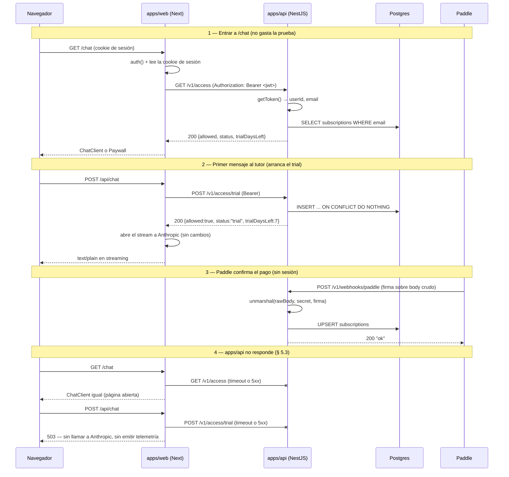
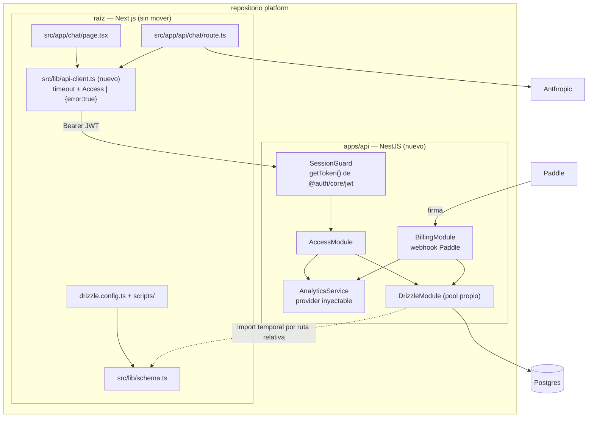

# PRD-003 (fase 1): `apps/api` en NestJS — el dominio de acceso y cobro

**Status**: Draft
**Date**: 2026-07-28
**Author**: AI-assisted
**Priority**: P1
**Depends on**: ADR-001
**Supersedes**: None
**Issue**: —

## Impacted Projects

| Project | Impact |
|---------|--------|
| **platform** | `pnpm-workspace.yaml` declara `packages: ["apps/*"]` y aprueba en `allowBuilds` los scripts de build nuevos. Paquete nuevo `apps/api` (NestJS, **CommonJS** — ver § Design Decisions): módulos `session`, `access`, `billing`, `analytics`, filtro de excepciones global, endpoint `/health`, más `apps/api/tsconfig.json` y `apps/api/nest-cli.json` con la configuración de build fijada. Tests en **Vitest** (`apps/api/vitest.config.ts`, `*.spec.ts` junto al código, `test/*.e2e-spec.ts`) con `vitest`, `unplugin-swc` y `@swc/core`. En la raíz: `.nvmrc` (nuevo, para que builder y máquina de desarrollo coincidan), `src/lib/api-client.ts` (nuevo, partido en `readSessionToken()` y `fetchAccess()` — ver § 5.3), `src/app/chat/error.tsx` (nuevo), `scripts/check-access-bridge.ts` (nuevo), y `package.json` gana los scripts `test` y `check:access`. Se modifican `src/app/chat/page.tsx:26`, `src/app/api/chat/route.ts:39`, `src/lib/db.ts:26` (añade `max` explícito), `src/app/api/t/route.ts:42` (deja de usar `AUTH_SECRET` como sal) y `src/app/api/paddle/webhook/route.ts` (emisión de `track()` detrás de variable). `src/lib/access.ts` queda reducido a su declaración de tipos y el webhook de Next se retira al final de la migración. `.env.example` añade `API_BASE_URL`, `ACCESS_VIA_API`, `AUTH_COOKIE_NAME`, `ACCESS_TIMEOUT_MS`, `ANALYTICS_SALT` y `PADDLE_TRACK_ENABLED`. `drizzle.config.ts`, `src/lib/schema.ts`, `curriculum/` y los nueve `scripts/check-*.ts` existentes **no se tocan**. Segundo servicio en Railway. |

---

## 1. Problem Statement

[ADR-001](ADR-001-backend-nestjs-front-nextjs.md) decidió partir `platform` en `apps/web` (Next), `apps/api` (NestJS) y `packages/shared`. Esta es la primera fase, y su trabajo no es entregar capacidad de producto: es **descubrir si el puente de sesión funciona antes de que nada importante dependa de él**.

El ADR deja dos zonas marcadas como caras o irreversibles, y esta fase no entra en ninguna. La primera es `packages/shared`: `drizzle.config.ts:9` y seis checks de `scripts/` importan `src/lib/schema.ts` **con extensión**, un arreglo deliberado que depende de `allowImportingTsExtensions` (PRD-002 § 9); moverlo es el punto de no retorno y va en la última fase (ADR-001 § 7). La segunda es el stream del tutor: `src/app/api/chat/route.ts` construye un `ReadableStream` sobre `client.messages.stream` y es la ruta más sensible a latencia del producto (ADR-001 § 6).

Queda un dominio que sirve exactamente para esto. **Acceso y cobro** es pequeño y está cerrado sobre sí mismo:

- `src/lib/access.ts` son 123 LOC con tres funciones exportadas y exactamente tres puntos de llamada: `src/app/chat/page.tsx:26` (`getAccess`), `src/app/api/chat/route.ts:39` (`ensureTrial`) y `src/app/api/paddle/webhook/route.ts:52,72` (`setSubscriptionStatus`).
- Es dueño de una sola tabla, `subscriptions` (`src/lib/schema.ts:107`), y ninguna otra parte del código la escribe.
- El webhook de Paddle **no lleva sesión**: se autentica por firma sobre el body crudo. Puede mudarse sin depender del puente de auth, lo que da un camino de despliegue que se valida solo.
- No toca el stream: `ensureTrial` es una llamada JSON que ocurre **antes** de abrir el stream (`route.ts:39`, el stream se construye en la línea 102).

La pregunta que esta fase responde es concreta: hoy `auth()` es una llamada de función en el mismo proceso (`src/auth.ts:38`) y la sesión es un JWT en cookie (`src/auth.ts:53`). ¿Puede otro servicio verificar esa misma identidad por su cuenta, sin un segundo sistema de identidad y sin que `apps/web` tenga que ser creído? Si la respuesta es no, se descubre aquí, con 211 LOC en juego y un `git revert` de vuelta.

### 1.1 El servicio tiene que ser seguro estando expuesto

El repositorio es AGPL-3.0 y público, y la adoptabilidad es un problema declarado del proyecto (PRD-002 § 1, punto 4). Eso fija una restricción sobre esta fase: **ninguna propiedad de seguridad de `apps/api` puede depender de la topología de red del despliegue.**

Restringir `/v1/access*` a una red privada es endurecimiento legítimo donde la plataforma lo ofrezca, pero no puede ser lo que hace correcto al sistema: quien despliegue esto en un VPS, en una sola máquina o en una plataforma sin red interna se llevaría un sistema inseguro sin haber hecho nada mal, y sin que nada falle de forma visible. Por eso § 5 y § 8 especifican `apps/api` como si todos sus endpoints fueran alcanzables desde internet, que es el caso por defecto.

## 2. Goals

1. Desplegar `apps/api` como servicio NestJS, con `/health` respondiendo 200 sin tocar Postgres y su propio pool contra la misma base.
2. Cuando `apps/api` reciba una petición con un JWT de sesión de Auth.js válido, el sistema deberá resolver `userId` y `email` **sin consultar a `apps/web` ni a Postgres**.
3. Si el JWT falta, no verifica, está caducado, o su payload no trae `id` y `email` no vacíos, el sistema deberá responder **401 antes de abrir conexión a Postgres** — nunca 500.
4. La identidad deberá resolverse **exclusivamente** desde el token: si una petición suministra un `email` o un `userId` por cuerpo, query o ruta, el sistema deberá rechazarla o ignorar ese campo, nunca usarlo.
5. Si falta la configuración que el puente necesita para funcionar, el sistema deberá **fallar al arrancar**, no en la primera petición de un estudiante.
6. Mover las tres funciones de `src/lib/access.ts` a `apps/api` sin cambio observable en la frontera gratis/pago mientras `apps/api` responde: mismos estados, mismos días de trial, mismo momento de arranque de la prueba, mismo `email` sin transformar.
7. Mover el webhook de Paddle a `apps/api` conservando la verificación de firma sobre el **body crudo** y sus dos ramas de 400.
8. Si `apps/api` no responde dentro del timeout, el sistema deberá renderizar `/chat` igual y denegar el turno del tutor con 503, sin llamar a Anthropic (§ 5.3).
9. Dejar `drizzle.config.ts`, `src/lib/schema.ts`, `curriculum/` y los nueve `scripts/check-*.ts` sin modificar (ADR-001 § 7).
10. Si el puente falla en producción, el sistema deberá poder volver al camino anterior cambiando una variable de entorno, sin desplegar código.

**Excepción declarada al goal 6.** El estado degradado del goal 8 *sí* es un cambio observable: con `apps/api` caído, un estudiante de pago entra a `/chat` pero recibe 503 al escribir, donde hoy se le serviría. Es la consecuencia aceptada de no conceder acceso al tutor sin poder verificarlo, y se declara aquí en vez de esconderse detrás de "sin cambio observable".

## 3. Non-Goals

- **`packages/shared`.** Va en la última fase. En esta, `apps/api` importa el esquema desde la raíz por ruta relativa (§ Design Decisions).
- **Mover el stream del tutor.** `src/app/api/chat/route.ts` sigue en Next y sigue hablando con Anthropic desde ahí.
- **Navegador → `apps/api` directo.** Esta fase es solo servidor-a-servidor: no se llama `enableCors()` (§ 8). El navegador sigue hablando únicamente con Next. El estado final del ADR-001 sí contempla el camino directo; llega en una fase posterior.
- **Mover el repositorio Next a `apps/web`.** Deliberadamente aplazado (§ Design Decisions).
- **Rate limiting.** Riesgo aceptado, argumentado en § 8.
- **Worker, colas, trabajo diferido.** El ADR los contempla; no son esta fase.
- **Corregir que `customData.email` lo controle el cliente.** Defecto preexistente, nombrado en § 8 como riesgo heredado.
- **Currículo, conversaciones, Auth.js.** Auth.js sigue emitiendo la sesión desde Next; `apps/api` solo la verifica.

## 4. User Flows

Mientras `apps/api` responde, ningún flujo cambia para el estudiante. Lo que cambia es quién ejecuta cada paso — y aparece un cuarto flujo que hoy no existe.



## 5. API

Todos los endpoints son **nuevos**, servidos por `apps/api`.

### 5.1 Autenticación

`apps/web` lee la cookie de sesión con `cookies()` de `next/headers` y la reenvía como `Authorization: Bearer <token>`. Resuelve el nombre probando `__Secure-authjs.session-token` y luego `authjs.session-token`; si encuentra un trozo `<nombre>.0`, lanza en vez de enviar un token truncado (§ 9, fila 35).

`apps/api` verifica con **`getToken()`** de `@auth/core/jwt`, no con `decode()` a pelo:

```ts
getToken({
  req,
  secret: process.env.AUTH_SECRET,
  salt: process.env.AUTH_COOKIE_NAME,
  cookieName: process.env.AUTH_COOKIE_NAME,
})
```

**Por qué `getToken()` y no `decode()`**: `decode()` devuelve `null` únicamente si el token es falsy; ante secreto equivocado, salt equivocado, token corrupto o `exp` vencido, `jwtDecrypt` **lanza** y `decode` no lo captura. Especificarlo pelado convertiría en 500 los casos que el goal 3 exige que sean 401 — incluido el desajuste de salt, que es el fallo más probable de esta fase, y que dejaría de aparecer como la señal que § 10 paso 3 vigila. `getToken()` envuelve la decodificación en `try/catch`, devuelve `null` al fallar y lee la cabecera `Bearer` por sí mismo.

**Lo que `getToken()` *no* hace por el camino Bearer.** Su reensamblado de cookies troceadas es una propiedad de `SessionStore`, que lee la cabecera `Cookie`; la rama `Bearer` entra **solo si no hubo cookie** y toma `split(" ")[1]` tal cual. En esta fase esa rama de reensamblado nunca corre, así que no se puede contar con ella (§ 11). Por la misma razón, `api-client.ts` **no reenvía la cabecera `Cookie`**: la cookie tendría precedencia sobre el Bearer dentro de `getToken()`, abriendo un segundo canal de credencial no declarado en un servicio que § 1.1 obliga a especificar como alcanzable desde internet.

**`AUTH_COOKIE_NAME` es obligatoria y no tiene valor por defecto.** `apps/api` no arranca sin ella (§ 9, fila 3). El `salt` de Auth.js es el nombre de la cookie, y Auth.js elige el prefijo `__Secure-` según el **protocolo de la URL de la petición**, no según `NODE_ENV` — con `trustHost: true` (`src/auth.config.ts:15`) eso sale del `X-Forwarded-Proto` del proxy. `apps/api` recibe un Bearer y estructuralmente no puede ver ese protocolo, así que no puede replicar el criterio: cualquier valor por defecto sería una conjetura que acierta en los dos entornos de hoy y falla en `pnpm build && pnpm start` local o en un despliegue sin TLS. Es el mismo patrón que el repositorio ya aplica a `CURRICULUM_SLUG` (`.env.example`): obligatoria y sin defecto, para que un entorno mal configurado falle en vez de elegir en silencio.

**Validación de forma del payload.** `getToken()` valida `exp`, `nbf` y el tag AEAD; no valida la forma de los claims. El guard devuelve 401 salvo que el payload traiga un `id` string no vacío **y** un `email` string no vacío. Esto preserva una invariante que hoy imponen los call sites (`src/app/api/chat/route.ts:33`, `src/app/chat/page.tsx:20`) y que `docs/SYSTEM_ARTIFACT.md` registra en el dominio `acceso`; sin ella, un `email` ausente llegaría a `eq(subscriptions.email, undefined)`.

**La identidad sale del token y de ningún otro sitio.** El control es que **ningún parámetro de método del controlador se liga a entrada del llamante**: los handlers de `/v1/access` y `/v1/access/trial` no declaran `@Body()`, `@Query()` ni `@Param()`, así que el cuerpo y el query string se ignoran por completo y `email` y `userId` solo pueden salir de `request.user`, que puebla `SessionGuard`.

`ValidationPipe({ whitelist: true, forbidNonWhitelisted: true })` se configura como **defensa en profundidad para DTOs futuros**, y se dice en este orden a propósito: el pipe solo actúa sobre parámetros decorados y tipados contra un DTO, así que hoy no se ejecuta y no está protegiendo de nada. Un implementador que creyera lo contrario podría **añadir** un `@Query() dto` para hacerlo disparar, que es exactamente lo opuesto a lo que se quiere.

Esto no es una precaución genérica: las funciones que se portan reciben el correo como argumento (`src/lib/access.ts:47`, `:86`), así que cablear `@Query('email')` hacia ellas es un error de una línea y del todo natural — y daría a cualquier estudiante con sesión válida lectura y escritura sobre la fila de suscripción de cualquier otro, siendo `subscriptions.email` la llave única (`src/lib/schema.ts:109`). Con la red privada degradada a endurecimiento opcional (§ 1.1), esta es la única defensa. La fila 19 de § 9 existe para eso.

`apps/api` **no acepta identidad declarada por nadie**: ni cabeceras `X-User-Id`, ni un secreto compartido. Precisión a nivel de servicio: `getToken()` sigue aceptando el token por cookie y la prefiere sobre el Bearer, así que cualquiera desde internet puede autenticarse mandando `Cookie:` en vez de `Authorization:`. Hoy es inocuo —el `salt` se aplica igual, así que solo verifica un token legítimamente emitido y el llamante obtiene sus propios datos— y nuestro cliente no la manda (§ 5.3). Queda escrito porque § 3 levanta el non-goal "navegador → `apps/api` directo" en una fase posterior, que es cuando esa precedencia pasa a ser carga.

### 5.2 Endpoints

| Método | Ruta | Auth | Respuesta |
|---|---|---|---|
| `GET` | `/health` | — | `200 {"status":"ok"}` |
| `GET` | `/v1/access` | Bearer | `200 Access` · `401` |
| `POST` | `/v1/access/trial` | Bearer | `200 Access` · `401` |
| `POST` | `/v1/webhooks/paddle` | firma Paddle | `200 "ok"` · `400` · `413` |

`Access` es el tipo que hoy vive en `src/lib/access.ts:16`, sin cambios de forma:

```ts
type Access = {
  allowed: boolean;
  status: "none" | "trial" | "active" | "canceled";
  trialDaysLeft: number | null;
};
```

- `GET /v1/access` — solo lee (equivale a `getAccess`). Nunca crea trial.
- `POST /v1/access/trial` — crea el trial si no existe y devuelve el acceso (equivale a `ensureTrial`). **Idempotente en dos sentidos**: una segunda llamada del usuario no reinserta ni reemite `trial_started`, y un reintento del cliente tras un timeout tampoco — el árbitro es el `UNIQUE(email)` de `src/lib/schema.ts:109` y el `returning()` vacío del `onConflictDoNothing`, no el proceso que atiende.
- `POST /v1/webhooks/paddle` — cuerpo crudo. Un error **posterior** a la verificación devuelve `200` para que Paddle no reintente en bucle, y se registra bajo las reglas de § 8. `413` si el cuerpo excede el límite declarado abajo. Dos ramas de 400:
  - **`"firma inválida"`** si `paddle.webhooks.unmarshal` lanza. Es la rama viva.
  - **`"sin evento"`** si resuelve sin lanzar pero sin evento (`src/app/api/paddle/webhook/route.ts:39-41`). **Con `@paddle/paddle-node-sdk@3.8.0` pineado, esta rama es inalcanzable**: `unmarshal` está tipada `Promise<EventEntity>` sin `| null`, o lanza o devuelve `Webhooks.fromJson(...)`, y el `default` de ese switch devuelve `new GenericEvent(data)`. El guarda se porta igualmente —cuesta dos líneas, mantiene la paridad con `docs/SYSTEM_ARTIFACT.md`, que lo declara invariante, y sigue siendo correcto si el contrato del SDK se afloja— pero se documenta como **defensivo**, no como comportamiento observable. La fila 25 de § 9 lo prueba mockeando `unmarshal`, y lo dice, porque con un cuerpo real firmado no se puede alcanzar.
- `/health` **no consulta Postgres**. Es el único endpoint sin token ni firma, y hacerle verificar la base entregaría a un llamante anónimo un viaje a Postgres, vaciando el goal 3.

**Límite de tamaño de cuerpo**: `64kb`, aplicado con `app.useBodyParser('json', { limit: '64kb' })`, que es **de aplicación y no de ruta** — se elige así a propósito, porque acotarlo solo al webhook exigiría montar un `express.raw({ limit })` como middleware de esa ruta, y una cota global es más difícil de perder al añadir endpoints. `rawBody: true` almacena el cuerpo entero **antes** de verificar la firma, en un endpoint que cualquiera alcanza; hoy estaría acotado en `100kb` por el defecto heredado de body-parser, o sea por accidente y no por decisión.

### 5.3 Contrato del cliente (`src/lib/api-client.ts`)

Nuevo módulo en la raíz. Es donde vive la política de degradación, y sin él la política no existe: **`fetch` en Node no tiene timeout por defecto**, así que un `apps/api` que acepta la conexión y no responde (reinicio de despliegue, pool agotado) colgaría el render de `/chat` indefinidamente en vez de degradar.

```ts
type ApiResult = Access | { error: true };
```

- **Timeout**: `AbortSignal.timeout(ACCESS_TIMEOUT_MS)`, por defecto `2000`.
- **Nunca lanza.**
- **Regla positiva, no enumeración**: **solo un `200` cuyo cuerpo valide contra `Access` produce un `Access`; todo lo demás, sin excepción, es `{ error: true }`.** Se formula así a propósito — una lista de casos (timeout, 5xx, 401, JSON malo…) invita a implementarla como un `switch` y deja fuera los que nadie enumeró: un `400` cualquiera, el `413` de § 5.2, el `404` de una `API_BASE_URL` mal puesta. La regla positiva falla cerrada por construcción.
- **`API_BASE_URL` es configuración de servidor**: obligatoria, sin valor por defecto, y **nunca derivada de la petición** — ni de `Host`, ni de cabeceras de proxy, ni de un parámetro. `apps/web` falla al arrancar si falta (§ 9, fila 38). Es la variable que decide a qué host se envía la credencial de sesión del estudiante: derivarla del request sería SSRF con exfiltración de credencial en el mismo movimiento. El repositorio ya tiene esta disciplina escrita para `CURRICULUM_SLUG` (`.env.example`: *"Es configuración de SERVIDOR: nunca se deriva del request"*).
- **El nombre de cookie se verifica en dos momentos distintos**, porque una sola comprobación no puede hacer las dos cosas:
  - **Al arrancar**: `AUTH_COOKIE_NAME` debe ser uno de `authjs.session-token` o `__Secure-authjs.session-token`. No hace falta petición y es lo que la fila 37 prueba como función pura.
  - **Por petición**: `api-client.ts` resuelve la cookie probando el prefijo `__Secure-` primero; si el nombre que encuentra difiere del configurado, **registra ruidosamente y devuelve `{ error: true }` — no lanza**, porque "nunca lanza" es lo que sostiene toda la política de degradación. Saca el fallo del agregado de 401, que es el desajuste que § 5.1 llama el más probable y que sin esto es silencioso en esta dirección.

| Call site | Con `{ error: true }` |
|---|---|
| `src/app/chat/page.tsx:26` | Renderiza `ChatClient`, **no** `Paywall`, **no** redirección a `/signin`. Es la forma que el archivo ya tiene en su repliegue defensivo (`chat/page.tsx:20-22`), y lo que se ve son datos del propio usuario, sin fuga entre estudiantes. **El resto de la función se ejecuta igual**: `loadConversation(userId)` y `getLessons(curriculumSlug())` (`chat/page.tsx:36-37`) leen la Postgres de Next y no dependen de `apps/api` en absoluto, así que saltarlas dejaría al estudiante con el historial vacío y el selector de lección muerto — un cambio observable adicional que la excepción declarada al goal 6 **no** cubre. `trialDaysLeft` queda `null`. |
| `src/app/api/chat/route.ts:39` | Devuelve `503` antes de abrir el stream. **No** llama a Anthropic y **no** emite `tutor_message_sent` (`chat/route.ts:64`) — es el evento con el que § 10 paso 3 lee el embudo, y emitirlo en un turno denegado lo corrompería. |

**Estructura del módulo.** `api-client.ts` se parte en dos, y la costura va **exactamente** aquí:

| Pieza | Qué hace | Testable bajo Node pelado |
|---|---|---|
| `readSessionToken()` | Lo único que necesita `next/headers`: leer las cookies de la petición y devolver el token. | No |
| `fetchAccess(token, baseUrl)` | `fetch` + `AbortSignal.timeout` + mapeo a `Access \| { error: true }`, y la decisión de status y telemetría de cada call site. | **Sí** — no necesita nada de Next si recibe el token y la URL como argumentos |

La costura **no** puede trazarse un paso más arriba, con un `mapResponse` que reciba una respuesta ya obtenida — que era la versión anterior de este párrafo. Un `AbortSignal.timeout` que dispara no produce una respuesta: hace que `fetch` **rechace**, así que nunca llegaría a `mapResponse`, y el control más cargado de esta sección se quedaría sin verificar por ningún lado. Con el `fetch` dentro de la mitad pura, la fila 34 lo prueba de verdad: un servidor local que **acepta la conexión y no responde nunca**, y la aserción de que la llamada resuelve `{ error: true }` dentro de `ACCESS_TIMEOUT_MS`. Un servicio *apagado* no sirve — da conexión rechazada de inmediato y el timeout no llega a dispararse, que es justo la distinción con la que abre esta sección.

**`src/app/chat/error.tsx`** es defensa en profundidad deliberada, no el manejador de esta política: el contrato de arriba dice que el cliente nunca lanza, así que no tiene disparador declarado. Existe porque hoy no hay **ningún** `error.tsx` en `src/app`, y un throw inesperado en el render de `/chat` —la página que da acceso al producto de pago— cae en la pantalla de crash por defecto de Next.

**Un 401 de `apps/api` no es "el estudiante no tiene sesión".** Un desajuste de salt produce 401 para todo el mundo con sesión perfectamente válida; `src/middleware.ts:15-19` no lo detecta porque valida el JWT por su cuenta y nunca llama a `apps/api`. Redirigir a `/signin` en ese caso produciría un bucle: iniciar sesión, volver a `/chat`, mismo 401. Por eso el 401 cae en `{ error: true }` como cualquier otro fallo y nunca redirige.

**Sin reintento automático** en esta fase. El timeout ya acota la espera, y el reintento solo tendría sentido con backoff, que es complejidad que aún no se ha ganado.

## 6. Data Model

**No hay migración.** `subscriptions` (`src/lib/schema.ts:107-115`) queda exactamente como está: `id`, `email` (único), `status`, `trial_ends_at`, `paddle_subscription_id`, `created_at`, `updated_at`. Ningún `drizzle-kit generate` en esta fase, y `drizzle.config.ts` no se toca.

**El `email` no se transforma.** Hoy la llave llega sin normalizar por el camino del tutor (`src/app/api/chat/route.ts:32` toma `session.user.email` tal cual) mientras el webhook sí normaliza (`webhook/route.ts:25`, `.toLowerCase()`) y el registro también (`src/auth.ts:70`). Esa asimetría existe en producción hoy. `apps/api` leerá el `email` del token, que es el mismo valor (`src/auth.ts:93-98` copia el token a la sesión), y **lo usará sin transformar**: añadir un `.toLowerCase()` al portar es exactamente lo que haría un implementador razonable al ver la asimetría, y sería un cambio de comportamiento observable que merece su propio PRD. La fila 18 de § 9 fija la paridad.

**Conexiones.** Aparece un segundo pool de `pg` contra la misma base. `src/lib/db.ts:26` abre hoy `new Pool({ connectionString })` **sin `max`**, o sea el default de `pg` (10). Esta fase fija `max` explícito en los dos servicios y reserva margen para los otros consumidores, que existen y no son ninguno de esos pools: `drizzle-kit migrate` y los scripts de `scripts/` (`check-curriculum-load.ts` abre su propia conexión).

| Consumidor | `max` |
|---|---|
| Next (`src/lib/db.ts`) | 8 |
| `apps/api` | 8 |
| Margen para migraciones y scripts | 4 |

El paso 1 de § 10 verifica esa suma contra el límite de conexiones del plugin de Postgres de Railway **antes** de continuar, y ajusta si el límite real es menor.

**Propiedad.** Al terminar la fase, `subscriptions` la escribe solo `apps/api`. Durante la migración la escriben los dos (§ 10); el `onConflictDoUpdate` de `setSubscriptionStatus` y el `onConflictDoNothing` de `ensureTrial` ya hacen esa convivencia segura — mismas sentencias, misma fila única por `email`.

## 7. Architecture



Cuatro piezas nuevas en `apps/api`:

- **`SessionGuard`** — `CanActivate` que resuelve el Bearer con `getToken()`, valida la forma del payload y pone `{ userId, email }` en el request. Es la única puerta de entrada de identidad.
- **`AccessModule`** — las tres funciones portadas desde `src/lib/access.ts`, incluida la relectura tras la carrera del `onConflictDoNothing` (`access.ts:112-119`), que se conserva porque el escenario no desaparece al mudarse.
- **`BillingModule`** — el webhook. `NestFactory.create(AppModule, { rawBody: true })`, y **`req.rawBody` es un `Buffer`**: `unmarshal` recibe hoy un `string` (`webhook/route.ts:31,35`, vía `req.text()`), así que hace falta `.toString("utf8")` explícito o la firma no verifica nunca.
- **`AnalyticsService`** — provider inyectable de NestJS envolviendo el mismo `posthog-node`. **No** se porta `src/lib/analytics.ts` tal cual: hoy construye el cliente en el ámbito del módulo y exporta una función suelta (`analytics.ts:19-23`), que no se puede inyectar ni espiar desde `Test.createTestingModule`. Sin esto, la fila 21 de § 9 solo podría afirmar "una fila" y no "un evento", que es la mitad interesante.

  **Conserva el contrato de hoy: fire-and-forget, nunca lanza, nunca se espera.** `track()` envuelve `client.capture` en `try/catch` y no se hace `await` (`analytics.ts:41-52`), y es un no-op silencioso sin `POSTHOG_API_KEY` (`analytics.ts:17-23`). Si el provider pierde esa envoltura, un fallo de PostHog lanzaría **dentro** de la petición — y en `POST /v1/access/trial` la emisión ocurre después del insert (`access.ts:107`), así que el estudiante se quedaría con la fila de trial creada y un 503 en la mano. La idempotencia de § 5.2 hace que el reintento se recupere, pero no hay razón para provocarlo.

  El union `TutorEvent` (`analytics.ts:29-35`), cuyo propósito registrado es que un typo no invente un evento y parta el embudo, se duplica en `apps/api` durante esta fase. Es la misma deriva que § Design Decisions resuelve para `Access`, y se cierra igual: en la fase de `packages/shared`.

## 8. Security

**El puente de sesión es la superficie nueva, y § 1.1 fija que debe ser segura estando expuesta.**

1. **`apps/api` nunca confía en `apps/web`.** No existe cabecera de identidad ni secreto compartido que sustituya al token: la identidad sale de `getToken()` y de la validación de forma de § 5.1, o la petición es 401. Ni `email` ni `userId` se leen de cuerpo, query o ruta (§ 5.1).
2. **401 antes de Postgres** (goal 3). El guard corre antes que el servicio, así que tráfico sin token no genera carga de base.
3. **CORS deshabilitado explícitamente.** No se llama `enableCors()` en esta fase. NestJS ya viene así por defecto, pero se declara aquí para que sea una invariante revisable y no una omisión.
4. **`AUTH_SECRET` pasa a vivir en dos servicios**, y su radio de explosión es mayor de lo que parece: hoy es también la sal del píxel anónimo de páginas públicas (`src/app/api/t/route.ts:42`), cuyo argumento de "no requiere consentimiento" se apoya en que el hash no sea enlazable. Quien tenga el secreto lo rompe por fuerza bruta sobre (IP × UA × día). **Esta fase le da al píxel su propia `ANALYTICS_SALT`** para que `apps/api` nunca necesite un secreto que hace de control de privacidad.

   ⚠️ **Y falla cerrado: sin `ANALYTICS_SALT`, `/api/t` devuelve el GIF y no emite.** Nunca `?? ""`. Hoy la línea es `process.env.AUTH_SECRET ?? ""` (`src/app/api/t/route.ts:42`) y ese respaldo es **inalcanzable**, porque sin `AUTH_SECRET` no hay login; al mover la sal a una variable propia pasa a ser alcanzable, y un despliegue que no la defina calcularía `sha256(ip|ua|día|"")` — reproducible por **cualquiera**, sin conocer ningún secreto, cuando hoy hace falta tener uno. El argumento de "no requiere consentimiento" que `docs/SYSTEM_ARTIFACT.md` apoya en la no-enlazabilidad del hash se caería sin error, sin log y sin señal. Es exactamente el modo de fallo contra el que legisla § 1.1, y el único punto de este PRD donde un arreglo de seguridad puede aterrizar como retroceso. No se hace obligatoria-al-arrancar porque tumbaría las páginas públicas por una variable de telemetría; el no-op silencioso reutiliza el patrón que el repositorio ya tiene sin `POSTHOG_API_KEY` (`analytics.ts:17-23`). Fila 39 de § 9. Se registra además que con `session: { strategy: "jwt" }` (`src/auth.ts:53`) no hay revocación por token: rotar `AUTH_SECRET` es el único interruptor, y obliga a redesplegar los dos servicios a la vez.
5. **Uso a sabiendas fuera de etiqueta.** `@auth/core/jwt` advierte upstream: *"Auth.js JWTs are meant to be used by the same app that issued them. If you need JWT authentication for your third-party API, you should rely on your Identity Provider instead."* Se asume conscientemente: `apps/api` no es un tercero, es el mismo producto partido en dos procesos. Queda escrito para que el siguiente lector no lo redescubra como sorpresa.

**Reglas de registro.** Dos cosas no pueden llegar nunca a los logs:

- **El correo.** La regla es **de servicio, no de un `catch`**: `apps/api` monta un **filtro de excepciones global** que registra únicamente `err.name` y `(err as { cause?: { code?: string } }).cause?.code` — **nunca** `err.message`, `err.stack`, ni el objeto de error — y aplica a todas las rutas. `DrizzleQueryError` embebe los parámetros ligados dentro del mensaje (`drizzle-orm@0.45.2/errors.js`, `super(\`Failed query: ${query}\nparams: ${params}\`)`), y `params` incluye el correo; el `console.error` de hoy (`src/app/api/paddle/webhook/route.ts:84`) sí lo filtra a los logs de Railway, así que la propiedad que la versión anterior de este PRD decía "conservar" nunca existió.

  **Tiene que ser global y no solo del webhook**: `getAccess` y `ensureTrial` ejecutan las mismas consultas parametrizadas con el correo (`access.ts:47-52`, `:97-101`) y **no capturan** — el error se propaga a quien atienda la excepción, que por defecto no es código que el implementador escriba y por tanto no es código que piense en redactar. Filas 31 y 40 de § 9 cubren los dos caminos.

  **Global *y* todo `catch` explícito**, con dos trampas que conviene nombrar porque empujan justo en contra:
  - **El `catch` del webhook se conserva.** El 200 que evita el bucle de reintentos de Paddle depende de él (§ 5.2), así que ese error nunca llega al filtro global y la regla la tiene que implementar el propio `catch`. Quitarlo para "dejar que lo maneje el filtro" haría que Paddle recibiera 500 y reintentara en bucle.
  - **El filtro no puede extender `BaseExceptionFilter` ni delegar en `super.catch()`.** Es el patrón documentado para conservar el formato de respuesta, y registra `exception.message` y `exception.stack` — o sea, reintroduce exactamente la fuga mientras se cree haber cumplido la regla.
- **El token.** El Bearer reenviado **es** la credencial de sesión, con ~30 días de vida y sin revocación individual. Mover una credencial de una cookie (que casi nada registra) a una cabecera `Authorization` (que los loggers de petición capturan de rutina) es un cambio real de exposición. Ningún interceptor, filtro ni manejador de error serializa cabeceras de petición; si se añade un interceptor de logging, `authorization` se redacta. Fila 12 de § 9.

**Diagnóstico de los 401.** El paso 3 de § 10 vigila la tasa de 401 y § 5.1 nombra el desajuste de salt como el fallo más probable, pero un 401 por salt, por token caducado, por cabecera ausente y por secreto equivocado son hoy indistinguibles. `SessionGuard` **registra** (no devuelve al cliente) un código de razón: `missing_header | malformed | decode_failed | missing_claims`. Sin él, "vigilar la tasa de 401" es mirar un agregado sin poder atribuir un pico.

**Secretos de Paddle.** `apps/api` recibe **solo `PADDLE_WEBHOOK_SECRET`**. `PADDLE_API_KEY` no se copia: `unmarshal` usa únicamente el secreto del webhook, y el código de hoy ya corre con `process.env.PADDLE_API_KEY ?? ""` (`webhook/route.ts:13`), o sea que una clave vacía funciona para este handler. Es una credencial de servidor capaz de cancelar suscripciones y emitir reembolsos; replicarla para nada amplía el radio de explosión sin comprarlo. Si una fase posterior necesita la API de Paddle desde `apps/api`, se aprovisiona entonces. Los dos servicios **nunca comparten secreto de firma** — ver § 10 paso 4.

**PII.** El `email` es la llave de `subscriptions` (`schema.ts:109`) y ahora viaja por red entre servicios. Solo sobre TLS, nunca en query string, y bajo las reglas de registro de arriba.

**Riesgo aceptado: sin rate limiting.** El coste de CPU de una petición no autenticada es real y bajo — `getToken()` es HKDF-SHA256, un thumbprint SHA-512 sobre un JWK pequeño y un descifrado A256CBC-HS512: microsegundos, sin primitiva de hashing de contraseñas y sin E/S. Lo que la versión anterior de este PRD no decía es la otra mitad: con la política de "tutor cerrado" de § 5.3, **`apps/api` pasa a ser punto único de fallo del producto de pago**, alcanzable desde internet y sin cota de peticiones. Degradarlo deniega el tutor a todos los estudiantes que pagan. Se acepta igualmente para esta fase —el coste por petición no da apalancamiento a un atacante— y la cota de tamaño de cuerpo de § 5.2 cierra la mitad de memoria. Si aparece tráfico no autenticado sostenido, se añade entonces.

**Riesgo heredado: la llave de fila del webhook la suministra el cliente.** `customData.email` se origina en el navegador (`src/app/paywall.tsx:46`, componente `"use client"`), y el webhook lo cree como llave de fila para un **upsert** (`access.ts:78-81`). Un atacante que abra un checkout con el correo de una víctima, se suscriba y cancele, dispara `setSubscriptionStatus(victima, "canceled")` y la encierra tras el muro de pago; coste, un periodo de suscripción. **Este PRD no introduce el defecto y no lo arregla** — pero § 8 es el primer modelo de amenazas escrito del servicio que § 6 convierte en dueño único de `subscriptions`, y callarlo aquí sería perderlo. La remediación barata, para el PRD de seguimiento: contrastar `customData.email` contra el correo del cliente Paddle del evento antes de escribir.

**Cambio de superficie aceptado.** Hoy `ensureTrial` es privada y solo se invoca desde `POST /api/chat`; esa restricción de call site es lo que hace cierta la invariante *"el trial arranca con el primer mensaje al tutor"* (`access.ts:1-2`, y el dominio `acceso` de `docs/SYSTEM_ARTIFACT.md`). Tras esta fase, cualquiera con sesión válida puede arrancar su propio trial con un `curl` a `/v1/access/trial` sin escribirle nunca al tutor. El daño directo es nulo —quema su propia prueba— pero desacopla `trial_started` de `tutor_message_sent`, que es el embudo que § 10 paso 3 usa. La invariante pasa de "garantizada por el call site" a "garantizada porque solo `apps/web` llama al endpoint", y `SYSTEM_ARTIFACT.md` se actualiza en el mismo commit del gate.

## 9. Test Plan

`apps/api` usa **Vitest** con `unplugin-swc` (justificación en § Design Decisions). Unitarios en `*.spec.ts` junto al código; de integración en `apps/api/test/*.e2e-spec.ts` con `Test.createTestingModule` de `@nestjs/testing`.

- **`unplugin-swc` no es opcional.** El transformador por defecto de Vitest (esbuild) no emite metadatos de decorador y la DI de NestJS los necesita: sin el plugin, `Test.createTestingModule` no resuelve los providers. La fila 2 vigila esa configuración.
- **Cada fichero de test declara en su cabecera qué filas de este § 9 cubre**, siguiendo la convención que el repositorio ya usa (`scripts/check-schedule.ts:6`: *"Cubre las filas 21 y 23 de PRD-002 §9"*). Es lo que hace barata la verificación fila por fila de `workflow.md` paso 9.
- **Comandos**: `package.json` gana `"test": "pnpm --filter api test"` y `"check:access": "node scripts/check-access-bridge.ts"`. Sin esto, un check nuevo en un repositorio sin CI se ejecuta a mano una vez y nunca más, y dos filas del gate apuntarían a tests que nadie corre.
- Las filas del lado Next (34-39 y 41) se quedan en el estilo de checks de la raíz (`node scripts/check-*.ts` con `node:assert/strict`). Unificar los **nueve** `check-*.ts` existentes en Vitest es un cambio aparte y no entra en este PRD.
- **Todas afirman sobre funciones puras, y eso no es casual.** El runner de la raíz es Node pelado, que no conoce los `paths` de `tsconfig.json` (por eso `docs/SYSTEM_ARTIFACT.md` registra que los módulos de currículo usan rutas relativas con extensión), no transforma JSX, y no puede ejecutar `cookies()` de `next/headers` fuera del ámbito de una petición. Una fila que afirmara "`/chat` renderiza `ChatClient`" nombraría un `Path` donde el test no puede existir — y ese `Path` alimenta la lista `tests` del gate. Por eso § 5.3 parte `api-client.ts`: la mitad que decide es importable con ruta relativa y sostiene estas seis filas; la mitad que toca `next/headers` y renderiza se verifica **manualmente** en § 10 paso 3, que ya es un paso vigilado, y allí están nombradas.
- Las filas 13-18 mockean el repositorio vía override de provider en `Test.createTestingModule`; no tocan Postgres. Las filas de `test/*.e2e-spec.ts` sí usan base real.

| # | Test | Type | Description | Path |
|---|---|---|---|---|
| 1 | `apps/api` compila y arranca | Regresión | `pnpm --filter api build` seguido de arrancar el entrypoint emitido y pedir `/health`. Cubre el import cruzado a `src/lib/schema.ts` por el camino de **build**, no de test — que es donde § Design Decisions demuestra que se rompe. | `../platform/apps/api/test/build-boot.e2e-spec.ts` |
| 2 | La DI de NestJS resuelve bajo Vitest | Regresión | `Test.createTestingModule` instancia `AccessService` con sus dependencias. Falla si se pierde `unplugin-swc` o `emitDecoratorMetadata`. | `../platform/apps/api/test/build-boot.e2e-spec.ts` |
| 3 | Sin `AUTH_COOKIE_NAME`, `apps/api` no arranca | Regresión | Goal 5: la configuración que el puente necesita falla al arrancar, no en la primera petición. | `../platform/apps/api/test/build-boot.e2e-spec.ts` |
| 4 | JWT válido resuelve identidad | Unit | `getToken()` con secreto y salt correctos devuelve `id` y `email`; el guard los expone en `request.user`. | `../platform/apps/api/src/session/session.guard.spec.ts` |
| 5 | Sin cabecera `Authorization` → 401 | Unit | Rechaza antes de instanciar el servicio de acceso. | `../platform/apps/api/src/session/session.guard.spec.ts` |
| 6 | Secreto incorrecto → **401, no 500** | Regresión | Token firmado con otro `AUTH_SECRET`. Falla si alguien sustituye `getToken()` por `decode()` pelado. | `../platform/apps/api/src/session/session.guard.spec.ts` |
| 7 | Token caducado → **401, no 500** | Regresión | `exp` en el pasado. Mismo motivo que la fila 6. | `../platform/apps/api/src/session/session.guard.spec.ts` |
| 8 | Salt equivocado → **401, no 500** | Regresión | Token emitido con salt `__Secure-authjs.session-token`, verificado con `authjs.session-token`. Es el fallo de despliegue más probable (§ 5.1) y la señal que § 10 paso 3 vigila. | `../platform/apps/api/src/session/session.guard.spec.ts` |
| 9 | Token válido sin `email` → 401 | Edge | Preserva la invariante de `chat/route.ts:33`; sin ella llegaría `eq(subscriptions.email, undefined)`. | `../platform/apps/api/src/session/session.guard.spec.ts` |
| 10 | Token válido sin `id` → 401 | Edge | Misma invariante, otra mitad. | `../platform/apps/api/src/session/session.guard.spec.ts` |
| 11 | 401 no abre conexión a Postgres | Integración | Con `DATABASE_URL` a un puerto muerto, una petición sin token sigue devolviendo 401 y no lanza. Goal 3. | `../platform/apps/api/test/access.e2e-spec.ts` |
| 12 | El log de un 401 lleva razón y no lleva el token | Regresión | La línea emitida contiene uno de los cuatro códigos de § 8 y no contiene `eyJ`. | `../platform/apps/api/src/session/session.guard.spec.ts` |
| 13 | Sin fila → `{allowed:true, status:"none"}` | Unit | Paridad con `access.ts:56`. Entrar a mirar no gasta la prueba. | `../platform/apps/api/src/access/access.service.spec.ts` |
| 14 | Trial vigente devuelve días restantes | Unit | `Math.ceil` sobre la diferencia; paridad con `access.ts:34`. | `../platform/apps/api/src/access/access.service.spec.ts` |
| 15 | Trial vencido → `allowed:false` | Edge | `trialEndsAt` en el pasado. | `../platform/apps/api/src/access/access.service.spec.ts` |
| 16 | `canceled` → `allowed:false` | Edge | Paridad con `access.ts:41`. | `../platform/apps/api/src/access/access.service.spec.ts` |
| 17 | `active` → `allowed:true`, `trialDaysLeft:null` | Unit | Paridad con `access.ts:26`. | `../platform/apps/api/src/access/access.service.spec.ts` |
| 18 | El `email` del token se usa sin transformar | Regresión | `Estudiante@X.com` no se pasa a minúsculas. Fija la paridad de § 6 contra el `.toLowerCase()` que un implementador añadiría al ver la asimetría con el webhook. | `../platform/apps/api/src/access/access.service.spec.ts` |
| 19 | Un `email` suministrado por el llamante se ignora | Regresión | `GET /v1/access?email=<otro>` y `POST /v1/access/trial {"email":"<otro>"}` resuelven ambos contra el correo del token. **Nunca leen ni escriben la fila del otro.** Goal 4. | `../platform/apps/api/test/access.e2e-spec.ts` |
| 20 | `GET /v1/access` nunca crea trial | Regresión | Tras la llamada no hay fila en `subscriptions`. La frontera del producto depende de esto. | `../platform/apps/api/test/access.e2e-spec.ts` |
| 21 | `POST /v1/access/trial` concurrente: una fila, un evento | Integración | Dos llamadas a la vez. Cubre la carrera de `access.ts:104-119`. El "un evento" solo es afirmable con `AnalyticsService` inyectable (§ 7). | `../platform/apps/api/test/access.e2e-spec.ts` |
| 22 | `POST /v1/access/trial` secuencial no reinserta ni reemite | Regresión | Con fila existente, la segunda llamada se salta el bloque `access.ts:95-120` entero. Cubre también el reintento del cliente tras timeout. | `../platform/apps/api/test/access.e2e-spec.ts` |
| 23 | `GET /health` → 200 y no toca Postgres | Smoke | Healthcheck de Railway; § 5.2 prohíbe que consulte la base. | `../platform/apps/api/test/access.e2e-spec.ts` |
| 24 | Webhook con firma inválida → 400 | Error | `unmarshal` lanza; no se toca la base. | `../platform/apps/api/test/billing.e2e-spec.ts` |
| 25 | Webhook sin evento → 400 (guarda defensiva) | Error | **Con `unmarshal` mockeado**, porque con la versión pineada del SDK la rama es inalcanzable con un cuerpo real firmado (§ 5.2). Prueba que la guarda existe, no un comportamiento observable. | `../platform/apps/api/test/billing.e2e-spec.ts` |
| 26 | Body crudo preservado bajo NestJS | Regresión | Con `rawBody: true` y `.toString("utf8")`, la firma de un cuerpo real verifica. Es la regresión que introduce el cambio de framework. | `../platform/apps/api/test/billing.e2e-spec.ts` |
| 27 | `SubscriptionActivated` sin fila previa hace UPSERT | Edge | El caso que motivó el upsert (`access.ts:61-64`): checkout público, sin paso previo por el tutor. | `../platform/apps/api/test/billing.e2e-spec.ts` |
| 28 | `SubscriptionCanceled` → `canceled` sin pisar el `paddle_subscription_id` | Edge | Paridad con `access.ts:73-75`. | `../platform/apps/api/test/billing.e2e-spec.ts` |
| 29 | Error posterior a la firma devuelve 200 | Error | Paddle no debe reintentar en bucle. Paridad con `webhook/route.ts:81-87`. | `../platform/apps/api/test/billing.e2e-spec.ts` |
| 30 | Firma con `ts` 10 s en el pasado → 400 | Edge | Fija la ventana de frescura de 5 s del SDK y hace explícito el modo de fallo por desfase de reloj (§ 10 paso 4). | `../platform/apps/api/test/billing.e2e-spec.ts` |
| 31 | Un fallo de base no filtra el correo al log | Regresión | Forzando un error de Drizzle, la salida capturada no contiene `@`. Cierra la fuga descrita en § 8. | `../platform/apps/api/test/billing.e2e-spec.ts` |
| 32 | Cuerpo por encima de `64kb` → 413 | Edge | La cota de § 5.2, antes de verificar firma. | `../platform/apps/api/test/billing.e2e-spec.ts` |
| 33 | Email del webhook sí se normaliza | Regresión | `.toLowerCase()` de `webhook/route.ts:25` se conserva — la asimetría con la fila 18 es deliberada y preexistente. | `../platform/apps/api/test/billing.e2e-spec.ts` |
| 34 | El timeout está cableado al `fetch` | Regresión | `fetchAccess` contra un `http.createServer` local que **acepta la conexión y no responde nunca**: resuelve `{ error: true }` dentro de `ACCESS_TIMEOUT_MS`. **Es la fila que demuestra que la política de § 5.3 existe** — no que el mapeo funcione (eso es la 36), sino que la espera está acotada. Un servicio apagado no vale: da conexión rechazada de inmediato y el timeout no dispara. | `../platform/scripts/check-access-bridge.ts` |
| 35 | El resolutor de cookie falla ruidosamente en sus dos casos | Error | (a) Con `<cookie>.0` en el mapa, lanza en vez de devolver un token truncado, que daría un 401 indistinguible de un fallo de secreto. (b) Si el nombre resuelto difiere del `AUTH_COOKIE_NAME` configurado, registra y devuelve `{ error: true }` — **sin lanzar**, que rompería el contrato de § 5.3. | `../platform/scripts/check-access-bridge.ts` |
| 36 | Solo un 200 válido produce un `Access` | Regresión | La regla positiva de § 5.3, tabulada: 200 válido → `Access`; 200 malformado, 400, 401, 404, 413, 5xx y JSON no parseable → `{ error: true }`. Ninguna respuesta anómala puede coercionarse a `allowed: true`. | `../platform/scripts/check-access-bridge.ts` |
| 37 | `AUTH_COOKIE_NAME` fuera del par válido → falla al arrancar | Regresión | `resolveClientConfig()` rechaza cualquier valor que no sea `authjs.session-token` o `__Secure-authjs.session-token`. La otra mitad del control —por petición, nombre resuelto ≠ configurado— la cubre la fila 35(b). | `../platform/scripts/check-access-bridge.ts` |
| 38 | Sin `API_BASE_URL`, `resolveClientConfig()` lanza | Regresión | Goal 5 del lado Next, hermana de la fila 3. La función de configuración es lo que el runner puede alcanzar; que eso tumbe el arranque de Next es consecuencia de invocarla en el módulo. Sin ella, una variable ausente tumba el producto de pago de forma indistinguible de una caída de `apps/api`. | `../platform/scripts/check-access-bridge.ts` |
| 39 | Sin `ANALYTICS_SALT` no se emite | Regresión | `shouldEmitPageview()` —extraída de `src/app/api/t/route.ts` en esta fase, no es una función que ya exista— devuelve "no emitir" en vez de calcular con sal vacía. Cierra el retroceso de privacidad de § 8. | `../platform/scripts/check-access-bridge.ts` |
| 40 | Un fallo de base en `GET /v1/access` no filtra el correo al log | Regresión | El camino de acceso no captura (`access.ts:47-52`), así que lo atiende el filtro global. Hermana de la fila 31, camino distinto. También falla si el filtro delega en `BaseExceptionFilter.super.catch()`, que registra `message` y `stack` (§ 8). | `../platform/apps/api/test/access.e2e-spec.ts` |
| 41 | Con `{ error: true }`, el turno del tutor da 503 y no emite | Regresión | La decisión de status y telemetría del call site de `chat/route.ts:39`, extraída junto a `fetchAccess`. Protege el evento con el que § 10 paso 3 lee el embudo — y en un repositorio sin CI, una comprobación manual se ejecuta una vez y nunca más. | `../platform/scripts/check-access-bridge.ts` |

## 10. Migration Plan

Cinco pasos. Los cuatro primeros son reversibles sin desplegar código; el paso 1 tiene una excepción declarada.

1. **Levantar `apps/api` sin tráfico.** `pnpm-workspace.yaml` gana `packages: ["apps/*"]` y aprueba en `allowBuilds` los scripts de build que traen `@swc/core` y compañía (pnpm 11 los bloquea si no). Se crea `apps/api` con la configuración de build de § Design Decisions; segundo servicio en Railway con `DATABASE_URL`, `AUTH_SECRET`, `AUTH_COOKIE_NAME`, `PADDLE_WEBHOOK_SECRET` y `POSTHOG_*`. Se verifica `/health` y se comprueba la suma de `max` de § 6 contra el límite real del plugin de Postgres.

   ⚠️ **Este paso no es inerte para el servicio Next.** Declarar `packages:` cambia el grafo de instalación de la raíz, que *es* el servicio Next en producción: `pnpm install` pasa a instalar también NestJS, Vitest y `@swc/core`, con su coste de tiempo y tamaño de build. Y Railway despliega al mergear a `main`, así que sale a producción cuando se mergea, no cuando el operador lo decida. Hay que aislar el build del servicio Next (`pnpm install --filter`) o aceptar el crecimiento conscientemente.
   *Rollback: borrar el servicio **y revertir el commit que declara `packages:`**.*

2. **Cablear `apps/web` detrás de un flag.** `src/lib/api-client.ts` con el contrato de § 5.3, `src/app/chat/error.tsx`, y `ACCESS_VIA_API` por defecto `false`. Con el flag apagado, `chat/page.tsx` y `api/chat/route.ts` siguen importando `src/lib/access.ts` exactamente como hoy. Se despliega apagado: cero cambio de comportamiento. *Rollback: ya está apagado.*

3. **Encender el flag.** `ACCESS_VIA_API=true` en el servicio Next. Aquí se prueba el puente de verdad.

   **Señales, nombradas** — "vigilar" sin métrica no es accionable por nadie que no sea quien lo escribió:
   - Tasa de 401 en `apps/api`, **desglosada por el código de razón de § 8** (un desajuste de salt la pone al 100 % con `decode_failed`), leída de los logs del servicio.
   - Los eventos `trial_started` y `tutor_message_sent` en PostHog: su razón debe mantenerse en el orden de magnitud previa al cambio.
   - Latencia añadida por el salto: ADR-001 § 6 fija **+200 ms p95 sobre el primer token de `/api/chat`** como señal para devolver el endpoint a `apps/web`. Es el umbral contra el que se compara. Se mide con la duración de la llamada a `/v1/access/trial` emitida como propiedad del evento `tutor_message_sent` que ya existe (`chat/route.ts:64`), y se lee en PostHog — las otras dos señales dicen dónde se leen y ésta no puede ser la excepción.

   **Verificaciones manuales** (§ 9 explica por qué estas dos no son filas automatizables): con el flag encendido, comprobar en el navegador que (a) `/chat` renderiza el chat **con el historial y el selector de lección cargados**, y (b) apuntando `API_BASE_URL` a **un socket que acepta y no responde** —un `nc -l <puerto>` basta—, `/chat` sigue renderizando en torno a `ACCESS_TIMEOUT_MS` y el primer mensaje devuelve 503. *No* vale apagar `apps/api` para esto: un servicio caído da conexión rechazada de inmediato y el timeout no llega a dispararse, que es justo el caso que § 5.3 distingue.

   ⚠️ **Estas dos verificaciones no dejan un check repetible en el repositorio.** A diferencia de los nueve `check-*.ts` —que también se corren a mano, pero se pueden volver a correr— (a) y (b) se comprueban una vez durante este rollout y nada avisa después. Quien toque `src/app/chat/page.tsx` o `src/app/api/chat/route.ts` en el futuro tiene que re-verificarlas a mano. Se anota como deuda abierta en el `SYSTEM_ARTIFACT.md` del dominio `acceso` en el mismo commit del gate.

   *Rollback: `ACCESS_VIA_API=false`. No es un despliegue de código, pero sí reinicia el servicio Next — no es gratis.*

4. **Segundo destino de notificación en Paddle.** Se **crea** un destino nuevo apuntando a `apps/api`, en vez de editar la URL del existente. Paddle da a cada destino su propio secreto de firma, así que los dos servicios nunca comparten `PADDLE_WEBHOOK_SECRET` — y el rollback es deshabilitar el destino nuevo, no reeditar una URL. Durante el soak los dos endpoints reciben cada evento: la escritura a `subscriptions` es el mismo upsert idempotente contra la misma fila única, así que el estado converge.

   **Para no duplicar telemetría**, la ruta de Next deja de emitir `track()` — sigue escribiendo a Postgres. `track()` no deduplica, y sin esto cada evento de Paddle produciría dos `subscription_activated`, corrompiendo justo el embudo que el paso 3 vigila.

   **La mudez va detrás de `PADDLE_TRACK_ENABLED`, no cableada en el código.** Si fuera un cambio desplegado, deshabilitar el destino nuevo dejaría a los dos servicios mudos y el embudo de pago a oscuras justo mientras se diagnostica — y este paso dejaría de ser reversible sin desplegar, rompiendo la promesa del encabezado.

   **Orden, y no es simultáneo**: primero desplegar Next con la mudez activa y confirmarla; **después** crear el destino en Paddle. Son dos sistemas distintos y Railway despliega al mergear, así que el operador no controla el instante del primero. En este orden hay una ventana corta sin eventos; en el inverso, eventos duplicados. Para un embudo el hueco es preferible: se ve, mientras que los duplicados inflan la conversión de forma persistente y silenciosa.

   ⚠️ **Durante el soak, `subscription_activated` deja de medir pagos y pasa a medir la salud del webhook de `apps/api`.** Si el destino nuevo falla, Next sigue escribiendo a Postgres y los suscriptores conservan el acceso —correcto— pero ya nadie emite el evento y el embudo se va a cero **sin que haya ningún problema de cobro**. Las señales de abajo cubren el diagnóstico; queda escrito para quien mire el panel a las tres de la mañana.

   **Señales antes de continuar**: la tasa de 400 en `/v1/webhooks/paddle` y el contador de entregas fallidas del panel de Paddle. El SDK impone una ventana de frescura de 5 segundos sobre el `ts` de la firma, así que un reloj adelantado en el contenedor nuevo hace fallar **todos** los webhooks con un 400 indistinguible de un secreto equivocado — y los suscriptores que pagan nunca reciben `status: "active"`, en silencio. *Rollback: deshabilitar el destino nuevo **y devolver `PADDLE_TRACK_ENABLED=true`**. Las dos mitades, o el resultado es los dos servicios mudos y el embudo de pago a oscuras — el estado que la variable existe para evitar.*

5. **Soak y limpieza.** Tras 7 días —una vuelta completa del ciclo de trial— con las señales limpias **y confirmación de que el destino viejo lleva cero entregas**: se retira el destino viejo de Paddle, se borra `src/app/api/paddle/webhook/route.ts`, `src/lib/access.ts` queda reducido a su declaración de tipos (§ Design Decisions), se retira `PADDLE_WEBHOOK_SECRET` del servicio Next y se elimina el flag `ACCESS_VIA_API` con su rama muerta. El criterio de salida es la evidencia de cero entregas, no el paso del tiempo. *Este paso sí exige `git revert` para deshacerse.*

**Sin backfill de datos**: no hay migración de esquema y la tabla no se mueve de base.

## 11. Open Questions

- [ ] **Cookies troceadas.** Auth.js parte la cookie de sesión cuando excede el límite del navegador. Se difiere por dos razones, y **ninguna es que `getToken()` lo resuelva**: su reensamblado solo funciona por la cabecera `Cookie`, y en esta fase el token llega como Bearer (§ 5.1), así que esa rama nunca corre. Las razones reales son que nuestro JWT lleva cuatro claims —`id`, `email`, `name`, `exp`— y no debería trocearse, y que la fila 35 de § 9 hace que el caso falle ruidosamente en `apps/web` en vez de enviar un token truncado. **Diferido**: reensamblar en `api-client.ts` hasta que se observe uno; son unas seis líneas.
- [ ] **`AUTH_SECRET` compartido.** Esta fase lo replica en los dos servicios. **Diferido hasta que haya un tercer consumidor**, pero el coste de salir no es el que decía la versión anterior de este PRD: el token de sesión de Auth.js es un **JWE** cifrado con `dir` + `A256CBC-HS512` y clave derivada por HKDF del secreto, no un JWT firmado — no hay clave pública que publicar. Pasar a JWKS obliga a reemplazar cómo `apps/web` **emite** el token (un override `jwt: { encode, decode }` sobre `src/auth.ts:38`), cambia lo que valida `src/middleware.ts:13` —dos ficheros que este PRD deliberadamente no toca— e invalida toda sesión viva en el corte. Diferir sigue siendo lo correcto; la estimación baja era como los aplazamientos se vuelven permanentes.

---

## Design Decisions

**Cómo se construye `apps/api` — y por qué la versión anterior de este PRD no compilaba.** El import relativo a `src/lib/schema.ts` estaba justificado solo por el camino de **tests** ("Vitest resuelve TypeScript nativamente"). El camino de **build** se rompe, y se comprobó con el `typescript@5.9.3` del repositorio sobre la misma topología:

- Con `allowImportingTsExtensions` y emit: `error TS5096: Option 'allowImportingTsExtensions' can only be used when either 'noEmit' or 'emitDeclarationOnly' is set`. La raíz puede permitírselo porque `tsconfig.json:8` tiene `"noEmit": true` — y su propio comentario (`tsconfig.json:21`) documenta esa dependencia. `apps/api` **tiene** que emitir: NestJS necesita `emitDecoratorMetadata`, y `--experimental-strip-types` de Node no lo sustituye.
- Añadiendo `rewriteRelativeImportExtensions` con `rootDir: "./src"`: `error TS6059: File '…/src/lib/schema.ts' is not under 'rootDir'`.

La configuración que sí funciona, y que esta fase fija:

- `apps/api/tsconfig.json`: `allowImportingTsExtensions` **y** `rewriteRelativeImportExtensions`, **sin** `rootDir`. Compila, pero el `rootDir` inferido pasa a ser la raíz del repositorio y el árbol emitido es `dist/apps/api/src/main.js` más `dist/src/lib/schema.js`.
- `nest-cli.json` con `entryFile` apuntando a `apps/api/src/main`, y el arranque en Railway a `node dist/apps/api/src/main.js` — **no** `dist/main.js`, que es lo que asumen los defaults y lo que nadie descubriría hasta el primer arranque.
- El build es `tsc` mientras exista el import cruzado. Si se pasa a `nest build -b swc`, hay que verificar antes que SWC reescribe `.ts` → `.js` en el especificador emitido; si no lo hace, el `require(".../schema.ts")` resultante muere en runtime con `MODULE_NOT_FOUND`.
- `apps/api/package.json` fija `drizzle-orm` y `pg` a la **misma versión exacta** que la raíz (`drizzle-orm@0.45.2`, `pg@8.21.0`), vía `catalog:` de pnpm 11. Con versiones distintas se resuelven dos instancias de `drizzle-orm` y `drizzle(pool, { schema })` deja de reconocer las tablas. Igual con `@auth/core@0.41.2` **exacto**, no `^`: la derivación de clave depende de la cadena literal del HKDF, y un minor que la cambie daría 401 en todas las sesiones sin que nada más cambie.

La fila 1 de § 9 vigila todo esto por el camino de build; la fila 2 vigila el de test, que es otro transformador y no cubre lo anterior.

**Next se queda en la raíz; no se mueve a `apps/web` en esta fase.** El estado final del ADR-001 tiene tres paquetes, pero mover el repositorio Next entero toca `tsconfig.json`, `drizzle.config.ts:9`, las rutas de `scripts/`, la configuración de Railway y `next.config.mjs` — todo lo que ADR-001 § 7 marca como caro de revertir, y nada necesario para responder la pregunta de esta fase. Se aplaza a la fase que crea `packages/shared`, donde esos ficheros hay que tocar de todas formas.

**`apps/api` importa `src/lib/schema.ts` por ruta relativa, temporalmente.** Sin `packages/shared`, `apps/api` alcanza el esquema subiendo a la raíz. Es deuda declarada, marcada en el código con `// ponytail: import temporal a la raíz; lo cierra la fase de packages/shared, ver ADR-001 §7`. La alternativa —duplicar el esquema— introduce deriva entre dos definiciones de la misma tabla, que es el fallo que `packages/shared` existe para evitar.

**`src/lib/access.ts` sobrevive al paso 5, reducido a tipos.** El tipo `Access` se ancla hoy a un archivo que el paso 5 borraba, dejando a `apps/api` con una definición y a `api-client.ts` con otra — la deriva de tipos que ADR-001 § 2 encarga a `packages/shared`. Y con el union `Access | { error: true }` de § 5.3 son dos formas que mantener sincronizadas, no una. Lo barato: el archivo queda con la declaración de tipos y nada más —cero lógica, cero import de `db`— marcado con el mismo comentario `ponytail:`, y se borra en la fase de `packages/shared`.

**El puente reenvía el JWT en vez de que Next declare al usuario.** Un secreto compartido más una cabecera `X-User-Id` sería menos código, pero convertiría a `apps/api` en un servicio que confía en su cliente, y § 1.1 fija que debe ser seguro estando expuesto. Reenviar el token cuesta unas líneas y da la propiedad que el estado final necesita. Es además el mismo camino de código que usará el navegador en una fase posterior, así que se paga una vez.

**`apps/api` es CommonJS en esta fase. No declara `"type": "module"`.** No es una preferencia: con `"type": "module"` la configuración de build de arriba **compila limpio y revienta al arrancar**, comprobado sobre la misma topología variando solo ese campo:

```
$ node dist/apps/api/src/main.js
SyntaxError: The requested module '../../../src/lib/schema.js' does not provide
an export named 'subscriptions'
```

La causa es que las dos reglas divergen justo en el import cruzado que esta fase acepta como deuda. Bajo `module: nodenext`, TypeScript decide el formato **por fichero según el `package.json` más cercano al fuente**: `apps/api/src/*.ts` caería bajo `apps/api/package.json` (ESM) y `src/lib/schema.ts` cae bajo la raíz, que no tiene `"type"` (CJS). En runtime, Node decide **por el `package.json` más cercano a la salida**, y toda la salida vive dentro de `apps/api/` — así que `dist/src/lib/schema.js`, emitido como CJS, se carga como ESM y no expone ningún nombre. `tsc` sale 0 sin un solo aviso.

`apps/api` pasa a ESM en la fase de `packages/shared`, cuando el esquema viva bajo su mismo paquete y las dos reglas vuelvan a coincidir. La fila 1 de § 9 detecta esta regresión, pero después de implementarla: sirve de red, no de especificación, y por eso la decisión se cierra aquí.

**Y CommonJS trae un prerrequisito que hay que fijar: `apps/api` declara `"engines": { "node": ">=22.12" }`, y la raíz gana un `.nvmrc`.** `@auth/core@0.41.2` es ESM puro —`"type": "module"`, y su export `./jwt` no tiene condición `require`, igual que `jose`, del que depende— así que un `apps/api` CommonJS solo puede cargarlo mediante `require(esm)`, que va sin bandera desde Node 22.12. Hoy `platform` no fija versión de Node por ningún lado: no hay `engines`, ni `.nvmrc`, ni `nixpacks.toml`, ni `railway.json`, ni `Dockerfile`, así que la elige el builder de Railway por su cuenta en cada rebuild. En un Node sin `require(esm)`, `apps/api` no arranca — `ERR_REQUIRE_ESM` en el guard, que es la única puerta de identidad del servicio. Es el mismo perfil de fallo que el punto anterior, un piso más abajo. **Esta frase es la razón del `engines`**: sin ella, el siguiente lector lo ve sin motivo aparente y lo borra.

**Vitest, no Jest, y no el estilo de checks de la raíz.** NestJS 11 trae Jest preconfigurado, pero el roadmap de NestJS v12 ([PR #16391](https://github.com/nestjs/nest/pull/16391), en draft, objetivo *early Q3 2026*) mueve todos los repositorios y ejemplos de Jest a Vitest. El argumento de "los proyectos ESM del CLI usan Vitest por defecto" **no aplica aquí**, porque el punto anterior fija que `apps/api` es CJS en esta fase; lo que sostiene la elección es el rumbo del framework más `unplugin-swc`, que funciona igual bajo CommonJS.

*Corrección respecto a la versión anterior*: la raíz **no es ESM**. `package.json` no tiene campo `"type"`, así que Node la trata como CommonJS; `"module": "esnext"` y `"moduleResolution": "bundler"` (`tsconfig.json:10-11`) son ajustes para el bundler de Next, y `next.config.mjs` lleva `.mjs` precisamente porque el paquete no es ESM.

**Lo que se paga por Vitest hoy**: la PR de v12 está en draft, así que `nest new` sigue generando Jest y el `vitest.config.ts` se escribe a mano. El punto delicado es `unplugin-swc`: esbuild no emite metadatos de decorador y sin ellos la DI de NestJS no resuelve nada. También significa **dos estilos de test en el repositorio** —Vitest en `apps/api`, checks de `node:assert` en la raíz— hasta que alguien unifique; se prefiere eso a migrar nueve checks que hoy funcionan dentro de un PRD que va de otra cosa.

**La red privada es endurecimiento, no diseño.** Donde la plataforma lo ofrezca, restringir `/v1/access*` a la red interna es una mejora legítima y se recomienda. Pero § 1.1 fija que no puede ser lo que hace correcto al sistema: el repositorio es público y adoptable, y una propiedad de seguridad que depende de la topología de despliegue falla en silencio para quien despliegue en otro sitio. Por eso todos los controles de § 5.1 y § 8 asumen que los tres endpoints son alcanzables desde internet.

---

## Gate: Promotion to Implemented

```yaml
commit_hash: [TBD]
tests:
  - [TBD]
system_artifact_diff:
  - [TBD]
```
