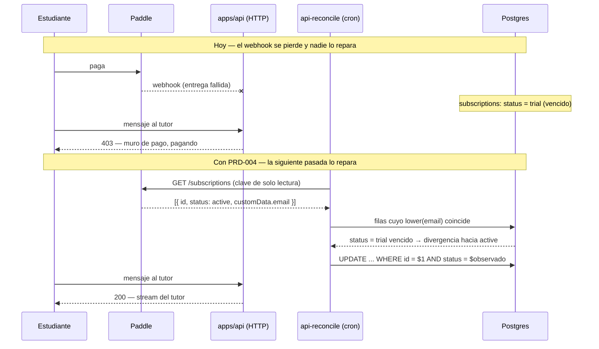
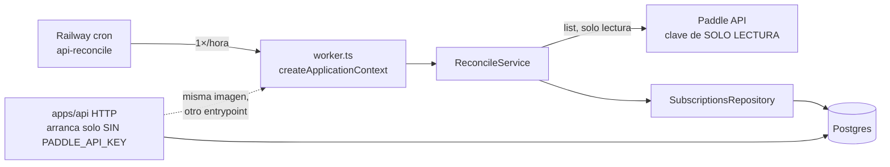

# PRD-004: Reconciliación con Paddle — el primer trabajo diferido de `apps/api`

**Status**: Draft
**Date**: 2026-07-28
**Author**: AI-assisted
**Priority**: P1
**Depends on**: ADR-001, PRD-003
**Supersedes**: None
**Issue**: —

## Impacted Projects

| Project | Impact |
|---------|--------|
| **platform** | Segundo punto de entrada de `apps/api`: `apps/api/src/worker.ts` (nuevo — exporta `main()` y solo se auto-invoca como entrypoint, § 5.1), `apps/api/src/worker.module.ts` y `apps/api/src/worker-config.ts` (nuevos — incluye un `WorkerConfigModule` **`@Global()`**, § 7.1), módulo `reconcile` (nuevo: `reconcile.service.ts`, `reconcile.module.ts`, `paddle.client.ts`), `apps/api/src/billing/paddle-status.ts` y `apps/api/src/billing/paddle-email.ts` (nuevos — el mapa de estados y el extractor de correo que hoy viven inline en `billing.controller.ts:129` y `:52-56`). Se modifican: `apps/api/src/config.ts` (se retira `paddleApiKey` de `ApiConfig`, se añade un guarda que **falla el arranque si `PADDLE_API_KEY` está presente** (§ 8.1) y se añade `poolMax`), `apps/api/src/db/drizzle.module.ts` (el `max` del pool sale de la configuración inyectada), `apps/api/src/billing/billing.controller.ts` (consume las dos piezas extraídas y construye su cliente de Paddle con cadena vacía explícita), `apps/api/src/access/subscriptions.repository.ts` (añade `listAll` y `updateStatusIfUnchanged`), `apps/api/src/analytics/analytics.service.ts` (un valor más en el union `TutorEvent`: `subscription_reconciled`), `apps/api/test/helpers.ts` y `apps/api/test/build-boot.e2e-spec.ts` (los dos sitios que tienen que limpiar `PADDLE_API_KEY` del entorno de los tests, § 8.1) y `apps/api/package.json` (script `start:worker`). Sin migraciones: `subscriptions` no cambia de forma. Tercer servicio en Railway (`api-reconcile`), de tipo cron. `apps/api/Dockerfile` no se modifica; si Railway no permite sobrescribir el arranque por servicio, aparece `apps/api/Dockerfile.worker` (§ 10 paso 3). `.env.example` añade `PADDLE_API_KEY` **comentada** (§ 10 paso 1), `RECONCILE_APPLY` y `RECONCILE_DEADLINE_MS`. |

---

## 1. Problem Statement

El estado de cobro de un estudiante llega a `subscriptions` por una sola vía: el webhook de Paddle (`apps/api/src/billing/billing.controller.ts`). Si un evento no llega —entrega fallida, ventana de reintentos agotada, despliegue en curso, firma rechazada por desfase de reloj— **nada lo detecta y nada lo repara**. `docs/SYSTEM_ARTIFACT.md` lo declara como deuda abierta del dominio `acceso`: *"No hay reconciliación periódica contra la API de Paddle: si un webhook se pierde, el estado queda desincronizado hasta el siguiente evento."*

El fallo no es simétrico, y **toda la forma de este PRD sale de esa asimetría**. En la dirección mala —Paddle dice `active`, nuestra fila dice `trial` vencido o `canceled`— un estudiante que está pagando no puede escribirle al tutor, y no hay ningún camino por el que se arregle solo: el siguiente evento de esa suscripción puede tardar un mes. En la dirección contraria —Paddle dice `canceled`, nosotros `active`— servimos a quien dejó de pagar, que cuesta dinero pero no rompe a nadie.

Hoy no hay forma de saber cuántas veces ha ocurrido. No es una hipótesis de que ocurrirá: es que **el sistema no puede responder si está ocurriendo ahora**.

### 1.1 Por qué esto y no el andamiaje del worker

ADR-001 § 4 dejó escrito que el trabajo diferido *"ya no es una decisión de arquitectura, es un `main` más en `apps/api`"*, y § 6 fija la señal contraria: si a los 3 meses el roadmap sigue sin items que exijan API fuera de la web, congelar la migración. Construir el worker sin trabajo que ejecutar sería exactamente lo que esa señal prohíbe. Aquí el worker aparece porque un problema real necesita correr fuera del ciclo de petición, no como objetivo.

### 1.2 La restricción que hereda de PRD-003

`apps/api/src/config.ts:58-62` dice por qué el servicio HTTP **no** recibe la clave de API de Paddle:

> *"apps/api NO recibe `PADDLE_API_KEY` (§8): `unmarshal` usa únicamente el secreto del webhook […]. Replicar una credencial capaz de cancelar suscripciones y emitir reembolsos ampliaría el radio de explosión sin comprar nada."*

Reconciliar es leer la API de Paddle. O esa decisión se revierte, o la credencial vive en otro sitio. Este PRD elige lo segundo — pero "vive en otro sitio" no puede ser una instrucción de despliegue: PRD-003 § 1.1 prohíbe que una propiedad de seguridad dependa de dónde se ponga una variable, porque quien despliegue este repositorio —público, AGPL-3.0— en una sola máquina se llevaría el sistema inseguro sin haber hecho nada mal. Por eso § 8.1 lo convierte en propiedad de código.

### 1.3 El barrido concede acceso; no lo quita

**El reconciliador solo escribe hacia `active`.** Una divergencia en dirección `canceled` se detecta, se cuenta y se registra, pero **no se aplica**: la resuelve una persona.

No es cautela genérica, es la conclusión de tres rondas de revisión en las que cada intento de escribir revocaciones produjo un fallo distinto y grave:

1. Crear una fila `canceled` donde no había ninguna es **irreversible**: sin fila, `getAccess` devuelve `{allowed: true, status: "none"}` (`access.service.ts:51-56`) y el primer mensaje abre el trial; con fila `canceled`, `evaluate` devuelve `allowed: false` (`:27-39`) **y** `ensureTrial` hace corto circuito porque ya hay fila (`:76-93`), así que ese trial no puede crearse nunca más.
2. `customData.email` lo elige quien inicia el checkout (riesgo heredado, PRD-003 § 8). Una revocación por correo convertiría un ataque puntual —pagar con el correo de otro y cancelar— en un bloqueo **re-aplicado cada hora para siempre**, porque § 5.2 no filtra por estado y una suscripción cancelada permanece en la lista indefinidamente.
3. Exigir que el `paddle_subscription_id` coincidiera parecía cerrarlo, y no lo hace: **el propio camino de conceder instala ese identificador**. El atacante paga, el barrido concede y estampa el id, el atacante cancela, y la revocación queda autorizada por el vínculo que el barrido acaba de crear.

Conceder no tiene ninguna de esas propiedades: el peor caso es servir el tutor a alguien de más, que es reversible, barato y —según § 1— la dirección que no rompe a nadie. Quitar la escritura de revocaciones no recorta el problema de § 1: lo deja entero y elimina la clase de fallo.

## 2. Goals

1. Detectar toda divergencia entre lo que reporta Paddle y lo que guarda `subscriptions`, **en las dos direcciones**, y dejar las cuentas en los logs con el formato de § 8.2.
2. Cuando Paddle reporte un estado que mapea a `active` y la fila local diga otra cosa, el sistema deberá escribir `active` usando **el mismo mapa de estados que el webhook** (§ 6.2).
3. Cuando la divergencia vaya en dirección `canceled`, el sistema **no deberá escribirla**: la cuenta como `pendiente_revocacion` y la registra (§ 6.5).
4. Si Paddle no reporta una fila local, el sistema **no deberá tocarla** (§ 6.3).
5. El sistema **solo** deberá crear filas nuevas para un reporte que mapee a `active` (§ 6.5).
6. Si la fila cambió entre la carga de la tabla y la escritura, el sistema **no deberá pisarla**: la escritura es un compare-and-set y el fallo cuenta como `desincronizado` (§ 6.6).
7. Si `RECONCILE_APPLY` no vale exactamente `"true"`, el sistema deberá completar el barrido **sin ejecutar una sola escritura**.
8. Si falta `DATABASE_URL` o `PADDLE_API_KEY`, o si `PADDLE_ENV` no vale exactamente `production` o `sandbox`, o si falta `POSTHOG_API_KEY` con `RECONCILE_APPLY=true`, el worker deberá fallar al arrancar nombrando la variable (§ 7.1).
9. Si `PADDLE_API_KEY` está presente en el entorno del **servicio HTTP**, ese servicio deberá fallar al arrancar nombrando la variable (§ 8.1).
10. Si el barrido supera `RECONCILE_DEADLINE_MS`, el proceso deberá registrarlo y terminar de forma incondicional con código 1.
11. Ningún error del worker —incluido uno lanzado **durante la construcción del contenedor**, una excepción no capturada o un rechazo no manejado— deberá escribir un correo en los logs (§ 8.2).
12. Reparar la fila que el tutor va a leer: el emparejamiento es insensible a mayúsculas y alcanza a **todas** las filas que casen (§ 6.4).
13. Arrancar el worker sin exigir ninguno de los secretos del servicio HTTP: ni `AUTH_SECRET`, ni `AUTH_COOKIE_NAME`, ni `PADDLE_WEBHOOK_SECRET` (§ 7.1).
14. Dejar rastro duradero y atribuible de cada escritura aplicada (§ 8.2).
15. Terminar con código 0 cuando la pasada se completa y distinto de 0 cuando falla.

## 3. Non-Goals

- **Aplicar revocaciones.** § 1.3. Se detectan y se cuentan; escribirlas es otro PRD, y ese PRD tendrá que resolver antes el problema del identificador instalado por el barrido (§ 11).
- **Cola de trabajos.** Un barrido no tiene unidades de trabajo que repartir.
- **Corregir la asimetría de normalización del correo.** Defecto preexistente declarado en `access.service.ts` y `billing.controller.ts`. Este PRD convive con ella y con las filas duplicadas que ya ha producido (§ 6.4).
- **Emitir eventos del *embudo* desde el reconciliador.** `subscription_activated` significa "Paddle nos lo confirmó por webhook" y su marca de tiempo alimenta el embudo. `subscription_reconciled` (§ 8.2) es de auditoría y no entra en él.
- **Reconciliar `transactions`, reembolsos, impagos o dunning.**
- **Mapear `past_due` y `paused` a estados propios.** Hoy caen a `active` por el webhook; se reproduce (§ 6.2).
- **Tocar la rama `SubscriptionCanceled` del webhook.** Es dirigida por evento, no por estado.
- **Cerrar el ataque del correo ajeno en el checkout.** Sigue abierto desde PRD-003; § 1.3 impide que el barrido lo amplifique (§ 11).
- **`packages/shared`, `apps/web`, mover el stream del tutor.** Fases pendientes de ADR-001.
- **Panel, endpoint o disparo del barrido por HTTP.**

## 4. User Flows

El estudiante no ve nada nuevo. Cambia que una situación que hoy no se sale sola, se sale sola.



**Flujo del operador** (§ 10): la primera semana el barrido corre sin `RECONCILE_APPLY`. Cada pasada deja el resumen de § 8.2 sin correos. `pendiente_revocacion` es una cola de trabajo humano desde el primer día, no solo un número: son las cuentas a las que se sirve de más.

## 5. API

**El worker no expone superficie HTTP.** No abre puerto, no declara controladores, no hereda el `ThrottlerGuard` global.

### 5.1 Contrato de proceso

| Aspecto | Valor |
|---|---|
| Entrypoint emitido | `apps/api/dist/apps/api/src/worker.js` — mismo `rootDir` inferido que `main.js` |
| Forma del módulo | `worker.ts` **exporta `main()`** y solo se auto-invoca cuando es el entrypoint (`require.main === module`). Sin eso, importarlo desde un test lo ejecuta, y la fila 17 de § 9 no se puede escribir |
| Duración | Una pasada y termina. No es un demonio |
| Código 0 / 1 | 0 si la pasada se completó; 1 ante config inválida, fallo de Paddle o de Postgres, deadline, o cualquier error no capturado |
| Camino del deadline | **`process.exit(1)` incondicional** tras intentar cerrar el contexto. `Collection` del SDK no expone cancelación (§ 5.2), así que un `fetch` en vuelo mantendría vivo el bucle de eventos. **Ese camino se salta `onModuleDestroy`**, así que el lote pendiente de PostHog se pierde: es aceptable para una pasada que ya falló, y se dice aquí para que nadie cuente con lo contrario |
| Errores de construcción | El contexto se crea con **`abortOnError: false`** y con un **logger propio que descarta sus argumentos**. Lo segundo es el control real, y conviene no confundirlos: `ExceptionsZone.asyncRun` llama a `exceptionHandler.handle(e)` —que hace `logger.error(exception)` con el objeto crudo— **antes** de `teardown`, y lo hace pase lo que pase (`@nestjs/core/errors/exceptions-zone.js:20-29`, `exception-handler.js:6-7`). `abortOnError` solo elige entre `process.exit(1)` y relanzar hacia nuestro `.catch()`; **no evita ese registro**. Un logger que se limite a no formatear un `Error` no basta: tiene que descartar lo que recibe |
| Traza de arranque | Inmediatamente después de `resolveWorkerConfig()`, una línea (`reconcile: config resuelta env=<entorno>`). Es lo que permite a la fila 39 de § 9 afirmar sobre el arranque sin esperar a un fallo posterior, que solo podría venir de llamar a Paddle |
| Manejadores de error | `unhandledRejection` y `uncaughtException` instalados **antes** de construir el contexto, más un `.catch()` de nivel superior. Los tres registran bajo § 8.2 y salen 1 |
| Concurrencia | **Invariante: `RECONCILE_DEADLINE_MS` < periodo del cron.** Defecto 300 000 ms contra el cron horario de § 10 |

### 5.2 API de Paddle consumida

Un solo método, de lectura. Verificado contra `@paddle/paddle-node-sdk@3.8.0`, la versión pineada en el `catalog:`:

```ts
paddle.subscriptions.list({ perPage: 100 })   // → SubscriptionCollection
```

- `SubscriptionCollection` extiende `Collection<ISubscriptionResponse, Subscription>`, declarada `implements AsyncIterable<C>`: se recorre con `for await` y la paginación la resuelve el SDK. **No expone cancelación.**
- De cada `Subscription` se leen `id`, `status` y `customData`.
- `ListSubscriptionQueryParameters` **no tiene filtro por fecha**: el barrido es completo por construcción.
- No se filtra por `status`: sin las canceladas no se detectaría la dirección contraria, que aunque no se escriba (§ 1.3) sí se cuenta y se entrega a una persona.
- **Ningún método de escritura del SDK se invoca.**
- `ApiError` del SDK **no asigna `name`**, así que todo fallo de Paddle se registra como `name=Error`; lo que discrimina es `code`, que `causeCode()` lee y que pasa el guarda de forma — un 403 por clave sin permiso sigue siendo diagnosticable.

## 6. Data Model

### 6.1 Sin cambios de esquema

`subscriptions` (`src/lib/schema.ts:107`) no cambia: ni columnas, ni índices, ni enum, ni migración. Es lo que mantiene este PRD fuera del punto de no retorno que ADR-001 § 7 marca en `packages/shared`.

| Columna | Papel |
|---|---|
| `email` | Llave del emparejamiento con `customData.email`, comparada en minúsculas. **Nunca se reescribe** |
| `status` | Se compara, y se escribe solo hacia `active` |
| `paddle_subscription_id` | Se rellena al conceder si Paddle lo trae y la fila no lo tenía. **No autoriza nada** (§ 1.3 punto 3) |
| `trial_ends_at` | **Nunca se toca** |
| `updated_at` | Se sella en cada escritura |

### 6.2 Mapa de estados — uno solo, compartido

| Paddle | `subscriptions.status` | Nota |
|---|---|---|
| `canceled` | `canceled` | Se **detecta**, no se escribe (§ 6.5) |
| `active` | `active` | |
| `past_due` | `active` | Deuda heredada declarada en `SYSTEM_ARTIFACT.md`; se reproduce |
| `paused` | `active` | Ídem |
| `trialing` | `active` | El trial **de Paddle** (con tarjeta) es una conversión |
| cualquier otro | — | No se mapea y no se escribe. Cuenta como `desconocido` |
| — | `trial` | **Inalcanzable desde Paddle** |

**El mapa se extrae a `apps/api/src/billing/paddle-status.ts`** y lo consumen el reconciliador y la rama `Created / Activated / Updated` del webhook. Con dos copias, un `past_due` haría que cada escritor pisara al otro y la fila oscilaría sin que ningún test lo viera. **La extracción sustituye `billing.controller.ts:129` y nada más**: la rama `EventName.SubscriptionCanceled` (`:144-154`) escribe `"canceled"` sin leer `data.status`, es dirigida por evento, y no cambia.

**`emailFromCustomData` se mueve a `apps/api/src/billing/paddle-email.ts`** y también se comparte: es el único guarda de tipo sobre un campo que el navegador controla en el checkout público, y un segundo extractor divergente sería la misma clase de fallo. El reconciliador **añade dos cotas** que el webhook no necesita porque escribe una vez y aquí se reintenta cada hora: descarta lo que no lleve `@` y lo que pase de 254 caracteres (RFC 5321). Lo descartado suma a `sin_correo`.

### 6.3 Solo evidencia positiva — y solo de la cuenta correcta

El reconciliador actúa únicamente sobre suscripciones que Paddle reporta. Una fila cuyo correo no aparece en la lista no se toca ni se cuenta como divergencia. La lista puede venir incompleta por causas indistinguibles de un "no existe" —una página que falla, un `customData` vacío, una clave recortada—, y con la regla contraria cualquiera de ellas dañaría a la escuela entera.

**Esa regla cubre la ausencia; la presencia desde la cuenta equivocada la cubre § 7.1.** `config.ts:63` resuelve el entorno con `PADDLE_ENV === "production" ? … : "sandbox"`, o sea **falla abierto**. En el servicio HTTP es tolerable —solo verifica firmas—; en el worker significaría leer la cuenta de sandbox y escribir la tabla de producción, sin error y sin señal, tomando por evidencia unas suscripciones de prueba que llevan correos reales en su `customData`.

### 6.4 Emparejamiento insensible a mayúsculas

`billing.controller.ts:55` pasa a minúsculas el correo de Paddle; `access.service.ts` **no** transforma el del token. **La consecuencia ya está en la base de datos y es el escenario de § 1**: el unique de `subscriptions.email` es sobre `text` plano (`src/lib/schema.ts:109`), así que `Estudiante@Ejemplo.test` y `estudiante@ejemplo.test` no colisionan. El estudiante escribe al tutor e `insertTrial` crea la fila A con las mayúsculas del token; luego paga, el `onConflictDoUpdate` del webhook no encuentra conflicto contra A e **inserta la fila B en minúsculas**. El tutor sigue leyendo A.

Por eso el barrido **carga la tabla entera una vez** (`listAll`) y la indexa en memoria por correo en minúsculas. Un `Map<string, Subscription[]>` hace visible que una llave puede tener más de una fila; un `SELECT … LIMIT 1` devolvería una arbitraria —si es B, ya está `active`, no hay divergencia, y el barrido informa cero reparaciones con el estudiante igual de bloqueado.

Cuando la llave tiene más de una fila, **la regla se aplica a todas** y la pasada cuenta `ambiguo=N`. No se elige una: son la misma persona, y cuál lee el tutor depende de las mayúsculas del token, que no son observables desde aquí. Fusionarlas o borrarlas es otro PRD (§ 3).

**Varias suscripciones de Paddle para un mismo correo son normales**, no un ataque: quien cancela y se vuelve a suscribir tiene dos, y la cancelada no sale nunca de la lista. Como solo se escribe hacia `active`, el orden es irrelevante y la operación es idempotente: cualquier reporte `active` del grupo produce la misma escritura, y los `canceled` hermanos solo suman a `pendiente_revocacion`.

Sin índice funcional sobre `lower(email)`: con la carga única, la pasada hace **un** recorrido secuencial. `ponytail:` con el techo — si `subscriptions` pasa del orden de 10⁴ filas, la salida es paginar la carga y añadir `CREATE INDEX ON subscriptions (lower(email))`.

### 6.5 Qué se escribe y qué no

| Reporte de Paddle | Fila local | Acción |
|---|---|---|
| mapea a `active` | existe, `status` distinto | **`updateStatusIfUnchanged`** sobre cada fila que case; rellena `paddle_subscription_id` si estaba vacío |
| mapea a `active` | existe, ya `active` | Nada |
| mapea a `active` | no existe | **`upsertStatus`** — inserta en minúsculas con su identificador |
| mapea a `canceled` | existe, `status` distinto | **No se escribe.** `pendiente_revocacion++`, se registra el identificador |
| mapea a `canceled` | no existe | **No se crea nada.** `pendiente_revocacion++` |
| no mapea | cualquiera | Nada. `desconocido++` |

**El alta usa `upsertStatus` a propósito**, y no un `INSERT` pelado: un fallo del `Map` significa que no hay fila en ninguna capitalización, pero el webhook puede crearla a mitad de pasada y `subscriptions.email` es `.unique()` (`src/lib/schema.ts:109`). El `onConflictDoUpdate` degrada a `UPDATE` en vez de lanzar. En el camino de emparejamiento **no** se usa: allí conflictaría sobre el correo en minúsculas contra una fila en mayúsculas e **insertaría** la duplicada que § 6.4 existe para no crear.

**Y ese `onConflictDoUpdate` lleva predicado**, por la misma razón que § 6.6: si la fila que apareció entre la carga y la escritura la creó el webhook con `canceled`, un upsert incondicional la pisaría con `active`, y como el barrido nunca revoca se quedaría así para siempre. La cláusula `setWhere` —disponible en el `drizzle-orm` pineado— limita la actualización a las filas que no estén ya en `canceled`; un conflicto descartado cuenta como `desincronizado`, igual que en § 6.6.

### 6.6 Las escrituras son compare-and-set

`updateStatusIfUnchanged` es `UPDATE … WHERE id = $1 AND status = $observado`, donde `$observado` es el estado que la fila tenía **cuando se cargó la tabla**. Cero filas afectadas significa que alguien escribió entretanto: se salta y cuenta `desincronizado`.

Sin esa cláusula, la carga única de § 6.4 abre una ventana de hasta `RECONCILE_DEADLINE_MS` entre lectura y escritura. El caso que la hace necesaria aun escribiendo solo hacia `active`: en T0 se lee la suscripción en Paddle todavía `active` **y la fila local en `trial` vencido** —o sea, una divergencia que sí se va a intentar escribir—; el estudiante cancela y el webhook escribe `canceled` en T1; el barrido escribiría `active` en T2 pisando un dato más fresco — y como el barrido nunca revoca, esa fila se quedaría `active` **para siempre**. La cláusula convierte la pasada en idempotente bajo concurrencia y no solo en aislamiento.

## 7. Architecture



- **`worker.ts`** instala los manejadores de § 5.1, resuelve la configuración, construye el contexto con `abortOnError: false`, arma el deadline, invoca una pasada, cierra el contexto —lo que cierra el pool y vacía PostHog por los `OnModuleDestroy` que ya existen— y termina.
- **`ReconcileService`** es el barrido de §§ 6.4-6.6.
- **`SubscriptionsRepository`** gana `listAll` y `updateStatusIfUnchanged`. Las sentencias existentes no cambian.

### 7.1 El grafo del worker no es el del servicio HTTP

`WorkerModule` **no importa `ConfigModule` ni `AccessModule`**:

- `config.module.ts` es `@Global()` y su fábrica corre al construir el contenedor, exigiendo `AUTH_SECRET`, `AUTH_COOKIE_NAME` y `PADDLE_WEBHOOK_SECRET`. Un worker que lo importara moriría en cada pasada nombrando `AUTH_SECRET`, y el atajo de darle las cuatro variables metería en un tercer servicio el secreto de sesión —falsificable, sin revocación individual— y el del webhook, justo lo que PRD-003 paso 5 quitó.
- `AccessModule` registra `AccessController`, cuyo `@UseGuards(SessionGuard)` arrastra `SessionGuard` → `API_CONFIG`, y **exporta solo `AccessService`**: no podría suministrar el repositorio ni aunque se importara.

**`worker-config.ts` expone un `WorkerConfigModule` marcado `@Global()` que además `exports: [API_CONFIG]`.** Las dos mitades hacen falta y la segunda es la que trabaja: en Nest un módulo global no registra sus providers globalmente, registra **lo que exporta** — por eso `config.module.ts:15` lleva ese `exports` y por eso resuelven hoy los dos consumidores, que no importan nada: `DrizzleModule` inyecta `API_CONFIG` en su fábrica de `PG_POOL` (`drizzle.module.ts:38`) y `AnalyticsService` en su constructor (`analytics.service.ts:39`). Declarar `API_CONFIG` como provider local de `WorkerModule` haría fallar el contenedor en la construcción, que es el mismo fallo una indirección más adentro. `WorkerModule` importa `WorkerConfigModule`, `DrizzleModule`, `AnalyticsModule` y `ReconcileModule`, y provee `SubscriptionsRepository` directamente (sin conflicto: `DrizzleModule` es `@Global()` y exporta `DRIZZLE`).

`resolveWorkerConfig()` exige:

| Variable | Regla |
|---|---|
| `DATABASE_URL` | Obligatoria |
| `PADDLE_API_KEY` | Obligatoria |
| `PADDLE_ENV` | **Obligatoria y exacta**: solo `production` o `sandbox`; cualquier otra cosa es `ConfigError`. Aquí **no** se reproduce el defecto de `config.ts:63`, y la divergencia es deliberada (§ 6.3). Mismo patrón que `AUTH_COOKIE_NAME` en `config.ts:48-54` |
| `POSTHOG_API_KEY` | **Obligatoria si `RECONCILE_APPLY=true`**; opcional en modo sin escritura. Sin ella `AnalyticsService` deja el cliente a `null` y `track()` retorna en la primera línea, así que el goal 14 sería un no-op silencioso en producción sin que nada se pusiera rojo. Se puede observar sin telemetría; no se puede **escribir** sin rastro |
| `POSTHOG_HOST` | Mismo defecto que `config.ts:67` |
| `RECONCILE_APPLY` | Opcional. Solo `"true"` exacta activa la escritura; cualquier otra cosa, incluida la ausencia, es modo sin escritura (goal 7). Es la que condiciona la regla de `POSTHOG_API_KEY` de arriba |
| `RECONCILE_DEADLINE_MS` | Opcional, defecto 300 000. Invariante: menor que el periodo del cron (§ 5.1) |
| `poolMax` | 1 (§ 7.2) |

### 7.2 Presupuesto de conexiones

`MAX_POOL_CONNECTIONS = 8` es hoy una constante de módulo horneada en la fábrica del pool (`drizzle.module.ts:23,42`): sin punto de inyección, el worker no puede declarar el suyo sin tocar ese fichero. **El `max` pasa a salir de la configuración inyectada** — HTTP 8, worker 1.

Se hace así, y no con un módulo de pool aparte, porque la fábrica actual registra el listener `error` del pool (`drizzle.module.ts:52-56`), y `SYSTEM_ARTIFACT.md:213` documenta que ése es el único obstáculo entre la caída de un cliente ocioso y la muerte del proceso, **sin ningún test que lo cubra**. Una segunda fábrica que lo olvidara le daría al cron un camino de caída silenciosa. Una fábrica, un listener.

Reparto: 8 Next, 8 `apps/api`, 1 worker, 3 de margen para `drizzle-kit migrate` y los scripts.

## 8. Security

### 8.1 La credencial, contenida por código y no por despliegue

`PADDLE_API_KEY` permite cancelar suscripciones y emitir reembolsos. Tres controles:

| # | Control | Qué compra |
|---|---|---|
| 1 | **Clave de solo lectura sobre suscripciones**, creada aparte | Aunque el proceso se comprometa entero, no hay escritura que ejecutar contra Paddle |
| 2 | **El servicio HTTP se niega a arrancar si la variable está presente** | La separación deja de depender de dónde se ponga una variable |
| 3 | **El proceso no atiende peticiones** | No hay petición que un tercero pueda formar para hacerlo actuar |

**El control 2 no puede ser una instrucción de despliegue.** Hay dos caminos que llegan a la configuración prohibida sin que nadie cometa un error perceptible, y los dos **fallan aparentando éxito**:

- **El arranque por servicio no se aplica.** `Dockerfile:41` es `CMD [… main.js]`. § 10 paso 3 despliega `api-reconcile` desde esa misma imagen confiando en una sobrescritura que —la cabecera del propio Dockerfile lo documenta— Railway ya ignoró una vez. El modo de fallo no es "no arranca": es **"arranca `main.js` correctamente"**, o sea una API sana en `0.0.0.0`, con dominio público, sosteniendo la credencial.
- **Auto-hospedaje.** `.env.example` es un fichero y un entorno, y en una sola máquina lo heredan los dos entrypoints.

Por eso: **`resolveApiConfig()` retira `paddleApiKey` y lanza `ConfigError` si `PADDLE_API_KEY` está presente**. `main.ts:39-46` ya convierte un `ConfigError` en salida 1 etiquetada. `BillingController` construye su cliente con cadena vacía explícita — verificado que no rompe la firma: `unmarshal` delega en el validador sin tocar el cliente ni la clave.

**Dos consecuencias del guarda que hay que absorber, no descubrir:**

- **Dos sitios tienen que limpiar `PADDLE_API_KEY`, no uno.** El primero es el mapa base de `applyApiEnv()` (`apps/api/test/helpers.ts:89-99`), como ya hace con `POSTHOG_API_KEY` (`:97`); eso cubre `access.e2e-spec.ts`, `billing.e2e-spec.ts`, `throttle.e2e-spec.ts` y la fila 2 de PRD-003 § 9. El segundo es **`build-boot.e2e-spec.ts:61`**, cuyo `bootEntrypoint` esparce `...process.env` y donde `applyApiEnv()` se llama una sola vez (`:173`, solo la fila 2): las filas 1 y 3 de PRD-003 § 9 nunca pasan por él, así que sin limpiarla ahí también, una variable exportada por el desarrollador llega al `main.js` lanzado, el guarda lo mata, y esas filas fallan con un mensaje que nombra el problema equivocado.
- **En `.env.example` la variable va comentada**, en bloque propio —el estilo que el fichero ya usa para `CURRICULUM_TEST_DATABASE_URL`— diciendo que pertenece solo al proceso de reconciliación, que debe ser de solo lectura, y que descomentarla en el entorno del servicio HTTP impide su arranque **a propósito**. Un ejemplo que la enviara activa mandaría a todo el que clone el repositorio directo al ciclo de reinicios. `RECONCILE_APPLY` va igualmente comentada: enviarla en `true` desactivaría el modo seguro por defecto para todos.

**El control 3 dice "no atiende peticiones", no "nada le llega".** Dos cosas le llegan en cada pasada: el `customData` que nace en el checkout público —contenido por § 6.2 y § 1.3— y **el propio código**, porque Railway despliega al mergear a `main` y el repositorio no tiene CI (`SYSTEM_ARTIFACT.md:398,428`). Cualquier commit mergeado corre cada hora con la credencial, sin vigilancia. Ése es el vector real que hace cargar el peso al control 1.

Si el panel de Paddle no permite recortar permisos por recurso, este PRD **no se implementa como está** (§ 11).

### 8.2 Registro sin PII, y el rastro de lo que se cambió

**El worker no puede instalar `AllExceptionsFilter`.** `SYSTEM_ARTIFACT.md:368` declara la invariante como *"una allowlist por campo, **de servicio y no de un `catch`**"*, porque las consultas que ligan el correo no capturan y el error aterriza en un manejador que nadie escribió. Ese control se instala en `bootstrap.ts:38` sobre una `NestExpressApplication`; `createApplicationContext` devuelve un `INestApplicationContext`, sin `useGlobalFilters` ni ciclo de petición.

El sustituto es estructural y de proceso (§ 5.1): `unhandledRejection`, `uncaughtException` y el `.catch()` de nivel superior, los tres registrando **solo** `errorName()` y `causeCode()`.

**El quinto camino —un fallo durante la construcción del contenedor— no lo cubre ninguno de los tres, y `abortOnError: false` tampoco.** Nest registra el error crudo en `ExceptionsZone` antes de ceder el control (§ 5.1), así que ahí el único control es **el logger que se le pasa a `createApplicationContext`, y tiene que descartar sus argumentos**, no simplemente evitar formatear un `Error`. Con eso quedan cubiertos los cinco: el `DrizzleQueryError` de una consulta que liga el correo (su `message` lleva los parámetros), el `DatabaseError` de `pg` con `detail: Key (email)=(…)`, el agotamiento del pool, el rechazo en vuelo al vencer el deadline, y el fallo en construcción.

- **Nunca se registra un correo**, ni entero ni truncado ni hasheado.
- `paddle_subscription_id` sí, y se etiqueta por lo que es: **un seudónimo re-identificable con acceso al panel de Paddle**, no un dato anónimo — el paso 4 de § 10 consiste en resolverlo a personas. No se pega en tickets ni en issues de un repositorio público. La retención es la de los logs de Railway.
- **Resumen de cada pasada**, una línea:

  ```
  revisadas=N reparadas=M divergencias=D pendiente_revocacion=P sin_correo=S desincronizado=X ambiguo=A desconocido=U aplicar=true|false
  ```

  El paso 4 de § 10 depende de leerla, así que su forma es contrato: § 9 la verifica.

**Rastro duradero (goal 14).** Cada escritura aplicada emite **`subscription_reconciled`** con `distinctId` = correo y `{ from, to, paddle_subscription_id }`. No es un sumidero de PII nuevo: el `distinct_id` ya es el correo en todos los eventos del sistema. No entra en el embudo ni toca los nombres existentes (§ 3). Exige un valor más en el union `TutorEvent` —duplicado hoy en dos ficheros, deuda que cierra `packages/shared`— y **el vaciado del lote depende de cerrar el contexto**: `AnalyticsService` no expone `flush()` público, solo `onModuleDestroy` → `shutdown()` (`analytics.service.ts:63-66`); el `flush()` que existe está en `src/lib/analytics.ts:63`, que es otro fichero y otro cliente. Por eso el camino del deadline (`process.exit(1)`) pierde el lote, y por eso se dice en § 5.1.

### 8.3 Superficie que no cambia

- El webhook no cambia de cara a Paddle: misma verificación de firma, mismo 200 defensivo, mismos dos 400, misma rama `SubscriptionCanceled`.
- No se añade endpoint. El límite de tasa, el `trust proxy` y el guard global siguen igual.
- La `DATABASE_URL` del worker es la misma. **Acotarlo a un rol de Postgres con permiso solo sobre `subscriptions` sería el endurecimiento siguiente**; el plugin de Railway entrega un único usuario.

### 8.4 Riesgos aceptados

- **Se sirve de más, a propósito.** Como el barrido no revoca, a quien canceló y cuyo webhook se perdió se le sigue sirviendo el tutor hasta que una persona actúe sobre `pendiente_revocacion`. Es fuga de ingresos acotada, visible en cada pasada y reversible a mano — y es el precio de no tener ninguna de las tres clases de fallo de § 1.3.
- **El ataque del correo ajeno en el checkout se hereda.** § 1.3 impide que el barrido lo amplifique: lo peor que puede hacer un atacante vía el barrido es **pagar el acceso de otro**. Cerrarlo de verdad exige cotejar contra el cliente de Paddle (§ 11).
- **Una escritura que falla a mitad de pasada deja la pasada a medias.** Las escrituras son por fila y no hay transacción sobre el barrido: si la fila 7 de 30 lanza, las 6 anteriores persisten, el proceso propaga y sale 1. Se acepta —una transacción sobre el barrido entero mantendría abierta una escritura larga contra la tabla que sirve el acceso— y es seguro porque la pasada es idempotente incluso bajo concurrencia (§ 6.6).
- **Una fila creada por el barrido consume la elegibilidad de trial para siempre.** `ensureTrial` hace corto circuito ante cualquier fila existente (`access.service.ts:76-93`), así que quien no tenía fila y el barrido se la crea ya no podrá estrenar el trial de 7 días más adelante. En el único caso en que el barrido crea filas —Paddle reporta `active`— eso es correcto, porque esa persona está pagando y no necesita prueba; se declara aquí porque el efecto es permanente y no evidente leyendo § 6.5.
- **El paso 3 de § 10 también puede romper producción, no solo el paso 1.** Poner `PADDLE_API_KEY` en el servicio equivocado al crear el cron —o teclear mal el nombre del servicio— deja al servicio HTTP en ciclo de reinicios por el guarda de § 8.1. Es el precio deliberado de que el control sea de código: falla ruidosamente en vez de en silencio. La contención es el orden del paso 1 (comprobar el entorno de `api` antes de mergear) y que el rollback es quitar la variable, sin desplegar.
- **Sin límite de páginas.** Lo corta el deadline, no un contador.

## 9. Test Plan

Vitest en `apps/api`, con la convención de PRD-003. Los e2e con base exigen `API_TEST_DATABASE_URL` y abortan si coincide con `DATABASE_URL`.

**Los códigos de salida solo se afirman desde un proceso hijo** (`build-boot.e2e-spec.ts:59-72`, `spawn` + `child.on("exit")`), y un proceso lanzado así **no admite sustitución de providers ni alcanza la API de Paddle** con una clave de prueba. Por eso las filas de arranque solo afirman sobre lo que ocurre **antes** de la primera llamada a Paddle, y todo lo demás corre en proceso con el cliente sustituido por un doble.

| # | Test | Type | Description | Path |
|---|---|---|---|---|
| 1 | Mapa de estados completo | Unit | Los cinco estados del SDK mapean según § 6.2 | `../platform/apps/api/src/billing/paddle-status.spec.ts` |
| 2 | El mapa nunca produce `trial` | Unit | Ningún estado de entrada devuelve `trial` | `../platform/apps/api/src/billing/paddle-status.spec.ts` |
| 3 | Extractor de correo compartido | Unit | No-string, sin `@` y >254 caracteres se rechazan y suman a `sin_correo` | `../platform/apps/api/src/billing/paddle-email.spec.ts` |
| 4 | Estado no declarado por el SDK | Unit | Un `status` fuera de los cinco no mapea, no escribe, suma a `desconocido` | `../platform/apps/api/src/reconcile/reconcile.service.spec.ts` |
| 5 | El webhook conserva su comportamiento | Regresión | Los cinco estados por la rama `Created/Activated/Updated` escriben lo mismo que antes | `../platform/apps/api/test/billing.e2e-spec.ts` |
| 6 | La rama `SubscriptionCanceled` ignora el estado | Regresión | Un `subscription.canceled` con `status: "active"` sigue escribiendo `canceled` | `../platform/apps/api/test/billing.e2e-spec.ts` |
| 7 | Divergencia hacia `active` | Unit | Paddle `active`, fila `trial` caducada → se escribe `active` — goal 2 | `../platform/apps/api/src/reconcile/reconcile.service.spec.ts` |
| 8 | Divergencia hacia `canceled` no se escribe | Unit | Paddle `canceled`, fila `active` → **cero escrituras**, `pendiente_revocacion=1` — goal 3 | `../platform/apps/api/src/reconcile/reconcile.service.spec.ts` |
| 9 | `canceled` sin fila no crea nada | Unit | Paddle `canceled` para un correo sin fila → nada escrito, `pendiente_revocacion=1` — goal 5 | `../platform/apps/api/src/reconcile/reconcile.service.spec.ts` |
| 10 | Re-suscripción | Unit | Dos suscripciones con el mismo correo, una `canceled` y otra `active` → se escribe `active` una vez y `pendiente_revocacion` no bloquea — § 6.4 | `../platform/apps/api/src/reconcile/reconcile.service.spec.ts` |
| 11 | Sin divergencia, sin escritura | Unit | Estados que ya coinciden no generan escrituras | `../platform/apps/api/src/reconcile/reconcile.service.spec.ts` |
| 12 | Modo sin escritura | Unit | Con `RECONCILE_APPLY` ausente y divergencias: cero escrituras, cuentas registradas — goal 7 | `../platform/apps/api/src/reconcile/reconcile.service.spec.ts` |
| 13 | Paginación | Unit | Una colección simulada de dos páginas se recorre entera con `for await` | `../platform/apps/api/src/reconcile/reconcile.service.spec.ts` |
| 14 | Fallo de la API de Paddle | Unit | Un rechazo a mitad de iteración propaga | `../platform/apps/api/src/reconcile/reconcile.service.spec.ts` |
| 15 | Formato del resumen | Unit | La línea lleva los nueve campos de § 8.2 con los valores correctos — goal 1 | `../platform/apps/api/src/reconcile/reconcile.service.spec.ts` |
| 16 | Evento de auditoría | Unit | Una reparación emite un `subscription_reconciled` con `from`/`to`; en modo sin escritura, ninguno — goal 14 | `../platform/apps/api/src/reconcile/reconcile.service.spec.ts` |
| 17 | Deadline vencido | Unit | Con un doble que **cede a través de un temporizador real** —no un iterable que nunca await-ea un macrotask, que mataría el fichero por `testTimeout`— la pasada rechaza con el error de deadline — goal 10 | `../platform/apps/api/src/reconcile/reconcile.service.spec.ts` |
| 18 | Mapa de códigos de salida | Unit | Importando `main()` sin ejecutarlo: pasada limpia → 0; error de Paddle, de base y deadline → 1, con `process.exit` espiado — goals 10 y 15 | `../platform/apps/api/src/worker.spec.ts` |
| 19 | Emparejamiento insensible a mayúsculas | E2E | Fila `Estudiante@Ejemplo.test` en `trial`, Paddle `estudiante@ejemplo.test` `active`: se actualiza **esa** fila, conserva sus mayúsculas, y no aparece una segunda — goal 12 | `../platform/apps/api/test/reconcile.e2e-spec.ts` |
| 20 | Dos filas para el mismo correo | E2E | Fila mixta en `trial` vencido y minúscula en `active`, Paddle `active`: **ambas** quedan `active`, `ambiguo=1`, y el acceso por el correo con mayúsculas pasa a permitido | `../platform/apps/api/test/reconcile.e2e-spec.ts` |
| 21 | Alta sin fila previa | E2E | Paddle `active` para un correo sin fila → se inserta en minúsculas con su identificador, vía `upsertStatus` — § 6.5 | `../platform/apps/api/test/reconcile.e2e-spec.ts` |
| 22 | Alta que carrera con el webhook | E2E | Creando la fila entre la carga y la escritura, el alta degrada a `UPDATE` y no lanza violación de unicidad — § 6.5 | `../platform/apps/api/test/reconcile.e2e-spec.ts` |
| 23 | Compare-and-set | E2E | Cambiando el `status` de la fila después de la carga, la escritura afecta cero filas, no pisa el valor nuevo, y cuenta `desincronizado` — goal 6, § 6.6 | `../platform/apps/api/test/reconcile.e2e-spec.ts` |
| 24 | Fila que Paddle no conoce | E2E | Filas cuyos correos no están en la lista quedan **byte a byte iguales**, `updated_at` incluido — goal 4 | `../platform/apps/api/test/reconcile.e2e-spec.ts` |
| 25 | Lista de Paddle vacía | E2E | Una respuesta sin suscripciones no cambia nada | `../platform/apps/api/test/reconcile.e2e-spec.ts` |
| 26 | `trial_ends_at` intacto | E2E | Reparar a `active` una fila en `trial` no modifica `trial_ends_at` | `../platform/apps/api/test/reconcile.e2e-spec.ts` |
| 27 | Modo sin escritura contra base real | E2E | Con divergencias reales y `RECONCILE_APPLY` ausente, ninguna fila cambia — goal 7 | `../platform/apps/api/test/reconcile.e2e-spec.ts` |
| 28 | Idempotencia | E2E | Dos pasadas seguidas dejan el mismo estado y la segunda reporta cero reparaciones | `../platform/apps/api/test/reconcile.e2e-spec.ts` |
| 29 | Fallo de escritura a mitad de barrido | E2E | Fallando la segunda de tres divergencias: la primera persiste, la pasada propaga, y una segunda pasada completa el resto — § 8.4 | `../platform/apps/api/test/reconcile.e2e-spec.ts` |
| 30 | Fuga por error de base | E2E | Forzando un `DrizzleQueryError` real (pool cerrado) con el correo entre los parámetros ligados, la salida capturada no contiene `@` — goal 11 | `../platform/apps/api/test/reconcile.e2e-spec.ts` |
| 31 | Fuga por violación de unicidad | E2E | Forzando el `DatabaseError` de `pg` cuyo `detail` lleva `Key (email)=(…)`, la salida no contiene `@` — goal 11 | `../platform/apps/api/test/reconcile.e2e-spec.ts` |
| 32 | Fuga en construcción del contenedor | Unit | Una fábrica que lanza con el correo en el mensaje: ni el `ExceptionHandler` de Nest ni el `.catch()` de nivel superior dejan el correo en la salida — es el logger que descarta argumentos lo que se está probando, no `abortOnError` — goal 11, § 5.1 | `../platform/apps/api/src/worker.spec.ts` |
| 33 | Fuga por rechazo y por excepción no capturados | Unit | Los manejadores `unhandledRejection` y `uncaughtException` instalados registran solo `name` y `code` — goal 11 | `../platform/apps/api/src/worker.spec.ts` |
| 34 | Los logs de la pasada buena no llevan correos | E2E | La salida de una pasada con divergencias no contiene `@` | `../platform/apps/api/test/reconcile.e2e-spec.ts` |
| 35 | Arranque sin `PADDLE_API_KEY` | E2E | El worker lanzado con `spawn` sale distinto de 0 nombrando `PADDLE_API_KEY`, sin abrir conexión a Postgres — goal 8 | `../platform/apps/api/test/worker-boot.e2e-spec.ts` |
| 36 | Arranque sin `DATABASE_URL` | E2E | Ídem nombrando `DATABASE_URL` — goal 8 | `../platform/apps/api/test/worker-boot.e2e-spec.ts` |
| 37 | `PADDLE_ENV` ausente o inexacta | E2E | Ausente, `Production`, `prod` o con espacio → sale 1 nombrando `PADDLE_ENV` — goal 8, § 7.1 | `../platform/apps/api/test/worker-boot.e2e-spec.ts` |
| 38 | `POSTHOG_API_KEY` con escritura activada | E2E | Con `RECONCILE_APPLY=true` y sin esa variable → sale 1 nombrándola; sin `RECONCILE_APPLY` arranca — goal 8, § 7.1 | `../platform/apps/api/test/worker-boot.e2e-spec.ts` |
| 39 | El worker no exige los secretos del servicio HTTP | E2E | Con `AUTH_SECRET`, `AUTH_COOKIE_NAME` y `PADDLE_WEBHOOK_SECRET` **ausentes**, el worker emite la línea `reconcile: config resuelta` (§ 5.1) y el test mata el proceso ahí. Se afirma sobre esa línea y no sobre un fallo posterior, porque lo único entre la configuración y la salida es la llamada a Paddle — goal 13, § 7.1 | `../platform/apps/api/test/worker-boot.e2e-spec.ts` |
| 40 | El entrypoint del worker existe donde se dice | E2E | Tras `pnpm --filter api build`, `dist/apps/api/src/worker.js` existe | `../platform/apps/api/test/build-boot.e2e-spec.ts` |
| 41 | El servicio HTTP se niega a arrancar con `PADDLE_API_KEY` | E2E | Arrancar `main.js` con la variable puesta sale con código 1 y el mensaje la nombra — goal 9, § 8.1 | `../platform/apps/api/test/build-boot.e2e-spec.ts` |
| 42 | La suite existente sobrevive al guarda | Regresión | Con `PADDLE_API_KEY` exportada en el entorno del desarrollador, `applyApiEnv()` la limpia y las filas 1-3 de PRD-003 § 9 siguen pasando — § 8.1 | `../platform/apps/api/test/build-boot.e2e-spec.ts` |
| 43 | El pool toma su `max` de la configuración | Unit | `resolveApiConfig()` da 8 y `resolveWorkerConfig()` 1, y la fábrica de `PG_POOL` lo propaga al `Pool` con el listener `error` registrado — § 7.2 | `../platform/apps/api/src/db/drizzle.module.spec.ts` |

El cliente de Paddle se inyecta como provider (`PADDLE_CLIENT`) para que las filas en proceso lo sustituyan por un doble sin red, igual que `SubscriptionsRepository` se sustituye hoy en las filas 13-18 de PRD-003 § 9. **Ninguna fila alcanza la API real de Paddle**: las de arranque (35-39) afirman solo sobre la resolución de configuración, que ocurre antes.

## 10. Migration Plan

**Paso 1 — Código, sin servicio.** Se mergea todo. Railway despliega al mergear a `main`, así que el servicio `api` sale con las dos piezas extraídas, el guarda de `PADDLE_API_KEY` y el `max` inyectado; las filas 5, 6, 41, 42 y 43 sostienen que eso no cambie nada.

**Comprobar antes de mergear que el servicio `api` no tiene `PADDLE_API_KEY` en su entorno** — si la tuviera, el guarda lo dejaría en ciclo de reinicios. Si la tiene, retirarla primero y desplegar después. El paso 3 tiene el mismo filo por otra vía (§ 8.4): son los dos momentos del plan en que este PRD puede tumbar producción, y los dos fallan de forma ruidosa a propósito.

En `.env.example`, `PADDLE_API_KEY` y `RECONCILE_APPLY` van **comentadas**, en bloque propio, con la advertencia de § 8.1. **Y hay que corregir la línea que ya existe**: hoy `.env.example` presenta `PADDLE_API_KEY` como variable de `apps/api`, que tras este PRD es exactamente lo contrario de lo cierto y manda al auto-hospedador al rechazo de arranque. Añadir el bloque nuevo sin tocar esa línea deja el fichero contradiciéndose. Para desarrollo local con las dos partes en una máquina: la variable **no** va en el `.env` compartido; se pasa solo al worker en la invocación (`PADDLE_API_KEY=… pnpm --filter api start:worker`), que es lo que mantiene el guarda cierto sin romper el flujo del desarrollador.

**Paso 2 — Clave de solo lectura.** Se crea en el panel de Paddle una clave nueva con permiso de lectura sobre suscripciones y nada más. Si el panel no permite ese recorte, **parar aquí** y volver a § 11.

**Paso 3 — Servicio de cron, sin escribir.** Se crea `api-reconcile` sobre el mismo repositorio, con `RAILWAY_DOCKERFILE_PATH=apps/api/Dockerfile` y el arranque sobrescrito a `node apps/api/dist/apps/api/src/worker.js`. Variables: `DATABASE_URL`, `PADDLE_API_KEY`, `PADDLE_ENV`, `POSTHOG_API_KEY`. **`RECONCILE_APPLY` no se pone.** Programación: cada hora.

  **Verificar que el servicio ejecuta el worker y no `main.js`.** No basta con que arranque: el `CMD` de la imagen es el servidor HTTP, así que una sobrescritura ignorada produce una API sana con la credencial y dominio público, y eso *parece* un despliegue correcto. Se comprueba leyendo el log de arranque —el worker no imprime "escuchando en el puerto"— y confirmando que el servicio no expone dominio. Si la sobrescritura no se aplica, la salida es **`apps/api/Dockerfile.worker`**: copia del actual que solo cambia el `CMD`. No puede heredar la imagen del otro servicio con un `FROM` —Railway construye cada servicio por su cuenta— así que cuesta un segundo build completo.

  Verificar también el límite de conexiones del plugin de Postgres antes de sumar el tercer consumidor.

**Paso 4 — Observar una semana.** Cada pasada deja la línea de § 8.2. `divergencias` distintas de 0 en pasadas sucesivas para la misma suscripción son deriva real; `pendiente_revocacion` es **cola de trabajo humano**, no un número de diagnóstico; `sin_correo` alto dice que el enlace por `customData` está peor de lo que se cree; `ambiguo` mide cuántas cuentas duplicadas ha producido la asimetría de mayúsculas; `desincronizado` mide cuánta concurrencia real hay con el webhook. Se contrasta a mano contra el panel de Paddle usando el identificador de los logs.

**Paso 5 — Encender la escritura.** `RECONCILE_APPLY=true`. Solo tras el paso 4 y solo si lo observado se explica. La primera pasada con escritura se mira en directo.

**Rollback.** Quitar `RECONCILE_APPLY` detiene toda escritura en la pasada siguiente, sin desplegar. Borrar el servicio detiene el barrido. Ninguna de las dos afecta a `api` ni a Next.

**Sin backfill y sin migración.** La primera pasada con escritura *es* el backfill, y es idempotente (filas 23 y 28).

## 11. Open Questions

- [ ] **¿Permite el panel de Paddle de esta cuenta crear una clave acotada a lectura de suscripciones?** Bloquea el paso 2 de § 10. Si no, el control 1 de § 8.1 —el que carga el peso— desaparece, y la decisión de seguir con una clave plena o descartar el PRD es del usuario. **Debe cerrarse antes de `Implemented`.**
- [ ] **¿Cómo se aplican las revocaciones que el barrido detecta y no escribe?** Hoy: a mano, sobre `pendiente_revocacion`. Automatizarlo es un PRD aparte y **tiene un prerrequisito**: mientras el camino de conceder rellene `paddle_subscription_id`, ese identificador no puede servir de autorización para revocar (§ 1.3 punto 3). Quien lo aborde necesita otra fuente de vínculo, probablemente el cliente de Paddle.
- [ ] **¿Se cierra el ataque del correo ajeno en el checkout, y con qué?** Abierto desde PRD-003. **No bloquea este PRD**: § 1.3 garantiza que lo peor que el barrido puede hacer es conceder acceso de más.
- [ ] **¿Una vez por hora es la frecuencia correcta?** Diferido a los datos del paso 4.

---

## Design Decisions

**El barrido concede y no revoca.** La decisión de fondo, argumentada en § 1.3. Tres rondas de revisión produjeron tres fallos distintos y graves, todos en el camino de escribir revocaciones, y cada arreglo añadía reglas —cotejo de identificador, colisiones, vínculo— hasta que la última demostró que la defensa era circular. Conceder no tiene ninguna de esas propiedades. Se paga con fuga de ingresos acotada y visible.

**Proceso de una pasada con cron externo, no demonio con `setInterval`.** Un demonio son 24 h de contenedor para segundos de trabajo, y un `setInterval` obliga a decidir qué pasa si dos pasadas se solapan; un proceso que termina no tiene ese problema.

**`@nestjs/schedule` no se instala.** Quien programa es Railway.

**Sin tabla de jobs, sin cola.** Un barrido no reparte unidades de trabajo. Una cola sería una tabla, una migración y un mecanismo de reclamo para un consumidor inexistente — y una migración es lo que este PRD evita para no acercarse al punto de no retorno de ADR-001 § 7.

**El mapa de estados y el extractor de correo se extraen aunque toquen ficheros que PRD-003 congeló.** Dos escritores con criterios divergentes se pisan en cada pasada y producen una fila que oscila sin causa aparente, y ningún test que mire a un solo lado lo detecta. La regla de PRD-003 congelada es el documento, no el código.

**La tabla se carga entera en memoria.** No es una optimización: un `SELECT … LIMIT 1` por iteración devuelve una fila arbitraria cuando hay dos con el mismo correo modulo mayúsculas, que es el caso que el PRD existe para reparar.

**Las escrituras son compare-and-set.** La carga única abre una ventana de minutos entre lectura y escritura, y sin la cláusula el barrido pisaría un `canceled` recién escrito por el webhook — que, al no revocar nunca, quedaría `active` para siempre.

**El control de la credencial se implementa como fallo de arranque.** "Pon la variable solo en este servicio" no lo enforza nada, y los dos caminos por los que se incumple fallan *presentándose como éxito*. PRD-003 § 1.1 prohíbe exactamente eso.

**El worker exige `PADDLE_ENV` exacta aunque el servicio HTTP no lo haga.** El servicio HTTP solo verifica firmas; el worker lee de una cuenta y escribe en una tabla. Un defecto que acierta en los dos entornos de hoy y falla en el tercero es tolerable en el primero y no en el segundo.

**`POSTHOG_API_KEY` es obligatoria solo con la escritura activada.** Se puede observar sin telemetría; no se puede cambiar el acceso de alguien sin dejar rastro.

**El `max` del pool se inyecta en vez de duplicar el módulo de pool.** Una segunda fábrica tendría que acordarse de registrar el listener `error`, que no tiene test y cuya ausencia mata el proceso en silencio.

**`RECONCILE_APPLY` se compara contra `"true"` exacta.** El modo que escribe se pide explícitamente; el que no escribe es lo que pasa por defecto y ante cualquier error de configuración.

---

## Gate: Promotion to Implemented

```yaml
commit_hash: [TBD]
tests:
  - [TBD]
system_artifact_diff:
  - [TBD]
```
