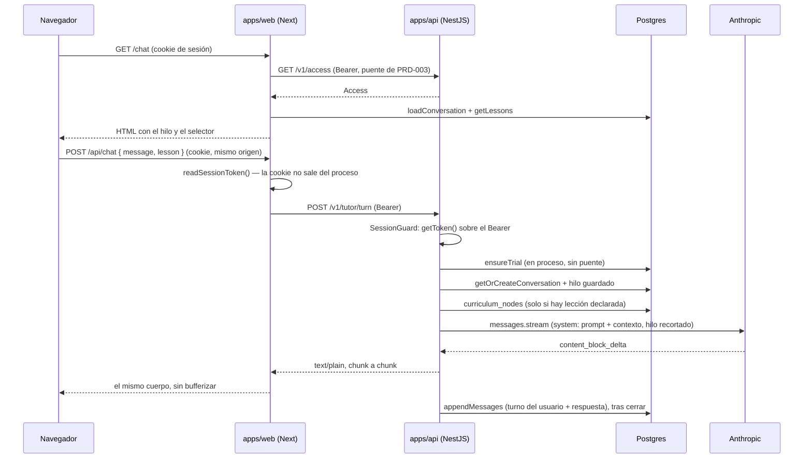
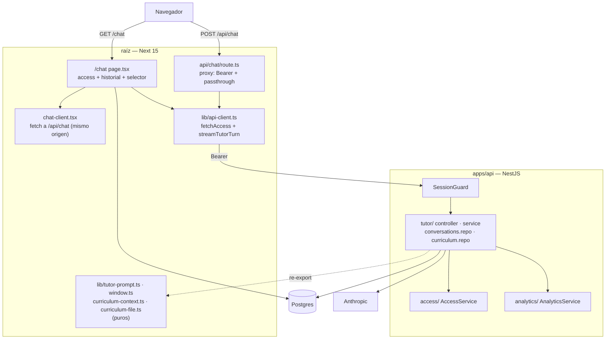

# PRD-005 (fase 2): el stream del tutor en `apps/api`, proxyado por `apps/web`

**Status**: Draft
**Date**: 2026-07-30
**Author**: AI-assisted
**Priority**: P1
**Depends on**: ADR-001, PRD-003
**Supersedes**: None
**Issue**: —

## Impacted Projects

| Project | Impact |
|---------|--------|
| **platform** | Módulo nuevo `apps/api/src/tutor` (`tutor.controller.ts`, `tutor.service.ts`, `tutor.module.ts`, `turn.dto.ts`, `conversations.repository.ts`, `curriculum.repository.ts`, `anthropic.client.ts` — el SDK entra como **provider inyectable** `ANTHROPIC_CLIENT`, § 7 — más tres costuras de re-export hacia módulos puros de la raíz). `apps/api/src/config.ts` añade `anthropicApiKey` y `curriculumSlug` (obligatorias y sin defecto); `apps/api/src/worker-config.ts` rechaza `ANTHROPIC_API_KEY` presente, simétrico al guarda de `PADDLE_API_KEY` (§ 8.3); `apps/api/src/common/all-exceptions.filter.ts` gana la rama `headersSent`; `apps/api/src/app.module.ts` registra `TutorModule`; `apps/api/src/bootstrap.ts` reescribe el aviso del `ValidationPipe` —que afirmaba que "hoy no se ejecuta", y con `turn.dto.ts` deja de ser cierto (§ 8.4)— y exporta sus opciones para que el spec del DTO ejercite el pipe de **producción** y no uno construido en el test: si no, alguien podría quitar `forbidNonWhitelisted` de producción con las filas 20-21 en verde, y ese flag es media seguridad del goal 2; `apps/api/src/throttle.ts` añade `TUTOR_THROTTLE`; `apps/api/test/helpers.ts` añade las variables nuevas a `applyApiEnv`; `apps/api/package.json` añade `@anthropic-ai/sdk` y `pnpm-workspace.yaml` lo pinea en `catalog:` mientras las dos rutas coexisten. En la raíz: `src/app/api/chat/route.ts` primero deja de confiar en el hilo del cliente y después **se vacía a proxy** —reenvía el turno a `apps/api` con el Bearer que el puente ya usa y devuelve el cuerpo del stream tal cual—, `src/lib/api-client.ts` gana `streamTutorTurn()` junto a las funciones de acceso y **deja de lanzar** ante una cookie troceada (`resolveSessionCookie` degrada a `{error:true}`, § 5.3), `src/lib/tutor-turn.ts` (nuevo — cuerpo saliente, mapeo de errores **y el guarda de arranque que rechaza `ANTHROPIC_API_KEY` en el proceso Next** (§ 8.3); puro y verificable bajo Node pelado), `src/app/chat-client.tsx` manda `{ message, lesson }`, deja de borrar el texto parcial al fallar el stream, cubre 413 y 429, y acota el `<textarea>` a 4000. `src/lib/conversations.ts` conserva solo `loadConversation`; `src/lib/tutor-prompt.ts`, `window.ts`, `curriculum-context.ts` y `curriculum-file.ts` **se quedan** (son el otro extremo de las costuras). `@anthropic-ai/sdk` y `ANTHROPIC_API_KEY` salen de la raíz al final. `scripts/check-tutor-turn.ts` y `scripts/check-secrets.ts` (nuevos); `package.json` añade `check:turn` y `check:secrets`. Sin migraciones: `conversations` y `curriculum_nodes` no cambian de forma. Sin servicios nuevos en Railway. **Sin corte de sesión**: la cookie no cambia de nombre ni de ámbito, `src/auth.ts`, `src/auth.config.ts` y `src/middleware.ts` **no se tocan**. `.env.example` añade `TUTOR_VIA_API` y `TUTOR_TIMEOUT_MS` en la raíz, y `ANTHROPIC_API_KEY` y `CURRICULUM_SLUG` en `apps/api`. |

---

## 1. Problem Statement

[ADR-001](ADR-001-backend-nestjs-front-nextjs.md) partió `platform` para que la lógica de dominio dejara de vivir dentro del framework web. [PRD-003](003-phase-1-api-acceso-y-cobro.md) movió el dominio que servía para descubrir si el puente de sesión funciona: 123 LOC de acceso y cobro, tres puntos de llamada, una tabla. Funcionó — el puente cuesta **+4 ms p95** contra un presupuesto de 200 ms (`docs/SYSTEM_ARTIFACT.md` § `acceso`).

Lo que queda fuera es el producto. El tutor son 199 LOC en `src/app/api/chat/route.ts` más cinco módulos de `src/lib` (`tutor-prompt.ts`, `window.ts`, `curriculum-context.ts`, `conversations.ts` y el tramo de `curriculum.ts` que compone el bloque de contexto), y es **el único dominio de la plataforma que hace algo que un usuario paga por usar**. Mientras siga en Next, la frontera que ADR-001 compró cubre la periferia y no el centro: el prompt certificado, la ventana de contexto, la memoria de la conversación y la clave de Anthropic viven todos dentro del ciclo de petición del servidor que sirve páginas.

Hay además un fallo concreto y ya declarado como deuda. `docs/SYSTEM_ARTIFACT.md`, dominio `tutor`: *"Lo que se envía al modelo sale del array que manda el **cliente**, no de la fila de `conversations`; el servidor no verifica que coincidan."* `chat-client.tsx:105` manda `messages: nextMessages` —el hilo entero, incluidos los turnos `assistant`— y `route.ts:143` lo reenvía a Anthropic tras recortarlo. Un cliente puede entonces **fabricar lo que el tutor supuestamente dijo antes** y meterlo en el contexto del modelo como historia propia. La regla pedagógica inviolable del prompt resiste instrucciones *dentro de* la conversación, pero un `assistant` falso no es una instrucción del estudiante: es memoria inventada. Y el mismo hilo choca contra la cota de cuerpo de `apps/api`: `bootstrap.ts:19` fija `BODY_LIMIT = "64kb"` de aplicación, y 30 mensajes con código pegado la pasan.

### 1.1 La ruta del navegador: decidida dos veces, y la segunda con datos

ADR-001 § 4 dejó la ruta sin elegir: *"o el navegador llama directo a `apps/api` (CORS + cookie de dominio compartido) o `apps/web` proxya el stream, añadiendo un hop en la ruta más sensible a latencia del producto"*.

**Este PRD elige el proxy, y la elección se revisó una vez.** La primera versión especificaba el camino directo. El panel de revisión lo desmontó por partes: para sostenerlo hacían falta cuatro controles nuevos —resolución de la cookie por nombre exacto, validación de `Origin` en servidor, contador de tasa sobre el valor de una cookie concreta, y un corte de nombre de cookie con re-login forzado—, y aun con los cuatro escritos quedaba una variante de fijación de sesión que **ningún control de servidor cierra**: desde cualquier `*.contextia.io`, un `Set-Cookie` con la misma terna (nombre, dominio, ruta) **sobrescribe** la cookie de la víctima, el token plantado es real y válido, y el propio middleware lo reencripta en cada carga de `/chat`. El control existiría en la **emisión** del token, que es el fichero que PRD-003 § 11 y este PRD difieren a propósito.

Tres rondas de revisión encontraron cuatro 🔴 que existían **solo** por el camino directo, y tres de ellos aparecieron dentro de los arreglos de los anteriores: cada ronda cerraba una variante de cookie plantada y destapaba otra (otra `Path`, luego trozo único, luego trozo de valor vacío). Eso no es un dato sobre el equipo: es un dato sobre la superficie. El proxy no la acota mejor — la elimina, porque la cookie sigue siendo host-only y el navegador nunca habla con `apps/api`.

**El precio es el hop**, que es exactamente lo que ADR-001 § 4 nombró como riesgo principal. La única medición que existe lo dimensiona: el puente de acceso, el mismo salto sobre TLS por dominio público, cuesta **+4 ms p95 sobre un presupuesto de 200**. Un 2% del margen. § 10 lo mide otra vez sobre la ruta del tutor antes y después del corte, porque un stream no es una llamada JSON y el número no se hereda.

Y la debilidad de fondo sigue siendo la de ADR-001 § 1: `ROADMAP.md` tiene tres items y **los tres están `Shipped`**. Cero `Candidate`, cero `Committed`. La primera fila de ADR-001 § 6 dice que a los tres meses de esa situación la migración se congela donde esté; el reloj arrancó el 2026-07-28. Esta fase se hace con margen sobre esa señal y **ninguna evidencia nueva** de que haga falta: se justifica por la deuda del párrafo anterior —real, medible y del dominio— y no por demanda de un consumidor no-web, que no existe todavía.

## 2. Goals

1. Servir la respuesta del tutor desde `apps/api` (`POST /v1/tutor/turn`), en streaming `text/plain`, con `apps/web` reenviando el stream al navegador sin bufferizarlo.
2. **El hilo que viaja al modelo sale de `conversations`, nunca del cuerpo de la petición.** El cliente manda un solo mensaje: el suyo.
3. Conservar sin cambio observable el prompt certificado, el bloque de contexto de la lección, la ventana de 30 mensajes, `max_tokens: 1024`, `thinking: adaptive` y el `cache_control: ephemeral` del primer bloque de system. Ninguna de las cuatro llaves de `curriculum/<slug>.json` que alcanzan el bloque de system cambia de forma ni de ruta.
4. **No tocar la sesión**: ni el nombre de la cookie, ni su ámbito, ni cómo se emite, ni el middleware. Ningún estudiante vuelve a iniciar sesión por este PRD.
5. Si `apps/api` no responde **antes** de la primera cabecera, entonces el turno se deniega con 503 y no se persiste nada; si falla **después**, entonces la conexión se corta con el texto ya entregado en pantalla.
6. Si `ANTHROPIC_API_KEY` o `CURRICULUM_SLUG` faltan en el entorno de `apps/api`, entonces el servicio **no arranca** — mismo criterio que goal 5 de PRD-003.
7. Cuando el stream falla después de haber enviado cabeceras, el servicio corta la conexión y registra el fallo bajo las reglas de § 8 de PRD-003, sin intentar escribir un cuerpo JSON que Express ya no puede enviar.
8. Cuando el estudiante abandona el turno, la cancelación llega hasta Anthropic — a través de los dos saltos — y deja de facturarse.
9. Dejar medida la latencia hasta el primer token **antes y después** del corte, con el mismo `t=0` en las dos mitades, para que la señal de ADR-001 § 6 (+200 ms p95) se pueda disparar con un número y no con una impresión.
10. Retirar de la raíz la clave de Anthropic y el SDK cuando el camino nuevo esté en producción, y hacer que ningún otro proceso pueda arrancar con esa clave en el entorno.

## 3. Non-Goals

- **`packages/shared`.** Sigue siendo la última fase (ADR-001 § 7). Las piezas puras que `apps/api` necesita se alcanzan con la misma costura de re-export que ya usa `apps/api/src/db/schema.ts:12`, y esa costura se cierra allí, no aquí.
- **Mover `apps/web`.** La raíz sigue siendo la app Next; no nace `apps/web` en este PRD. (El nombre se usa en este documento para el rol, no para un directorio.)
- **Exponer `apps/api` al navegador.** No se habilita CORS, no se ensancha la cookie, no se abre un segundo canal de credencial. Es la decisión de § 1.1 y todo § 8 depende de ella.
- **Tocar el prompt.** Ni una palabra: cambiarlo exige recertificar el banco de 35 evals.
- **El píxel anónimo `GET /api/t`** y el lado navegador del checkout se quedan en la raíz.
- **Conversaciones múltiples, historial navegable, o cambiar la ventana a presupuesto de tokens.** Deuda declarada del dominio `tutor`; sigue abierta.
- **Emitir tokens propios o pasar a JWKS.** PRD-003 § 11 lo difiere hasta un tercer consumidor; sigue diferido.
- **Cachear el currículo en `apps/api`.** Ver § Design Decisions.

## 4. User Flows

El estudiante no ve nada nuevo: escribe, el texto aparece token a token, el hilo queda guardado, y su sesión sigue siendo la misma. Lo que cambia es de qué proceso salen los bytes y qué se le manda.



Los cuatro caminos que no son el bueno:

1. **Sin sesión válida** → 401 sin cuerpo útil (§ 5.1), sin tocar Postgres. El cliente muestra "Tu sesión expiró".
2. **Sin acceso** (`allowed: false`) → 403. El cliente muestra el aviso de suscripción. Igual que hoy.
3. **`apps/api` no responde antes de la primera cabecera** → 503, nada persistido. Es la misma política de degradación que PRD-003 § 5.3 fijó para el turno, y que sobrevive porque sobrevive el puente.
4. **Fallo a mitad del stream** → la conexión se corta y **no se persiste nada**. El cliente conserva el texto parcial en pantalla y añade el aviso de reintento — y eso **hoy no es cierto**: `chat-client.tsx:136-138` envuelve en un solo `catch` el `fetch`, la comprobación de `res.body` y el bucle de lectura, y ejecuta `setMessages((m) => m.slice(0, -1))`, que borra la burbuja entera aunque ya tuviera texto pintado. El comentario de esa línea dice "quita el hueco del asistente" y describe solo uno de los dos casos que atrapa. Separar las dos ramas va en el paso B de § 10, junto al cambio de cuerpo saliente que ya toca esa función.

## 5. API

### 5.1 `POST /v1/tutor/turn` (en `apps/api`)

Autenticado por `SessionGuard`, el mismo de `access.controller.ts`, por el mismo canal que el puente de PRD-003: **Bearer, nunca cookie**. La identidad sale del token y de ningún otro sitio.

**Cuerpo** (`turn.dto.ts`, validado por el `ValidationPipe` global de `bootstrap.ts:45`, que aquí **sí** se ejecuta porque hay un DTO decorado):

| Campo | Tipo | Reglas |
|---|---|---|
| `message` | string | `@IsString`, `@Length(1, 4000)`. El turno del estudiante, y nada más. |
| `lesson` | string opcional | `@IsOptional`, `@Matches(/^[A-Za-z0-9_-]{1,64}$/)` — el patrón de `route.ts:29`, movido tal cual. |

`whitelist: true` + `forbidNonWhitelisted: true` ya están activos, así que un cuerpo con `messages`, `email` o cualquier campo extra es **400**, no un campo ignorado. Eso es deliberado: `email` en el cuerpo es el error de una línea que `access.controller.ts` documenta como el más natural y el más caro.

**Respuesta 200**: `Content-Type: text/plain; charset=utf-8`, `Cache-Control: no-store`, cuerpo en streaming. **Exige `@HttpCode(HttpStatus.OK)` explícito**: `@Post()` de Nest fija 201 *antes* de invocar el handler, así que ni siquiera usar `@Res()` lo evita. Es el mismo remedio que `access.controller.ts` ya aplica a `POST /v1/access/trial`. Solo se reenvían los `content_block_delta` de tipo `text_delta`, como hoy (`route.ts:150-156`): los deltas de `thinking` no viajan.

| Estado | Cuándo | Cuerpo |
|---|---|---|
| 200 | Turno concedido | stream de texto |
| 400 | DTO inválido, JSON no parseable, campo extra | JSON del `ValidationPipe` |
| 401 | Sin token utilizable o claims incompletos | Sin cuerpo **útil**: el `{ statusCode, message }` que el filtro global devuelve para toda `HttpException` (`all-exceptions.filter.ts:57-59`). Nunca el código de razón, nunca el token. No es un cuerpo vacío, y pretender que lo sea empujaría a tocar el filtro, que es global |
| 403 | `access.allowed === false` | `{ error: "Subscription required" }`, construido con `new ForbiddenException({ error: … })` — con argumento string el filtro devuelve `{ statusCode, message, error }`, que no es la forma que `chat-client.tsx:110-114` lee |
| 413 | Cuerpo sobre `BODY_LIMIT` | JSON del filtro global |
| 429 | Sobre `TUTOR_THROTTLE` | JSON del throttler |
| 500 | Fallo inesperado **antes** del primer byte | `{ statusCode, message }` del filtro global |
| — | Fallo **después** del primer byte | conexión cortada, sin estado (§ 5.4) |

**El 503 no vive aquí: lo produce el proxy** (§ 5.3). Y hay una consecuencia que no es cosmética: **el puente se queda sin la mitad que crea el trial**. `ensureTrial` pasa a ser una llamada en proceso a `AccessService` (que `AccessModule` ya exporta, `access.module.ts:15`), y `decideTutorTurn()` y `fetchAccessTrial()` tienen exactamente dos call sites cada uno —`route.ts:57,197` y `scripts/check-access-bridge.ts`—, verificado por grep; el render de `/chat` **no** los usa: resuelve su degradación con un ternario en línea (`chat/page.tsx:63-67`). Cuando el paso E retira el camino viejo, las dos funciones quedan muertas en producción con tests que las siguen ejercitando, y **`POST /v1/access/trial` se queda sin un solo llamante legítimo** mientras sigue abierto y escribiendo en `subscriptions`. Eso retira la invariante de `docs/SYSTEM_ARTIFACT.md:196`. El paso E decide y ejecuta: retirar el endpoint, `fetchAccessTrial`, `decideTutorTurn` y sus filas de `check-access-bridge.ts`, o dejarlos con una razón escrita. `fetchAccess()` sí sigue vivo: lo usa el render de `/chat`.

### 5.2 El hilo sale de la base, no del cliente

`tutor.service.ts` compone lo que viaja al modelo así:

1. `conversations.repository.ts` → `getOrCreateConversation(userId)` y el array `messages` guardado, **validado al leer**: se descarta toda entrada cuyo `role` no sea exactamente `"user"` o `"assistant"` o cuyo `content` no sea string, y el descarte se registra como contador, sin contenido. La columna es `jsonb` sin restricción y `trimWindow` solo mira `m.role === "user"` (`window.ts:36`), así que hasta ahora nada impedía que una fila con `role: "system"` viajara al modelo — daba igual porque la fila no alimentaba al modelo. Desde este PRD sí: el goal 2 es una propiedad de seguridad, y solo es tan fuerte como la lectura que la sostiene.
2. La ventana es `trimWindow([...filtrado, { role: "user", content: message }])` — `MAX_WINDOW_MESSAGES = 30` se conserva sin tocar `window.ts`. **Pero la garantía de "empieza por un turno `user`" no la da `trimWindow` por debajo de 30**: `window.ts:33` devuelve el array tal cual y la búsqueda del primer `user` solo corre en la rama de recorte (`:36-39`). Si el descarte del punto 1 se lleva la primera entrada y la siguiente es `assistant`, lo que viaja empieza por `assistant`, la API de Anthropic responde 400 y el tutor da 500. Así que el filtrado recorta también el prefijo hasta el primer `user`, antes de llamar a `trimWindow`.
3. Al cerrar el stream, `appendMessages(conversation.id, [turno del usuario, respuesta completa])`, en su propio `try/catch` y **después** de cerrar, como hoy (`route.ts:163-172`).

Tres propiedades que esto compra, y una que hay que aceptar:

- El cliente ya no puede fabricar turnos `assistant`. La deuda del dominio `tutor` queda cerrada.
- El cuerpo pasa de "el hilo entero" a "un mensaje ≤ 4000 caracteres": la cota de 64 kb deja de ser alcanzable por uso normal.
- La base pasa a ser la única fuente de lo que el modelo ve. **No es que la divergencia desaparezca: cambia de forma, y a peor.** Hoy la persistencia es best-effort en su propio `try/catch` que solo registra, y es inocuo porque el modelo lee del array del cliente: un `appendMessages` fallido no borra memoria. Cuando el hilo sale de `conversations`, el mismo fallo es **amnesia**: la UI sigue mostrando el intercambio, el modelo del turno siguiente ya no lo ve, y el estudiante no recibe ninguna señal. Se conserva el best-effort —tumbar una respuesta ya entregada es peor— pero el fallo sube de `console.error` a una línea con `name=`/`code=` bajo § 8.3, y § 9 fija qué ve el turno siguiente.
- **A cambio**: si dos pestañas del mismo estudiante mandan un turno a la vez, cada una ve el hilo tal como estaba al empezar y `appendMessages` concatena las dos parejas en el orden en que cierren. Es exactamente lo que hoy hace la concatenación en SQL (`conversations.ts:57`), y sigue siendo aceptable en v0 con una conversación por usuario.

### 5.3 El proxy: `POST /api/chat` en Next

`route.ts` se vacía hasta quedarse en el reenvío. Lo que hace, en orden: `auth()` para exigir sesión (sin cambio), `readSessionToken()` para sacar la cookie del tarro, y `streamTutorTurn(token, body, config)` — una función nueva en `src/lib/api-client.ts`, junto a las de acceso y con las mismas reglas.

**Y `readSessionToken()` deja de lanzar.** Hoy `resolveSessionCookie` hace `throw` ante `${name}.0` en el tarro (`api-client.ts:117-125`) y `readSessionToken()` no captura (`:153-159`): dentro del handler del proxy eso no es 401, es **500**. La condición es alcanzable por un tercero —la cookie es host-only, pero un subdominio puede plantar `<nombre>.0` con `Domain=.contextia.io` y ese trozo sí llega a `contextia.io`— y contradice el contrato que el propio módulo declara tres líneas antes: *"NUNCA lanza, porque 'nunca lanza' es lo que sostiene toda la política de degradación"*. Pasa a `{error:true}` con el mismo `console.error` ruidoso que la otra rama de degradación. Es preexistente y no lo introduce este PRD, pero este PRD es el que convierte `route.ts` en el camino donde duele.

**Qué se reenvía y qué no.** El `Authorization: Bearer <token>` y el cuerpo. **La cabecera `Cookie` no se reenvía**, igual que en `requestAccess` (`api-client.ts:192-196`) y por la misma razón escrita allí: tendría precedencia sobre el Bearer dentro de `getToken()` y abriría un segundo canal de credencial no declarado. Esta es la invariante que el camino directo habría retirado y que aquí se conserva intacta.

**El timeout es del principio, no del stream, y `AbortSignal.timeout` NO sirve para eso.** Es el punto donde la lectura natural —copiar `fetchAccess`, que usa `AbortSignal.timeout(2000)` sobre la petición entera (`api-client.ts:199`)— produce un fallo silencioso, así que va el mecanismo entero y no la intención:

```ts
const controller = new AbortController();
const timer = setTimeout(() => controller.abort(), config.tutorTimeoutMs);
try {
  const upstream = await fetch(url, { signal: controller.signal, … });
  clearTimeout(timer);          // ← esto es "solo hasta las cabeceras"
  …
} catch { clearTimeout(timer); return { error: true }; }
```

**El `clearTimeout` tras el `await` es el mecanismo entero**: sin él no hay timeout de cabeceras, hay timeout de turno. Abortar un `fetch` después de las cabeceras **no es un no-op** — el algoritmo de la spec termina en *"error response's body with error"*, o sea que rompe el cuerpo a media lectura— y `AbortSignal.timeout()` no devuelve ningún asa con la que desarmarlo. Verificado empíricamente contra un servidor que emite cabeceras al instante y un chunk tardío: con `AbortSignal.timeout(200)` la lectura lanza `TimeoutError` tras haber recibido las cabeceras; con `AbortController` + `clearTimeout` el cuerpo llega entero. Traducido: con el patrón equivocado, **todo turno que siga emitiendo al vencer `TUTOR_TIMEOUT_MS` se corta a media frase**, y el estudiante ve una respuesta truncada sin ningún error, porque el navegador ya pintó lo que llegó. Con `max_tokens: 1024` eso no es el caso raro.

Tampoco vale `AbortSignal.any([req.signal, AbortSignal.timeout(ms)])`, que es la otra lectura elegante: reintroduce el mismo fallo, porque la pata del timeout sigue sin poder cancelarse.

Lo que el timeout protege es el caso que `api-client.ts` describe en su cabecera: un `apps/api` que acepta la conexión y no responde. **Pero mide algo más largo de lo que suena, y conviene saberlo antes de tocar el número.** Como `apps/api` no llama a `flushHeaders()` —a propósito, § 5.4—, sus cabeceras salen con el primer `text_delta`, así que el `fetch` del proxy resuelve cuando llega **el primer token**, no cuando el servicio empieza a atender. Tres consecuencias:

- Un turno que tarde más de `TUTOR_TIMEOUT_MS` en su primer token produce un 503 que dice "servicio no disponible" cuando lo que pasó es que el tutor tardó en arrancar. Con 10 000 ms de defecto y `max_tokens: 1024` sobra de largo, pero el margen es contra Anthropic, no contra la red.
- En ese caso la frase "nada se persiste porque `apps/api` no llegó a abrir el stream" es inexacta en su razonamiento: el stream sí se abrió, solo que sin token. Lo **observable** se mantiene —el camino de abandono de § 5.4 retorna sin persistir— pero el porqué es otro.
- Quien baje este número creyendo que acorta el presupuesto del transporte estaría acortando el de Anthropic.

`TUTOR_TIMEOUT_MS` es nueva, por defecto 10 000.

**El cuerpo se devuelve tal cual, sin releerlo.** `return new Response(upstream.body, { headers })`. No `await upstream.text()`, no un `ReadableStream` nuevo que copie chunks, no `TextDecoder` en medio: cualquiera de las tres convierte el proxy en un buffer y el estudiante recibe la respuesta entera de golpe. El tutor "funcionaría", solo que sin streaming, y ningún test unitario lo vería.

**Y las cabeceras se construyen, no se copian — en las dos direcciones.** Hacia arriba, el conjunto saliente es **exactamente** `Authorization` y `Content-Type`: esparcir las cabeceras entrantes para dejar pasar un `Accept-Language` o una traza se lleva la `Cookie` de paso, y también el `X-Forwarded-For` del cliente hacia un servicio con `trust proxy` puesto. Hacia abajo, `{ headers: upstream.headers }` es lo natural en un proxy y arrastra `Content-Length`, `Content-Encoding` y `Transfer-Encoding` de **otra** conexión HTTP a ésta: `Transfer-Encoding` es hop-by-hop y no debe reenviarse nunca, undici ya decodificó el cuerpo así que un `Content-Encoding` heredado describe algo que ya no está, y un `Content-Length` heredado sobre un cuerpo troceado da respuesta truncada o cuelgue. Y es la puerta por la que un `Set-Cookie` del upstream llegaría al navegador el día que `apps/api` ponga uno — hoy no pone ninguno, que es justo por qué conviene fijarlo ahora. Van las dos de § 5.1 y nada más — con un matiz sobre el valor: el `Content-Type` se **lee por nombre** del upstream con `text/plain; charset=utf-8` como respaldo, porque los estados de error de § 5.1 devuelven JSON y fijar `text/plain` para todos rompería el `res.json()` con el que `chat-client.tsx:110-114` lee el `{ error }`. Leer una cabecera por nombre sigue siendo construir; lo prohibido es esparcir. El `curl` del paso C no vería nada de esto, porque va contra `apps/api` y no contra el proxy.

**`redirect: "manual"`, y cualquier 3xx es fallo de upstream → 503.** `fetch` de Node sigue redirects por defecto, y undici retira `authorization` **solo si el redirect es cross-origin**: uno same-origin reenvía el Bearer a una ruta que nadie decidió, un 3xx cross-origin lo descarta en silencio y `apps/api` responde 401 —el estudiante ve "Tu sesión expiró" con la sesión intacta y sin rastro en el log—, y un 302 convierte el POST en GET y descarta el cuerpo. `apps/api` no tiene un solo redirect en su tabla de rutas, así que un 3xx aquí es por definición inesperado y seguirlo solo puede hacer daño.

**El passthrough por identidad y la cancelación son la misma propiedad, no dos.** Cuando el navegador se va, Next cancela el `ReadableStream` de la respuesta; ese stream **es** `upstream.body`, así que cancelarlo destruye el socket hacia `apps/api` y allí Express emite `close`. Bufferizar el cuerpo rompe el streaming **y** la cancelación a la vez — por eso "no releas el cuerpo" no es una regla de rendimiento, es una de facturación.

**`streamTutorTurn` recibe la configuración como argumento**, igual que `fetchAccess(token, baseUrl, timeoutMs)` (`api-client.ts:218-227`) y por la misma razón escrita allí: si leyera `resolveClientConfig()` por dentro, las filas 32-35 de § 9 dejarían de correr bajo Node pelado.

**Estados que produce el proxy**, además de reenviar los de § 5.1:

| Estado | Cuándo |
|---|---|
| 401 | `auth()` sin sesión, o `readSessionToken()` devuelve `{error:true}` — antes de salir del proceso |
| 503 | La petición a `apps/api` falla, agota `TUTOR_TIMEOUT_MS` antes de las cabeceras, o **responde 3xx**. **Nada se persiste**: `apps/api` no llegó a abrir el stream |
| — | Un fallo después de las cabeceras no tiene estado: el cuerpo ya empezó a viajar y la conexión se corta |

**La cancelación tiene que cruzar los dos saltos** (goal 8): navegador → Next → `apps/api` → `MessageStream.abort()`. El eslabón del medio se propaga solo por el párrafo anterior —cancelar el stream devuelto destruye el socket hacia `apps/api`—, pero se ata **además** de forma explícita: `if (req.signal.aborted) controller.abort();` seguido de `req.signal.addEventListener("abort", () => controller.abort())`, reutilizando el mismo `AbortController` del timeout. La comprobación previa no es ceremonia: un listener registrado sobre una señal **ya abortada** no dispara, y ese es justo el caso del cliente que se va entre el `auth()` y el `fetch`. Tres líneas, tirantes y cinturón: si la propagación por el stream fallara, el `signal` lo cubre. Sin ninguno de los dos, el turno abandonado sigue facturándose en Anthropic hasta terminar y el único síntoma es la factura.

**Y lo que NO cambia, que es el punto de elegir este camino**: la cookie de sesión no cambia de nombre, de ámbito ni de atributos; `src/auth.ts`, `src/auth.config.ts` y `src/middleware.ts` no se tocan; `apps/api` no habilita CORS; el navegador sigue hablando solo con su propio origen. Ninguna sesión viva se invalida.

### 5.4 Mecánica del stream en `apps/api`

`tutor.controller.ts` recibe `@Res() res: Response` y escribe a mano: `res.setHeader(...)` para los dos encabezados de § 5.1, `res.write(delta)` por cada `text_delta`, `res.end()` al terminar. No hay `StreamableFile` ni interceptor: el turno tiene que poder escribir la primera respuesta antes de saber si habrá una segunda.

- **Fallo antes del primer byte**: se lanza y lo atiende el filtro global (401/403/500 con cuerpo).
- **Y por eso el handler NO llama a `res.flushHeaders()`.** Es tentador: medido, sin flush las cabeceras y el primer delta salen juntos (436 ms / 436 ms; con flush, 6 ms / 407 ms). Pero la línea que este PRD traza es el primer **byte**, no la cabecera lógica, y `flushHeaders()` pone `headersSent` en `true` al instante — lo que borra la fila "500 antes del primer byte" de § 5.1 y, peor, **rompe el muro de pago**: `ensureTrial` corre dentro del turno, así que con las cabeceras ya enviadas el 200 viaja por el cable antes de saber si hay acceso, la `ForbiddenException` llega al filtro con `headersSent` en `true` y sale como conexión cortada sobre una respuesta que el cliente ya leyó como 200. Verificado: con el flush puesto se ponen rojas cuatro filas de § 9, dos con `expected 200 to be 403`. En producción sería un estudiante sin suscripción viendo una respuesta vacía en vez del aviso.
- **Fallo después del primer byte**: `all-exceptions.filter.ts` gana una primera rama `if (response.headersSent)` que registra `name`/`code` bajo las reglas de PRD-003 § 8 y hace `response.destroy()`. Sin ella el filtro llama a `response.status().json()` sobre una respuesta ya empezada, y Express lanza un segundo error dentro del manejador del primero. Va en el filtro y no en el servicio a propósito: cualquier endpoint de streaming futuro nace cubierto. Es también la única excepción a la regla "las `HttpException` no se registran" — a mitad de stream son invisibles de cualquier otra forma.
- **El llamante se va**: **`res.on("close")`** —no `req`— aborta el stream de Anthropic (`MessageStream.abort()`, presente en `@anthropic-ai/sdk@0.104.1`) y **no persiste**. La distinción no es de estilo: desde Node 16 `IncomingMessage` emite `close` cuando la **petición** se ha completado, no cuando cae el socket, y `body-parser` consume el cuerpo al entrar. Medido contra el stack real: con el cuerpo consumido, `req close` llega a los **2 ms** —en cuanto termina de leerse— mientras la respuesta sigue emitiendo; `res close` llega al abandonar, con `writableEnded === false`. Atado a `req`, se llamaría `abort()` en **todos** los turnos.
  Y aun sobre `res`, `close` **también dispara al terminar con normalidad**, así que el handler lleva una bandera de "ya cerré" (o comprueba `writableEnded`): sin ella se llamaría `abort()` sobre un turno completado, después de haber persistido. Es el mismo discriminador que § 9 fila 35b exige del otro lado del salto.
- **`first_token_ms`**: el servicio registra una línea `[TutorService] first_token_ms=<n>` al recibir el primer `text_delta`. Es un entero, no lleva PII, y es la señal de ADR-001 § 6.
- **El `t=0` es la entrada al handler, en las dos mitades.** Sin fijarlo, la línea base del paso A y la medida post-corte no son la misma magnitud: en `route.ts` el turno arranca con la llamada al puente (`route.ts:53-55`) y en `apps/api` no hay puente, así que la línea base saldría inflada y el corte parecería una mejora. En el paso A se mide desde la entrada de `POST /api/chat` **excluyendo** el tramo del puente.
- **El instrumento no ve el hop, y el hop es justo lo que este PRD añade.** `first_token_ms` se mide dentro de `apps/api`; el salto hasta Next y de Next al navegador quedan fuera. Por eso el paso D contrasta además una medida de navegador: es la única que responde la pregunta de ADR-001 § 6.

### 5.5 Límite de tasa

`throttle.ts` añade `TUTOR_THROTTLE = { ttl: 60_000, limit: 10 }`, aplicado con `@Throttle({ default: TUTOR_THROTTLE })` sobre el controlador — la forma exacta que el repositorio ya usa (`billing.controller.ts:56`), porque el throttler está registrado sin nombre (`app.module.ts:19`) y `@Throttle(TUTOR_THROTTLE)` a secas no sobrescribe nada. Diez turnos por minuto es holgado para una persona escribiendo y acota un bucle: a diferencia de `/v1/access*`, cada petición aquí cuesta una llamada facturada a Anthropic.

**`BridgeThrottlerGuard` no se toca.** El llamante sigue siendo el servidor de Next con un `Authorization` por estudiante, que es exactamente el eje para el que se escribió el tracker (`bridge-throttler.guard.ts:37-47`): el hash de la cabecera separa por credencial y el cubo significa "por estudiante". Con el navegador llamando directo habría hecho falta reescribirlo para contar por el valor de una cookie —y ese era uno de los cuatro controles que § 1.1 evita.

## 6. Data Model

**Sin migraciones.** `conversations` y `curriculum_nodes` no cambian de forma, de columnas ni de índices; este PRD cambia quién las lee y desde qué proceso.

| Tabla | Antes | Después |
|---|---|---|
| `conversations` | Next escribe (route) y lee (page) | `apps/api` escribe y lee para el turno; Next conserva **solo** `loadConversation` para pintar el historial al renderizar `/chat` |
| `curriculum_nodes` | Next lee (home, `/chat`, `/registro`, tutor) | Igual, más una lectura de `apps/api` por turno **con lección declarada** |
| `subscriptions` | Solo `apps/api` (PRD-003) | Igual, y `ensureTrial` deja de llegar por HTTP |

El presupuesto de conexiones de PRD-004 § 7.2 no se mueve: 8 Next, 8 servicio HTTP, 1 worker, 3 de margen. `apps/api` gana **tres** consultas por turno sobre el pool que ya tiene —`SELECT` de la conversación, `SELECT` del currículo (solo si hay lección) y `UPDATE` al cerrar—; `ensureTrial` ya usaba ese pool a través del puente, así que no cuenta como nueva. Next pierde las dos suyas del turno. No hay pool nuevo y `src/lib/db.ts` no se toca.

**Lo que sí se mueve, y hay que nombrarlo, es la contención.** El número de pools no cambia; quién compite por ellos, sí. Antes el trabajo de base del turno ocurría en el pool de Next y el del puente de acceso en el de `apps/api`; ahora las tres consultas del turno **y** el puente comparten las mismas 8 conexiones. Y el puente **degrada abierto**: `fetchAccess` agota a 2 s → `{error:true}` → `chat/page.tsx:64-66` devuelve `{ allowed: true, status: "none" }`. Traducido: **saturar el tutor hace que el muro de pago falle abierto**, y las credenciales para intentarlo son gratis (trial autoservicio de 7 días, con la rotación de credenciales ya declarada como deuda abierta en `docs/SYSTEM_ARTIFACT.md:218`).

No se construye nada contra esto: con 13 estudiantes y `TUTOR_THROTTLE` a 10/min por credencial el riesgo real es bajo, y el fallo abierto es una decisión deliberada de PRD-003 § 5.3. Lo que cambia es la **alcanzabilidad** —antes ningún usuario podía saturar ese pool, ahora una carga dirigida lo comparte—, y eso se nombra aquí y se vigila en el paso D. La escalada, si llega, ya está escrita: el `ponytail:` del TTL del currículo en § Design Decisions, que es la más cara de las tres consultas. Y un aviso para quien venga después: **no fijar un `connections: N` en un agente de undici propio** para "acotar" el tutor — encolaría las llamadas cortas del puente detrás de los streams largos al mismo origen, que es el fallo contrario y peor.

## 7. Architecture



**El SDK de Anthropic entra como provider inyectable**, no como constante de módulo. `route.ts:21` construye `new Anthropic()` en el ámbito del módulo, y copiar ese patrón dejaría sin doble a las filas de § 9 que necesitan sustituirlo. El precedente exacto es de este repositorio: PRD-004 inyectó `PADDLE_CLIENT` por la misma razón, se sustituye con `.overrideProvider(PADDLE_CLIENT)` en sus e2e. Aquí es `ANTHROPIC_CLIENT`, construido en `anthropic.client.ts` desde `config.anthropicApiKey`.

**Las costuras.** `apps/api/src/tutor/` re-exporta tres módulos puros de la raíz con el idioma que `apps/api/src/db/schema.ts:12` ya usa (ruta relativa con extensión, un fichero de costura por módulo, comentario `ponytail:` apuntando a ADR-001 § 7):

| Costura | Qué trae | Por qué no se copia |
|---|---|---|
| `tutor-prompt.ts` | `TUTOR_SYSTEM_PROMPT` | Lo certifica un banco de 35 evals. Dos copias es la forma de desplegar un tutor sin certificar. |
| `window.ts` | `trimWindow`, `MAX_WINDOW_MESSAGES` | Puro, con una invariante fina ("empieza por `user`") ya probada. |
| `curriculum-context.ts` + `curriculum-file.ts` | `buildLessonContext`, `buildForest`, `lessonContextInputs` | `buildLessonContext` compone texto que **entra al bloque de system**; duplicarlo permite que el bloque derive del que revisa `curriculum:check`. |

Ninguno de los tres importa base de datos, así que la costura no arrastra el `Pool` de `src/lib/db.ts` al proceso de `apps/api`. Es exactamente por eso que `src/lib/curriculum.ts` **no** se re-exporta: importa `./db.ts` (`curriculum.ts:11`) y traerlo abriría un tercer pool dentro del servicio. En su lugar, `curriculum.repository.ts` hace la misma consulta con el `DRIZZLE` inyectado y la pasa por las funciones puras:

```
select() from curriculum_nodes where curriculum = config.curriculumSlug
  → buildForest(rows) → lessonContextInputs(forest, lessonSlug)
```

Con el mismo corto circuito que la raíz: **sin `lesson` declarada no hay consulta.** `curriculum.ts:173-174` corta antes de tocar la base (`if (!lessonSlug) return empty`), y el selector es opcional, así que es un camino corriente. Sin replicarlo, y sin caché en `apps/api`, cada turno sin lección pasaría de cero a un `SELECT` del currículo entero.

Y conserva la invariante que hace falta conservar: **nunca lanza**. Un currículo sin cargar o un slug inexistente devuelven el par vacío, que es la rama "el estudiante no ha declarado lección" y no un 500 en el tutor (`curriculum.ts:169-181`).

## 8. Security

### 8.1 Lo que este PRD deliberadamente no mueve

La superficie de sesión **no cambia**, y eso es el resultado de la decisión de § 1.1, no una omisión:

- La cookie sigue siendo host-only de `contextia.io`, con el nombre que Auth.js elige hoy. **Contra `apps/api`, la familia entera de cookie plantada —trozos, otra `Path`, sufijos, duplicados, y la sobrescritura que ningún control de servidor cierra— no es alcanzable**, y por una razón sola: `api.contextia.io` nunca ve una cookie del estudiante. Contra `contextia.io` **la superficie preexistente queda igual**: un subdominio hostil puede seguir emitiendo `Set-Cookie: …; Domain=.contextia.io`, que domain-matchea el apex y llega al proceso de Next exactamente como antes de este PRD. Este PRD ni la abre ni la cierra; lo que evita es **añadir** una segunda superficie y hacer que el planting compre acceso al dominio del tutor.
- El JWE sigue viajando a `apps/api` solo como Bearer, puesto por el servidor de Next. Sigue siendo una credencial portadora de ~30 días sin revocación individual (PRD-003 § 8) y sigue viajando solo sobre TLS.
- `apps/api` sigue sin CORS (`bootstrap.ts:47-49` conserva su comentario y su verdad) y `getToken()` sigue recibiendo un solo canal de credencial **enviado**: el Bearer. Que lo *acepte* por cookie es otra cosa y sigue siendo cierto (fila 15). Y lo acotado **no es la alcanzabilidad** —`throttle.ts:4-11` ya declaró muerta esa premisa cuando el webhook recibió dominio público: cualquiera llega— sino la usabilidad: sin Bearer válido nadie pasa de `SessionGuard`.
- No hay CSRF nuevo. `POST /api/chat` es del **mismo origen** que la página, exactamente como hoy: este PRD cambia el cuerpo que se manda y a dónde reenvía el handler, no quién puede llamarlo.

### 8.2 Inyección en el contexto del modelo

Cerrar § 5.2 quita una superficie que hoy está abierta: el hilo `assistant` deja de ser dato del cliente, y la validación al leer impide que una fila con `role` inesperado alcance al modelo. Lo que **no** cambia es la deuda declarada en el dominio `contenido`: la cláusula anti-anulación del prompt no cubre el bloque de temario inyectado, y un `stuck` hostil entra como bloque de system por encima de la regla inviolable. La contención sigue siendo la de PRD-002 —filtro de patrones imperativos, cota de 4 000 caracteres, control de URLs, `CODEOWNERS`— y sigue diferida a un PRD de seguimiento. Este PRD no la mejora ni la empeora: mueve el mismo bloque de sitio.

### 8.3 Secretos y registro

- `ANTHROPIC_API_KEY` pasa a ser variable del servicio HTTP de `apps/api` y se **retira** del servicio Next en el paso E. Durante los pasos C-D vive en los dos, que es el precio del flag.
- **Y nace con el guarda de "falla cerrado ante la presencia" que este repositorio ya exige para la otra credencial cara.** `config.ts:77-83` tumba el arranque si aparece `PADDLE_API_KEY`, y su comentario da la razón que aplica igual aquí: el `CMD` de la imagen equivocada arranca *aparentando éxito*, y en autohospedaje —repo público, AGPL— un solo `.env` en una máquina lo heredan todos los entrypoints. PRD-003 § 1.1 prohíbe que una propiedad de seguridad dependa de dónde se ponga una variable, y "retirarla del servicio Next" es exactamente eso. Concreto: `worker-config.ts` rechaza `ANTHROPIC_API_KEY` presente (el reconciliador no habla con Anthropic) — lo que obliga a limpiar el entorno en **tres** sitios, no dos, porque hay un tercero que resuelve la configuración contra el `process.env` real: `spawnWorker` (`test/worker-boot.e2e-spec.ts`), `applyWorkerEnv` (`src/worker.spec.ts`) y `applyApiEnv` (`test/helpers.ts`, donde la variable es **obligatoria** en vez de prohibida). Sin los tres, la clave de Anthropic que un desarrollador tenga exportada en su shell tumba la suite — o peor, se usa en silencio en el servicio HTTP sin que nada se ponga rojo. Y en la raíz el guarda vive en `src/lib/tutor-turn.ts` —el módulo que el proxy importa en cada petición, así que **se carga en el arranque real de Next y en `next build`**, igual que `resolveClientConfig()` (`api-client.ts:97`)— y `scripts/check-secrets.ts` lo ejercita. Un guarda en un módulo que nadie importa probaría que una función lanza, no que el arranque falla.
- `apps/api` sigue negándose a arrancar si encuentra `PADDLE_API_KEY` (PRD-004 § 8.1). Nada de este PRD lo toca.
- El registro sigue siendo allowlist por campo: `name` y `code`, nunca `message`, `stack`, el objeto ni `detail`. La rama nueva del filtro (§ 5.4) obedece la misma regla; `first_token_ms` es un entero, el contador de entradas descartadas al leer el hilo (§ 5.2) es un entero, y la línea nueva del fallo de persistencia lleva solo `name=`/`code=`.
- El turno del estudiante y la respuesta del tutor **no se registran** en ningún nivel. Van a `conversations` y a Anthropic, y a ningún log. El proxy tampoco los toca: devuelve el cuerpo sin leerlo.

### 8.4 Invariantes que este PRD retira, nombradas

Retirar una invariante está bien; retirarla sin decirlo deja el documento vivo mintiendo. Son **dos**, y las dos entran en el `system_artifact_diff` del gate:

| Invariante | Dónde está escrita | Qué la sustituye |
|---|---|---|
| "`POST /v1/access/trial` es el único que crea la fila de suscripción" | `docs/SYSTEM_ARTIFACT.md:196` | `POST /v1/tutor/turn` pasa a ser el creador real; la idempotencia de `trial_started` se conserva (la da el `returning()` del repositorio, no el endpoint) |
| "El `ValidationPipe` global **hoy no se ejecuta** y no protege de nada; el control de identidad es que los handlers no declaran `@Body`/`@Query`/`@Param`" | `bootstrap.ts:40-45`, `access.controller.ts:17-21`, `docs/SYSTEM_ARTIFACT.md:199` | `turn.dto.ts` es el primer DTO decorado del servicio, así que el pipe **empieza a ejecutarse**. Lo que **no** cambia: el control estructural de `/v1/access*` sigue siendo que esos handlers no declaran parámetros de entrada, con independencia de que el pipe ya corra. El aviso de `access.controller.ts:19-21` conserva su conclusión y pierde su premisa |

Y hay dos líneas del documento vivo que **dejan de ser ciertas sin ser invariantes de seguridad**, así que entran en el alcance del `system_artifact_diff` del gate aunque no en esta tabla: `docs/SYSTEM_ARTIFACT.md:267` (*"La `ANTHROPIC_API_KEY` vive solo en el servidor (`new Anthropic()` en el route handler)"*) es falsa en sus dos mitades tras el paso E, y la capability del dominio `tutor` que apunta a `POST /api/chat` pasa a describir un proxy.

La lista era de seis en la versión de camino directo. Cuatro de las seis —CORS, el segundo canal de credencial, "solo servidor-a-servidor" y "el único llamante de `/v1/access*` es Next", con la calibración de 120/min que depende de ella— **dejan de retirarse** al elegir el proxy. Es la medida más concreta de lo que compra esta decisión.

## 9. Test Plan

| # | Test | Type | Description | Path |
|---|---|---|---|---|
| 1 | Turno feliz, extremo a extremo | E2E | Sesión válida con acceso: 200, `Content-Type: text/plain; charset=utf-8`, `Cache-Control: no-store`, y el cuerpo llega en más de un chunk (doble de `ANTHROPIC_CLIENT`). | `../platform/apps/api/test/tutor.e2e-spec.ts` |
| 2 | El hilo sale de la base | E2E | Con dos mensajes guardados en `conversations`, lo que recibe el doble son esos dos más el del cuerpo, en ese orden. | `../platform/apps/api/test/tutor.e2e-spec.ts` |
| 3 | Un `assistant` fabricado no entra | E2E | Cuerpo con `messages: [...]` además de `message` → 400 por `forbidNonWhitelisted`, sin llamar a Anthropic. | `../platform/apps/api/test/tutor.e2e-spec.ts` |
| 4 | Basura en el hilo guardado no llega al modelo | Seguridad | Fila con `role: "system"` y otra con `content` no-string → se descartan al leer, no viajan al doble, y el contador del descarte se registra sin contenido. **Y con la basura al principio, el primer mensaje que recibe el doble es `user`** — el recorte de prefijo de § 5.2, que `trimWindow` no hace por debajo de 30. | `../platform/apps/api/test/tutor.e2e-spec.ts` |
| 5 | Persistencia al cerrar | E2E | Tras un turno completo, `conversations.messages` gana exactamente dos entradas: el turno del usuario y la respuesta completa. | `../platform/apps/api/test/tutor.e2e-spec.ts` |
| 6 | Turno fallido no persiste | E2E | Anthropic lanza antes del primer delta → nada nuevo en `conversations`. | `../platform/apps/api/test/tutor.e2e-spec.ts` |
| 7 | Amnesia por fallo de persistencia | Error | `appendMessages` lanza tras un turno completo: la respuesta ya entregada no se rompe, se registra una línea con `name=`/`code=` y sin contenido, y el turno siguiente **no** ve ese intercambio. | `../platform/apps/api/test/tutor.e2e-spec.ts` |
| 8 | Fallo a mitad de stream | Error | Anthropic lanza tras dos deltas → el llamante recibe esos dos y la conexión se corta; el log lleva `name=`, no `message=`; no hay segundo error de Express. | `../platform/apps/api/test/tutor.e2e-spec.ts` |
| 9 | Llamante que aborta | Edge | Cerrar la petición a mitad llama `abort()` sobre el stream y no persiste. | `../platform/apps/api/test/tutor.e2e-spec.ts` |
| 10 | Cierre normal no aborta | Edge | Un turno que termina bien **no** llama `abort()` pese a que Express dispara `close` igual (la bandera de § 5.4). La aserción tiene que esperar al evento `close` **real** posterior a `res.end()`, no a un timeout corto: comprobar antes la hace pasar por vacuidad. | `../platform/apps/api/test/tutor.e2e-spec.ts` |
| 11 | Nada del turno en los logs | Seguridad | Capturando la salida de un turno completo, no aparece ni el texto del mensaje ni el de la respuesta en ningún nivel. Cubre el camino feliz, no solo la rama de excepción. | `../platform/apps/api/test/tutor.e2e-spec.ts` |
| 12 | `first_token_ms` se emite | E2E | Con el doble emitiendo ≥1 `text_delta`, aparece la línea `[TutorService] first_token_ms=<n>` con `n` entero. Es la señal de la que depende el paso D y el goal 9. | `../platform/apps/api/test/tutor.e2e-spec.ts` |
| 13 | 401 sin sesión | E2E | Sin Bearer → 401 sin código de razón ni token en el cuerpo, ninguna consulta a Postgres. | `../platform/apps/api/test/tutor.e2e-spec.ts` |
| 14 | 401 con token de otro salt | E2E | Token cifrado con otro nombre de cookie → 401 con `reason=decode_failed` en el log. | `../platform/apps/api/test/tutor.e2e-spec.ts` |
| 15 | Una cookie válida sin Bearer autentica, y está bien | Seguridad | Petición con una cookie de sesión válida en la cabecera `Cookie` y **sin** Bearer → **200**, no 401: `getToken()` lee la cookie primero y solo cae al Bearer si sale vacía (`@auth/core@0.41.2/jwt.js:90-93`). Es lo que PRD-003 § 5.1 aceptó como inocuo —esa cookie solo autentica a su propio dueño— y la fila existe para que nadie "endurezca" `session.guard.ts` con un filtro que ningún PRD ha especificado. Lo que sí se prueba, en la fila 34, es que **el proxy nunca la manda**. | `../platform/apps/api/test/tutor.e2e-spec.ts` |
| 16 | 403 sin acceso | E2E | `subscriptions` en `canceled` → 403 con `{ error: "Subscription required" }`, sin llamar a Anthropic. | `../platform/apps/api/test/tutor.e2e-spec.ts` |
| 17 | El trial arranca aquí | E2E | Primer turno de un correo sin fila: se crea el trial, se emite `trial_started` una sola vez, y un segundo turno no lo reemite. | `../platform/apps/api/test/tutor.e2e-spec.ts` |
| 18 | `tutor_message_sent` | E2E | Se emite al aceptar el turno (antes de abrir el stream) con `access_status` y `lesson`; un turno denegado con 403 no lo emite. | `../platform/apps/api/test/tutor.e2e-spec.ts` |
| 19 | Cuerpo sobre la cota | Edge | 65 kb → 413 del filtro global, con `name=PayloadTooLargeError`. | `../platform/apps/api/test/tutor.e2e-spec.ts` |
| 20 | `message` fuera de rango | Unit | `""` y 4001 caracteres → 400; 1 y 4000 → válidos. | `../platform/apps/api/src/tutor/turn.dto.spec.ts` |
| 21 | `lesson` no confiable | Unit | `../etc`, `L1;drop`, 65 caracteres → 400; `L1` y ausente → válidos. | `../platform/apps/api/src/tutor/turn.dto.spec.ts` |
| 22 | Ventana de 30 | Unit | 40 mensajes guardados + el nuevo → viaja **como mucho** 30 y el primero es `user`. **Las dos paridades**: con un hilo cuyo corte a 30 cae en `user` viajan 30 exactos; con el que cae en `assistant` viajan 29, porque `trimWindow` descarta hasta el primer `user` — y ese es el comportamiento correcto, no un fallo: una ventana que empiece por `assistant` es un 400 de Anthropic. Solo la segunda ejercita el recorte. | `../platform/apps/api/src/tutor/tutor.service.spec.ts` |
| 23 | Bloques de system | Unit | Dos bloques: el prompt con `cache_control: ephemeral` y el contexto sin él; el contexto es idéntico al de `buildLessonContext` con los mismos argumentos. | `../platform/apps/api/src/tutor/tutor.service.spec.ts` |
| 24 | Parámetros del modelo | Unit | `model: "claude-sonnet-4-6"`, `max_tokens: 1024`, `thinking: { type: "adaptive" }`; los deltas de `thinking` no se reenvían. | `../platform/apps/api/src/tutor/tutor.service.spec.ts` |
| 25 | Contexto acotado al módulo | Unit | Currículo con dos módulos con lecciones: `moduleLessons` solo trae las del módulo de la lección declarada. | `../platform/apps/api/src/tutor/curriculum.repository.spec.ts` |
| 26 | Currículo sin cargar no tumba el tutor | Error | Tabla vacía y consulta que lanza → par vacío, y el turno sigue con la rama "no ha declarado lección". | `../platform/apps/api/src/tutor/curriculum.repository.spec.ts` |
| 27 | Sin lección no hay consulta | Unit | Turno sin `lesson` → cero consultas a `curriculum_nodes` (el corto circuito de `curriculum.ts:174`). | `../platform/apps/api/src/tutor/curriculum.repository.spec.ts` |
| 28 | Arranque cerrado | Arranque | Sin `ANTHROPIC_API_KEY` o sin `CURRICULUM_SLUG` el proceso no levanta y el mensaje nombra la variable. | `../platform/apps/api/test/build-boot.e2e-spec.ts` |
| 29 | El worker rechaza la clave de Anthropic | Arranque | `resolveWorkerConfig()` con `ANTHROPIC_API_KEY` presente → no arranca, con mensaje que nombra la variable y no imprime su valor. Simétrico a `PADDLE_API_KEY`. | `../platform/apps/api/test/worker-boot.e2e-spec.ts` |
| 30 | `headersSent` en el filtro | Unit | Con `headersSent: true` el filtro registra y destruye, y **no** llama a `status()` ni a `json()`. | `../platform/apps/api/src/common/all-exceptions.filter.spec.ts` |
| 31 | Tasa del tutor | E2E | El turno 11 en un minuto con el mismo Bearer → 429; con otro Bearer → 200. | `../platform/apps/api/test/throttle.e2e-spec.ts` |
| 32 | El proxy no bufferiza | Node | `streamTutorTurn` devuelve el `body` del upstream **por identidad**, sin releerlo: contra un servidor de prueba que emite dos chunks con una espera **real** entre ellos, el consumidor recibe dos lecturas **y mide entre ellas un intervalo comparable a esa espera**. Contar lecturas no basta —un buffer rápido también puede producir dos— así que la aserción es sobre el intervalo, no sobre el número. Es la fila que distingue el proxy del buffer, y el fallo que ningún test unitario vería de otra forma. | `../platform/scripts/check-tutor-turn.ts` |
| 33 | El timeout es de cabeceras, no de stream | Node | Con `TUTOR_TIMEOUT_MS=200`: un upstream que tarda 500 ms en la **primera cabecera** → `{error:true}` → 503; un upstream que responde cabeceras en 50 ms y sigue emitiendo durante 2 s → el cuerpo llega entero. Copiar el `AbortSignal.timeout` de `fetchAccess` cortaría todo turno real. | `../platform/scripts/check-tutor-turn.ts` |
| 34 | El conjunto de cabeceras salientes es cerrado | Node | El servidor de prueba recibe **exactamente** `Authorization` y `Content-Type` (más las que pone el runtime), y ninguna otra de la petición entrante. Afirmado como allowlist y no como "no lleva `Cookie`": el fallo probable es esparcir las cabeceras entrantes para dejar pasar una traza, y eso arrastra la `Cookie` **y** el `X-Forwarded-For` del cliente hacia un servicio con `trust proxy` puesto. | `../platform/scripts/check-tutor-turn.ts` |
| 35 | Degradación del proxy | Node | Upstream caído, que rechaza la conexión (`http://127.0.0.1:1`, como `check-access-bridge.ts:206`) o que agota el timeout → `{error:true}`, nunca lanza; el handler lo traduce a 503. | `../platform/scripts/check-tutor-turn.ts` |
| 35b | La cancelación llega a `apps/api` | Node | Cancelar el stream que devuelve `streamTutorTurn` → el servidor de prueba observa `close` **con `res.writableEnded === false`**; y el caso de control —leer el cuerpo entero— observa `close` con `res.writableEnded === true`. **Las dos aserciones, no solo la primera**: medido, `close` dispara idéntico en los dos casos y `destroyed` también, así que una fila que solo afirme `close` pasa aunque la cancelación no se propague. `aborted` sí discrimina pero está deprecado desde Node 16. Cubre el eslabón Next → `apps/api` de goal 8, el que se paga en la factura sin ningún otro síntoma. | `../platform/scripts/check-tutor-turn.ts` |
| 35c | Un 3xx del upstream no se sigue | Node | El servidor de prueba responde 302 y 307 → `{error:true}` → 503, y **la petición no se repite** contra el destino del `Location`. Con `redirect: "follow"` (el defecto) un 3xx same-origin reenviaría el Bearer a una ruta que nadie decidió y un 302 convertiría el POST en GET. | `../platform/scripts/check-tutor-turn.ts` |
| 36 | Cuerpo saliente del cliente | Node | El cuerpo es `{ message, lesson }` y **no** lleva el hilo; `lesson` ausente cuando no hay selección. | `../platform/scripts/check-tutor-turn.ts` |
| 37 | Mapeo de errores del cliente | Node | 401/403/400 conservan su copy actual; 413, 429 y 503 tienen copy propio (no el genérico). | `../platform/scripts/check-tutor-turn.ts` |
| 38 | Qué se conserva al fallar | Node | Fallo de `fetch` o `!res.ok` → se recorta el hueco del asistente; fallo del bucle de lectura → **se conserva** el texto parcial y solo se añade el aviso. **Cubre la decisión, no la clasificación**: verifica qué hacer dada la fase, no que el componente sepa en qué fase está. Lo segundo es la comprobación manual del paso B. | `../platform/scripts/check-tutor-turn.ts` |
| 38b | Una cookie troceada no tumba el proxy | Regresión | `resolveSessionCookie` ante `<nombre>.0` en el tarro **degrada a `{error:true}` y no lanza**, con `console.error` ruidoso. Sin esto el handler devuelve 500 en vez de 401, y la condición la puede provocar un tercero plantando ese trozo desde un subdominio. | `../platform/scripts/check-access-bridge.ts` |
| 39 | El proceso Next se niega a arrancar con la clave de Anthropic | Regresión | Tras el paso E, con `ANTHROPIC_API_KEY` presente en el entorno de la raíz el arranque falla y el mensaje nombra la variable sin imprimir su valor. El guarda vive en un módulo que el proxy importa, así que se carga de verdad (§ 8.3). | `../platform/scripts/check-secrets.ts` |

**Runners y cobertura, dicho sin adornos.** `E2E`, `Unit`, `Seguridad`, `Error`, `Edge` y `Arranque` corren con Vitest en `apps/api` contra `API_TEST_DATABASE_URL` (nunca la base de desarrollo ni la de producción). `Node` y `Regresión` corren bajo Node pelado desde `scripts/`, como `check-format-message.ts` y `check-access-bridge.ts`.

Lo que **no** cubre ninguna fila, y se declara en vez de disimularse:

- **El repositorio no tiene runner de componentes React**, y este PRD no añade uno. Las tres filas del cliente (36-38) prueban `src/lib/tutor-turn.ts` —el módulo puro donde se extraen el cuerpo saliente, el mapeo de estados y la decisión de qué conservar al fallar— y no `chat-client.tsx`, que se verifica a mano. Es el mismo reparto que `format-message.ts` ↔ `check-format-message.ts`.
- **De los tres eslabones de la cancelación, dos tienen fila y uno no**: la 9 cubre `apps/api` → Anthropic y la 35b cubre Next → `apps/api`. El de **navegador → Next** depende de que el runtime real de Next traduzca la desconexión del cliente en la cancelación del `ReadableStream` devuelto —comportamiento de framework, no de código propio— y se comprueba a mano en el paso D.
- **El cableado de `route.ts` mismo.** Las filas 32-38 prueban las piezas puras en aislamiento; ninguna prueba que el handler traduzca `auth()`, `readSessionToken()` y `streamTutorTurn()` en los estados que un navegador vería. No es testable bajo Node pelado por la misma razón que `/chat` nunca lo fue: `auth()` necesita `next/headers` (PRD-003 § 9). Se verifica a mano en el paso D, antes del flip, recorriendo los cuatro caminos de § 4.
- **Que el borde de Railway no bufferice** no se puede afirmar desde un test en proceso (los e2e corren contra `app.listen(0, "127.0.0.1")`, sin proxy en medio). Va como comprobación manual del paso C.

## 10. Migration Plan

Cinco pasos. Los dos primeros son independientes entre sí y ninguno mueve el stream; eso separa riesgos que no tienen por qué coincidir en el mismo despliegue.

**Paso A — medir la línea base.** Añadir a `src/app/api/chat/route.ts` la misma medida `first_token_ms=` que llevará `apps/api` —el token grepeable idéntico, el prefijo distinto (`[tutor]` en la raíz, `[TutorService]` en el servicio), porque son dos procesos separados en Railway y conviene poder atribuir la línea— con el `t=0` en la entrada del handler y **excluyendo el tramo del puente** (`route.ts:53-55`), que en el camino nuevo no existe. Desplegar y dejarla correr hasta tener turnos de varios días. Sin esto la señal de ADR-001 § 6 no se puede disparar: hoy nadie mide el tiempo hasta el primer token. *Rollback*: quitar la línea.

**Paso B — el hilo, del cliente a la base, todavía en Next.** `chat-client.tsx` manda `{ message, lesson }`; `route.ts` carga el hilo de `conversations`, lo recorta y sigue haciendo todo lo demás igual. Van en el mismo paso los cuatro arreglos de cliente que este PRD arrastra: separar el `catch` de red del fallo del bucle de lectura para no borrar el texto parcial (§ 4 caso 4), copy propio para 413, 429 y 503, `maxLength={4000}` en el `<textarea>` para que el límite del DTO no llegue como un 400 con el consejo inútil de "recarga la página", y un `console.error` en el `catch` de red — hoy no lo hay, a diferencia de la rama `!res.ok` (`chat-client.tsx:116`).

**Comprobación manual obligatoria de este paso, en dos pasadas**, porque el fallo del bucle de lectura se comporta distinto según haya llegado texto o no:

1. **Después del primer chunk**: forzar offline o abortar. El texto ya pintado tiene que **permanecer** en la burbuja, con el aviso de reintento debajo; si la burbuja se vacía, la separación de `try/catch` no se hizo.
2. **Antes del primer chunk**: abortar en cuanto salga la petición. La burbuja tiene que **desaparecer**, no quedarse vacía y gris. Es la rama que el código resuelve con un guard compuesto (`keepPartial` **y** contenido no vacío) y que ningún test ve: la fila 38 prueba `decideTurnFailure` aislado, que no conoce ese guard porque vive en el componente. Hace falta porque la fila 38 prueba la decisión —dada la fase del fallo, qué conservar— y no la clasificación: una implementación que conserve el `catch` único y pase siempre la fase "antes del stream" hace pasar el test con el fallo intacto.

Cambio de comportamiento observable sin cambio de infraestructura, y cierra la deuda de § 1 antes de mover nada. **Y no es cierto que no haya nada que deshacer**: las dos mitades van juntas en el despliegue, no en el navegador. Un estudiante con `/chat` ya abierto conserva el bundle viejo, que manda el hilo entero, y el `route.ts` nuevo espera `message` → 400 hasta que recargue, con el problema simétrico en el rollback. Por eso durante este paso `route.ts` acepta **las dos formas** (`message`, o caída a `messages.at(-1).content`), y la rama se retira en el paso E. *Rollback*: revertir el despliegue.

**Paso C — desplegar el tutor en `apps/api`, apagado.** Módulo `tutor` con `ANTHROPIC_CLIENT`, `ANTHROPIC_API_KEY` y `CURRICULUM_SLUG`. `TUTOR_VIA_API` ausente en Next, así que `/api/chat` sigue ejecutando la implementación local y el endpoint nuevo solo lo ejercitan los tests y la prueba manual.

La prueba manual de este paso es concreta y no opcional: `curl -N -i` contra `https://api.contextia.io/v1/tutor/turn` con un Bearer real, verificando **200 y llegada incremental** de los chunks. Por el borde del servicio `api` nunca ha pasado un `text/plain` en streaming —el streaming de hoy sale por el servicio Next—, y si Railway bufferiza o comprime esa respuesta, el estudiante recibe la respuesta entera de golpe: el tutor "funciona" y solo se ha perdido el streaming, que es justo el tipo de fallo que ningún test en proceso ve. Si bufferiza: `X-Accel-Buffering: no`, y si eso no basta, el problema es del borde y hay que resolverlo antes del paso D. *Rollback*: nada que rodar; el camino no está en uso y no se ha tocado ni CORS ni la sesión.

**Paso D — flip.** `TUTOR_VIA_API=1` en Next: `/api/chat` pasa a proxyar. Vigilar durante la primera clase:

- `first_token_ms` p95 contra la línea base del paso A y el umbral de +200 ms de ADR-001 § 6 — **y además una medida de navegador**, aunque sea un `performance.now()` alrededor del `fetch` durante esa clase: el hop que este PRD añade no aparece en el log del servicio (§ 5.4), y es exactamente lo que la señal pregunta.
- **Que el stream siga llegando troceado al navegador**, no solo a Next: es el segundo borde y nadie lo ha ejercitado.
- **Calibrar `TUTOR_TIMEOUT_MS` con el número, no con la intuición.** Como `apps/api` no hace `flushHeaders()` (§ 5.4), ese reloj cubre de hecho la fase de razonamiento entera —`thinking: adaptive` no escribe deltas—, así que mide "hasta el primer token" y no "hasta que el servicio empieza a atender". Un turno que piense más de lo que dice la variable se convierte en un 503 que dice "reintenta". El instrumento ya está en esta misma lista: tomar el **p99** de `first_token_ms` de la primera clase y dejar la variable en un múltiplo de él, anotado en `.env.example` con la fecha de la medida. El defecto de 10 000 es una conjetura hasta que exista ese número.
- **Que abandonar un turno cancele de verdad desde el navegador**: abrir un turno largo, cerrar la pestaña, y comprobar en los logs de `apps/api` que llegó el `close` y se llamó `abort()`. La fila 35b ya cubre el eslabón Next → `apps/api`; lo que solo se ve aquí es el primero. Si no llega, el turno abandonado se sigue facturando (goal 8).
- Tasa de 503 (el puente del tutor cayendo), de 401, de 403, de 429 y de 5xx, **más la espera de pool en `apps/api`**: es el recurso cuya contención cambia (§ 6), y su saturación no se ve como error del tutor sino como muro de pago abierto.
- **Las tres comprobaciones no repetibles que `docs/SYSTEM_ARTIFACT.md:215` obliga a rehacer** a quien toque `src/app/chat/page.tsx` o `src/app/api/chat/route.ts`, y este PRD vacía `route.ts` entero: que `/chat` renderice con historial y selector durante una degradación del puente; que un 503 del tutor **no** emita `tutor_message_sent`; y que un 401 de `apps/api` no redirija a `/signin`. La segunda cambia de mecanismo —el 503 ya no sale de `decideTutorTurn()` sino del proxy— y la propiedad se conserva por construcción, porque el evento se emite dentro de `apps/api` (fila 18) y en un 503 ese código ni corrió. Pero eso hay que verificarlo, no deducirlo.

*Rollback*: quitar la variable. Un solo cambio de entorno, sin despliegue — que es toda la razón de que el paso B exista aparte: en este punto las dos rutas aceptan el mismo cuerpo.

**Un matiz de la compatibilidad del paso B**: la rama que acepta las dos formas vive en el camino **local**, no en el proxy, que reenvía el cuerpo tal cual para que el 400 del `ValidationPipe` de § 5.1 llegue al cliente sin que Next duplique validación. Traducido: tras el flip, un bundle viejo que todavía mande `{ messages }` recibe 400 de `apps/api`. No rompe el rollback —para cuando se flipa, el paso B lleva días desplegado y todo el mundo manda `{ message, lesson }`— pero la ventana de "pestaña abierta desde antes del paso B" existe y se cierra recargando.

**Paso E — retirar el camino viejo.** Vaciar `src/app/api/chat/route.ts` hasta dejarlo en el proxy —borrando la implementación local y la rama de compatibilidad del paso B—, sacar `@anthropic-ai/sdk` de las dependencias de la raíz y del `catalog:`, retirar `ANTHROPIC_API_KEY` del servicio Next **y añadir el guarda que impide arrancarlo con ella** (§ 8.3), dejar en `src/lib/conversations.ts` solo `loadConversation`, y quitar `TUTOR_VIA_API` con su rama muerta.

Y resolver lo que el turno en proceso deja huérfano (§ 5.1): `POST /v1/access/trial`, `fetchAccessTrial()`, `decideTutorTurn()` y sus filas en `check-access-bridge.ts`. Retirarlos, o dejarlos con una razón escrita — lo que no vale es que un endpoint que escribe en `subscriptions` siga abierto sin llamante porque nadie miró. `src/lib/tutor-prompt.ts`, `window.ts`, `curriculum-context.ts` y `curriculum-file.ts` **se quedan en la raíz**: son el otro extremo de las costuras. *Rollback*: revertir el commit; a partir de aquí volver a Next es el trabajo de ADR-001 § 6 fila 2, no un rollback.

Sin migraciones de base, sin servicios nuevos en Railway, sin cambios en `drizzle.config.ts`, en `src/auth.ts`, en `src/auth.config.ts` ni en `src/middleware.ts`. De los nueve `scripts/check-*.ts` existentes se toca **uno**: `check-access-bridge.ts`, que gana la fila 38b — la degradación de `resolveSessionCookie` ante cookie troceada. Los otros ocho no.

## 11. Open Questions

- [ ] **Revocación individual de sesión.** El token sigue siendo un portador de ~30 días sin forma de revocar uno solo. Este PRD no lo empeora —la cookie no se ensancha— pero tampoco lo arregla. **Diferido**: la salida es una tabla de sesiones o un `jti` con lista de revocación, y las dos exigen que Next cambie cómo **emite** el token, el mismo fichero que PRD-003 § 11 protege. Se reabre con el primer incidente o con el tercer consumidor, lo que llegue antes.
- [ ] **`p95` desde logs.** `first_token_ms` sale de líneas de log, así que el percentil se calcula a ojo sobre una ventana. Es suficiente para un umbral de 200 ms y no lo sería para uno de 20. **Diferido con disparador numérico**: si en cualquier ventana de medida el p95 estimado supera **100 ms** de delta contra la línea base —la mitad del umbral de ADR-001 § 6—, la estimación a ojo deja de bastar y la respuesta es una propiedad numérica en un evento de PostHog.
- [ ] **Turnos concurrentes desde dos pestañas.** § 5.2 acepta el entrelazado que ya existe. **Diferido** a cuando haya más de una conversación por usuario, que es el PRD donde el problema deja de ser teórico.
- [ ] **No hay runner de componentes React.** Las tres decisiones del cliente que este PRD cambia se prueban extraídas a `src/lib/tutor-turn.ts` (§ 9 filas 36-38); su cableado en `chat-client.tsx` se verifica a mano. **Diferido con disparador**: el día que un segundo PRD tenga que tocar el cuerpo saliente o el mapeo de estados del cliente, el reparto deja de amortizarse y toca decidir si entra un runner de componentes.

---

## Design Decisions

**Por qué el proxy, después de haber especificado lo contrario.** La primera versión de este PRD eligió el camino directo —navegador contra `apps/api`— por decisión del equipo, y lo especificó entero: CORS con allowlist, cookie con `Domain=.contextia.io`, corte de nombre con re-login forzado, validación de `Origin` en servidor, resolución de cookie por nombre exacto y contador de tasa sobre el valor de una cookie. Tres rondas de revisión encontraron cuatro 🔴 que existían **solo** por ese camino, y tres de ellos vivían dentro de los arreglos de los anteriores: cada ronda cerraba una variante de cookie plantada y destapaba otra (otra `Path`, trozo único, trozo de valor vacío). Y al final quedaba una que **ningún control de servidor cierra**, porque el atacante presenta un token legítimo de su propia cuenta: la sobrescritura de la cookie desde cualquier subdominio, que además se autorrenueva porque el middleware reencripta en cada `/chat` lo que encuentre.

Lo que decidió el cambio no fue el hallazgo suelto sino su forma: **la superficie no se acotaba, se desplazaba**. El proxy no la acota mejor — la hace inalcanzable, porque la cookie sigue siendo host-only y el navegador nunca habla con `apps/api`. Cuatro de las seis invariantes que el camino directo retiraba dejan de retirarse (§ 8.4), y los cuatro controles nuevos dejan de hacer falta.

**Lo que cuesta, y lo que no.** Cuesta el hop en la ruta más sensible a latencia del producto, que es lo que ADR-001 § 4 nombró como riesgo principal de esta opción. La única medición que existe lo dimensiona: el mismo salto, sobre TLS por dominio público, cuesta +4 ms p95 contra un presupuesto de 200. § 10 lo vuelve a medir sobre el tutor porque un stream no es una llamada JSON. **No** cuesta el beneficio que motivaba el directo: un consumidor no-web futuro usará Bearer contra `apps/api` igual, con independencia de por dónde llegue el navegador — y hoy ese consumidor no existe (`ROADMAP.md`: cero `Candidate`, cero `Committed`).

**Por qué no un `rewrite` de `next.config.mjs`.** Tres líneas y ningún handler: `/api/chat/:path*` → `https://api.contextia.io/...`. Un rewrite reenvía la cabecera `Cookie` tal cual, y `getToken()` prefiere la cookie sobre el Bearer (`@auth/core@0.41.2/jwt.js:90-93`), así que la credencial llegaría por el canal que PRD-003 § 5.1 cerró, sin que nadie lo hubiese decidido. El handler de § 5.3 cuesta unas 30 líneas y conserva la invariante.

**La tercera opción, para cuando se revise el transporte.** Ni directo con cookie ensanchada ni proxy: **cookie host-only y un Bearer entregado al navegador** por la página, que ya lee la sesión en servidor. No ensancha la cookie, no corta sesiones y no añade el hop. Hoy **no compensa**, y la razón es concreta: pondría un portador de ~30 días sin revocación individual al alcance de un XSS en `contextia.io`, cuando hoy es `httpOnly` y no lo está. Se vuelve atractiva junto con tokens de vida corta, que es la emisión que PRD-003 § 11 difiere. Queda escrita para que la próxima revisión del transporte encuentre las tres opciones y la condición que haría viable esta.

**Por qué costuras de re-export y no copias.** `TUTOR_SYSTEM_PROMPT` lo certifica un banco de 35 evals y `buildLessonContext` compone texto que entra al bloque de system. Una segunda copia de cualquiera de los dos es la forma de desplegar un tutor que nadie certificó, y el fallo sería silencioso: el tutor responde, solo que con otro texto. La costura tiene su propio coste —extiende el `rootDir` inferido por `tsc`, que es lo que ya obliga a arrancar con `node dist/apps/api/src/main.js`— y ese coste está pagado desde PRD-003. Lo que sí se duplica es la *consulta* del currículo (~15 líneas), porque re-exportar `curriculum.ts` arrastraría `src/lib/db.ts` y con él un tercer pool dentro del proceso.

**Por qué `first_token_ms` es una línea de log y no una propiedad de PostHog.** `tutor_message_sent` se emite **al aceptar** el turno, y el comentario de `route.ts:82-90` explica por qué: lo que mide es que el estudiante habló con el tutor, y eso ya pasó aunque Anthropic falle a mitad. Meterle el tiempo hasta el primer token obligaría a emitirlo después del primer delta, y el embudo perdería los turnos que fallan antes. La alternativa —un evento nuevo— ensancha el union `TutorEvent` para una señal que se lee una vez y sirve para decidir una fila de ADR-001 § 6. El precedente es PRD-004: los contadores del reconciliador también se leen de los logs.

**Por qué `apps/api` no cachea el currículo.** Next lo cachea con `unstable_cache` a 600 s más un `lastKnown` por proceso (`curriculum.ts:77-123`). En `apps/api` no hay `next/cache` y replicar el par sería el trabajo de la fase de `packages/shared`, no de esta. La consulta es un `SELECT` por `curriculum` de unas decenas de filas, una vez por mensaje al tutor **con lección declarada**, sobre un pool que ya está abierto. `ponytail:` sin caché; si aparece en las consultas lentas, el arreglo es un TTL en el repositorio, no un módulo nuevo.

**Por qué `@Res()` y no un interceptor de streaming.** El turno tiene que escribir cabeceras antes de saber si la respuesta llegará entera, y el filtro global de excepciones ya asume que puede poner estado y cuerpo. Con `@Res()` la mecánica es explícita (`setHeader`, `write`, `end`, `destroy`) y la rama `headersSent` del filtro cubre lo único que se rompe. Un interceptor con `Observable` escondería exactamente ese caso.

---

## Gate: Promotion to Implemented

```yaml
commit_hash: [TBD]
tests:
  - [TBD]
system_artifact_diff:
  - [TBD]
```
