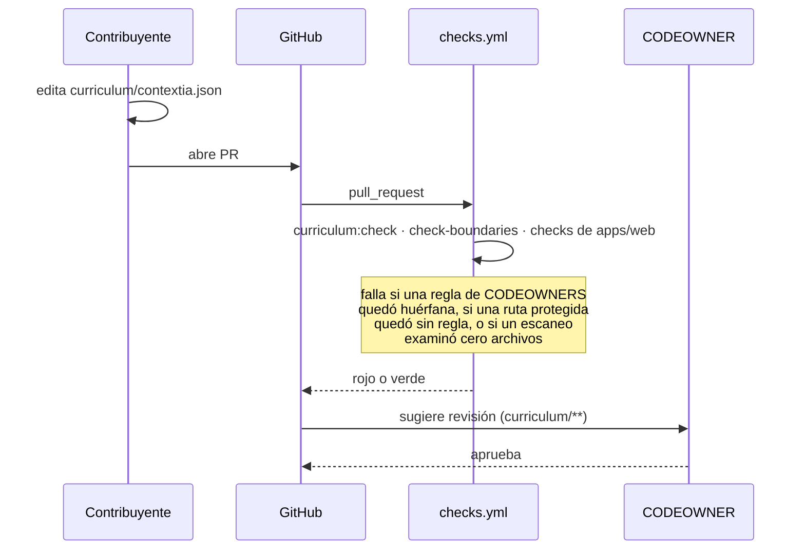
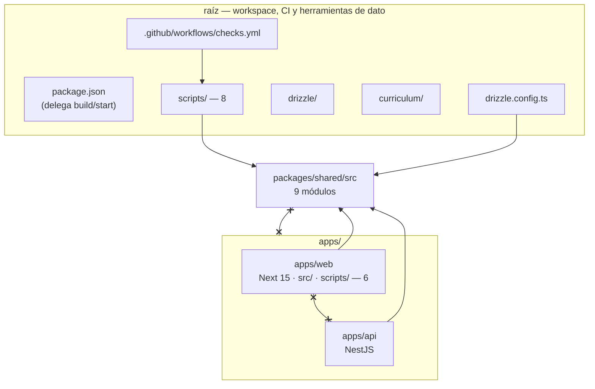

# PRD-006 (fase 3): `apps/web` y `packages/shared` — cierre de ADR-001

**Status**: Draft
**Date**: 2026-07-30
**Author**: AI-assisted
**Priority**: P2
**Depends on**: ADR-001, PRD-003, PRD-005
**Supersedes**: None
**Issue**: —

## Impacted Projects

| Project | Impact |
|---------|--------|
| **platform** | Mudanza de rutas sin cambio de comportamiento para el estudiante. La app Next entera pasa de la raíz a `apps/web/` (`src/`, `public/`, `next.config.mjs`, `tsconfig.json` y las seis comprobaciones de `scripts/` que dependen de `src/lib/`, que viajan a `apps/web/scripts/` con sus imports intactos). `apps/web/next.config.mjs` **gana `experimental: { externalDir: true }`** — sin eso `next build` no compila nada fuera del directorio de la app (§ 5.3, es el motivo de que este no sea un cambio de rutas puro). Nace `packages/shared/src/` con ocho módulos que hoy viven en `src/lib/` —`schema.ts`, `db.ts`, `access.ts`, `tutor-prompt.ts`, `window.ts`, `curriculum-context.ts`, `curriculum-file.ts`, `curriculum.ts`— más `analytics-events.ts` (nuevo). **No es un paquete de pnpm**, es una carpeta de fuentes (§ Design Decisions). Las cinco costuras de re-export de `apps/api` (`src/db/schema.ts:12`, `src/tutor/tutor-prompt.ts:21`, `src/tutor/window.ts:18`, `src/tutor/curriculum-context.ts:24-25`) repuntan; los dos duplicados por copia (`src/access/access.types.ts:8` y el union `TutorEvent` de `src/analytics/analytics.service.ts:26`) se borran y pasan a importar. **`apps/api` no queda intacto**: `apps/api/test/build-boot.e2e-spec.ts:138` fija la ruta emitida del esquema y hay que editarla (§ 7.2). Sí quedan intactos su `tsconfig.json`, su `package.json` y sus dos Dockerfiles. En la raíz quedan herramientas y dato: `scripts/` (ocho), `curriculum/`, `drizzle/`, `drizzle.config.ts` (repunta `schema:`), `pnpm-workspace.yaml`, `.env.example`, `CONTRIBUTING.md` y un `package.json` que delega `build`/`start` a `pnpm --filter web` y cuya lista de `scripts` se reescribe (§ 10 paso 3). `.github/CODEOWNERS` repunta sus dos reglas y gana una tercera; **`.github/workflows/checks.yml` es nuevo** y es lo que hace que las comprobaciones de § 9 se ejecuten sin depender de que alguien se acuerde. Sin migraciones —`drizzle-kit generate` tras la mudanza da diff vacío (§ 6)—, sin dependencias nuevas, sin variables nuevas, sin superficie HTTP nueva, sin cambios de servicio en Railway. |

---

## 1. Problem Statement

[ADR-001](ADR-001-backend-nestjs-front-nextjs.md) § 2 decidió tres paquetes: `apps/web`, `apps/api` y `packages/shared`. [PRD-003](003-phase-1-api-acceso-y-cobro.md) y [PRD-005](005-phase-2-stream-del-tutor.md) construyeron el segundo y movieron a él acceso, cobro, reconciliación y el turno del tutor. Los otros dos no existen. La migración lleva tres cuartos hechos y el cuarto que falta es el que ADR-001 § 7 mandó dejar para el final.

El estado intermedio tiene un coste concreto, no estético. `apps/api` depende hoy de siete módulos de la raíz —cinco por ruta relativa de cuatro niveles, dos por copia literal—, y cada uno de esos puntos lleva escrito en el propio archivo qué lo cierra:

| Costura | Destino en la raíz | Forma |
|---|---|---|
| `apps/api/src/db/schema.ts:12` | `src/lib/schema.ts` | re-export |
| `apps/api/src/tutor/tutor-prompt.ts:21` | `src/lib/tutor-prompt.ts` | re-export |
| `apps/api/src/tutor/window.ts:18` | `src/lib/window.ts` | re-export |
| `apps/api/src/tutor/curriculum-context.ts:24-25` | `src/lib/curriculum-context.ts`, `src/lib/curriculum-file.ts` | re-export |
| `apps/api/src/access/access.types.ts:8` | `src/lib/access.ts:11` | **copia** |
| `apps/api/src/analytics/analytics.service.ts:26` | `src/lib/analytics.ts:35` | **copia** |

Las cuatro primeras son re-exports y no pueden derivar: hay un solo cuerpo. Las dos últimas son copias literales, y ahí sí puede derivar — que es el fallo que `packages/shared` existe para hacer imposible (ADR-001 § 3, Opción C). **Y ya derivó**: `src/lib/analytics.ts:35-41` declara seis miembros de `TutorEvent` y `apps/api/src/analytics/analytics.service.ts:26-38` declara siete. El séptimo, `subscription_reconciled`, lleva un comentario que dice *"AUDITORÍA, NO EMBUDO"* y advierte que mezclarlo en el embudo *"lo corrompería con eventos que no son conversiones"*. La deriva no es hipotética; está en el árbol y § 5.2 tiene que resolverla, no colapsarla.

`src/lib/access.ts:5-7` dice el resto sin rodeos: *"este archivo sobrevive únicamente porque el tipo tiene que estar en algún sitio hasta que exista `packages/shared`"*.

El segundo coste es que la raíz del repositorio es a la vez raíz del workspace y servicio desplegado. De ahí salen tres arreglos documentados como load-bearing que solo existen por esa doble identidad: `tsconfig.json:23` excluye `apps` para que `next build` no typecheckee los decoradores de NestJS; `apps/api/Dockerfile` existe porque Railway usa el script `start` del `package.json` de la raíz; y `pnpm-workspace.yaml` lleva un aviso de doce líneas sobre lo que cuesta que el build del servicio Next salga de la raíz.

El tercero es de gobierno y es el que más pesa. `.github/CODEOWNERS:14-15` protege `src/lib/tutor-prompt.ts` y `src/lib/curriculum-context.ts` — el prompt certificado por un banco de 35 evals y el bloque que lo acompaña. Son reglas por ruta: **cualquier mudanza que las mueva sin repuntar el archivo desactiva la puerta en silencio**, sin que nada se ponga rojo. Es el modo de fallo que el propio CODEOWNERS declara en su cabecera como razón de existir ("mismo destino, menos escrutinio").

Y ese modo de fallo no se limita a CODEOWNERS. `scripts/check-curriculum.ts` no es solo un importador: `:411` escanea el árbol con `sourceFiles("src")` y `sourceFiles("scripts")`, y dos de sus invariantes se seleccionan por prefijo de ruta (`:444`, `:477-478`). Movidos los directorios, esas dos pasan a examinar cero archivos y siguen dando verde. § 4 y § 9 tratan esto como trabajo declarado, no como detalle de implementación.

ADR-001 § 6 tiene una fila que apunta a este momento: *"El equipo sigue siendo de una persona a los 6 meses y la migración no ha terminado → Parar y consolidar; una migración a medias es peor que cualquiera de los dos extremos."* El equipo es una persona. La forma barata de no quedarse a medias es terminar ahora, mientras lo que queda son nueve archivos y ninguna decisión abierta.

### 1.1 Por qué las dos mudanzas van en el mismo PRD

`apps/web` y `packages/shared` rompen **el mismo conjunto de cosas**: las 23 referencias `../src/lib/*.ts` repartidas por doce archivos de `scripts/`, el `schema:` de `drizzle.config.ts:9`, la resolución del árbol que emite `apps/api` (que no lleva `rootDir` a propósito) y el arranque del servicio Next en Railway. Hacerlas por separado paga esa factura dos veces, y cada pago es una ventana de despliegue en dos servicios a la vez — Railway despliega al mergear a `main`, y `docs/SYSTEM_ARTIFACT.md` registra dos roturas de producción por cortes más pequeños que este (PRD-002 y PRD-005).

Separarlas tampoco entrega valor intermedio: `apps/web` sola deja las siete costuras donde están y solo les cambia el prefijo; `packages/shared` sola deja la raíz siendo raíz-y-servicio. El corte único es el que cierra ADR-001.

## 2. Goals

1. Mover la app Next a `apps/web/` sin cambio observable para el estudiante: mismas rutas, mismo HTML, misma sesión, mismo dominio.
2. Crear `packages/shared/src/` con los ocho módulos que hoy consumen dos o más paquetes, y **resolver los dos duplicados por copia** — `access.types.ts` por borrado, el union `TutorEvent` por unificación explícita que preserve la distinción embudo/auditoría (§ 5.2).
3. Si un archivo de `apps/api/src` importa de `apps/web`, o al revés, o si un archivo de `packages/shared/src` importa de cualquiera de los dos, entonces la comprobación de fronteras debe fallar.
4. Si una regla de `.github/CODEOWNERS` apunta a una ruta que no existe, o si una ruta protegida deja de estar cubierta por alguna regla, entonces **CI debe fallar el PR**. (Esto hace vigentes las reglas; **no** bloquea el merge por falta de revisión de propietario — eso exige "Require review from Code Owners" en la protección de rama, que queda fuera de alcance por decisión explícita. CODEOWNERS sigue sugiriendo revisores, no exigiéndolos.)
5. Si una comprobación que se selecciona por prefijo de ruta deja de examinar archivos, entonces debe fallar en vez de pasar verde (§ 9 fila 6).
6. Que `drizzle-kit generate` tras la mudanza produzca un diff vacío.
7. No cambiar ningún servicio, Dockerfile ni variable de Railway. El corte es un merge, no un despliegue coordinado.
8. Dejar `apps/api` sin cambios en su `tsconfig.json`, su `package.json` y sus dos Dockerfiles. (Su árbol de tests **sí** cambia: `test/build-boot.e2e-spec.ts:138` fija la ruta emitida del esquema — § 7.2.)

## 3. Non-Goals

- **Activar "Require review from Code Owners"** en la protección de rama de `main`. Decisión explícita del propietario del repositorio. Consecuencia registrada en el Goal 4: CODEOWNERS sigue siendo sugerencia en el momento del merge; lo que CI garantiza es que las reglas no estén huérfanas.
- **Adelgazar el build del servicio Next.** Que `pnpm install` desde la raíz instale también NestJS, Vitest y `@swc/core` es coste aceptado y documentado en `pnpm-workspace.yaml`, y no lo arregla esta mudanza: Nixpacks instala desde la raíz del workspace pase lo que pase. El arreglo es un `NIXPACKS_INSTALL_CMD` con `--filter`, una variable de servicio, y va aparte para no meter un cambio de variable en el mismo corte que un cambio de rutas.
- **Convertir `packages/shared` en un paquete de pnpm** con `package.json`, build propio y especificador desnudo. Ver § Design Decisions.
- **Replicar en `apps/api` el par caché-más-`lastKnown` de `curriculum.ts`**, que `apps/api/src/tutor/curriculum.repository.ts:25` anota como trabajo de esta fase. Es un cambio de rendimiento con comportamiento observable propio (qué se sirve durante un fallo de Postgres), no una mudanza de rutas.
- **Tocar `output: "standalone"`.** Se construye y hoy no se usa en runtime (`start` es `next start`, no `node server.js`); es desperdicio preexistente y sacarlo es una decisión de despliegue. Anotado en § 11.
- **Ampliar CI más allá de correr las comprobaciones que ya existen.** Sin matriz de versiones, sin despliegue, sin caché elaborada.
- **Un `packages/ui`, un `packages/config` o cualquier cuarto paquete.** ADR-001 § 2 declara tres.
- Cambiar el esquema, la API HTTP, el prompt, la ventana de contexto o cualquier texto que viaje al modelo.

## 4. User Flows

Para el estudiante no hay flujo: ninguna ruta, respuesta ni cookie cambia. Los dos que sí cambian son de quien mantiene el repositorio.

**Contribuir un cambio de currículo.** El flujo de `CONTRIBUTING.md` es idéntico salvo dos rutas; lo que cambia es que la puerta deja de depender de que el contribuyente se acuerde de correr nada:



La flecha de CI a GitHub es rojo-o-verde, no bloqueo: sin protección de rama activada (§ 3) un PR rojo se puede mergear igualmente. Lo que se compra es que **nadie pueda decir que no lo sabía**.

**Dónde vive cada comprobación.** El criterio es **qué importa y qué lee** — no solo qué importa. Tres de los trece scripts leen archivos del árbol por ruta además de importar, y esa dependencia es la que decide dos de las clasificaciones:

| Comprobación | Después | Depende de |
|---|---|---|
| `check-curriculum.ts` | `scripts/` (raíz) | importa `packages/shared`; **escanea `src/` y `scripts/`** (`:411`) y lee `src/lib/db.ts` por ruta (`:380`) |
| `check-curriculum-golden.ts` | `scripts/` (raíz) | importa `packages/shared`; **lee `src/app/chat-client.tsx` y `src/app/registro/registro-form.tsx`** (`:103`) |
| `check-lessons.ts`, `check-window.ts` | `scripts/` (raíz) | solo importa `packages/shared` |
| `check-curriculum-identity.ts`, `check-curriculum-load.ts`, `load-curriculum.ts` | `scripts/` (raíz) | `packages/shared` más `curriculum/`, `drizzle/` y git |
| `check-access-bridge.ts`, `check-analytics.ts`, `check-format-message.ts`, `check-schedule.ts`, `check-tutor-turn.ts`, `check-secrets.ts` | `apps/web/scripts/` | importan `apps/web/src/lib`; `check-secrets.ts` además calcula `repoRoot` desde su propia ubicación (`:31-32`) y lee `src/app/api/chat/route.ts` (`:125`) |
| `check-boundaries.ts` | `scripts/` (raíz) | el árbol entero (**nuevo**) |
| `check-sub.mjs`, `expire-trial.mjs`, `send-class-email.mjs` | `scripts/` (raíz) | `pg`, `resend` — nada de `src/` |

Las seis que van a `apps/web/scripts/` viajan **junto a** `src/`, así que sus imports no cambian ni un carácter y `check-secrets.ts` conserva además su aritmética de rutas: `repoRoot` pasa a ser `<repo>/apps/web` y todo lo que lee cuelga de ahí. Las que se quedan en la raíz repuntan sus imports **y** sus rutas de lectura (§ 10 paso 3).

## 5. API

No hay superficie HTTP nueva ni modificada. Lo que este PRD define es la superficie de módulo de `packages/shared`, que es el contrato entre los tres paquetes.

### 5.1 Contenido de `packages/shared/src/`

Ocho archivos movidos, más `analytics-events.ts` (§ 5.2):

| Archivo | LOC | Consumidores tras la mudanza |
|---|---|---|
| `schema.ts` | 203 | `apps/api` (`src/db/schema.ts:12`), `apps/web` (`auth.ts:26`, `registro/actions.ts:4`, `conversations.ts:21`), interno (`db.ts`, `window.ts`, `curriculum.ts`), `scripts/check-window.ts`, `scripts/load-curriculum.ts:17`, `drizzle.config.ts` |
| `db.ts` | 31 | `apps/web` (`auth.ts:19`, `registro/actions.ts:3`, `conversations.ts:20`), interno (`curriculum.ts:11`), `scripts/load-curriculum.ts:16`, `scripts/check-curriculum-load.ts:110` |
| `access.ts` | 17 | `apps/web` (`chat/page.tsx:9`, `api-client.ts:26`), `apps/api` (`src/access/*`) |
| `tutor-prompt.ts` | 83 | `apps/api` (`src/tutor/tutor-prompt.ts:21`) — **un solo consumidor**, ver abajo |
| `window.ts` | 40 | `apps/api` (`src/tutor/window.ts:18`), `scripts/check-window.ts` |
| `curriculum-context.ts` | 64 | `apps/api`, `scripts/` (3 checks) |
| `curriculum-file.ts` | 575 | `apps/api`, `apps/web` (`page.tsx:7`), `scripts/` (4 checks), interno (`curriculum.ts`, `curriculum-context.ts`) |
| `curriculum.ts` | 186 | `apps/web` (`page.tsx:6`, `chat/page.tsx:11`, `registro/page.tsx:3`, `chat-client.tsx:5`, `registro-form.tsx:6`), `scripts/check-curriculum-load.ts:113` |

**`tutor-prompt.ts` entra pese a tener un solo consumidor.** El criterio de admisión del resto es "≥2 paquetes"; este no lo cumple y aun así no baja a `apps/api/src/tutor/`. La razón es `.github/CODEOWNERS:14-15`, que lo protege **en pareja** con `curriculum-context.ts` — *"El prompt certificado y el bloque que lo acompaña, por lo mismo"* — y `curriculum-context.ts` sí tiene tres consumidores y tiene que estar en `shared`. Partir la pareja entre dos directorios rompe el agrupamiento que la propia regla justifica, y convierte el prompt certificado en detalle de implementación de un servicio cuando lo que lo certifica es un banco de evals independiente de dónde corra. Es una excepción nombrada, no un descuido.

**`db.ts` entra aunque `apps/api` no lo use.** Lo consumen `apps/web`, la propia `curriculum.ts` y dos scripts de la raíz. `apps/api` sigue con su pool propio en `src/db/drizzle.module.ts` —listener de `error` y `max` inyectado (PRD-004)— y **no** se sustituye por este; ninguna costura de `apps/api` alcanza `db.ts`.

**`curriculum.ts` entra aunque toque `next/cache`.** Su acoplamiento es un `await import("next/cache")` **dinámico y ya capturado** (`src/lib/curriculum.ts:80-90`), escrito así para que el módulo cargue bajo Node pelado: el comentario de `:85` dice *"Fuera del servidor de Next (los checks de `scripts/`) el especificador ni resuelve"* y el `catch` cae a lectura directa. Un fallo de **resolución** —que es lo que pasará en la raíz cuando `next` deje de ser dependencia suya— entra por el mismo `catch`. Fila 13 de § 9 lo ejecuta en vez de suponerlo.

**Lo que NO entra**: `analytics.ts` (cliente PostHog con inicialización propia de cada servicio — solo emigra el union, § 5.2), `conversations.ts`, `api-client.ts`, `tutor-turn.ts`, `pixel.ts`, `format-message.ts`, `schedule.ts` — todos con un solo consumidor, que es `apps/web`, y ninguno en pareja protegida.

**Tres archivos se mueven byte a byte, sin excepción de cabecera.** `curriculum-file.ts`, `tutor-prompt.ts` y `curriculum-context.ts` son los que llevan control de seguridad o texto certificado. Los otros cinco pueden perder su marcador `ponytail:` de cabecera en el mismo commit (`access.ts:5`, `window.ts:14`, `curriculum.ts:101`); los tres primeros **no**, y § 10 paso 7 lo verifica con similitud de renombrado `R100`.

### 5.2 Los dos duplicados, resueltos

- `apps/api/src/access/access.types.ts` **se elimina**. Sus importadores (`access.controller.ts`, `access.service.ts`, `subscriptions.repository.ts`) pasan a importar `Access` de `packages/shared`. El requisito es que **haya un solo `export type Access` en el árbol**; que quede o no un archivo-costura en la ruta vieja lo decide quien implementa.
- **El union `TutorEvent` no se colapsa: se unifica preservando la distinción.** Las dos copias ya divergieron (§ 1) y la de `apps/api` tiene un séptimo miembro marcado como auditoría, no embudo. `packages/shared/src/analytics-events.ts` declara:

  ```ts
  // Los seis escalones del embudo. Es lo que `apps/web` puede emitir.
  export type FunnelEvent =
    | "server_pageview" | "registered" | "trial_started"
    | "tutor_message_sent" | "subscription_activated" | "subscription_canceled";

  // Auditoría, NO embudo (PRD-004 §3, §8.2): lo emite solo el reconciliador.
  export type AuditEvent = "subscription_reconciled";

  export type TutorEvent = FunnelEvent | AuditEvent;
  ```

  `src/lib/analytics.ts` de `apps/web` tipa su `track()` con **`FunnelEvent`**, no con `TutorEvent` — así el miembro de auditoría deja de ser emitible desde el proceso que sirve páginas, que es lo que el comentario de `analytics.service.ts:32-36` pide y hoy solo sostiene la separación de archivos. `apps/api` tipa el suyo con `TutorEvent`. La fila 5 de § 9 afirma el conjunto de miembros sobre el texto fuente; que `apps/web` **no pueda** emitir el de auditoría es una propiedad de tipos y la afirma la fila 14, con una fixture `@ts-expect-error` que verifica `next build`.

  Esto **estrecha** el tipo de `apps/web` (de 6 miembros propios a 6 miembros nombrados) sin cambiar ningún evento emitido: `src/lib/analytics.ts:35-41` ya declaraba exactamente esos seis. No hay cambio observable en PostHog.

### 5.3 Cómo importa cada paquete

| Desde | Especificador | Mecanismo |
|---|---|---|
| `apps/api/src/**` | `../../../../packages/shared/src/x.ts` | relativo **con extensión** — lo que hoy funciona y lo que `rewriteRelativeImportExtensions` reescribe al emitir |
| `scripts/**` (raíz) | `../packages/shared/src/x.ts` | relativo con extensión, bajo Node pelado |
| `apps/web/src/**` | `@shared/x` (**sin extensión**) | alias en `apps/web/tsconfig.json` → `../../packages/shared/src/*`, junto al `@/*` existente. Sin extensión para igualar la convención de los ~14 imports `@/lib/x` que reemplaza |
| `drizzle.config.ts` | `./packages/shared/src/schema.ts` | ruta de configuración, la lee `drizzle-kit` sobre el fuente |

**`apps/web/next.config.mjs` necesita `experimental: { externalDir: true }`, y sin eso el build no compila.** No es una precaución: `next/dist/build/webpack-config.js:372` calcula

```js
const shouldIncludeExternalDirs = config.experimental.externalDir || !!config.transpilePackages;
```

y cuando es falso restringe el `codeCondition` del loader a `include: [dir, ...babelIncludeRegexes]`, donde `dir` es la raíz del proyecto Next — `apps/web` tras la mudanza. `packages/shared/src/**` queda fuera, ningún loader de SWC lo transforma, webpack parsea TypeScript como JavaScript y `access.ts` revienta en su `export type`. Verificado contra el Next 15.5.19 instalado.

**`transpilePackages` no es el rodeo.** `isResourceInPackages` resuelve directorios de paquete con `require.resolve`, y `packages/shared` no es un paquete a propósito (§ Design Decisions). Tampoco hace falta `outputFileTracingRoot`: solo importa para la salida `standalone`, que se construye y no se ejecuta (§ 11).

**`apps/web/tsconfig.json` conserva la exclusión de `scripts`** que hoy lleva `tsconfig.json:23` con su razón escrita (*"scripts/ sigue fuera del bundle"*), y **deja de excluir `apps`**, que ya no es descendiente suyo. Queda `"exclude": ["node_modules", "scripts"]`.

Efecto colateral aceptado, anotado para que nadie lo redescubra como bug: al mudarse el `tsconfig.json` la raíz se queda **sin ninguno**, así que `drizzle.config.ts` —hoy dentro del `**/*.ts` del de la raíz— deja de typecheckearse. Sin efecto en runtime (`drizzle-kit` lo empaqueta con esbuild) y los `scripts/*.ts` de la raíz ya estaban excluidos en `tsconfig.json:23`; es experiencia de editor, no corrección.

**Los catorce imports de `apps/web` que se editan a mano.** A diferencia de los seis scripts —`git mv` puro, imports intactos—, estos son ediciones manuales y por tanto la única clase de cambio de esta mudanza sin red mecánica. Se enumeran para que el diff sea auditable línea a línea:

```
src/auth.ts:19,26                     src/app/page.tsx:6,7
src/app/registro/actions.ts:3,4       src/app/chat/page.tsx:9,11
src/lib/conversations.ts:20,21        src/app/registro/page.tsx:3
src/app/chat-client.tsx:5             src/app/registro/registro-form.tsx:6
src/lib/api-client.ts:26
```

Un import olvidado falla `next build` con TS2307, así que la red no es cero; lo que no verifica nada es que el diff toque **solo** el especificador. Lo afirma § 10 paso 7, no § 9: es una propiedad de este commit, y anclarla en un script de CI la dejaría roja en el primer PR posterior que edite un cuerpo en cualquiera de los nueve.

Los imports internos entre módulos que viajan juntos (`curriculum.ts:11-21`, `curriculum-context.ts:13`, `window.ts:12`, `db.ts:19`) **no cambian**: son relativos dentro de `packages/shared/src/`.

## 6. Data Model

Sin cambios. Ni tabla, ni columna, ni índice, ni migración.

Lo que se mueve es dónde `drizzle-kit` lee el esquema: `drizzle.config.ts:9` pasa de `"./src/lib/schema.ts"` a `"./packages/shared/src/schema.ts"`. `out: "./drizzle"` no cambia.

**El diff vacío es lo que hace esto seguro.** Verificado que las instantáneas de `drizzle/meta/` guardan `id`, `prevId`, `version`, `dialect` y `tables` y **ninguna ruta de archivo**, así que repuntar la configuración no puede por sí solo producir una migración. Si `pnpm db:generate` emite una, el esquema se editó en el camino: hay que revertir el archivo movido, no aceptar la migración.

Eso protege además el riesgo heredado de `docs/SYSTEM_ARTIFACT.md`: la migración de `curriculum_nodes` lleva SQL editado a mano (`DEFERRABLE INITIALLY IMMEDIATE` en `drizzle/20260728051523_bright_kulan_gath.sql:20` y un `COMMENT ON COLUMN` en `:25`) que `drizzle-kit` no modela y que una regeneración accidental emitiría sin la cláusula.

## 7. Architecture

### 7.1 Layout resultante



Las dos aristas tachadas son la invariante que comprueba `scripts/check-boundaries.ts`: **`apps/web` y `apps/api` no se importan entre sí, y `packages/shared` no importa de ninguno de los dos.** La segunda dirección importa más que la primera: `shared` lo cargan los dos servicios, así que un módulo suyo alcanzando `apps/` arrastra código local de una app al proceso de la otra. Es además el accidente probable aquí — cuando `next` deje de resolver desde la raíz, la tentación de "arreglar" `curriculum.ts:80` alcanzando de lado es real, y § 5.1 explica por qué no hay nada que arreglar.

### 7.2 Qué sobrevive en `apps/api` y qué no

`apps/api/tsconfig.json` lleva una cabecera de PRD-003 que dice "NO la 'simplifiques'", con tres cosas load-bearing: `allowImportingTsExtensions` junto a `rewriteRelativeImportExtensions`, la ausencia de `rootDir`, y que `apps/api/package.json` no declare `"type": "module"`.

Sin `rootDir`, tsc calcula el directorio raíz común sobre **todos los archivos del programa que pueden emitirse** — no sobre los globs de `include`, que solo fijan las raíces; `exclude` nunca retira un archivo traído por un import. Hoy el conjunto es `apps/api/src/**` ∪ `src/lib/**` y el ancestro es la raíz del repositorio; tras la mudanza es `apps/api/src/**` ∪ `packages/shared/src/**` y el ancestro **sigue siendo la raíz**. Comprobado compilando un árbol sintético con el `tsconfig.json` real: emite `dist/apps/api/src/main.js`, `dist/apps/api/src/db/schema.js` y `dist/packages/shared/src/schema.js`, y la costura reescribe a `require("../../../../packages/shared/src/schema.js")`.

Por eso **`apps/api/package.json`, `apps/api/Dockerfile` y `Dockerfile.worker` no se tocan**: el entrypoint emitido no se mueve.

**Pero la rama compartida sí se mueve**, de `dist/src/lib/*.js` a `dist/packages/shared/src/*.js` — y `apps/api/test/build-boot.e2e-spec.ts:138` la fija:

```ts
const schema = readFileSync(join(API_ROOT, "dist/src/lib/schema.js"), "utf8");
```

`ENOENT` tras la mudanza. Es el único literal de ruta emitida en todo `apps/api`, y es la razón de que el Goal 8 hable de tres archivos concretos y no de "`apps/api` sin tocar".

**Dos invariantes del manifiesto de la raíz pasan a ser load-bearing para el emit de `apps/api`.** tsc elige el formato de módulo de cada archivo por el `package.json` más cercano al **fuente**; para `packages/shared/src/**` ese sigue siendo el de la raíz. Como § 10 paso 3 lo reescribe y lo deja junto a tres `.mjs`, hay que dejar escrito que:

1. **el `package.json` de la raíz no declara `"type": "module"`** — con él, `dist/packages/shared/src/schema.js` sale ESM mientras `dist/apps/api/src/**` sigue CJS, que es la divergencia que `docs/SYSTEM_ARTIFACT.md` documenta produciendo `SyntaxError: … does not provide an export named 'subscriptions'`;
2. **los tres scripts `.mjs` conservan su extensión** en vez de apoyarse en un `type` del manifiesto.

### 7.3 El arranque del servicio Next

Railway ejecuta el script `start` del `package.json` de la **raíz** para servicios enlazados a repositorio — el hecho documentado en `apps/api/Dockerfile:3-8` que obligó a darle a la API un Dockerfile propio. Este PRD no lucha contra eso: la raíz conserva `build` y `start`, delegando.

```json
"build": "pnpm --filter web build",
"start": "pnpm --filter web start"
```

Consecuencia: **cero cambios en Railway**. Ni Dockerfile nuevo, ni `RAILWAY_DOCKERFILE_PATH`, ni variable tocada. Es también lo que evita aplicar la regla de orden de variables de `docs/SYSTEM_ARTIFACT.md` § `Entorno y despliegue`, porque no hay variable que ordenar.

Verificado además que el `COPY` parcial de manifiestos de `apps/api/Dockerfile:29-31` sobrevive: con `apps/web/package.json` ausente del contexto de build, `pnpm install --frozen-lockfile` sale 0 e instala el subconjunto descubierto.

**El riesgo residual es de detección, y el paso 1 de § 10 lo mide contra Nixpacks, no contra pnpm.** Correr `pnpm build` en la máquina prueba la delegación y no dice nada sobre si Nixpacks sigue generando un plan para un manifiesto de raíz sin `next`, sin `react` y sin `dev`. La salida documentada, si no lo genera, es un `apps/web/Dockerfile` simétrico al de la API — y entonces este PRD vuelve a revisión, porque mete un cambio de variable en Railway.

### 7.4 CI

`.github/workflows/checks.yml`, nuevo, disparado en `pull_request`. Corre `pnpm install --frozen-lockfile` —que hace del lockfile regenerado un requisito duro del commit de la mudanza, no una cortesía (§ 10 paso 3)— y después lo que no necesita base: `check-boundaries.ts`, `pnpm curriculum:check`, `node scripts/check-window.ts`, las seis de `apps/web/scripts/`, `pnpm --filter web build` y **`pnpm --filter api test test/build-boot.e2e-spec.ts`** — no `pnpm --filter api build`, que es `tsc -p tsconfig.json` (`apps/api/package.json:11`) y no puede ejecutar una spec de vitest. La fila 11 de § 9 se apoya en esa spec, que se basta sola: hace su propio build en `beforeAll` y se pone sus variables en línea. Invocar `pnpm --filter api test` a secas arrastraría las seis specs que la fila 12 marca `operador`.

**Tres cosas que el workflow tiene que declarar, y sin las cuales no arranca en verde:**

1. **`actions/checkout` con `fetch-depth: 0`.** Con el defecto (`fetch-depth: 1`) y en `pull_request`, el clon queda en HEAD desacoplado y sin refs de rama, así que las cuatro sondas de `baseRef()` en `scripts/check-curriculum-identity.ts:151-161` fallan y la función cae a `"HEAD"` — con lo que `:166` compara el archivo consigo mismo y el check imprime OK en cada PR sin haber mirado nada. Es exactamente el fallo que su propio docstring (`:142-147`) describe y el que el Goal 5 prohíbe. La fila 8 de § 9 lo afirma en vez de confiar en la profundidad del clon.
2. **Un bloque `env:` con dos variables no secretas.** `src/lib/api-client.ts:111` llama a `resolveClientConfig()` **a nivel de módulo**, y esa función lanza sin `AUTH_COOKIE_NAME` (`:57-61`) o sin `API_BASE_URL` (`:70-75`). `next build` importa los módulos de página al recolectar rutas, así que el build falla — el propio archivo lo dice en `:104-110` y por eso `scripts/check-access-bridge.ts:24-25` fija las dos antes de importar. Los valores son `AUTH_COOKIE_NAME: authjs.session-token` y `API_BASE_URL: http://127.0.0.1:1`, los mismos que ya usa ese check. Ninguna de las dos es secreto, así que esto no roza la invariante 3 de § 8.5.
3. **Nada más.** El conjunto `NEXT_PUBLIC_*` que `docs/SYSTEM_ARTIFACT.md` exige en tiempo de build **no** hace falta en CI: verificado que todas sus lecturas (`paywall.tsx:24,27,34`, `checkout/page.tsx:16,19`, `analytics-consent.tsx:19,23`) están dentro de cuerpos de función y ninguna lanza a nivel de módulo. Sin ellas el build sale verde e inlinea `undefined`; lo que degrada es el runtime, que en CI no se ejercita.

   Ese "nada más" descansa además en un hecho que conviene dejar escrito porque es frágil: `curriculumSlug()` (`src/lib/curriculum.ts:43-50`) **sí lanza** sin `CURRICULUM_SLUG`, y lo llaman `page.tsx:36`, `registro/page.tsx:19` y `chat/page.tsx:42` — dentro del cuerpo del componente, que es lo que hace pasar la prueba de "está dentro de una función", pero esos cuerpos **se ejecutan en build** para cualquier ruta prerenderizada. Lo que salva el build es que las tres son dinámicas: `page.tsx:34` y `registro/page.tsx:18` llaman a `connection()` para salir del prerender y `/chat` lo es por leer cookies. Una página nueva que llame a `curriculumSlug()` sin salirse del prerender compila en local y falla solo en CI.

**Partir la cadena `curriculum:check` no es cosmético.** Hoy `package.json:14` es un solo encadenado con `&&` que termina en `check-curriculum-load.ts`, y ese script sale 1 sin `CURRICULUM_TEST_DATABASE_URL` (`:50-58`) porque escribe y borra filas. La cadena es todo-o-nada contra Postgres: o CI la corre y está roja en cada PR, o no la corre y "la parte que no toca Postgres" no es una unidad invocable. § 10 paso 3 la parte en `curriculum:check` (las cuatro sin base) y `curriculum:check:db` (el cargador), y CI apunta a la primera. Las que exigen `CURRICULUM_TEST_DATABASE_URL` o `API_TEST_DATABASE_URL` quedan marcadas `operador` en § 9 y se corren a mano.

No existía CI antes de este PRD — `.github/` contenía solo `CODEOWNERS` — así que las trece comprobaciones del repositorio eran honor-system. Este workflow no es alcance de la mudanza: es lo que hace que las filas de § 9 signifiquen algo. Sin él, § 8.1 capa 2 sería memoria reubicada, no memoria eliminada.

Y como el repositorio es público y `CONTRIBUTING.md:39` manda hacer fork, esto mete contenido de terceros en un runner por primera vez: **§ 8.5 fija las cinco invariantes del workflow** y no son opcionales.

## 8. Security

La mudanza no introduce superficie de red, credencial ni entrada de usuario. Los riesgos son de control que desaparece en silencio.

### 8.1 Controles indexados por ruta

Tres controles se seleccionan por prefijo o ruta exacta y todos quedan huérfanos con la mudanza:

1. **`.github/CODEOWNERS:14-15`** protege `src/lib/tutor-prompt.ts` y `src/lib/curriculum-context.ts`. GitHub no avisa de reglas huérfanas: una regla que apunta a una ruta inexistente no sugiere a nadie, y una vigente sí — pero **ninguna de las dos exige**, porque "Require review from Code Owners" queda fuera de alcance por decisión del propietario (§ 3). Lo que esta capa compra es visibilidad, no bloqueo: el propietario aparece en la lista de revisores del PR y su ausencia se nota. Nota de temporización: el PR de la mudanza **sí** está cubierto, porque GitHub evalúa CODEOWNERS desde la rama **base** y ahí la regla vieja todavía casa con el archivo borrado. La exposición empieza en el PR **siguiente**, cuando ya nadie está mirando.
2. **`scripts/check-curriculum.ts:444`** (`path.startsWith("src")`) gobierna que ningún módulo seleccione el currículo por literal en vez de por `CURRICULUM_SLUG`. Sus sujetos vivos son reales: `src/app/page.tsx`, `src/app/chat/page.tsx`, `src/app/registro/page.tsx`. Es el control detrás de la invariante *"No hay aislamiento ni control de acceso entre currículos"* de `docs/SYSTEM_ARTIFACT.md`.
3. **`scripts/check-curriculum.ts:477-478`** (`startsWith(join("src","lib"))`) gobierna que `src/lib/` no exporte contenido del currículo, con `schedule.ts` como excepción nombrada. Tras la partición el antiguo `src/lib` son **dos** directorios.

Los dos últimos primero fallan ruidosamente (`:411` hace `readdirSync` sobre un `src/` que ya no existe), lo que garantiza que alguien los repunte. El peligro es el repunte ingenuo: apuntar `sourceFiles("src")` a `apps/web/src` deja `packages/shared/src/` —donde viven `curriculum-file.ts`, `curriculum-context.ts` y `schema.ts`— fuera del alcance, y las dos invariantes pasan a verde examinando menos.

**Mitigación en tres capas:**

1. Repuntar las tres en el mismo commit: CODEOWNERS a `packages/shared/src/`, y los escaneos a una lista explícita de raíces que cubra `apps/web/src`, `packages/shared/src`, `scripts/` y `apps/web/scripts/`.
2. **Cobertura no vacía**: cada escaneo afirma haber examinado un número de archivos distinto de cero, por raíz. Una mudanza futura que vacíe un escaneo falla en vez de pasar verde (§ 9 fila 6).
3. **CI lo ejecuta** (§ 7.4). Sin esto las dos capas anteriores son honor-system, que es lo que son hoy.

**La comprobación de CODEOWNERS va en las dos direcciones.** Regla→archivo responde "¿hay reglas huérfanas?"; el fallo que CODEOWNERS documenta como su razón de ser es el inverso — **contenido que llega al bloque de system sin regla que lo cubra**. Partir `tutor-prompt.ts` en dos archivos dejaría regla→archivo en verde con el archivo nuevo sin dueño. `CONTRIBUTING.md:57` es explícito en que la regla se indexa *"por destino del contenido, no por ruta de archivo"*. Así que `check-boundaries.ts` afirma también archivo→regla sobre una lista declarada de rutas protegidas:

```
packages/shared/src/tutor-prompt.ts
packages/shared/src/curriculum-context.ts
packages/shared/src/curriculum-file.ts    ← nueva, ver abajo
curriculum/**
.github/workflows/**                      ← nueva, § 8.5
pnpm-workspace.yaml                       ← nueva, § 8.5
```

Las dos últimas no protegen contenido que llegue al tutor: protegen **los controles mismos**. `.github/workflows/**` porque las cinco invariantes de § 8.5 viven en un archivo que cualquiera puede mandar en un PR, y con la protección de rama declinada un cambio de disparador se mergea como cualquier otro; `pnpm-workspace.yaml` porque su `allowBuilds:` (`:49-59`) y su `catalog:` (`:25-27`) son las dos líneas que sostienen, respectivamente, el residual de § 8.5 y la invariante de una sola instancia de `drizzle-orm`. Hoy CODEOWNERS no cubre ninguno de los dos — verificado: sus únicas reglas son `curriculum/**` y los dos módulos del prompt.

**`curriculum-file.ts` gana regla de CODEOWNERS.** Hoy no tiene, y su propio comentario (`:140`) la llama *"la única puerta"* para URLs hostiles; además lleva el filtro de imperativos y la cota de 4 000. Es deuda preexistente, pero este es el PRD que reescribe CODEOWNERS y el comprobador.

El resolvedor debe implementar la semántica de globs de **CODEOWNERS**, no la de un globber genérico: `*` no cruza `/`. Un resolvedor de propósito general discrepa con GitHub sobre `curriculum/**`.

`CONTRIBUTING.md:59-60` nombra las mismas rutas en prosa y se actualiza en el mismo commit.

### 8.2 Los guardas de arranque tienen que sobrevivir

Dos guardas fallan cerrado sobre variables de entorno:

- `assertNoAnthropicKey` en `src/lib/tutor-turn.ts` impide arrancar el proceso Next con `ANTHROPIC_API_KEY` presente. Se arma por **import por efecto** desde `src/app/api/chat/route.ts`.
- Sus dos simétricos en `apps/api`: el rechazo de `PADDLE_API_KEY` en el servicio HTTP está en **`apps/api/src/config.ts:78-83`**, y el de `ANTHROPIC_API_KEY` en el worker está en **`apps/api/src/worker-config.ts:137-145`**. (En `worker-config.ts` `PADDLE_API_KEY` es `required()`, no rechazada — es la variable que ese proceso sí necesita.)

`tutor-turn.ts` viaja con `src/` a `apps/web` y el import por efecto no cambia. Su vigilante es `check-secrets.ts:154-184`, la única afirmación de que el guarda sigue **armado** en `tutor-turn.ts:191`. Verificada su aritmética de rutas tras la mudanza: `repoRoot` (`:31-32`) pasa a `<repo>/apps/web`, `:33` y `:125` resuelven, y el regex de `:135` sobre el literal `@/lib/tutor-turn` aguanta porque `paths` viaja en el `tsconfig.json` que se muda con la app.

**Que "siga corriendo" es lo que había que arreglar, no lo que se podía suponer.** `package.json:18` expone `check:secrets` como entrada suelta que ningún agregado invoca — hoy tampoco lo corre nadie. § 10 paso 3 crea la entrada en `apps/web/package.json` y § 7.4 la mete en CI; deja de ser opcional.

### 8.3 El detector de URLs viaja intacto, y se demuestra por renombrado

`curriculum-file.ts` son 575 líneas de las que una parte es el control que impide que un enlace hostil entre en el bloque de system: `stripUrlNoise`, `URL_LIKE` con `[/\\]{2}`, y la lista cerrada de esquemas peligrosos. `docs/SYSTEM_ARTIFACT.md` deja escrito que las tres piezas hay que pensarlas juntas.

Pasar las 14 evasiones y las 3 no-regresiones de prosa es equivalencia de comportamiento sobre un conjunto finito de casos: un cambio de un carácter en `URL_LIKE` que aun así pase las 14 es representable. La prueba fuerte la da el mecanismo que § 10 ya elige: **el commit debe mostrar similitud de renombrado `R100` para `curriculum-file.ts`, `tutor-prompt.ts` y `curriculum-context.ts`** (`git diff -M --name-status`; `--summary` imprime `(100%)` en prosa, no el token), y § 5.1 los excluye de la licencia de editar cabecera. Byte a byte, verificable en el diff, sin depender de la cobertura del banco de casos.

### 8.4 El archivo de secretos local se muda

`.env.example:1` instruye *"Copia este archivo a .env.local"*. Tras § 7.3 el proceso Next corre con cwd `apps/web`, así que carga `apps/web/.env.local` — la copia en la raíz deja de leerse. Es un cambio de dónde vive un archivo de secretos, no de prosa.

Toda variable afectada falla cerrado (sin `AUTH_SECRET` no hay login; sin `AUTH_COOKIE_NAME` el puente da 401; sin `ANALYTICS_SALT` el píxel no emite; sin `NEXT_PUBLIC_PADDLE_ENV` se cae a `sandbox`), así que el radio está acotado — pero la primera ejecución local tras el merge sería un fallo confuso con todo cerrado a la vez. `.env.example:1` nombra el destino nuevo y § 10 paso 1 lo incluye.

Verificado que `.gitignore` no necesita reglas nuevas: sus patrones desnudos (`.env.local`, `.next`, `node_modules`, `dist`) siguen casando a las profundidades nuevas.

### 8.5 CI ejecuta contenido de terceros por primera vez

`CONTRIBUTING.md:39` manda a los contribuyentes **hacer fork y abrir PR**, el repositorio es público, y § 7.4 mete por primera vez en la historia de este repo contenido de un PR no confiable dentro de un runner que ejecuta. Es superficie nueva creada por este PRD, no por la mudanza, y por eso va aquí en vez de darse por buena.

El diseño de § 7.4 ya es el correcto; lo que falta es que esté escrito, porque lo que no está escrito se deshace. Cuatro invariantes del workflow:

1. **El único disparador es `pull_request`.** Añadir `pull_request_target`, `workflow_run` o `issue_comment` es la misma decisión y exige la misma revisión. `pull_request_target` corre el workflow de la rama base **con secretos** contra el código del fork; `workflow_run` corre en el contexto del repo base con secretos y token de escritura, y su explotación documentada es consumir un artefacto que subió el trabajo no confiable. El segundo es la parada siguiente de quien ya oyó "no uses `pull_request_target`". Si una comprobación necesita credencial, se va a un workflow aparte que corra el operador — no se cambia el disparador de este.
2. **`permissions: contents: read` declarado explícitamente a nivel de workflow**, no heredado del ajuste por defecto del repositorio. Precisión sobre qué cierra: un PR desde un fork ya recibe token de solo lectura pase lo que pase; lo que esta invariante cubre es el camino de rama de colaborador dentro del propio repo. Va a nivel de workflow porque un bloque `permissions:` a nivel de job lo sobrescribe en silencio.
3. **Ninguna referencia a `secrets.*`.** Las variables de build que el workflow sí declara son literales no secretos en un bloque `env:` en claro (§ 7.4), que es una categoría distinta y queda escrita para que nadie la confunda con una excepción. Lo de no tener secretos hoy es cierto por construcción: § 7.4 excluye a propósito lo que exige `CURRICULUM_TEST_DATABASE_URL` o `API_TEST_DATABASE_URL`, así que no hay secreto que el runner pueda filtrar.
4. **Acciones de terceros ancladas por SHA de commit**, no por etiqueta.
5. **`runs-on` es un runner hospedado por GitHub.** Un runner autohospedado ejecutando contenido de PR no confiable convierte el residual de abajo, que son minutos de Actions, en acceso persistente a una máquina con alcance de red. Hoy no hay ninguno, que es exactamente por qué está a una línea de distancia.

**Las cinco se hacen cumplir por CODEOWNERS, no por buena voluntad.** Escribirlas donde nada las guarda es el mismo fallo que § 8.1 dedica una página a arreglar: `.github/workflows/checks.yml` va a ser un archivo que cualquiera puede mandar en un PR, y con la protección de rama declinada (§ 3) un PR que cambie el disparador se mergea como cualquier otro. Por eso la lista de rutas protegidas de § 8.1 gana dos entradas, `.github/workflows/**` y `pnpm-workspace.yaml`, y la fila 2 de § 9 las cubre gratis — ya afirma que toda ruta declarada resuelve a ≥1 regla. Es la misma compra de visibilidad-y-no-bloqueo que § 8.1 explica, por dos líneas.

Nota tranquilizadora que conviene dejar escrita: un PR de fork que edite `checks.yml` corre **su propia** versión editada, porque en `pull_request` GitHub usa el archivo de la cabeza — pero sigue sin secretos y con token de solo lectura, así que automodificarse no le compra nada al atacante. La exposición no es el PR hostil: es un cambio **mergeado** a ese archivo. De ahí las dos entradas de CODEOWNERS.

**Riesgo residual nombrado y aceptado**: `pnpm install --frozen-lockfile` ejecuta scripts de ciclo de vida, y `pnpm-workspace.yaml:49-59` ya lleva un `allowBuilds:` con `sharp`, `esbuild` y `@swc/core`. Un PR que edite esa lista junto con una dependencia ejecuta código arbitrario en el runner. Y `allowBuilds:` no es el único vector, ni el principal: CI corre `pnpm --filter web build` y trece scripts sobre fuente escrito por el fork, así que **cualquier PR ejecuta su propio código en el runner**, con o sin esa lista. La propiedad que hace eso aceptable no es vigilar una línea del manifiesto: es que, con las cinco invariantes, ese runner no contiene nada que valga la pena robar —ni secretos, ni token de escritura, ni máquina persistente— y el daño se acota a gastar minutos de Actions.

**Ese acotamiento depende de un ajuste de GitHub, no de nada que quepa en el YAML** — Settings → Actions → *"Fork pull request workflows from outside collaborators"*, cuyo defecto en repositorio público es exigir aprobación para quien contribuye por primera vez. El residual de arriba **asume ese valor**. Puesto en "run automatically for everyone", pasa de "quien ya te mereció una aprobación puede quemar minutos" a "cualquiera con cuenta de GitHub ejecuta código en tu runner cuando quiera". Es la misma clase de cosa que la protección de rama —vive en los ajustes, no en el repositorio— y por eso queda anotado en § 11 igual que aquella. Importa además que `CONTRIBUTING.md:39` recluta activamente a primeros contribuyentes, así que el aviso de aprobación va a saltar seguido y la tentación de apagarlo es real y recurrente.

### 8.6 Sin cambios

Sesión, cookie, JWT, `AUTH_SECRET`, `AUTH_COOKIE_NAME`, dominio, CORS, límite de tasa, `ANALYTICS_SALT`, firma del webhook de Paddle: intactos. No se añade ni se retira ninguna variable de entorno.

## 9. Test Plan

Todas las filas nombran un archivo ejecutable y afirman una propiedad **permanente**. Dos clases de verificación quedan fuera a propósito y viven en § 10: las manuales (build local, arranque, humo en producción) y las que solo son ciertas del commit de la mudanza —la forma del diff, la similitud de renombrado—, que anclarlas aquí las metería en CI y en el `tests:` del gate y las dejaría rojas para siempre a partir del PR siguiente.

La columna `Type` distingue además **CI** (lo corre `checks.yml` en cada PR) de **operador** (exige una base desechable y se corre a mano).

| # | Test | Type | Description | Path |
|---|---|---|---|---|
| 1 | Fronteras entre paquetes | unit · CI | Ningún archivo de `apps/api/src/**` importa dentro de `apps/web/` ni al revés, y ningún archivo de `packages/shared/src/**` importa de `apps/`. Falla nombrando archivo y línea. | `../platform/scripts/check-boundaries.ts` |
| 2 | CODEOWNERS, las dos direcciones | unit · CI | (a) Toda regla resuelve a ≥1 archivo existente. (b) Toda ruta de la lista declarada de rutas protegidas (§ 8.1) está cubierta por ≥1 regla. Semántica de globs de CODEOWNERS, no de globber genérico. Fixtures negativas para las dos direcciones. | `../platform/scripts/check-boundaries.ts` |
| 3 | Tipos sin duplicar | unit · CI | `export type Access` aparece exactamente una vez en el árbol, en `packages/shared/src/access.ts`. | `../platform/scripts/check-boundaries.ts` |
| 4 | Ningún Client Component importa `@shared/*` por valor | unit · CI | Ningún archivo con `"use client"` importa de `@shared/*` sin el modificador `type`. Dos de los catorce imports de § 5.3 son `import type` sobre componentes de cliente (`chat-client.tsx:5`, `registro-form.tsx:6`) y `curriculum.ts:11` importa `db.ts` por valor, que construye un `Pool` de `pg`: quitar el `type` es "solo una línea de import" y convierte un Client Component en importador por valor de la capa de base. Rompe el build en vez de filtrar —Next no inlinea `DATABASE_URL` fuera de `NEXT_PUBLIC_*`— pero es un resbalón vivo en la única clase de cambio sin red mecánica. | `../platform/scripts/check-boundaries.ts` |
| 5 | El union de eventos, separado | unit · CI | Afirmación **sobre el texto fuente**, no sobre el tipo: `FunnelEvent` declara exactamente los seis miembros del embudo y `AuditEvent` exactamente `subscription_reconciled`. La mitad de tipos no cabe aquí — este script corre bajo Node pelado (`:15` hace `await import`), que borra los tipos en vez de comprobarlos; el rechazo se afirma en la fila 14. | `../platform/apps/web/scripts/check-analytics.ts` |
| 6 | Los escaneos no están vacíos ni incompletos | unit · CI | La lista de raíces de escaneo de `check-curriculum.ts` **es igual** a la constante declarada en § 8.1 —borrar una raíz deja las supervivientes no vacías y pasaría verde, que es el mismo fallo un nivel más arriba— y cada raíz reporta un recuento de archivos distinto de cero. | `../platform/scripts/check-curriculum.ts` |
| 7 | Currículo: evasiones de URL, imperativos, cotas | unit · CI | Las 14 formas de evasión y las 3 no-regresiones de prosa pasan desde `packages/shared`, y las invariantes 19-20 de PRD-002 —la numeración que usa el propio `check-curriculum.ts:392`, no filas de este PRD— cubren las cuatro raíces nuevas. **El cuerpo del script cambia** (§ 10 paso 3 enumera los seis puntos). | `../platform/scripts/check-curriculum.ts` |
| 8 | Currículo: golden, lecciones, identidad | unit · CI | Pasan con imports y rutas de lectura repuntados. `check-curriculum-golden.ts:103` lee dos archivos que se mudan a `apps/web/src/app/` y también se edita. **Y `check-curriculum-identity.ts` afirma que su comparación no es vacía**: `baseRef()` (`:151-161`) cae a `"HEAD"` cuando ninguna ref de rama resuelve, y entonces `:166` compara el archivo consigo mismo y pasa verde sin mirar nada. Falla en vez de degradar cuando `GITHUB_ACTIONS` está puesto. Junto con `check-curriculum.ts` (fila 6) son los cuatro que **no** necesitan base, y por eso son los que quedan en la cadena `curriculum:check` (§ 10 paso 3). | `../platform/scripts/check-curriculum-golden.ts`, `../platform/scripts/check-lessons.ts`, `../platform/scripts/check-curriculum-identity.ts` |
| 9 | Ventana de contexto | unit · CI | `trimWindow` sigue sin dejar la ventana empezando por `assistant`, importando de `packages/shared`. | `../platform/scripts/check-window.ts` |
| 10 | Comprobaciones de `apps/web` | unit · CI | Las seis pasan desde `apps/web/scripts/` **sin diff en sus imports**. Un diff en la línea de import de cualquiera es señal de que algo se movió mal. Incluye el tripwire de `check-secrets.ts:154-184`. | `../platform/apps/web/scripts/check-secrets.ts`, `../platform/apps/web/scripts/check-tutor-turn.ts`, `../platform/apps/web/scripts/check-access-bridge.ts`, `../platform/apps/web/scripts/check-analytics.ts`, `../platform/apps/web/scripts/check-format-message.ts`, `../platform/apps/web/scripts/check-schedule.ts` |
| 11 | `apps/api` compila, arranca y emite donde toca | e2e · CI | La spec hace su propio build en `beforeAll` y afirma que emite `dist/apps/api/src/main.js` y que el proceso arranca. Se invoca con alcance de archivo (`pnpm --filter api test test/build-boot.e2e-spec.ts`), no con `pnpm --filter api build`, que es `tsc` y no ejecuta specs, ni con `pnpm --filter api test` a secas, que arrastraría las seis de la fila 12. **Fila editada, no nueva**: `:138` pasa a afirmar `dist/packages/shared/src/schema.js` (§ 7.2). | `../platform/apps/api/test/build-boot.e2e-spec.ts` |
| 12 | `apps/api` en verde sin tocar su configuración | e2e · operador | Las seis e2e restantes pasan tras repuntar solo las costuras, con cero cambios en `apps/api/tsconfig.json`, `apps/api/package.json` y los dos Dockerfiles. Exigen `API_TEST_DATABASE_URL`. | `../platform/apps/api/test/access.e2e-spec.ts`, `../platform/apps/api/test/billing.e2e-spec.ts`, `../platform/apps/api/test/tutor.e2e-spec.ts`, `../platform/apps/api/test/reconcile.e2e-spec.ts`, `../platform/apps/api/test/throttle.e2e-spec.ts`, `../platform/apps/api/test/worker-boot.e2e-spec.ts` |
| 13 | Currículo: la carga, y `curriculum.ts` sin `next` resolvable | integración · operador | El cargador pasa desde la raíz **después** de que `next` deje de ser dependencia suya: el `catch` de `curriculum.ts:84` absorbe el fallo de **resolución** igual que el de runtime. Exige `CURRICULUM_TEST_DATABASE_URL` (`:50-58` sale 1 sin ella), así que vive en `curriculum:check:db` y **no** en CI. | `../platform/scripts/check-curriculum-load.ts` |
| 14 | El build de `apps/web` compila `@shared/*` y tipa el embudo | e2e · CI | `pnpm --filter web build` termina en verde con al menos un import `@shared/*` en el grafo — falla sin `experimental.externalDir` (§ 5.3) — y con una fixture negativa `@ts-expect-error` sobre `track(email, "subscription_reconciled")`, que es donde se afirma de verdad que `apps/web` no puede emitir el evento de auditoría (§ 5.2). | `../platform/.github/workflows/checks.yml` |
| 15 | Los agregados de `package.json` resuelven | unit · CI | Ninguna entrada de `scripts` del `package.json` de la raíz o de `apps/web` apunta a un archivo inexistente, y `curriculum:check` no contiene ningún script que exija base. | `../platform/scripts/check-boundaries.ts` |

**Nota sobre `check-boundaries.ts`.** Ancla cinco filas (1, 2, 3, 4, 15) y no son veinte líneas: la resolución fiable de imports relativos entre árboles y la semántica de globs de CODEOWNERS son el grueso. Se estima en el orden de 150-250 líneas de `assert` sin framework, en la línea de los checks que ya existen (`check-curriculum.ts` pasa de 400).

**No** lleva dos cosas, y las dos exclusiones son deliberadas:

- **Comprobación de instancias de `drizzle-orm`.** El diseño ya excluye ese fallo —una carpeta sin `package.json` no puede introducir una segunda resolución— y la afirmación "no hay una segunda instancia en `pnpm list`" es cierta por construcción incluso en el estado peligroso, que es el catálogo roto en el manifiesto y todavía no reinstalado. La invariante real es el especificador `catalog:` en los manifiestos, que § 10 paso 3 declara como requisito, no como test.
- **La forma del diff de la mudanza.** Que los catorce imports de § 5.3 se editen sin tocar nada más es cierto de **un solo commit**. Anclado aquí entraría en `checks.yml` y en el `tests:` del gate, y el primer PR posterior que toque un cuerpo en `src/auth.ts` o `src/app/page.tsx` lo dejaría rojo para siempre — devolviendo el estado honor-system que § 7.4 existe para terminar, por otra puerta. Vive en § 10 paso 7, junto a la comprobación de `R100`.

## 10. Migration Plan

Un solo commit en el árbol — un repositorio a medio mover no compila, así que no hay pasos intermedios mergeables. Lo que se escalona es la verificación **antes** del merge, porque el merge es el despliegue.

**Paso 1 — Spike de arranque. Ejecutado el 2026-07-30; la puerta está despejada.** Se corrió tal como este paso lo especificaba: rama desechable con `package.json`/`next.config.mjs`/`tsconfig.json`/`src`/`public` movidos a `apps/web`, manifiesto de la raíz reducido a los dos scripts delegados, y `nixpacks plan` (v1.41.0) contra esa rama. Resultado:

- **Nixpacks genera plan.** `NIXPACKS_METADATA: node`, `setup` con `nodejs_24`, `build: pnpm run build`, `start: pnpm run start` — los dos scripts delegados de la raíz. Detecta Next **dentro de `apps/web`** por su cuenta: el plan lista `apps/web/.next/cache` en `cacheDirectories`.
- **Por tanto § 7.3 se sostiene y `apps/web/Dockerfile` no hace falta.** La variante de respaldo queda descartada, y con ella el cambio de variable en Railway que arrastraba.
- **El bloque `env:` de § 7.4 punto 2 es necesario y suficiente, probado en las dos direcciones.** Con solo `AUTH_COOKIE_NAME` y `API_BASE_URL` en un entorno por lo demás vacío (`env -i`), `pnpm --filter web build` termina en verde y las tres rutas dinámicas salen marcadas `ƒ`. Sin ellas muere con `Error: AUTH_COOKIE_NAME debe ser …` y `Failed to collect page data for /api/chat`. El punto 3 ("nada más") queda confirmado por ejecución, no por lectura.
- **Hallazgo nuevo del spike, incorporado al paso 3**: partir el manifiesto **invalida `pnpm-lock.yaml`**. `pnpm install --frozen-lockfile` falla con `ERR_PNPM_OUTDATED_LOCKFILE` nombrando las 16 dependencias que se movieron.

La rama se descartó y `platform` quedó en el estado previo, así que el rollback del paso 8 sigue siendo un `git revert` limpio.

Dos cosas que el spike **no** puede aflorar, y que por eso siguen vivas más adelante: el fallo de `externalDir` (§ 5.3), porque `packages/shared` no existe en él —aparece en el paso 5—, y que un `.env.local` colocado en `apps/web/` sea el que se lee (§ 8.4), que se verifica en el paso 6.

**Paso 2 — La mudanza, con `git mv`.** Sin editar contenido:
1. `src/`, `public/`, `next.config.mjs`, `tsconfig.json` → `apps/web/`. **`next-env.d.ts` no**: está en `.gitignore:9` y no lo rastrea git, así que `git mv` abortaría; Next lo regenera.
2. Las seis comprobaciones de § 4 → `apps/web/scripts/` (viajan con `src/`, imports intactos).
3. Los ocho módulos de § 5.1 de `apps/web/src/lib/` → `packages/shared/src/`.

`git mv` y no copiar-borrar: es lo que permite exigir `R100` en el paso 7.

**Paso 3 — Repuntar y crear, de menor a mayor riesgo.**

*Crear*: `packages/shared/src/analytics-events.ts` (§ 5.2) y `.github/workflows/checks.yml` (§ 7.4).

*Configuración*: `drizzle.config.ts:9`. `apps/web/next.config.mjs` gana `experimental: { externalDir: true }`. `apps/web/tsconfig.json` gana el alias `@shared/*` y queda con `"exclude": ["node_modules", "scripts"]`.

*Imports*: los catorce de `apps/web` enumerados en § 5.3; los de los cuatro `scripts/` de la raíz; las cinco costuras de `apps/api`; el borrado de `access.types.ts` y la unificación del union (§ 5.2).

*Cuerpos de script* — no son repuntes de import y por eso se enumeran:
- `scripts/check-curriculum.ts`: `:380` (`join(ROOT,"src/lib/db.ts")`, cadena invisible a un repunte de import), `:411` (lista de raíces de escaneo), `:420-423` (el conjunto `WRITERS`, literal de rutas), `:444`, `:454` (el `find(...)!`, cuyo `!` convierte un fallo en `TypeError`), `:477-478`. Más el recuento no vacío por raíz (§ 9 fila 6).
- `scripts/check-curriculum-golden.ts:103`: las dos rutas leídas pasan a `apps/web/src/app/`.

*Manifiestos*: repartir el de la raíz. A `apps/web`: `next`, `react`, `react-dom`, `next-auth`, `@auth/drizzle-adapter`, `posthog-js`, `posthog-node`, `@paddle/paddle-js`, `@types/react`, `@types/react-dom`. Se quedan en la raíz: `drizzle-kit`, `resend`. En **ambos** lados: `drizzle-orm`, `pg`, `@types/node`, `@types/pg`, `typescript` — `packages/shared/src/db.ts` importa `pg` y resuelve desde la raíz, los `scripts/` corren bajo Node, y `next build` resuelve `typescript` desde el directorio del proyecto: bajo el layout aislado de pnpm eso solo funcionaría caminando hacia arriba, que es el enlace implícito contra el que argumenta `pnpm-workspace.yaml:20-24` y lo contrario de lo que hace `apps/api/package.json:41`, que declara el suyo. Dos invariantes:
- **`drizzle-orm` y `pg` conservan el especificador `catalog:` en los tres manifiestos** —raíz, `apps/web` y `apps/api` (`apps/api/package.json:27-28`, ya correcto y sin tocar)—, no solo la dependencia. Es lo único que impide dos instancias, y `pnpm-workspace.yaml:20-24` ya deja escrito que un catálogo obedecido a medias "no es un pin, es una nota".
- **el manifiesto de la raíz no declara `"type": "module"`** y los tres `.mjs` conservan su extensión (§ 7.2).

*Entradas de `scripts`*: la raíz **parte la cadena en dos** (`package.json:14`). `curriculum:check` conserva `check-curriculum-golden.ts`, `check-lessons.ts` y `check-curriculum-identity.ts` —las tres que no tocan base, y por tanto las únicas que CI puede correr— más `check-curriculum.ts`; sale `check-schedule.ts`, que se muda, y sale `check-curriculum-load.ts` a un `curriculum:check:db` nuevo, porque exige `CURRICULUM_TEST_DATABASE_URL` y sale 1 sin ella (§ 7.4). La raíz repunta o retira además `check:access`, `check:turn` y `check:secrets` (`:16-18`), que apuntan a archivos que se mudan. `apps/web/package.json` gana las seis entradas correspondientes, `check:secrets` incluida (§ 8.2).

*Lockfile*: **regenerar `pnpm-lock.yaml` en el mismo commit** y commitearlo. Partir el manifiesto de la raíz lo invalida —el spike del paso 1 lo confirmó: `pnpm install --frozen-lockfile` sale con `ERR_PNPM_OUTDATED_LOCKFILE` nombrando las 16 dependencias movidas— y § 7.4 corre CI precisamente con `--frozen-lockfile`, así que un lockfile olvidado deja rojo el PR de la propia mudanza.

*Tests*: `apps/api/test/build-boot.e2e-spec.ts:138` → `dist/packages/shared/src/schema.js`.

*Gobierno*: `.github/CODEOWNERS` repunta sus dos reglas y gana tres: `curriculum-file.ts`, `.github/workflows/**` y `pnpm-workspace.yaml` (§ 8.1). **Su comentario de cabecera (`:1-3`) se conserva**: dice que sin "Require review from Code Owners" el archivo solo sugiere revisores, y desde § 3 eso deja de ser una advertencia genérica para ser el registro en repositorio de una decisión deliberada. `CONTRIBUTING.md:59-60` y `.env.example:1` actualizan rutas.

**Paso 4 — `pnpm db:generate` y exigir diff vacío** (§ 6). Primera puerta que puede parar el commit.

**Paso 5 — Correr todo en local**: las quince filas de § 9. `pnpm --filter web build` es la que descubre un `externalDir` mal puesto.

Una de las quince hay que correrla **dos veces**, y la segunda con el entorno vacío: en local existe `apps/web/.env.local` (§ 8.4), así que un build normal no distingue "compila con dos variables" de "compila con quince", y la afirmación del punto 3 de § 7.4 no se ejercitaría hasta la primera pasada de CI — es decir, después del merge, cuando ya no hay puerta que pare el commit. Es el mismo hueco que el spike de Nixpacks del paso 1, y este sí es barato de cerrar:

```sh
env -i PATH=$PATH AUTH_COOKIE_NAME=authjs.session-token \
  API_BASE_URL=http://127.0.0.1:1 pnpm --filter web build
```

**Paso 6 — Build y arranque local de los dos servicios.** Para `apps/api`, `docker build -f apps/api/Dockerfile .` desde la raíz y verificar que el `CMD` resuelve — la comprobación de § 7.2 contra el artefacto real. Para `apps/web`, `pnpm build && pnpm start` desde la raíz y que `/`, `/precios`, `/registro` y `/chat` respondan. Si aparece un aviso de "inferred workspace root" en el build de Next, es esperado y benigno: la salida `standalone` se construye y no se ejecuta (§ 11).

**Paso 7 — Verificar la forma del diff.** Dos comprobaciones que son ciertas de este commit y solo de este, y que por eso viven aquí y no en § 9:

- `git diff -M --name-status` muestra `R100` para `curriculum-file.ts`, `tutor-prompt.ts` y `curriculum-context.ts` (§ 8.3). Un `R097` en cualquiera de los tres para el commit.
- `git diff -U0 --` sobre los nueve archivos de § 5.3 muestra **solo** líneas de import. Es la única clase de cambio de esta mudanza sin red mecánica: un import olvidado lo caza `next build` con TS2307, pero que el editor no haya tocado nada más en la misma pasada no lo verifica nadie.

**Paso 8 — Merge y verificación en producción.** Railway reconstruye los tres servicios (`tutor-app`, `api`, `api-reconcile`) desde el mismo commit; `api` y `api-reconcile` con sus Dockerfiles, que no cambiaron. Humo manual en cuanto termine: login por magic link, `/chat` renderiza con historial y selector, un turno del tutor llega en stream, **un registro real desde `/registro` con un correo desechable** —`src/app/registro/actions.ts:32-40` escribe en Postgres a través de un import que sí se editó, y degrada a un mensaje suave en vez de a un 500, así que un fallo de cableado ahí no lo ve quien solo comprueba que la ruta renderiza— y el checkout de Paddle abre.

**Rollback.** `git revert` del commit único y esperar el redespliegue. Limpio porque no hay migración de base, ni variable nueva, ni cambio de servicio: el estado anterior es exactamente el commit anterior. Es la propiedad que justifica el corte único y la que se pierde si esta mudanza se parte en dos.

**Ventana de riesgo.** Entre el merge y el final del build de `tutor-app`, Railway sigue sirviendo el despliegue anterior; un build fallido no intercambia nada. El riesgo real no es el build sino un arranque que sube y sirve mal, y contra eso está el paso 6.

## 11. Open Questions

- [ ] `output: "standalone"` se construye y no se usa: `start` es `next start`, no `node .next/standalone/server.js`. Retirarlo acorta el build; usarlo de verdad exige `outputFileTracingRoot` apuntando a la raíz del monorepo. **Diferido**: decisión de despliegue independiente de la mudanza.
- [ ] `apps/api/src/tutor/curriculum.repository.ts:25` anota que replicar el par caché-más-`lastKnown` "es el trabajo de la fase de `packages/shared`". Declarado Non-Goal (§ 3) porque cambia qué se sirve durante un fallo de Postgres. **Queda abierto** a quién le toca.
- [ ] Un agregado en la raíz que corra las comprobaciones de los tres sitios de una sola invocación sería cómodo, pero CI (§ 7.4) ya las ejecuta todas y el agregado sería un segundo sitio donde mantener la lista. **Diferido** hasta que moleste.
- [ ] Activar "Require review from Code Owners" en `main` convertiría CODEOWNERS de sugerencia en puerta. Declarado Non-Goal (§ 3) por decisión del propietario del repositorio; anotado aquí para que la elección quede localizable si cambia.
- [ ] **Settings → Actions → "Fork pull request workflows from outside collaborators"** acota el residual que § 8.5 acepta, y no es algo que se pueda escribir en el YAML. Este PRD **asume el defecto de repositorio público**: aprobación exigida para quien contribuye por primera vez. Puesto en "run automatically for everyone", el residual pasa de "quien ya mereció una aprobación puede quemar minutos" a "cualquiera con cuenta de GitHub ejecuta código en el runner cuando quiera". Como `CONTRIBUTING.md:39` recluta primeros contribuyentes, el aviso va a saltar seguido y la tentación de apagarlo es recurrente — de ahí que quede escrito en vez de supuesto.

## Design Decisions

**`packages/shared` es una carpeta de fuentes, no un paquete de pnpm.** Sin `package.json`, sin build, sin entrada en `pnpm-workspace.yaml` (que sigue con `packages: ["apps/*"]`), y por tanto sin cambio en el grafo de instalación.

La alternativa —paquete real con `"main": "dist/index.js"` y especificador desnudo— es la forma canónica y aquí es la equivocada:

1. **Rompe el emit de `apps/api`.** `rewriteRelativeImportExtensions` reescribe especificadores **relativos**; uno desnudo no lo es. `apps/api` tendría que consumir un `dist` precompilado, lo que añade un tercer paso de build y un modo de fallo nuevo: un `dist` viejo arranca el servicio con un esquema desactualizado sin que nada se ponga rojo.
2. **Es incompatible con `transpilePackages`, que es el mecanismo de Next para esto.** `isResourceInPackages` resuelve directorios de paquete con `require.resolve`; una carpeta no lo es. Por eso la vía de `apps/web` es `experimental.externalDir` (§ 5.3) y no `transpilePackages` — y por eso convertir `shared` en paquete tampoco compraría el camino fácil del lado del bundler, solo lo cambiaría por otro.
3. **Toca lo que PRD-003 marcó como intocable.** La cabecera de `apps/api/tsconfig.json` enumera tres cosas load-bearing y dice "NO la 'simplifiques'". La carpeta las conserva sin leerlas; el paquete real obliga a rehacer las tres.

**Dónde resuelve sus dependencias `packages/shared`, que no es donde uno supondría.** Un módulo en `packages/shared/src/db.ts` que importa `pg` resuelve caminando hacia arriba desde **su propia** ubicación: `packages/shared/node_modules` (ausente) → `packages/node_modules` (ausente) → `<repo>/node_modules`. Es decir, resuelve contra el conjunto de dependencias del **manifiesto de la raíz** — no hereda las del paquete que lo importó. De ahí la invariante de § 10 paso 3: la raíz conserva `drizzle-orm` y `pg` con especificador `catalog:`. Quien lea "la carpeta usa las dependencias de quien la importa" concluirá que la raíz ya no las necesita, las quitará, y romperá `packages/shared` para los `scripts/` de la raíz además de reabrir el fallo de las dos instancias.

Lo que se pierde con la carpeta: un especificador desnudo impediría añadir una séptima costura ad-hoc por descuido, y el relativo no. Se recupera con `check-boundaries.ts` (§ 9 filas 1 y 3).

**Los `scripts/` se parten por lo que importan *y por lo que leen*.** El criterio solo-imports clasificaba mal dos archivos: `check-curriculum.ts` escanea el árbol (`:411`) y `check-curriculum-golden.ts` lee dos componentes por ruta (`:103`). Con el criterio corregido, las seis que dependen de `apps/web/src` viajan junto a `src/` y sus imports no cambian ni un carácter — y un diff en esa línea pasa a ser señal de error (§ 9 fila 10).

**El `package.json` de la raíz conserva `build` y `start` delegando.** Es lo que hace que este PRD no toque Railway. `apps/api/Dockerfile:3-8` documenta que Railway ya ignoró `NIXPACKS_START_CMD` una vez; apoyarse en un comportamiento que ese archivo registra como no fiable, para el servicio público, en el mismo commit que mueve todas las rutas, es acumular dos riesgos donde cabe cero.

**CI entra en este PRD en vez de en uno propio.** Es alcance nuevo y se justifica por una razón concreta: § 8.1 convierte tres controles indexados por ruta en comprobaciones, y sin runner esas comprobaciones son honor-system exactamente igual que las trece que ya existían. Un PRD que reescribe los controles y deja el runner para después registra una garantía que el repositorio no da. El workflow se mantiene mínimo a propósito (§ 3): corre lo que ya existe, nada más.

---

<!-- yellow-tracking: pendiente — se completa tras la re-revisión post-implementación (workflow.md paso 9). -->

## Gate: Promotion to Implemented

```yaml
commit_hash: [TBD]
tests:
  - [TBD]
system_artifact_diff:
  - [TBD]
```
