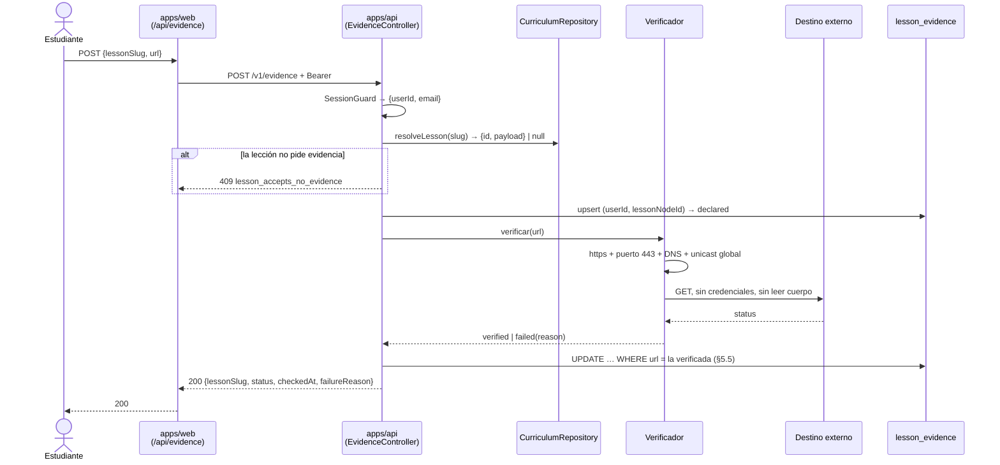
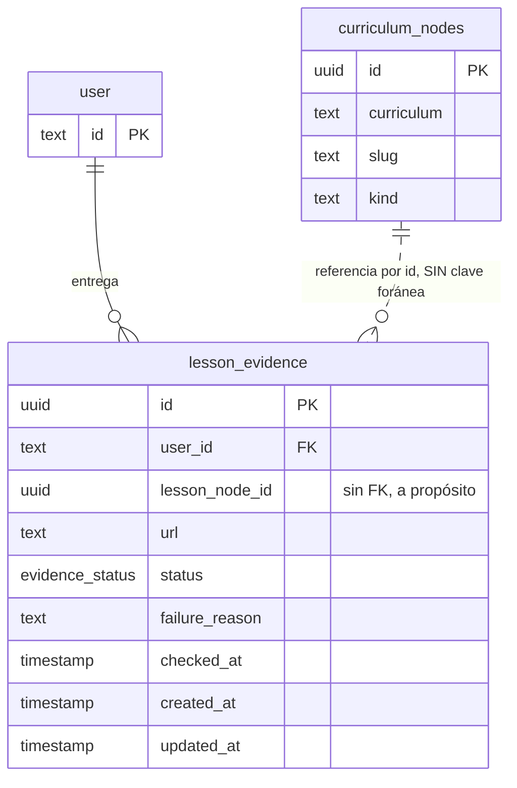
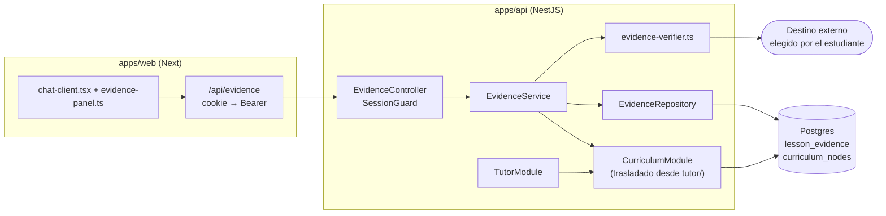

# PRD-007: La evidencia por lección, declarada y verificada

**Status**: Draft
**Date**: 2026-07-31
**Author**: AI-assisted
**Priority**: P1
**Depends on**: PRD-002, PRD-003, PRD-006
**Supersedes**: None
**Issue**: [CON-6](https://linear.app/contextia/issue/CON-6)

## Impacted Projects

| Project | Impact |
|---------|--------|
| **apps-api** | Módulo nuevo `src/evidence/` (controller, service, repository, verificador). Endpoints nuevos `POST /v1/evidence` y `GET /v1/evidence`, ambos tras `SessionGuard`. Se trasladan a `src/curriculum/`, como módulo propio exportado, `src/tutor/curriculum.repository.ts`, su shim `src/tutor/curriculum-context.ts` y `src/tutor/curriculum.repository.spec.ts`; el repositorio gana dos métodos que **sí lanzan** (§ 7.1). Cambian por el traslado `src/tutor/tutor.module.ts`, `src/tutor/tutor.service.ts` y `src/tutor/tutor.service.spec.ts`. Cotas nuevas en `src/throttle.ts` (`EVIDENCE_THROTTLE` y `EVIDENCE_OUTBOUND_THROTTLE`), con el segundo **registrado como throttler con nombre** en `src/app.module.ts` (§ 5.4). `src/config.ts` gana `requiredNumber()` y las variables `EVIDENCE_TIMEOUT_MS` y `EVIDENCE_MAX_REDIRECTS`. |
| shared | Tabla nueva `lesson_evidence` en `src/schema.ts`. Tipo de dominio nuevo `src/evidence.ts`. `src/curriculum-file.ts` gana el soporte de `enum` en `PayloadRule` y dos llaves opcionales en `PAYLOAD_VOCABULARY.lesson` (`evidenceKind`, `evidencePrompt`). `src/curriculum.ts` gana `toEvidenceLessons()`; **`toLessonOptions` no se toca** (§ 6.6). |
| apps-web | Ruta nueva `src/app/api/evidence/route.ts` (proxy, patrón de `api/chat`). `src/lib/api-client.ts` gana `submitEvidence()` y `fetchEvidence()`. `src/lib/evidence-panel.ts` nuevo (las decisiones puras del cliente, testables bajo Node pelado). `src/app/chat-client.tsx` y `src/app/chat/page.tsx` ganan el panel de entrega. Script nuevo `scripts/check-evidence-bridge.ts`, entrada `check:evidence`, **y su paso en `.github/workflows/checks.yml`** (§ 10 paso F). |

---

## 1. Problem Statement

La plataforma es hoy un chat con un muro de pago que no registra nada de lo que hace un estudiante. Lo único parecido a progreso es que el estudiante **declara** su lección en el selector del chat; ese dato viaja en la petición al tutor y se pierde. `registrations.current_lesson` (`packages/shared/src/schema.ts:143`) cuelga de la lista de correos de marketing, no del usuario que inicia sesión, y el commit `f2b6f61` retiró `user.current_lesson` porque nadie la escribía ni la leía — el único campo con forma de progreso murió por no tener estructura alrededor. Esa estructura ya existe desde PRD-002: `curriculum_nodes` es un árbol consultable con identidad estable por nodo. Lo que falta es la otra mitad de la relación.

La consecuencia con precio es el portafolio verificable, que es producto vendido: `apps/web/src/app/page.tsx:439` promete al visitante "No prometemos empleo. Prometemos evidencia", y hoy no se recoge ni una sola pieza de esa evidencia. El evaluador de la defensa H1 abre a mano el repositorio del estudiante antes de cada sesión para elegir qué pieza pedirle explicar. Y nadie puede responder quién se atascó en qué lección, que es exactamente lo que un LMS existe para saber.

El dato que hace esto barato ya está escrito y nadie lo usa. Cada lección declara `payload.outcome` (`packages/shared/src/curriculum-file.ts:100`), y leídos seguidos no son objetivos de aprendizaje sino **artefactos**: L1 "publicas tu web con tu nombre", L5 "tu repositorio con historia de verdad", L7 "tu primera pieza de portafolio, defendida". Buena parte de E1 produce algo que existe en internet y responde a una petición HTTP.

## 2. Goals

1. Registrar, por estudiante y por lección, la evidencia que esa lección pide, con `(usuario, lección)` como llave única — reenviar actualiza la fila, nunca la duplica.
2. Distinguir **declarado** de **verificado** en el esquema, no en la interpretación: solo lo verificado puede alimentar un portafolio, y esa distinción tiene que sobrevivir a una consulta SQL de un tercero. **Ninguna fila puede llevar un veredicto que no corresponda a la URL que guarda** (§ 5.5).
3. Cuando el estudiante entregue una evidencia de tipo comprobable, el sistema comprobará su alcanzabilidad en la misma petición y guardará el resultado.
4. Si la comprobación falla, agota su tiempo o el destino es inalcanzable, el sistema devolverá 200 con `status: "failed"` y la razón — nunca un error HTTP, nunca un bloqueo de avance.
5. Responder por estudiante —qué lecciones entregó, cuáles quedaron verificadas— con una consulta, y por lección —cuántos estudiantes la completaron, el dato de abandono— con otra.
6. Mantener el currículo como única fuente de qué pide cada lección: un curso adoptante cuyas lecciones no declaren evidencia funciona sin cambiar una línea de `src/`.
7. Si la URL entregada resuelve a una dirección fuera del unicast global, o declara un puerto distinto de 443, el sistema rechazará la comprobación antes de abrir la conexión y guardará `status: "failed"`.
8. Si la comprobación falla, el sistema no registrará en ningún log, ni emitirá a ninguna analítica, la URL, el host ni la dirección resuelta.

## 3. Non-Goals

- **La página pública del portafolio.** Este PRD recoge y verifica; publicar es otro trabajo.
- **Certificaciones y defensas (H1–H4).** Son síncronas y humanas.
- **Gamificación de cualquier tipo**: insignias, puntos, tablas de clasificación, rachas.
- **Notificaciones y recordatorios.**
- **Panel de administración.** El criterio de aceptación "cuántos estudiantes completaron la lección Y" se satisface con el modelo de datos y su índice (§ 6.2), consultable por SQL. Una superficie HTTP para el operador llegaría antes de que exista el dato.
- **Verificación de contenido.** Se comprueba que el destino responde, no lo que dice. El cuerpo de la respuesta **nunca se lee** (§ Design Decisions D4). "Una página con su nombre" y "un repositorio con más de un commit" exigen leer contenido o hablar con la API de GitHub —token, cuota, un tipo de fallo nuevo— y son un PRD posterior. La alcanzabilidad ya cubre el artefacto de L1 (una web publicada), L5 (un repositorio público que existe) y L7.
- **Reverificación periódica.** Una URL que muera después de verificarse conserva su `verified`. Cambiarlo exige el barrido del worker, que se descartó en § Design Decisions D2.
- **Progreso por consumo.** Nada de porcentaje de vídeo visto, lecciones "vistas" ni rachas. Si la métrica se puede subir sin aprender nada, es la métrica equivocada.
- **Migrar `registrations.current_lesson`.** Es la lección declarada por un correo de marketing, no por un usuario autenticado; queda donde está.
- **Cerrar el DNS rebinding residual** (§ 8.2). Exige un `Agent` de undici con `connect.lookup` propio, y por tanto declarar `undici` como dependencia directa para usar una API que Node no reexporta. La decisión y su alcance real están escritos en § 8.2.

## 4. User Flows / Design



### 4.1 Happy path

1. El estudiante abre `/chat`. `chat/page.tsx` ya carga las lecciones; a partir de aquí usa `toEvidenceLessons()` (§ 6.6) en vez de `toLessonOptions()`, de modo que cada opción arrastra `evidenceKind` y `evidencePrompt`. `/registro` sigue usando `toLessonOptions()` y no cambia.
2. `chat-client.tsx` pide `GET /api/evidence` al montar. La lección sin `evidenceKind` no pinta panel.
3. El estudiante pega la URL de su artefacto y envía. El control de envío queda deshabilitado mientras hay una comprobación en vuelo (§ 4.3).
4. `apps/web` reenvía a `POST /v1/evidence` con el Bearer de sesión, sin la cabecera `Cookie` (§ 8.2).
5. `apps/api` resuelve el `lessonSlug`, escribe la fila en `declared`, verifica, y actualiza a `verified` o `failed` **condicionado a que la URL siga siendo la que verificó** (§ 5.5).
6. La respuesta es 200 con el estado resultante. El cliente repinta y lo anuncia (§ 4.3).

### 4.2 Error branches

| Situación | `failureReason` | Qué pasa |
|---|---|---|
| El destino responde 4xx/5xx | `http_<código>` | 200, `status: "failed"`. |
| El destino responde 3xx terminal (agotados los saltos) | `too_many_redirects` | 200, `failed`. Un 3xx **nunca** es `verified`. |
| 3xx sin cabecera `Location` | `malformed_redirect` | 200, `failed`. Nunca una excepción. |
| `Location` que no parsea contra el salto actual | `malformed_redirect` | 200, `failed`. |
| Un salto sale de `https:` o cambia de puerto | `insecure_redirect` | 200, `failed`. |
| Un salto resuelve fuera del unicast global | `blocked_address` | 200, `failed`. |
| Conexión rechazada, TLS fallido, red caída | `network` | 200, `failed`. **Es el resultado más probable** de pegar la URL de algo aún sin desplegar. |
| DNS no resuelve | `dns` | 200, `failed`. |
| Se agota el presupuesto total (DNS + saltos) | `timeout` | 200, `failed`. |
| La URL declara un puerto ≠ 443 | — | 400 del `ValidationPipe`. |
| La URL no es `https:` o no parsea | — | 400. No se escribe fila: es entrada malformada, no una comprobación fallida. |
| El `lessonSlug` no existe en el currículo | — | 404 `lesson_not_found`. |
| La lección existe y no declara `evidenceKind` | — | 409 `lesson_accepts_no_evidence`. |
| El currículo no se puede leer | — | 503 `curriculum_unavailable` (§ 7.1). |
| `apps/api` no responde | — | El proxy devuelve 503 y el panel muestra que no se pudo guardar. El chat sigue funcionando. |

**La verificación nunca bloquea.** Un `failed` es un estado de la fila, no un error de la petición: la entrega quedó registrada, el estudiante puede seguir, mandar mensajes al tutor y reenviar cuando quiera. Un principiante con la URL mal escrita no se queda encerrado.

### 4.3 Lo que se pinta

Esta subsección es normativa, no decorativa: el único precedente de fallo asíncrono del repositorio es la caja roja `role="alert"` de `chat-client.tsx:241-245`, y copiarla aquí convertiría una comprobación fallida en lo que el goal 4 prohíbe.

| Estado | Tratamiento |
|---|---|
| Lección sin `evidenceKind` | No hay panel. |
| Sin entrega | El `evidencePrompt` del currículo, un campo de URL y el botón. |
| `declared` | La URL guardada, sin adorno de éxito ni de fallo. |
| `verified` | Marca afirmativa junto a la URL. |
| `failed` | **Tratamiento neutro, no de error**: la URL guardada más una línea accionable —"no pudimos comprobar esa URL; revísala y reenvía cuando quieras"—, visualmente distinta de la caja de error del tutor. Nunca rojo de alerta, nunca `role="alert"`, nunca la palabra "error". El estado es de la comprobación, no del estudiante. |
| Comprobación en vuelo | El control de envío deshabilitado, mismo patrón `busy` que `chat-client.tsx:272,:280`. Es el guarda de doble envío: el viaje dura hasta `EVIDENCE_BRIDGE_TIMEOUT_MS`. |
| `GET` de montaje en vuelo | El panel no se pinta todavía. No hay esqueleto: aparecer y saltar es peor que aparecer una vez. |
| `GET` de montaje fallido | El panel se pinta en estado "sin entrega", con una línea que dice que no se pudo leer el estado anterior. **Nunca bloquea la entrega**: reenviar es idempotente, así que el peor caso es que el estudiante reenvíe algo que ya estaba. |

**Accesibilidad.** El campo de URL lleva etiqueta asociada. El cambio de estado se anuncia por `role="status"` (`aria-live="polite"`), **no** por `role="alert"` — que es lo que usa el error del tutor y lo que arrastra la lectura de castigo. Mismo patrón que el aviso de "el tutor está escribiendo" en `chat-client.tsx:235-237`.

**Por qué el `GET` es del cliente y no del Server Component.** `chat/page.tsx` ya hace dos lecturas y una llamada a `apps/api` antes de pintar. `apps/api` lee el currículo **sin caché** (`apps/api/docs/SYSTEM_ARTIFACT.md:251`), así que una tercera llamada en el camino crítico añadiría un `SELECT` completo de `curriculum_nodes` al render de todo el chat. El estado de evidencia cambia con cada entrega, mientras que el árbol de lecciones cambia una vez por temporada: no comparten cadencia de caché y no deben compartir camino de carga.

## 5. API

Los dos endpoints van tras `SessionGuard`, la única puerta de identidad del servicio. **`userId` sale del token y de ningún otro sitio**: ningún handler declara un parámetro que pueda cargar identidad.

### 5.1 `POST /v1/evidence`

**Auth**: Bearer (JWT de sesión de Auth.js, verificado por `SessionGuard`).
**Cota**: `EVIDENCE_THROTTLE` — 5/min por credencial, más el tope global de salida (§ 5.4).

El handler declara `@HttpCode(HttpStatus.OK)`. Sin él Nest responde **201** a un `@Post()`, que es lo que ya mordió a `access.controller.ts:65` y `tutor.controller.ts:46`.

**Request**:

```json
{ "lessonSlug": "L1", "url": "https://ana.github.io/mi-web" }
```

`EvidenceDto` con `class-validator`, bajo el `ValidationPipe` global (`whitelist: true, forbidNonWhitelisted: true`): un campo de más es 400, no un campo ignorado.

| Campo | Regla |
|---|---|
| `lessonSlug` | `@IsString()` + `@Matches(SLUG_PATTERN)` — el mismo `/^[A-Za-z0-9_-]{1,64}$/` de `curriculum-file.ts:122`. |
| `url` | `@IsString()` + `@MaxLength(2048)` + un validador propio, **no `@IsUrl()` a secas**. |

**Por qué un validador propio.** Los defectos de `@IsUrl()` incluyen `require_tld: true`, así que `https://localhost/` muere en el pipe con un 400 y nunca llega al control de rango — un comportamiento correcto por accidente y por la razón equivocada. El validador de este DTO es explícito y comprueba, sobre `new URL(value)`: esquema `https:`, `port` vacío o `"443"`, y un host no vacío **con al menos un punto salvo que `net.isIP()` sea cierto**.

**El host se deriva exactamente como en § 8.2: `new URL(value).hostname` con el `[` inicial y el `]` final quitados**, y *después* se aplican `net.isIP()` y la exigencia del punto. No es un detalle de estilo. `URL.hostname` **conserva los corchetes** de un literal IPv6 —`new URL("https://[::1]/").hostname` es `"[::1]"`—, así que `net.isIP()` sobre ese valor devuelve `0` y el host no tiene ningún punto: sin quitarlos, esta regla daría **400 a todo literal IPv6**, contradiciendo la fila 5 de § 9 y el paso 4 de § 10. Quien se encuentre esa fila roja tiene dos salidas y la tentadora es la mala: relajar la exigencia del punto reabre el fail-open de la lista `search` que esa exigencia existe para cerrar. La salida correcta es quitar los corchetes, y por eso está escrito aquí y no sólo en § 8.2. (El parser WHATWG borra el puerto por defecto del esquema, así que `new URL("https://x:443/").port` es `""` y la rama del `"443"` literal no se alcanza. Se deja escrita como red de seguridad, no como comparación muerta que alguien deba "arreglar" relajándola.)

**La exigencia de FQDN es un control de seguridad, no higiene.** Desde que el cribado usa c-ares (§ 8.2 control 3) y la conexión sigue usando `getaddrinfo`, las dos mitades son pilas **distintas**, no sólo momentos distintos. Difieren en la lista `search` de `resolv.conf`: `getaddrinfo` la aplica a los nombres con menos puntos que `ndots`, y c-ares consulta el nombre tal cual. En un contenedor con dominio de búsqueda interno —`*.railway.internal`, o cualquier montaje tipo Kubernetes— un host de una sola etiqueta que resuelve públicamente se criba contra la dirección pública y **se conecta a la interna**. Es fail-open, y lo introduce el cambio a `Resolver`: con `lookup` en las dos mitades, el cribado habría visto la dirección interna. Ningún estudiante publica en un host sin puntos, así que exigir uno cierra la clase entera sin coste. Que un literal IP sea aceptable **es deliberado**: el control de destino es el rango resuelto (§ 8.2), no la forma del host.

**`@IsString()` va primero y el validador propio no puede lanzar.** `new URL(123)` lanza `TypeError`, y class-validator no envuelve las restricciones personalizadas síncronas: un `{"url": 123}` sería un **500** donde esta sección promete 400. El orden de decoradores es el idiom que `turn.dto.ts:37` ya usa —`@IsString()` antes de `@Length`— y el cuerpo del validador **devuelve `false`** ante un valor que no parsea, nunca propaga la excepción.

**Response 200**:

```json
{
  "lessonSlug": "L1",
  "status": "verified",
  "checkedAt": "2026-07-31T18:22:41.000Z",
  "failureReason": null
}
```

**Errors**: el cuerpo de error es un **objeto**, no una cadena — `AllExceptionsFilter:84-87` devuelve `exception.getResponse()` tal cual, y `tutor.service.ts:91-94` ya documenta por qué la forma de objeto es la correcta aquí. El panel tiene que distinguir "esta lección no pide evidencia" de "esa lección no existe".

```json
{ "error": "lesson_accepts_no_evidence" }
```

| Status | `error` | Reason |
|--------|---------|--------|
| 400 | (del `ValidationPipe`) | Cuerpo malformado, `url` no https, puerto ≠ 443, `lessonSlug` fuera de patrón, campo no declarado. |
| 401 | — | Sin token, token inválido o sin claims (`SessionGuard`). |
| 404 | `lesson_not_found` | El slug no resuelve **a un nodo `lesson`** del currículo configurado. El slug de una etapa o un módulo cae aquí, no en el 409 (§ 7.1). |
| 409 | `lesson_accepts_no_evidence` | La lección existe y no declara `evidenceKind`. |
| 429 | — | Cota agotada (§ 5.4). |
| 503 | `curriculum_unavailable` | No se pudo leer el currículo (§ 7.1). |

### 5.2 `GET /v1/evidence`

**Auth**: Bearer. **Cota**: la global de 120/min — el decorador `@Throttle` va en el **handler** del `POST`, no en la clase. Aplicarlo a la clase, que es lo que hace el único precedente (`tutor.controller.ts:34-37`), daría a este `GET` los 5/min de las escrituras.

Devuelve las filas **del propio estudiante**. Sin `@Query()`, sin `@Param()`: no hay forma de pedir las de otro.

**Response 200**:

```json
{
  "items": [
    { "lessonSlug": "L1", "url": "https://ana.github.io/mi-web", "status": "verified", "checkedAt": "2026-07-31T18:22:41.000Z", "failureReason": null },
    { "lessonSlug": "L3", "url": "https://github.com/ana/reto-3", "status": "failed", "checkedAt": "2026-07-31T18:30:02.000Z", "failureReason": "http_404" }
  ]
}
```

`lessonSlug` se resuelve al leer, desde `lessonNodeId`, con `slugsByNodeId()` (§ 7.1). Una fila cuyo nodo ya no exista en el currículo se **omite** de la respuesta y **no se borra** (§ 6.3).

**Errors**: 401, 429, y 503 `curriculum_unavailable`.

### 5.3 El proxy de `apps/web`

`src/app/api/evidence/route.ts` exporta `POST` y `GET` con el patrón de `api/chat/route.ts`: `auth()` primero para no gastar un salto de red, `readSessionToken()`, y reenvío con `Authorization: Bearer` **construyendo** las cabeceras — nunca esparciendo las entrantes, que arrastraría la `Cookie` (precedencia sobre el Bearer dentro de `getToken()`) y el `X-Forwarded-For` del cliente hacia un servicio con `trust proxy` puesto.

Aquí **no hay streaming**: la respuesta es JSON acotado, así que el bridge usa `AbortSignal.timeout(EVIDENCE_BRIDGE_TIMEOUT_MS)` como `fetchAccess()` y no el `AbortController` + `clearTimeout` que `streamTutorTurn()` necesita — ese baile existe sólo porque abortar un `fetch` después de la primera cabecera rompe el cuerpo a media lectura, y aquí no hay cuerpo que romper.

Las decisiones puras del cliente (mapear status → texto, decidir el estado del panel) viven en `src/lib/evidence-panel.ts` y no dentro del componente, por lo mismo que `tutor-turn.ts`: este repositorio no tiene runner de componentes React, y allí sí se pueden probar bajo Node pelado.

### 5.4 Cotas y tiempos

| Constante | Valor | Dónde | Razón |
|---|---|---|---|
| `EVIDENCE_THROTTLE` | 5/min por credencial | `apps/api/src/throttle.ts` | Holgado para una persona entregando; corta el bucle. |
| `EVIDENCE_OUTBOUND_THROTTLE` | 60/min **global**, sin discriminar credencial | `apps/api/src/throttle.ts` + registro en `app.module.ts` | **El anterior no es un techo.** `BridgeThrottlerGuard:41-44` clava el cubo en `sha256(authorization)`, y el login es magic-link con sesión JWT: un buzón firmado N veces son N tokens válidos y N cubos, sin coste (el trial es gratis). El eje global es el único que sobrevive a la rotación de credenciales, y a diferencia de un cubo por IP no hereda el problema de origen compartido que `bridge-throttler.guard.ts` existe para resolver. Ver abajo: **no basta con declararlo**. |
| `EVIDENCE_TIMEOUT_MS` | 3000, obligatoria y validada | `apps/api/src/config.ts` | **Presupuesto total de la comprobación**: DNS y saltos incluidos, medido contra un instante fijado una vez antes del bucle (§ 8.2). |
| `EVIDENCE_MAX_REDIRECTS` | 3, obligatoria y validada | `apps/api/src/config.ts` | `http→https`, `apex→www` y un dominio propio encadenan hasta tres en GitHub Pages. |
| `EVIDENCE_BRIDGE_TIMEOUT_MS` | 6000 | `apps/web/src/lib/api-client.ts` | Por encima del presupuesto total, con margen para el salto de red y las dos escrituras. El margen **sólo es cierto si el presupuesto se respeta también durante el DNS** — ver § 8.2. |

**El eje global necesita tres campos, y omitir cualquiera de ellos falla en silencio.** No basta con declarar la constante junto a sus dos hermanas: ésas son opciones de ruta aplicadas con `@Throttle`, y un cubo global no tiene esa forma. Se registra en `ThrottlerModule.forRoot` de `app.module.ts` con:

```ts
export const EVIDENCE_OUTBOUND_THROTTLE: ThrottlerOptions = {
  name: "evidence-outbound",
  ttl: MINUTE_MS,
  limit: 60,
  getTracker: () => "global",                    // sin esto: cubo por credencial, inerte
  skipIf: (ctx) => ctx.getClass().name !== "EvidenceController", // sin esto: acota el servicio entero
};
```

**El `skipIf` compara por nombre, o se declara en `app.module.ts`, y no es estilo.** `ctx.getClass() !== EvidenceController` obligaría a `throttle.ts` a importar el controlador, mientras el controlador importa `EVIDENCE_THROTTLE` de `throttle.ts` — un ciclo. `throttle.ts` hoy no tiene un solo import en tiempo de ejecución, y si se evalúa primero, el decorador `@Throttle` del controlador lee una vinculación todavía en TDZ: `ReferenceError` al arrancar. Es ruidoso, no silencioso, pero el atajo natural bajo presión es borrar el `skipIf` — que es justo el modo de fallo que deja el servicio entero acotado a 60/min. La alternativa igual de válida es poner el `skipIf` en el sitio del registro, `app.module.ts`, que ya importa los módulos.

Los tres modos de fallo, todos silenciosos:

- **Sin `skipIf`**, el guard evalúa **todos** los throttlers registrados en **cada** petición, así que el tope de 60/min alcanza al turno del tutor, a `/v1/access` y al webhook de Paddle — al que `WEBHOOK_THROTTLE` provisiona a 600/min a propósito. Un control de seguridad que tumba el producto.
- **Sin `getTracker`** propio, la precedencia del guard es `routeOrClass || namedThrottler.getTracker || commonOptions.getTracker`, y el `override` de `BridgeThrottlerGuard` entra por `commonOptions`, o sea el último: el cubo "global" acabaría clavado en el hash de credencial otra vez, detrás del de 5/min, y no podría dispararse nunca.
- **Sin el registro en `forRoot`**, una clave nueva en el decorador **no sobrescribe nada** y el endpoint se queda con la cota por defecto — la trampa que `tutor.controller.ts:29-33` ya dejó anotada.

Una cota que no acota es indistinguible de una que funciona, y por eso el mecanismo está aquí y no a criterio del implementador. Las filas 45 y 46 de § 9 lo detectan por los dos lados: que el tope global corta la rotación de credenciales, y que **otra ruta sigue alcanzando su propio límite** con el tope registrado.

`config.ts` gana `requiredNumber(env, key)`, que lanza `ConfigError` si el valor no es un número finito y positivo. Hoy el único campo numérico es `port: Number(env.PORT ?? 3001)`, sin validar. Sin este helper, `EVIDENCE_TIMEOUT_MS=3s` da `NaN`, `AbortSignal.timeout` lo coacciona a `0`, **toda** comprobación aborta al instante y devuelve `failed`/`timeout` con **HTTP 200** por el goal 4: la función queda rota entera y nada se pone rojo.

### 5.5 La segunda escritura es condicional

El upsert garantiza *una fila*; no garantiza una *coherente*. Dos entregas solapadas sobre la misma lección se intercalan así: A escribe `url=X` → B escribe `url=Y` → vuelve el verificador de A y estampa su veredicto sobre la fila que ya lleva `Y`. El resultado es una fila `verified` para una URL que nadie verificó, que es exactamente lo que el goal 2 prohíbe. No hace falta un segundo usuario: reenviar durante los 3 s de comprobación lo produce.

La segunda escritura es por tanto un compare-and-set sobre la URL:

```sql
UPDATE lesson_evidence
   SET status = $4, checked_at = now(), failure_reason = $5, updated_at = now()
 WHERE user_id = $1 AND lesson_node_id = $2 AND url = $3
 -- $3 = la URL TAL COMO SE GUARDÓ, nunca el destino final de la cadena de redirecciones
```

**`$3` es la URL entregada, y confundirla con el destino final rompe el camino feliz de L1.** El verificador recorre hasta `EVIDENCE_MAX_REDIRECTS` saltos (§ 8.2 control 5), así que al terminar tiene dos URLs en la mano: la que el estudiante entregó y la que de verdad contestó. Si el CAS compara contra la segunda, **no casa ninguna fila en todo destino que redirija**, el veredicto se descarta por el camino de abajo y la fila se queda en `declared` para siempre — con 200 y sin error en ningún sitio. Y `apex→www` de GitHub Pages es precisamente la razón por la que `EVIDENCE_MAX_REDIRECTS` es 3 (§ 5.4), y GitHub Pages es el artefacto de L1: la primera lección del curso nunca llegaría a `verified`. El destino final no se guarda en ninguna columna; sólo la URL entregada existe en la tabla.

Cero filas afectadas significa que una entrega posterior ganó: **se descarta el veredicto** y se devuelve la fila **releída con un `SELECT`** — no la que devolvió el upsert inicial, que ya es obsoleta. Un `RETURNING` sobre cero filas no devuelve nada, así que sin esa relectura el camino de descarte no tiene qué responder. El idiom ya existe en el repositorio — `updateStatusIfUnchanged` (`apps/api/src/access/subscriptions.repository.ts:169-181`), que PRD-004 introdujo para una ventana de lectura-escritura estructuralmente idéntica.

## 6. Data Model



### 6.1 `lesson_evidence` (nueva)

| Columna | Tipo | Nulo | Defecto | Descripción |
|---|---|---|---|---|
| `id` | `uuid` | no | `defaultRandom()` | Clave primaria. |
| `user_id` | `text` | no | — | → `user.id`, `onDelete: "cascade"`. Una baja se lleva su evidencia. |
| `lesson_node_id` | `uuid` | no | — | El `id` del nodo `lesson` de `curriculum_nodes`. **Sin clave foránea** (§ 6.3). |
| `url` | `text` | no | — | La URL entregada. `CHECK (url LIKE 'https://%')`. |
| `status` | `evidence_status` | no | `'declared'` | Enum `('declared','verified','failed')`. |
| `failure_reason` | `text` | sí | `null` | Código de la lista cerrada de § 4.2, nunca prosa del destino (§ 8.5). |
| `checked_at` | `timestamp … { mode: "date" }` | sí | `null` | Cuándo terminó el último intento. |
| `created_at` | `timestamp … { mode: "date" }` | no | `defaultNow()` | Primera entrega de esta lección. |
| `updated_at` | `timestamp … { mode: "date" }` | no | `defaultNow()` | Última reentrega. |

**`{ mode: "date" }` no es decorativo.** El defecto de Drizzle es modo cadena, que devuelve `2026-07-31 18:22:41` — ni un `Date` ni el literal ISO que § 5.1 muestra. Todas las columnas de fecha del esquema ya lo declaran (`schema.ts:113-114`, `:132-133`, `:173-174`).

**Restricciones e índices:**

- `unique("lesson_evidence_user_lesson_key").on(user_id, lesson_node_id)`. Su índice btree lleva `user_id` de primera columna, así que **también sirve** `GET /v1/evidence` — no hay un índice adicional por `user_id`, que sería un escritura más por fila a cambio de nada.
- `index("lesson_evidence_lesson_status_idx").on(lesson_node_id, status)` — el dato de abandono por lección.
- `CHECK (url LIKE 'https://%')` — la invariante "todo lo guardado es https" pasa a ser estructural y no sólo del DTO. Importa el día que la página pública del portafolio renderice estas filas entre usuarios.

**El `ON CONFLICT DO UPDATE` nombra su `set` explícitamente**, como `load-curriculum.ts:335-350` y `subscriptions.repository.ts:127-131`:

```
set: { url, status: 'declared', checkedAt: null, failureReason: null, updatedAt: now() }
```

`created_at` **no aparece** (la fila conserva su primera entrega). `updated_at` **sí** (no hay `$onUpdate` en el esquema, así que sin nombrarlo conservaría el valor de inserción). `status`/`checked_at`/`failure_reason` se reinician: una URL nueva no puede heredar el veredicto de la anterior.

### 6.2 Las dos preguntas que el modelo tiene que poder responder

| Pregunta | Consulta | Índice |
|---|---|---|
| Qué lecciones entregó el estudiante X, y cuáles verificadas | `WHERE user_id = $1` | `lesson_evidence_user_lesson_key` |
| Cuántos estudiantes completaron la lección Y | `WHERE lesson_node_id = $1 GROUP BY status` | `lesson_evidence_lesson_status_idx` |

"En cuál está" es la última lección con fila en orden de recorrido del bosque. No es una columna: derivarla evita un campo que se desincroniza, que es cómo murió `user.current_lesson`. El orden sale del recorrido, no de un campo — `buildForest` consume `position` al ordenar y no lo copia al nodo (`curriculum-file.ts:487-499`).

### 6.3 Por qué `lesson_node_id` no lleva clave foránea

`scripts/load-curriculum.ts` **no reescribe la tabla entera**: hace upsert por `id` (`:321-351`) y sólo borra los ids ausentes del archivo (`:357-369`), y ese borrado exige `--allow-deletes` explícito (`authorize()`, `:176-184`). Una recarga ordinaria, por tanto, no dispararía ninguna cascada. La elección real no es "sin FK contra cascada" sino **"sin FK contra `ON DELETE NO ACTION`"**, y es sobre eso que se decide.

Se elige **sin clave foránea**. Retirar una lección es una edición de temario, y una edición de temario no debería poder fallar por el trabajo que veinte estudiantes ya hicieron, ni poder destruirlo. Con `NO ACTION` la retirada aborta la transacción del cargador y el decano se topa con un error que no puede resolver sin ayuda de alguien con acceso a la base. Sin la clave, el borrado del nodo funciona, las filas de evidencia sobreviven, `GET` las omite mientras el nodo no resuelva, y **vuelven solas si el nodo regresa** — porque el `id` es identidad estable y sobrevive a recargas, reordenamientos y renombrados de `slug` (`packages/shared/docs/SYSTEM_ARTIFACT.md:114`). El trabajo del estudiante existió; el temario cambió. Ninguna consulta las borra.

Guardar `lessonSlug` en vez del `id` tendría el problema opuesto: el `slug` es **mutable** por contrato, así que un renombrado en el archivo desconectaría en silencio toda la evidencia de esa lección.

**Consecuencia que hay que arreglar en el mismo corte.** `load-curriculum.ts:178-181` le dice hoy al operador que borrar un nodo se lleva *"en cuanto exista el seguimiento de progreso, el progreso del estudiante por cascada"*. Este PRD hace falsa esa frase. Se reescribe en el paso B de § 10 para que diga lo que va a ser cierto: la evidencia sobrevive y deja de mostrarse.

### 6.4 El currículo declara qué pide cada lección

Dos llaves opcionales nuevas en `PAYLOAD_VOCABULARY.lesson` (`curriculum-file.ts:99`):

| Llave | Tipo | Obligatoria | `modelBound` | Qué es |
|---|---|---|---|---|
| `evidenceKind` | `string`, `enum: ["url"]` | no | no | Qué comprobación admite. Su ausencia es "esta lección no pide evidencia". |
| `evidencePrompt` | `string` | no | no | Lo que se le muestra al estudiante. |

Ninguna es `modelBound`: no viajan al bloque de system del tutor. Sí quedan bajo `walkStrings` + `checkUrlSafety`, que aplica a **todo** valor del payload a cualquier profundidad, así que un `evidencePrompt` con un enlace hostil muere en el validador y en la puerta del PR.

`PayloadRule` gana `enum?: string[]`, comprobado **sólo cuando `rule.type === "string"`** — de lo contrario `{ type: "number", enum: ["url"] }` sería representable e inerte. `checkPayload` sale temprano para una llave opcional ausente (`curriculum-file.ts:353-357`) antes del control de tipo, así que la comprobación de enum es alcanzable y bien definida exactamente donde hace falta. Es lo que hace que `evidenceKind: "repo"` —el tipo que este PRD no implementa— falle en el archivo en vez de degradar en silencio en producción.

**Una lección sin `evidenceKind` funciona igual que hoy.** Un currículo adoptante que no declare la llave en ninguna lección usa el sistema entero sin tocar `src/`.

### 6.5 Migración de esquema

Un archivo nuevo de `drizzle-kit generate` (el quinto de `drizzle/`): `CREATE TYPE evidence_status`, `CREATE TABLE lesson_evidence`, el `CHECK`, el índice y la restricción única.

**Sin backfill**: no hay dato previo — es el punto de partida del issue.

**La reversión borra también el registro de la migración.** `drizzle-kit migrate` anota lo aplicado en `drizzle.__drizzle_migrations`; un `DROP TABLE` que no borre esa fila deja el archivo marcado como aplicado, y un redespliegue posterior lo salta y arranca el servicio contra una tabla que no existe. La reversión es `DROP TABLE` + `DROP TYPE` + `DELETE` de su fila en `__drizzle_migrations`.

### 6.6 `toLessonOptions` no se toca

`toLessonOptions` lo llaman **dos** páginas: `chat/page.tsx:42` y `registro/page.tsx:19`, y la segunda es **pública y sin login**. Ensancharlo publicaría `evidencePrompt` a un visitante anónimo y rompería la invariante que `packages/shared/docs/SYSTEM_ARTIFACT.md:122` declara —*"al cliente solo viajan `{slug, title}`"*— junto con el guard que la hace real, `check-curriculum-golden.ts:97-99`.

Se añade en su lugar `toEvidenceLessons(lessons): EvidenceLesson[]`, que devuelve `{slug, title, evidenceKind?, evidencePrompt?}` y la usa **sólo** `/chat`. `LessonOption` sigue siendo `Pick<CurriculumNode, "slug" | "title">`, el guard del golden sigue en pie sin tocar una línea, y `/registro` no cambia.

## 7. Architecture

El dominio vive entero en `apps/api`, como manda ADR-001 y como ya hacen acceso (PRD-003) y tutor (PRD-005). `apps/web` no gana lógica: gana un proxy y una superficie.



### 7.1 El seam del currículo se traslada y gana métodos que lanzan

`CurriculumRepository` vive hoy en `apps/api/src/tutor/curriculum.repository.ts` y `TutorModule` lo declara **sin `exports:`**, así que es invisible fuera de ese módulo: importar `TutorModule` no da nada, y redeclarar el provider da dos instancias. Se traslada a `apps/api/src/curriculum/` como `CurriculumModule` propio que lo exporta, y `TutorModule` pasa a importarlo. Es un movimiento de archivo, y por eso está en § 10 y en la tabla de Impacted Projects.

Su método actual `lessonContext(slug?)` **nunca lanza**: por invariante documentada (`curriculum.repository.ts:19-21`), un slug inexistente, un currículo sin cargar y un fallo de Postgres devuelven el mismo par vacío. Es correcto para el tutor —un 500 ahí tumbaría el turno por no poder decorarlo— y **es inservible aquí**: § 5.1 necesita distinguir 404 de 503. Ese contrato se queda como está, atado al turno del tutor, y no se hereda.

Los dos métodos nuevos que consume `EvidenceService`:

| Método | Devuelve | Contrato |
|---|---|---|
| `resolveLesson(slug)` | `{ id, payload } \| null` | Casa **sólo nodos con `kind === "lesson"`**. `null` es "no existe" → 404. **Lanza** si la consulta falla → 503. |
| `slugsByNodeId(ids)` | `Map<uuid, string>` | Ids ausentes del mapa son nodos retirados → se omiten (§ 5.2). **Lanza** si la consulta falla. |

**El filtro por `kind` no es cosmético.** `PAYLOAD_VOCABULARY` está indexado por `kind` y `checkPayload` sólo recorre el vocabulario de ese kind (`curriculum-file.ts:349`), así que un `evidenceKind` colgado de un nodo `stage` o `module` **nunca pasa por el control de enum**: `{"kind":"stage","payload":{"evidenceKind":"repo"}}` parsea limpio. Un `resolveLesson` que casara sólo por slug aceptaría ese nodo y guardaría el id de una etapa en `lesson_node_id`, para un tipo de evidencia que este PRD no implementa. Además el 409 se dispararía donde toca un 404: el slug de una etapa contestaría "esta lección no pide evidencia" en vez de "no existe".

`apps/api/src/tutor/curriculum-context.ts` **se traslada con el repositorio**. Es el shim que reexporta `buildForest`, `lessonContextInputs` y `buildLessonContext` desde `packages/shared`, y `curriculum.repository.ts:39` lo importa. Mover sólo el repositorio dejaría ese import como `../tutor/curriculum-context.ts` — `curriculum/` alcanzando `tutor/`, la flecha contraria a la del diagrama de § 7. Trasladándolo, `tutor.service.ts:37` y `tutor.service.spec.ts:22` pasan a importar de `../curriculum/curriculum-context.ts`, que es `TutorModule → CurriculumModule` y coincide con el diagrama. Las tres funciones siguen viajando juntas, como argumenta la cabecera del propio shim, y `CODEOWNERS` protege `packages/shared/src/curriculum-context.ts`, no este archivo, así que el traslado no huérfana ninguna regla.

El error que lanzan es propio de `apps/api`. **No se reutiliza `CurriculumNotLoadedError`**: vive en `packages/shared/src/curriculum.ts:27`, cuyo ámbito de módulo importa `./db.ts` y construye un `Pool` al cargar — `apps/api/src/tutor/curriculum-context.ts:16-20` existe precisamente porque importarlo abriría un tercer pool de Postgres dentro de este proceso.

`evidence-verifier.ts` se separa del servicio por la costura que `api-client.ts` usa en `apps/web`: recibe la URL y la configuración como argumentos y no lee `process.env` por dentro, de modo que las filas de § 9 que lo ejercitan corren sin levantar el módulo de Nest. **El resolutor viaja por la misma costura**, inyectado como argumento igual que la configuración: cinco filas de § 9 (16, 17, 18, 26 y 27) necesitan respuestas guionizadas **por familia**, y sin esa inyección la única salida es parchear `dns.promises` en caliente.

**Nota sobre "el bosque".** `apps/api` lee el currículo **sin caché** (`apps/api/docs/SYSTEM_ARTIFACT.md:251`): cada resolución es un `SELECT` sobre `curriculum_nodes` más un `buildForest`. Está acotado (`MAX_NODES = 500`) y es aceptable, pero no hay ninguna estructura residente.

## 8. Security

### 8.1 Autenticación y autorización

`SessionGuard` es la única puerta. El control de "un estudiante no puede tocar la evidencia de otro" es **estructural, no una comprobación**: `POST` declara `@Body() dto` con exactamente dos campos bajo `forbidNonWhitelisted`, así que un `userId` en el cuerpo es 400; `GET` no declara `@Query()` ni `@Param()`. El `user_id` de toda escritura y lectura sale de `request.user`.

`curriculum` **nunca sale del request**: se resuelve desde la configuración de servidor. Aceptarlo del cliente daría lectura cruzada entre currículos en cuanto exista un segundo (PRD-002 § 8.5).

### 8.2 SSRF — la superficie nueva de este PRD

**Es el único punto del sistema donde una entrada del estudiante decide a dónde abre una conexión el servidor.**

**El host que se comprueba es exactamente el que se resuelve y al que se conecta**: `new URL(u).hostname`, con los corchetes de un literal IPv6 quitados. No un regex, no `split("/")`, no lo que dejó el validador. Anclarlo al parser WHATWG cierra tres casos sin escribir nada: `https://2130706433/` normaliza a `127.0.0.1`, `https://0x7f.0.0.1/` a `127.0.0.1`, y `https://evil.example.com@169.254.169.254/` deja `hostname = 169.254.169.254` descartando el userinfo. Derivar el host de cualquier otra forma reabre los tres.

Controles, en orden:

1. **Esquema y puerto.** Sólo `https:`, y sólo el 443 (`port` vacío o `"443"`). En el DTO **y otra vez en cada salto**: un `Location` que cambia únicamente el puerto sería un bypass gratuito de un control que sólo viviera en el DTO. Todo destino que el producto nombra —GitHub Pages para L1, `github.com` para L5— es 443.
2. **Rango, por allowlist y no por denylist.** Se acepta **sólo** unicast global:
   - IPv6: `2000::/3`, menos `2001::/23` (asignaciones de protocolo IETF: Teredo, ORCHIDv2, BMWG…), `2002::/16` (6to4) y `2001:db8::/32`. Esa única regla excluye `::`, `::1`, `fc00::/7`, `fe80::/10`, `ff00::/8`, `64:ff9b::/96` (NAT64), `100::/64` y `::ffff:0:0/96` **sin enumerar ninguna**. Se excluye `2001::/23` y no `2001::/32` porque el bloque ancho barre de una vez toda futura asignación de protocolo, sin coste.
   - IPv4: `1.0.0.0`–`223.255.255.255`, menos `10/8`, `100.64/10`, `127/8`, `169.254/16`, `172.16/12`, `192.0.0/24`, `192.0.2/24`, `192.88.99/24`, `192.168/16`, `198.18/15`, `198.51.100/24`, `203.0.113/24`.

   Una allowlist y no una lista de exclusiones porque el goal 7 es una propiedad cerrada —"fuera del unicast global"— y una enumeración de rangos malos está incompleta por construcción. La versión enumerada de este control dejaba pasar `https://[::]/`, que en Linux conecta al propio contenedor.

   **Se criban TODAS las direcciones de AMBAS familias, no la primera y no una sola familia.** Se resuelven `A` y `AAAA`, y se rechaza si **cualquiera** de las direcciones devueltas cae fuera del unicast global. Un host con doble registro pasaría el control mirando sólo uno — y con `autoSelectFamily` activo por defecto en Node 22, `fetch` corre Happy Eyeballs y puede conectar precisamente por la familia que no se comprobó. Un `A → 93.184.216.34` público junto a un `AAAA → ::1` es un SSRF vivo que no necesita ningún resolutor hostil: es una rama de código sin comprobar. **Un literal IP en la URL se comprueba directamente, sin resolver** (`net.isIP()` decide).
3. **Resolución con `dns.promises.Resolver`, no con `lookup`.** `dns.promises.lookup` es `getaddrinfo` sobre el threadpool de libuv: no acepta `AbortSignal`, no se cancela, y ocupa uno de los 4 slots por defecto mientras dura. Un host cuyo NS no contesta retiene la llamada el tiempo del resolutor del sistema, muy por encima de `EVIDENCE_TIMEOUT_MS` —que sólo aborta el `fetch`— y por encima de los 6000 del bridge, convirtiendo el `failed` que el estudiante debe ver en un 503 del proxy. Con varias peticiones en vuelo, además, agota el threadpool que sirve el `getaddrinfo` de toda conexión saliente del proceso. `Resolver` es c-ares: no bloquea, acepta `timeout` propio y expone `cancel()`. No consulta `/etc/hosts`, lo cual aquí es una ventaja.

   **Cambiar de `lookup` a `Resolver` retira tres comportamientos que hay que reconstruir a mano.** `dns.promises.lookup(host, {all:true})` hacía tres cosas en una llamada que `Resolver` no hace en ninguna:

   a. **Fusionaba las familias.** `Resolver` expone `resolve4()` y `resolve6()` por separado, y **un host que sólo tiene registro `A` hace que `resolve6()` rechace** con `ENODATA`/`ENOTFOUND`. Hay que llamar a **las dos**, y en las dos direcciones el error es distinto del fallo: el rechazo por ausencia de registros en una familia **no es un fallo** si la otra devuelve direcciones; `dns` sólo se emite cuando la unión queda vacía. Cablear sólo `resolve4()` —la elección natural, porque casi toda fixture de § 9 es IPv4— deja la familia AAAA sin comprobar y abre el bypass del control 2. Cablear las dos y fallar ante cualquier rechazo convierte **todo destino IPv4** en `failed`/`dns`, que es el camino feliz de la función entera.
   b. **Cortocircuitaba los literales IP.** `resolve4("127.0.0.1")` lanza una consulta DNS real por el *nombre* `"127.0.0.1"` y falla. Sin la puerta `net.isIP()` del control 2, todas las filas de literal devuelven `dns` en vez de `blocked_address`.
   c. **Devolvía todo en una respuesta.** De ahí que la regla "todas las direcciones, no la primera" del control 2 sea ahora explícita: con dos llamadas es más fácil comprobar una y olvidar la otra.
4. **Un presupuesto único de reloj, que además acota cada operación.** `EVIDENCE_TIMEOUT_MS` se convierte en un instante límite fijado **una vez antes del bucle**. No es un timeout por operación: con 3 saltos habría hasta 4 resoluciones y 4 peticiones, y un tope por operación no acota la suma. Pero **comprobar antes de empezar no acota lo que empieza**: una resolución lanzada a un milisegundo del límite corre después su duración entera. Así que cada operación recibe como tope **el tiempo restante** —`resolver.setTimeout(restante)` y `AbortSignal.timeout(restante)`— y al vencer se llama `resolver.cancel()`. Sin esto el rebase se come el margen de `EVIDENCE_BRIDGE_TIMEOUT_MS`, que es el fallo que ese margen existe para evitar.
5. **Redirecciones a mano.** `redirect: "manual"`, hasta `EVIDENCE_MAX_REDIRECTS`, repitiendo los controles 1 y 2 en cada salto. Seguirlas automáticamente es el bypass clásico: el primer host es público y el `Location` apunta adentro. El `Location` se resuelve contra **el salto actual**, no contra la URL original, porque `Location: /login` es el caso común de un repositorio tras autenticación. Un `Location` ausente o que no parsea es `malformed_redirect`, nunca una excepción.
6. **Sin credenciales.** Sin `Authorization`, sin cookies, sin cabecera propia. No hay nada que filtrar a un destino hostil.
7. **El cuerpo no se lee.** Se observa el status y se descarta la respuesta. Sin lectura no hay exfiltración de contenido, no hay bomba de descompresión, y los redirects por `meta refresh` o HTML son irrelevantes porque no hay nada que parsear.
8. **Cotas.** 5/min por credencial y 60/min global de salida (§ 5.4). La global es la que importa aquí: la per-credencial no es un techo.

**Riesgo residual declarado: la pila que criba no es la que conecta.** Node no expone públicamente el `lookup` del conector de `fetch`, así que la resolución que se comprueba y la que usa la conexión son dos, y difieren por **dos** causas, no una:

1. **En el tiempo** — un resolutor hostil puede devolver direcciones distintas a una y a otra (DNS rebinding).
2. **En el comportamiento** — desde el control 3 el cribado es c-ares y la conexión sigue siendo `getaddrinfo`, que aplica la lista `search` de `resolv.conf` y consulta `/etc/hosts`; c-ares no hace ninguna de las dos. La mitad alcanzable de esa divergencia —los nombres de una sola etiqueta— la cierra la exigencia de FQDN de § 5.1; lo que queda no es alcanzable desde la entrada del estudiante.

Se acepta; cerrarlo del todo exigiría declarar `undici` como dependencia directa para usar una API que Node no reexporta.

**Lo que un atacante obtiene explotándolo, dicho con precisión**: para una ruta que él elige, sobre el puerto 443 y sólo contra servicios que completen un handshake TLS, distingue alcanzable de no alcanzable **y el código de estado HTTP** —porque § 4.2 devuelve `http_<código>`— **y además separa "rechazado" de "sin respuesta"**, porque `network` y `timeout` son razones distintas: los tres estados clásicos de un escaneo de puertos, no dos. Eso es enumeración ciega de rutas y estados, no un bit de liveness. Lo que acota el daño es que no viajan credenciales, que el cuerpo nunca se lee, que el objetivo de más valor (`169.254.169.254`, HTTP plano) es inalcanzable sobre `https:`, y que el eje global de 60/min sobrevive a la rotación de credenciales. Queda escrito en `apps/api/docs/SYSTEM_ARTIFACT.md` al promocionar, para que quien reabra el fichero sepa que la ausencia es una decisión y no un olvido.

### 8.3 Validación de entrada e inyección

`lessonSlug` va contra `SLUG_PATTERN` y se usa como valor de consulta parametrizada de Drizzle — nunca concatenado. `url` se acota a 2048, a `https:` y al puerto 443, en el DTO y en la base (`CHECK`).

La URL se devuelve al cliente y se renderiza. React escapa nodos de texto, **no** `href`; lo que protege el `href` es la validación de esquema en el servidor. Como `GET /v1/evidence` sólo devuelve las filas del propio llamante, el peor caso hoy es auto-XSS, no XSS almacenado contra otro estudiante — pero eso deja de ser cierto el día que la página pública del portafolio (§ 3) renderice estas filas entre usuarios, y por eso el `CHECK` es estructural. El enlace lleva `rel="noreferrer"` para que la URL del chat no viaje en el `Referer` a un destino arbitrario.

El cuerpo entero está bajo la cota global de 64 kb de `bootstrap.ts`.

### 8.4 Abuso

Sin cota, el endpoint es un amplificador: una sesión, un bucle, y `apps/api` genera tráfico saliente contra un tercero desde la IP del despliegue. Las dos cotas de § 5.4 son necesarias y ninguna basta sola: la per-credencial da la experiencia correcta al estudiante real, la global es la única que un atacante no puede multiplicar rotando tokens legítimos.

`ThrottlerModule.forRoot` usa almacenamiento en memoria (`app.module.ts:20`), así que ambos techos se multiplican por el número de réplicas. Con una sola instancia hoy es exacto; con dos, no. Queda anotado en `SYSTEM_ARTIFACT.md` al promocionar.

### 8.5 PII y el repositorio público

La URL entregada **es dato personal por construcción**: `github.com/nombreapellido` identifica a una persona, y el artefacto de L1 es literalmente "publicas tu web con tu nombre".

- **No se registra nunca, y el control no es el filtro global.** `AllExceptionsFilter` sólo ve excepciones que **escapan** del handler, y el verificador captura sus propios fallos de red por contrato (goal 4) — así que en el camino que lleva el host, el filtro no corre. Lo que llevan esos errores capturados es peor que el host: un `getaddrinfo ENOTFOUND ana.github.io` trae el hostname, y un `TypeError` de undici trae en `cause.message` un `connect ECONNREFUSED 10.0.0.5:443`, la **IP interna resuelta**. El `catch` del verificador pasa obligatoriamente por `errorName()` / `causeCode()` (`apps/api/src/common/error-fields.ts`, el idiom del servicio, cuya cabecera documenta esta misma clase de fuga) y **nunca** registra el objeto de error, su `message`, su `stack` ni su propiedad `hostname`.
- **No se emite a analítica.** `AnalyticsService.track(email, event, properties)` manda `distinctId: email` a PostHog con una bolsa de propiedades libre y está disponible para cualquier módulo: emitir `{lessonSlug, url, status}` es la línea natural que escribiría un implementador siguiendo el precedente de embudo de PRD-003, y exportaría la URL a un procesador tercero, atada al correo del estudiante, fuera de la garantía de `onDelete: "cascade"`. Ningún evento de analítica lleva la URL, el host ni la dirección resuelta; si se emite un evento de evidencia, sus propiedades se limitan a `lessonSlug`, `status` y `failureReason`.
- **No entra al repositorio.** Fixtures con hosts de documentación (RFC 2606: `example.com`) y URLs sintéticas. Ningún dato de estudiante en fixtures, capturas ni cuerpos de issue.
- **Se borra con el usuario.** `onDelete: "cascade"` sobre `user_id`.
- **No se comparte.** `GET /v1/evidence` devuelve sólo las filas propias.

## 9. Test Plan

| # | Test | Type | Description | Path |
|---|---|---|---|---|
| 1 | DTO acepta el cuerpo mínimo | unit | Con `VALIDATION_OPTIONS` de producción importadas de `bootstrap.ts`, no con un pipe construido en el test. | `../platform/apps/api/src/evidence/evidence.dto.spec.ts` |
| 2 | DTO rechaza campo de más | unit | `{lessonSlug, url, userId}` → 400 por `forbidNonWhitelisted`. Control de § 8.1. | `../platform/apps/api/src/evidence/evidence.dto.spec.ts` |
| 3 | DTO rechaza esquema no https | unit | `http:`, `file:`, `javascript:`, `data:` → 400. | `../platform/apps/api/src/evidence/evidence.dto.spec.ts` |
| 4 | DTO rechaza puerto ≠ 443 | unit | `https://x.example.com:8443/`, `:9200` → 400; `:443` y sin puerto → aceptados. | `../platform/apps/api/src/evidence/evidence.dto.spec.ts` |
| 5 | **DTO: forma del host — literal sí, etiqueta única no** | unit | `https://93.184.216.34/` y `https://[2606:4700::1]/` **pasan** el DTO (el destino lo decide § 8.2, no la forma del host) — fija la desviación deliberada respecto a `@IsUrl`. `https://uz/` **es 400**: un host de una sola etiqueta que resuelve públicamente se cribaría contra c-ares y se conectaría por `getaddrinfo` con la lista `search` aplicada, o sea a una dirección interna (§ 5.1). Las dos mitades son la misma condición `net.isIP()`. | `../platform/apps/api/src/evidence/evidence.dto.spec.ts` |
| 6 | DTO rechaza slug fuera de patrón | unit | `../`, `a b`, 65 caracteres → 400. | `../platform/apps/api/src/evidence/evidence.dto.spec.ts` |
| 7 | DTO rechaza URL > 2048 | unit | Cota de § 5.1. | `../platform/apps/api/src/evidence/evidence.dto.spec.ts` |
| 8 | **DTO rechaza `url` no textual** | unit | `{"url": 123}` y `{"url": null}` → **400**, no 500. `new URL(123)` lanza y class-validator no envuelve las restricciones síncronas: sin `@IsString()` delante, este cuerpo rompe la promesa de § 5.1. | `../platform/apps/api/src/evidence/evidence.dto.spec.ts` |
| 9 | Verificador: 2xx → verified | unit | 200 y 204. | `../platform/apps/api/src/evidence/evidence-verifier.spec.ts` |
| 10 | Verificador: 4xx/5xx → failed | unit | `http_404` / `http_500`, nunca el cuerpo del destino. | `../platform/apps/api/src/evidence/evidence-verifier.spec.ts` |
| 11 | **Verificador: allowlist de rango, IPv4** | unit | Tabla: cada rango excluido de § 8.2 punto 2 → `blocked_address`, **sin abrir conexión** (el doble de `fetch` falla el test si se le llama). Un público → pasa. | `../platform/apps/api/src/evidence/evidence-verifier.spec.ts` |
| 12 | **Verificador: allowlist de rango, IPv6** | unit | `::1`, `fc00::…`, `fe80::…`, `ff00::…`, `64:ff9b::7f00:1`, `2002::…`, `2001:20::…` → `blocked_address` **y sin abrir conexión**, igual que la fila 11 (el goal 7 dice "antes de abrir la conexión" para las dos familias); un `2000::/3` legítimo → pasa. | `../platform/apps/api/src/evidence/evidence-verifier.spec.ts` |
| 13 | **Verificador: `https://[::]/`** | unit | El caso que la versión enumerada de este control dejaba pasar. → `blocked_address`, no `dns`. | `../platform/apps/api/src/evidence/evidence-verifier.spec.ts` |
| 14 | Verificador: IPv4 mapeada en IPv6 | unit | `::ffff:127.0.0.1` → `blocked_address`. | `../platform/apps/api/src/evidence/evidence-verifier.spec.ts` |
| 15 | **Verificador: el host sale de `URL.hostname`** | unit | `https://2130706433/`, `https://0x7f.0.0.1/` y `https://evil.example.com@127.0.0.1/` → `blocked_address`. Fija la derivación de § 8.2. | `../platform/apps/api/src/evidence/evidence-verifier.spec.ts` |
| 16 | **Verificador: una sola familia basta** | unit | Host con **sólo `A`** (y otro con **sólo `AAAA`**) → verifica. Un `resolve6()` que rechaza con `ENODATA` no es un fallo si `resolve4()` devolvió direcciones. Sin esta fila, la lectura natural de `Resolver` convierte todo destino IPv4 en `failed`/`dns` — el camino feliz de la función entera. | `../platform/apps/api/src/evidence/evidence-verifier.spec.ts` |
| 17 | **Verificador: la familia no comprobada** | unit | Host resoluble con `A` pública y `AAAA → ::1` → `blocked_address`. **Es la única fila que obliga a que `resolve6()` esté cableado**: todas las de literal IPv6 se resuelven sin consultar DNS, así que la suite puede estar verde entera sin haberlo llamado nunca — y con `autoSelectFamily` de Node 22, `fetch` puede conectar justo por ahí. | `../platform/apps/api/src/evidence/evidence-verifier.spec.ts` |
| 18 | Verificador: registro doble en una familia | unit | Host que resuelve a una pública y una privada dentro de la misma familia → `blocked_address`. Mirar sólo la primera lo dejaría pasar. | `../platform/apps/api/src/evidence/evidence-verifier.spec.ts` |
| 19 | **Verificador: redirección a privada** | unit | 302 pública → `169.254.169.254` → `blocked_address`. Justifica `redirect: "manual"`. | `../platform/apps/api/src/evidence/evidence-verifier.spec.ts` |
| 20 | **Verificador: redirección que cambia de puerto** | unit | 302 a `https://mismo-host:8443/` → `insecure_redirect`. Es el bypass de un control que sólo viviera en el DTO. | `../platform/apps/api/src/evidence/evidence-verifier.spec.ts` |
| 21 | Verificador: redirección a http | unit | → `insecure_redirect`. | `../platform/apps/api/src/evidence/evidence-verifier.spec.ts` |
| 22 | **Verificador: `Location` relativa** | unit | `Location: /login` se resuelve contra el salto actual, no contra la URL original. | `../platform/apps/api/src/evidence/evidence-verifier.spec.ts` |
| 23 | **Verificador: 3xx sin `Location`** | unit | → `malformed_redirect` con 200 arriba. Sin esta rama es un `TypeError` y un 500, contra el goal 4. | `../platform/apps/api/src/evidence/evidence-verifier.spec.ts` |
| 24 | Verificador: cadena de redirecciones | unit | 3 saltos → verifica; 4 → `too_many_redirects`. Un 3xx terminal nunca es `verified`. | `../platform/apps/api/src/evidence/evidence-verifier.spec.ts` |
| 25 | **Verificador: conexión rechazada y TLS fallido** | unit | → `network`. Es el resultado más probable de una URL de algo aún sin desplegar. | `../platform/apps/api/src/evidence/evidence-verifier.spec.ts` |
| 26 | Verificador: DNS no resuelve | unit | Ninguna familia devuelve direcciones → `dns`. | `../platform/apps/api/src/evidence/evidence-verifier.spec.ts` |
| 27 | **Verificador: presupuesto único con DNS lento** | unit | Resolutor que no contesta: el total transcurrido queda bajo `EVIDENCE_TIMEOUT_MS` y devuelve `timeout`. Exige que cada operación reciba el tiempo **restante** como tope, no sólo una comprobación antes de empezar (§ 8.2 control 4). | `../platform/apps/api/src/evidence/evidence-verifier.spec.ts` |
| 28 | Verificador: sin credenciales | unit | La petición saliente no lleva `Authorization`, `Cookie` ni cabecera propia. | `../platform/apps/api/src/evidence/evidence-verifier.spec.ts` |
| 29 | Verificador: no lee el cuerpo | unit | El doble de respuesta expone un cuerpo que falla el test si alguien lo consume. | `../platform/apps/api/src/evidence/evidence-verifier.spec.ts` |
| 30 | **Verificador: no registra host ni IP** | unit | Espía sobre el logger a nivel de transporte (no el que silencia `Test.createTestingModule()`): se somete un host identificable, se afirma que **ninguna** línea capturada contiene el host ni la IP resuelta, **y** se afirma que la captura no está vacía. Sin ese par la fila pasa por vacuidad (`apps/api/CLAUDE.md:24`). Goal 8. | `../platform/apps/api/src/evidence/evidence-verifier.spec.ts` |
| 31 | Servicio: lección sin `evidenceKind` | unit | → 409 `lesson_accepts_no_evidence`, y **no se escribe fila**. | `../platform/apps/api/src/evidence/evidence.service.spec.ts` |
| 32 | Servicio: slug inexistente | unit | `resolveLesson` devuelve `null` → 404 `lesson_not_found`. | `../platform/apps/api/src/evidence/evidence.service.spec.ts` |
| 33 | **Servicio: un slug que no es de lección es 404** | unit | El slug de un `stage` o un `module` → 404, **no** 409. `PAYLOAD_VOCABULARY` está indexado por `kind`, así que un `evidenceKind` colgado de una etapa nunca pasa el control de enum y llegaría aquí sin filtrar (§ 7.1). | `../platform/apps/api/src/evidence/evidence.service.spec.ts` |
| 34 | **Servicio: 404 y 503 se distinguen** | unit | `resolveLesson` que **lanza** → 503 `curriculum_unavailable`, no 404. Es la razón de § 7.1. | `../platform/apps/api/src/evidence/evidence.service.spec.ts` |
| 35 | Servicio: un fallo de verificación es 200 | unit | Verificador que devuelve `failed` → respuesta 200. Goal 4. | `../platform/apps/api/src/evidence/evidence.service.spec.ts` |
| 36 | Servicio: `userId` sale del token | unit | Un `userId` en el cuerpo no alcanza al repositorio ni aunque burlase el pipe. | `../platform/apps/api/src/evidence/evidence.service.spec.ts` |
| 37 | **Servicio: el CAS descarta un veredicto tardío** | unit | La URL cambió entre las dos escrituras → cero filas → se descarta el veredicto y se devuelve la fila **releída**, no la del upsert inicial. § 5.5. | `../platform/apps/api/src/evidence/evidence.service.spec.ts` |
| 38 | Servicio: sin URL en analítica | unit | El doble de `AnalyticsService` no se llama, o se llama sin propiedad `url`. Goal 8. | `../platform/apps/api/src/evidence/evidence.service.spec.ts` |
| 39 | **e2e: reenviar actualiza, no duplica** | e2e | Dos `POST` → una fila, `updated_at` avanzado, `created_at` intacto, `status` reiniciado. | `../platform/apps/api/test/evidence.e2e-spec.ts` |
| 40 | **e2e: concurrencia con URLs distintas** | e2e | Dos `POST` en paralelo con URLs distintas → una fila **cuyo `status` corresponde a su `url`**. Contar filas no basta. | `../platform/apps/api/test/evidence.e2e-spec.ts` |
| 41 | e2e: aislamiento entre estudiantes | e2e | Dos sesiones; cada `GET` devuelve sólo lo suyo. | `../platform/apps/api/test/evidence.e2e-spec.ts` |
| 42 | **e2e: un estudiante, varias lecciones, estados mixtos** | e2e | Un `GET` devuelve las tres filas con `declared`/`verified`/`failed` correctos. Es la forma literal que promete el goal 5. | `../platform/apps/api/test/evidence.e2e-spec.ts` |
| 43 | e2e: sin token → 401 | e2e | En los dos endpoints. | `../platform/apps/api/test/evidence.e2e-spec.ts` |
| 44 | e2e: `POST` responde 200, no 201 | e2e | `@HttpCode(HttpStatus.OK)`. | `../platform/apps/api/test/evidence.e2e-spec.ts` |
| 45 | **e2e: las dos cotas** | e2e | La sexta petición del minuto con la misma credencial → 429; otra credencial → 200; y el tope global corta la rotación de credenciales. Esta última mitad falla si el throttler `evidence-outbound` no quedó **registrado** en `app.module.ts`, o si le falta su `getTracker` propio (§ 5.4). | `../platform/apps/api/test/evidence.e2e-spec.ts` |
| 46 | **e2e: el tope global no alcanza a otras rutas** | e2e | Con el throttler global registrado, el turno del tutor sigue llegando a sus 10/min. Falla si falta el `skipIf`, que es el modo de fallo que acota **el servicio entero a 60/min**, webhook de Paddle incluido (§ 5.4). | `../platform/apps/api/test/evidence.e2e-spec.ts` |
| 47 | e2e: el `GET` no hereda la cota del `POST` | e2e | Seis `GET` seguidos → 200. Falla si `@Throttle` acabó en la clase (§ 5.2). | `../platform/apps/api/test/evidence.e2e-spec.ts` |
| 48 | e2e: nodo retirado | e2e | Fila cuyo `lesson_node_id` ya no existe: `GET` la omite y la fila **sigue** en la tabla (§ 6.3). | `../platform/apps/api/test/evidence.e2e-spec.ts` |
| 49 | **e2e: el `slug` cambia y la evidencia sobrevive** | e2e | Se renombra el `slug` del nodo y se recarga: `GET` sigue devolviendo la fila, bajo el slug nuevo. Es la afirmación de D1, que ninguna otra fila prueba. | `../platform/apps/api/test/evidence.e2e-spec.ts` |
| 50 | e2e: baja de usuario | e2e | `DELETE` sobre `user` se lleva sus filas por cascada. | `../platform/apps/api/test/evidence.e2e-spec.ts` |
| 51 | e2e: consulta de abandono | e2e | Tres estudiantes, una lección, estados distintos → el agregado por `lesson_node_id` devuelve los conteos. | `../platform/apps/api/test/evidence.e2e-spec.ts` |
| 52 | **e2e: un destino que redirige sí aterriza el veredicto** | e2e | Destino que responde 302 y luego 200 → la fila queda `verified`. Falla si el CAS compara contra el destino final en vez de contra la URL entregada (§ 5.5), que deja en `declared` **todo** destino con redirección — incluido `apex→www` de GitHub Pages, el artefacto de L1. Ninguna otra fila lo cubre: la 37 ejercita el descarte con una URL genuinamente cambiada, y las 20-25 ejercitan redirecciones sin base de datos. | `../platform/apps/api/test/evidence.e2e-spec.ts` |
| 53 | Arranque: variable ausente | e2e | Sin `EVIDENCE_TIMEOUT_MS` el servicio no arranca y nombra la variable. | `../platform/apps/api/test/build-boot.e2e-spec.ts` |
| 54 | **Arranque: variable no numérica** | e2e | `EVIDENCE_TIMEOUT_MS=3s` → `ConfigError` al arrancar, **no** un servicio que devuelve `failed`/`timeout` con 200 en cada petición. | `../platform/apps/api/test/build-boot.e2e-spec.ts` |
| 55 | Currículo: `evidenceKind` fuera del enum | unit | `"repo"` → `CurriculumFileError` nombrando nodo y llave. | `../platform/scripts/check-curriculum.ts` |
| 56 | Currículo: `enum` sólo aplica a `string` | unit | Una regla `{type:"number", enum:[…]}` no cambia el veredicto de un número válido. | `../platform/scripts/check-curriculum.ts` |
| 57 | Currículo: URL hostil en `evidencePrompt` | unit | `javascript:…` y `//evil.example.com` mueren en `checkUrlSafety`. | `../platform/scripts/check-curriculum.ts` |
| 58 | **Currículo: lección sin evidencia sigue siendo válida** | unit | Un archivo sin ninguna de las dos llaves parsea. Criterio de adoptabilidad, goal 6. | `../platform/scripts/check-curriculum.ts` |
| 59 | **Golden: `toLessonOptions` no se ensanchó** | unit | La aserción existente `Object.keys(option).sort() === ["slug","title"]` sigue en pie sin tocar. Es lo que protege `/registro`, que es pública. | `../platform/scripts/check-curriculum-golden.ts` |
| 60 | Golden: `toEvidenceLessons` sí lleva las llaves | unit | Llamando a la función real —no reconstruyendo las opciones a mano, que es lo que el golden hace hoy en `:93`— devuelve `evidenceKind`/`evidencePrompt` y `undefined` donde el currículo no los declara. | `../platform/scripts/check-curriculum-golden.ts` |
| 61 | Bridge: 200 se mapea al tipo | unit | Regla positiva: sólo un 200 con la forma esperada produce un resultado; todo lo demás es `{error:true}`. | `../platform/apps/web/scripts/check-evidence-bridge.ts` |
| 62 | Bridge: timeout degrada | unit | Un `apps/api` que no responde → `{error:true}`, nunca lanza. | `../platform/apps/web/scripts/check-evidence-bridge.ts` |
| 63 | Bridge: cabeceras construidas | unit | Lleva `Authorization` y `Content-Type` y **no** `Cookie`. | `../platform/apps/web/scripts/check-evidence-bridge.ts` |
| 64 | **Panel: un `failed` no se pinta como error** | unit | `evidence-panel.ts` devuelve para `failed` el tratamiento neutro de § 4.3 y **no** el rol de alerta. Es lo único automático que impide la regresión de copiar `chat-client.tsx:241-245`; el render en sí lo verifica a mano § 10 paso 7. Vive en este fichero y no en uno propio siguiendo a `check-tutor-turn.ts`, que ya mezcla el puente con un módulo puro. | `../platform/apps/web/scripts/check-evidence-bridge.ts` |
| 65 | Regresión: fronteras | unit | `chat-client.tsx` sigue importando de `@shared/*` sólo con `import type`; el módulo nuevo de `shared` no alcanza `apps/`. | `../platform/scripts/check-boundaries.ts` |

Cada fichero declara en su cabecera el rango de filas que cubre y cada `it()` lleva su número, según `apps/api/CLAUDE.md`. Los bloques son contiguos por fichero: 1-8 DTO, 9-30 verificador, 31-38 servicio, 39-52 e2e, 53-54 arranque, 55-58 currículo, 59-60 golden, 61-64 bridge, 65 fronteras.

**Las filas e2e sustituyen el verificador por un doble** mediante override de provider, el mismo movimiento que `subscriptions.repository.ts:1-3` documenta para las filas 13-18 de PRD-003. Sin eso, `pnpm test` haría DNS y HTTPS reales contra un tercero desde la máquina que lo ejecute: dependencia nueva y fuente de intermitencia. El camino de red real lo ejercitan sólo las filas 9-30, que ya reciben el resolutor y `fetch` inyectados. Los tres scripts compartidos (`check-curriculum.ts`, `check-curriculum-golden.ts`, `check-boundaries.ts`) actualizan su cabecera para citar los dos PRD, y `build-boot.e2e-spec.ts` para citar el rango nuevo.

## 10. Migration Plan

Un commit por paso, cada uno desplegable y reversible por su cuenta.

| Paso | Qué | Reversión |
|---|---|---|
| A | Migración de esquema (`pnpm db:generate` + `db:migrate`). Tabla, enum, `CHECK` e índices; nada los lee. **Leer el SQL generado antes de mergear**: `drizzle-kit` ya omitió en silencio la cláusula `DEFERRABLE` de un `unique()` en esta misma tabla de currículo (`schema.ts:177-180`), y ese SQL hubo que editarlo a mano. El archivo se commitea, así que es revisable. | `DROP TABLE` + `DROP TYPE` + **borrar su fila de `drizzle.__drizzle_migrations`** (§ 6.5). |
| B | `packages/shared`: `enum` en `PayloadRule`, las dos llaves del vocabulario, `toEvidenceLessons()`. Y el mensaje de `scripts/load-curriculum.ts:178-181`, que hoy promete borrado del progreso por cascada y con este PRD deja de ser cierto (§ 6.3). Ninguna llave es obligatoria: `curriculum/contextia.json` sigue validando sin tocarlo. | Revertir el commit. |
| C | `curriculum/contextia.json`: `evidenceKind` y `evidencePrompt` en L1–L7, y `pnpm curriculum:load --write`. Es contenido, pasa por PR bajo `CODEOWNERS`. Sin lector todavía. | Recargar el archivo anterior. |
| D | **Poner `EVIDENCE_TIMEOUT_MS` y `EVIDENCE_MAX_REDIRECTS` en el servicio `api` de Railway, antes de mergear E.** `resolveApiConfig()` lanza `ConfigError` al arrancar ante una variable obligatoria ausente, y ese proceso sirve además acceso, cobro y el turno del tutor: mergear el código antes que las variables tumba los tres. Es la regla que `apps/api/docs/SYSTEM_ARTIFACT.md:285` dejó escrita después de que pasara con `ANTHROPIC_API_KEY`. | Retirar las variables **después** de revertir E, nunca antes. |
| E | `apps/api`: traslado a `src/curriculum/` de **tres** ficheros —`curriculum.repository.ts`, su shim `curriculum-context.ts` y `curriculum.repository.spec.ts`, que se mueve entero porque `apps/api/CLAUDE.md:18` pone el spec junto al código— con los dos métodos nuevos (§ 7.1). Se reapuntan **dos** imports en `tutor.service.ts` (el shim y el repositorio), los mismos dos en `tutor.service.spec.ts`, y `tutor.module.ts` pasa de declarar el provider a `imports: [CurriculumModule]`. La cabecera de `curriculum.repository.spec.ts` **sigue citando las filas de PRD-005**, aunque el fichero caiga en un directorio que crea PRD-007. Después: registro del throttler `evidence-outbound` en `app.module.ts`, módulo `evidence/` y los dos endpoints. El traslado y el módulo nuevo pueden ir en commits separados: el primero no cambia comportamiento y debe dejar la suite del tutor verde —sin tocar una sola aserción— antes de que nada dependa de él. Sin llamante — verificable con `curl` y un Bearer. | Revertir; el módulo desaparece con él. |
| F | `apps/web`: bridge, proxy, `evidence-panel.ts` y el panel en `chat-client.tsx`. **Y el paso en `.github/workflows/checks.yml`** que ejecuta `node apps/web/scripts/check-evidence-bridge.ts`: ese workflow lista un paso explícito por script y **no** invoca ningún agregado, así que una entrada `check:evidence` suelta en `package.json` no la ejecutaría nadie — es literalmente lo que ya pasó con `check:secrets`, anotado en `apps/web/package.json:17`. Primer paso con cambio visible. | Revertir; los endpoints quedan sin llamante. |

**Sin feature flag.** PRD-003 usó uno porque movía un camino existente y necesitaba volver atrás en caliente. Aquí no se mueve nada: hasta el paso F no hay superficie que un estudiante alcance, y el interruptor es el propio despliegue. Un flag añadiría una rama muerta, que es la deuda que PRD-005 § 10 dejó anotada cuando su bandera se quedó inerte.

**Sin backfill.** No hay dato previo.

**Verificación en producción, tras el paso F:**

1. Entregar una URL propia alcanzable → `verified`, y la fila existe.
2. Reentregar otra URL sobre la misma lección → una fila, con la URL nueva y el estado recalculado.
3. Entregar una URL 404 → `failed`, `http_404`; mandar después un mensaje al tutor para confirmar que nada se bloqueó.
4. Entregar `https://127.0.0.1/`, `https://[::1]/` y `https://[::]/` → `blocked_address` los tres. **No usar `https://localhost/`**: no tiene TLD y muere antes, en el DTO.
5. Entregar `https://ejemplo-inexistente.invalid/` → `dns`, y una URL de un host que rechaza conexión → `network`.
6. Comprobar que ni la URL, ni el host, ni la IP resuelta aparecen en los logs del servicio, ni en las propiedades de ningún evento de PostHog (goal 8).
7. **Confirmar a mano que el panel en estado `failed` usa `role="status"` y el tratamiento neutro de § 4.3, no `role="alert"` ni la caja de error del tutor.** Este paso es obligatorio y no es redundante con la fila 64 de § 9: esa fila prueba que `evidence-panel.ts` *decide* el tratamiento correcto, y este repositorio no tiene runner de componentes React, así que **nada automático comprueba que `chat-client.tsx` renderice esa decisión** en vez de un `role="alert"` escrito a mano. Es el mismo hueco que `tutor-turn.ts` deja declarado para `decideTurnFailure` y que PRD-005 cerró con un paso manual en su § 10.
8. Vigilar la tasa de 429 de los dos ejes durante 48 h: si una persona real toca el de 5/min, es demasiado bajo; si el global de 60/min corta a alguien legítimo, hay que subirlo.

## 11. Open Questions

Ninguna abierta. El riesgo residual de DNS rebinding (§ 8.2) es una decisión tomada con su alcance escrito, no una pregunta pendiente, y pasa a `apps/api/docs/SYSTEM_ARTIFACT.md` en la promoción — igual que el techo de las cotas multiplicado por réplica (§ 8.4).

## Design Decisions

**D1 — La identidad de la lección es el UUID del nodo, no el slug.** El `slug` es mutable por contrato de PRD-002; el `id` es la identidad y sobrevive a renombrados, reordenamientos y recargas. Guardar el slug desconectaría la evidencia en silencio el día que alguien renombre una lección. La fila 49 de § 9 es la que lo prueba.

**D2 — La verificación corre en la petición, no en un worker.** Alternativa considerada y descartada: `status: "pending"` y un barrido en el segundo entrypoint que ya existe (`worker.ts`, PRD-004). Habría dado reverificación periódica y sacado la red del request. Se descarta por coste: un cron más en Railway, un entrypoint más en `Dockerfile.worker`, un estado `pending` que el estudiante ve y no entiende, y probablemente dos PRD de fase — para una comprobación de 3 segundos cuyo resultado el estudiante quiere ver ya. El techo está declarado: no hay reverificación. El barrido, el día que importe, es aditivo sobre este esquema.

**D3 — Sin allowlist de hosts, pero allowlist de rangos.** `curriculum-file.ts` restringe hosts para el contenido del temario, que escriben tres personas bajo revisión de PR. Aquí la URL la elige el estudiante y el artefacto de L1 es su web publicada, en el dominio que sea: una allowlist de hosts rompería el producto. El control correcto es el **rango resuelto**, y ahí sí es allowlist —unicast global— y no denylist, porque el goal 7 es una propiedad cerrada y una enumeración de rangos malos está incompleta por construcción.

**D4 — No se lee el cuerpo de la respuesta.** Sólo el status. Cierra la exfiltración de contenido vía SSRF, elimina el presupuesto de memoria de una respuesta arbitraria, y hace irrelevantes los redirects por HTML. El precio es que "una página con su nombre" no se puede verificar, declarado en § 3.

**D5 — El dato de abandono es un índice, no un endpoint.** El criterio de aceptación pide poder responder la pregunta; el issue excluye el panel de administración. Un índice sobre `(lesson_node_id, status)` la responde por SQL hoy sin comprometer la forma del panel futuro.

**D6 — Sin clave foránea a `curriculum_nodes`.** El cargador hace upsert y sólo borra bajo `--allow-deletes`, así que la elección real era contra `ON DELETE NO ACTION`, no contra cascada. Se elige sin clave: una edición de temario no debe poder fallar por el trabajo que veinte estudiantes ya hicieron, ni destruirlo. Razonado en § 6.3.

---

## Gate: Promotion to `Implemented`

```yaml
commit_hash: [TBD]
tests:
  - [TBD]
system_artifact_diff:
  - [TBD]
```
