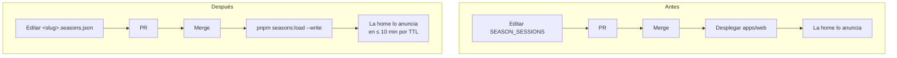
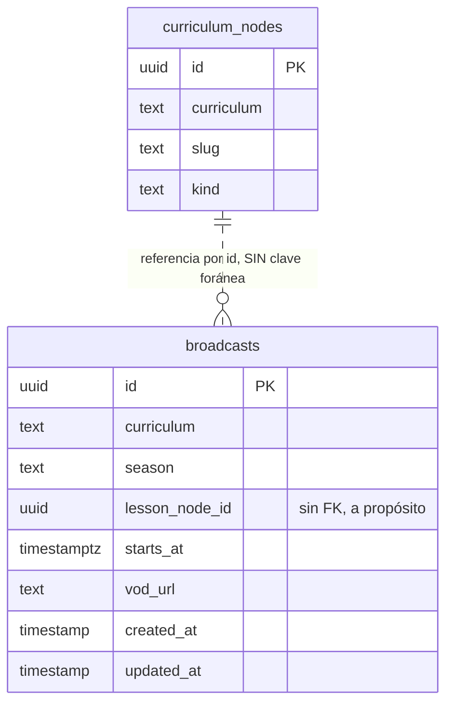
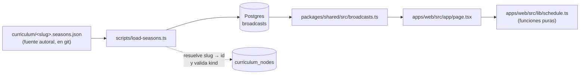

# PRD-008: Las emisiones como dato, y más de una temporada

**Status**: Draft
**Date**: 2026-07-31
**Author**: AI-assisted
**Priority**: P2
**Depends on**: PRD-002, PRD-006
**Supersedes**: None
**Issue**: [CON-7](https://linear.app/contextia/issue/CON-7)

## Impacted Projects

| Project | Impact |
|---------|--------|
| **shared** | Tabla nueva `broadcasts` en `src/schema.ts`. Módulos nuevos `src/broadcasts.ts` (lectura) y `src/broadcasts-file.ts` (parseo y contrato, puro). Archivo versionado `curriculum/<slug>.seasons.json`. Cargador `scripts/load-seasons.ts` (§ 7.2). **`src/curriculum-file.ts`**: `checkUrlSafety` se desacopla del nodo de currículo y se exporta, para que el control de URLs tenga una sola implementación (§ 6.4) — el fichero está bajo `CODEOWNERS` y el cambio queda declarado aquí a propósito. |
| apps-web | `src/lib/schedule.ts` pierde `SEASON_SESSIONS`, gana las cuatro composiciones de texto de la home (§ 7.1) y sus funciones pasan a recibir las emisiones como argumento. `src/app/page.tsx` las obtiene de la base, agrupa la tabla por temporada (§ 4.4) y corrige dos identificadores que dejan de ser únicos (§ 4.3). Script `scripts/check-schedule.ts` reescrito. |

---

## 1. Problem Statement

`apps/web/src/lib/schedule.ts` contiene `SEASON_SESSIONS`, un array con las siete fechas de la temporada actual y, para las emitidas, la URL de su grabación. Es la única fuente de fechas del sitio y eso está bien resuelto: la home no escribe ninguna fecha a mano. Lo que no está resuelto es que **sólo existe una temporada, y vive en un despliegue**.

Programar la siguiente es un cambio de TypeScript. La temporada actual termina el 4 de agosto de 2026; a partir de ahí `nextSession()` devuelve `null` y la home entra sola en estado de pausa — comportamiento correcto y deliberado, la home nunca miente. Pero **salir** de la pausa exige editar código y desplegar, y eso convierte una decisión de calendario en un evento de ingeniería.

Tampoco cabe una segunda cohorte. El array *es* la temporada, en singular: dos grupos con calendarios distintos, o una temporada nueva que reemita las mismas lecciones en otras fechas, no tienen dónde existir. Cuando la escuela repita E1-M1 —y va a repetirlo— no hay forma de decir a qué emisión perteneció cada estudiante ni de conservar la grabación de la primera.

Y la garantía de tipo que sostenía todo esto **ya se perdió**. Antes de PRD-002, `Session.lessonId` era de tipo `LessonId`, derivado del array `LESSONS`; hoy es `lessonSlug: string` y nada valida que apunte a una lección real. `apps/web/src/lib/schedule.ts:7-11` lo dice y nombra este issue; `packages/shared/docs/SYSTEM_ARTIFACT.md:148` lo registra como excepción con fecha de caducidad.

## 2. Goals

1. Almacenar las emisiones como dato consultable, con su fecha, su lección y su grabación, de modo que programar una temporada nueva no exija desplegar código.
2. Permitir que varias temporadas coexistan, cada una con sus fechas y sus grabaciones, y que **la misma lección se emita en varias** sin que ninguna pierda la suya.
3. Cuando no haya ninguna emisión futura, la home entrará en pausa exactamente como hoy — sin inventar "próximamente" ni dejar una fecha vieja en pantalla.
4. Si una emisión declara una lección que no existe en el currículo, el cargador rechazará el archivo entero antes de escribir nada.
5. Renderizar toda fecha con el mismo resultado en local y en producción, sin depender de los locales ICU del entorno ni de la `TZ` del proceso.
6. Mantener funcionando un curso adoptante **sin ninguna emisión**: sin temporadas, sin fechas y sin sección de calendario, y sin que su ausencia rompa el resto de la página.
7. Si el operador retira una emisión del archivo, el cargador rechazará la carga salvo que la autorice explícitamente — una clase emitida es un hecho histórico y no se borra por descuido.

## 3. Non-Goals

- **Inscribir estudiantes en una temporada o grupo.** Este PRD es el calendario; a quién pertenece cada estudiante es otro problema. La tabla no lleva ninguna columna de pertenencia.
- **Panel de administración** para editar el calendario. El único escritor es un cargador que corre desde un PR revisado.
- **Notificaciones o recordatorios de clase.**
- **Rellenar las grabaciones automáticamente.** El `vodUrl` se sigue poniendo a mano tras cada directo; lo que cambia es que deja de exigir un despliegue.
- **Modelar la temporada como entidad propia**, con nombre, estado o metadatos. Ver D2.
- **Una página de archivo de temporadas pasadas.** La tabla de la home las muestra agrupadas (§ 4.4); una superficie propia para navegar el histórico es otro trabajo.

**Lo que este PRD SÍ cambia en la home, y hay que decirlo porque el borrador anterior prometía lo contrario**: con dos o más temporadas cargadas la tabla crece y gana un encabezado por temporada, y el copy estático de la sección deja de poder decir "Siete clases". Con **una** temporada cargada —el estado de hoy— no cambia ni un píxel, y § 9 fila 20 lo afirma. Ver § 4.4 y D6.

## 4. User Flows / Design

No hay flujo de usuario nuevo. El flujo que cambia es el del **operador**, y es el punto entero del PRD.



El despliegue desaparece del camino. Sigue habiendo PR —el archivo vive en git a propósito, D1— pero programar una temporada deja de tocar TypeScript y deja de reiniciar el servicio.

### 4.1 Happy path del operador

1. Añade un bloque de temporada al archivo con sus fechas y sus `lessonSlug`.
2. Abre un PR. `pnpm curriculum:check` valida el archivo **sin base de datos**: fechas parseables, slugs con forma, y que cada `lessonSlug` resuelve a un nodo `kind: "lesson"` del archivo de currículo.
3. Al mergear, ejecuta `pnpm seasons:load --write`. La home la recoge en ≤ 10 min, por el TTL que PRD-002 ya dejó montado.
4. Tras cada directo, añade el `vodUrl` de esa emisión y vuelve a cargar. Sin desplegar. **Antes de hacerlo, confirma que la grabación está autorizada para distribución pública** (§ 8).

### 4.2 Error branches

| Situación | Qué pasa |
|---|---|
| Una emisión declara un `lessonSlug` que no existe | El cargador **rechaza el archivo entero** y no escribe nada, nombrando la emisión y el slug. Es la garantía que el tipo `LessonId` daba y que se perdió. |
| El `lessonSlug` existe pero no es de `kind: "lesson"` | Mismo rechazo. Una etapa no se emite. |
| Fecha no parseable o fuera de rango | Rechazo, nombrando la emisión. |
| Dos emisiones con la misma lección, temporada **y fecha** | Rechazo por restricción única (§ 6.1). Dos emisiones de la misma lección en la misma temporada en **fechas distintas** son legales — ver § 6.1. |
| **Una emisión desaparece del archivo** | El cargador **aborta sin escribir** y nombra las emisiones que morirían, salvo `--allow-deletes` explícito (§ 7.2, goal 7). |
| No hay ninguna emisión futura | `nextSession()` devuelve `null` y la home entra en pausa, **igual que hoy y en los dos sitios**: el banner (`page.tsx:41-43`) y la línea de cierre (`:519-521`) tienen textos **distintos** para ese estado, y los dos se conservan literalmente. |
| No hay ninguna emisión, en absoluto | La home omite la sección de temporada **y su entrada de navegación**, y conserva la alternancia de bandas (§ 4.4). |
| La lectura de emisiones falla y no hay valor en caché | La sección se omite, el resto de la home se pinta, y **se registra una línea** (§ 7.3). La home nunca inventa una fecha. |

### 4.3 Dos identificadores que dejan de ser únicos

`page.tsx:271` usa `key={session.lessonSlug}` y `schedule.ts:91` decide la fila destacada con `isNext: next?.lessonSlug === session.lessonSlug`. **Las dos cosas asumen que un `lessonSlug` aparece una sola vez en el calendario**, cierto con una temporada y falso en cuanto el goal 2 se cumple: la misma lección emitida en dos temporadas produce claves duplicadas en React y marca como "próxima" la fila de la temporada equivocada.

Ambos pasan a usar el `id` de la emisión, único por construcción. Es una regresión que **introduce el propio criterio de aceptación**, y sin nombrarla aparecería como una fila resaltada de más el día que exista la segunda temporada.

Los otros dos sitios que derivan de `next` —el banner (`:40-43`) y la línea de cierre (`:519-521`)— llaman a `formatSessionDate(next)` sobre el objeto que `nextSession()` ya resolvió, sin buscar por slug. No están afectados.

### 4.4 Lo que cambia visualmente, y cuándo

Con **una** temporada cargada, nada. Con dos o más:

- **La tabla se agrupa por temporada**, con un encabezado por grupo, ordenadas por su primera emisión. Dentro de cada grupo, por fecha.
- **El copy estático de la sección deja de afirmar el tamaño de una temporada.** `page.tsx:257-262` dice hoy "Ahora mismo: tu primera semana como developer" y "Siete clases de 2 horas…". Con dos temporadas eso es falso. El texto pasa a describir el formato —clases de 2 horas, martes y jueves, 20:00 Colombia, en Twitch, gratis y en diferido para siempre— sin contar clases ni prometer una semana concreta.
- **La sección omitida no rompe la página.** `page.tsx:16` declara como decisión fechada que los fondos alternan "papel ↔ surface **en estricto**", y hoy la secuencia es S4 `band-surface` → S5 temporada (sin banda) → S6 `band-surface`. Omitir S5 deja dos `band-surface` seguidas. La alternancia se conserva: o S5 deja un envoltorio vacío que preserva la paridad, o la clase de banda de S6 en adelante se deriva de si S5 se pintó. **La entrada de navegación `#temporada` (`:57`) se omite con ella**, porque un ancla a una sección que no existe es un enlace muerto.

## 5. API

**Ninguna.** Este PRD no añade endpoints.

La home es un Server Component que ya lee el currículo directamente de Postgres a través de `@shared/curriculum`; las emisiones se leen por el mismo camino y en el mismo render. No hay un segundo consumidor —`apps/api` no necesita el calendario— y añadir una superficie HTTP para un solo llamante que vive en el mismo proceso sería estructura sin cliente.

Si algún día el calendario tiene que salir del proceso web (una app, un feed iCal, un recordatorio), eso es un PRD con su propio § 5.

## 6. Data Model



### 6.1 `broadcasts` (nueva)

| Columna | Tipo | Nulo | Defecto | Descripción |
|---|---|---|---|---|
| `id` | `uuid` | no | — | Clave primaria. **La aporta el archivo**, igual que en `curriculum_nodes`: es la identidad de la emisión y sobrevive a recargas y a correcciones de fecha. |
| `curriculum` | `text` | no | — | El mismo valor que `curriculum_nodes.curriculum`. Sale de `CURRICULUM_SLUG`, nunca del request. |
| `season` | `text` | no | — | Etiqueta de temporada (`"2026-t1"`). Contra `SLUG_PATTERN`, el mismo `/^[A-Za-z0-9_-]{1,64}$/` que `curriculum` y `slug`: participa en la clave única y en el agrupado de la tabla, así que no puede ser texto libre. |
| `lesson_node_id` | `uuid` | no | — | El `id` del nodo `lesson`. **Sin clave foránea** (§ 6.3). |
| `starts_at` | `timestamp … { withTimezone: true, mode: "date" }` | no | — | Instante de inicio. `timestamptz` **y `mode: "date"` explícito** (§ 6.2). |
| `vod_url` | `text` | sí | `null` | Grabación, si ya se emitió. `CHECK (vod_url IS NULL OR vod_url LIKE 'https://%')`. |
| `created_at` / `updated_at` | `timestamp … { mode: "date" }` | no | `defaultNow()` | |

**Restricciones e índices:**

- `unique("broadcasts_season_lesson_starts_key").on(curriculum, season, lesson_node_id, starts_at)`.

  **La fecha entra en la clave a propósito, y el borrador anterior la dejaba fuera por accidente.** Sin ella, una lección sólo puede emitirse una vez por temporada — lo que prohíbe una clase de recuperación, o una cohorte que se parte y recibe L1 dos veces, que son casos ordinarios en una escuela con directos. Nada en § 1 ni en § 2 pide prohibirlos, y el rodeo (una etiqueta `2026-t1-bis`) corrompería el campo que D2 define como simple etiqueta. Lo que la clave sigue cazando es el error real: la misma emisión duplicada por copia y pega.

- `index("broadcasts_curriculum_starts_idx").on(curriculum, starts_at)` — el orden que la home consulta.

### 6.2 `timestamptz` y por qué la hora de Colombia no se guarda

La restricción del issue es que **el formato no dependa del runtime**: los nombres de día y mes están escritos a mano en `schedule.ts` para no depender de los locales ICU, que en un contenedor pueden faltar. Esa garantía se conserva intacta.

Lo que cambia es de dónde sale el instante. Hoy se compone con `new Date(\`${date}T20:00:00-05:00\`)`: fecha en el array, hora y desfase **quemados en el código**. Al pasar a dato, el offset se aplica **al cargar** y se guarda un `timestamptz`.

**`timestamptz` y no `timestamp`, y esto es medible, no estético.** `pg-types` registra el mismo parser para los dos OID, y para una cadena sin desfase construye el `Date` con los componentes **locales del proceso**. Leyendo `2026-07-14 20:00:00`:

| `TZ` del proceso | `timestamp` | `timestamptz` |
|---|---|---|
| `UTC` | `2026-07-14T20:00:00Z` | `2026-07-15T01:00:00Z` |
| `America/Bogota` | `2026-07-15T01:00:00Z` | `2026-07-15T01:00:00Z` |
| `Asia/Tokyo` | `2026-07-14T11:00:00Z` | `2026-07-15T01:00:00Z` |

Tres instantes distintos frente a uno. Es exactamente el fallo que el formato manual existe para evitar, reintroducido por la puerta de atrás — y la fila 8 de § 9 es lo único que lo detecta, porque `formatSessionDate` es pura y sigue verde con la columna mal declarada.

**La regla, dicha bien**: la lleva *cualquier columna cuyo valor vuelva a convertirse en un instante absoluto*, no "todo lo que no sea una marca de auditoría". El resto del esquema usa `timestamp` sin zona, y al menos una —`lesson_evidence.checked_at`, que PRD-007 § 5.1 serializa con `.toISOString()`— tiene la misma exposición. No es problema de este PRD arreglarla, pero la regla se escribe aquí para que la próxima tabla no la repita.

**La hora de Colombia no es una columna.** Es una propiedad del render, y `formatSessionDate()` la aplica igual que hoy. Guardar además "20:00 Colombia" sería guardar dos veces el mismo hecho.

### 6.3 Por qué `lesson_node_id` no lleva clave foránea

Idéntico razonamiento a PRD-007 § 6.3. `curriculum_nodes` es una proyección: el cargador hace upsert y sólo borra bajo `--allow-deletes`. Con clave foránea, retirar una lección del temario o bien borraría en cascada la emisión —perdiendo la fecha y la grabación de una clase que **sí ocurrió**— o bien abortaría la transacción del cargador.

Una clase emitida es un hecho histórico. El temario puede cambiar; el 14 de julio de 2026 hubo una clase y su grabación existe. Sin clave, el nodo puede morir y la emisión sobrevive; la fila de la agenda degrada a título vacío, que es lo que `schedule.ts:88-89` ya hace desde PRD-002.

**La integridad se comprueba en la escritura**: el cargador resuelve `lessonSlug → nodo` y rechaza el archivo entero si alguno no existe o no es `kind: "lesson"` (goal 4). Es más fuerte que el tipo `LessonId`, porque además cubre el `kind`.

**Y esa puerta sólo cierra un lado.** El otro es el propio archivo de temporadas: quitar una línea y recargar borraría la fila. Lo cierra § 7.2 con la misma bandera que el currículo (goal 7). Sin las dos, § 6.3 protege un hecho histórico de una puerta y lo deja abierto por la otra.

### 6.4 El archivo de temporadas

`curriculum/<slug>.seasons.json`, hermano del de currículo y con la misma disciplina: **la fuente de verdad autoral está en git, la tabla es su proyección.**

```json
{
  "curriculum": "contextia",
  "seasons": [
    {
      "season": "2026-t1",
      "startsAtLocal": "20:00",
      "utcOffset": "-05:00",
      "broadcasts": [
        { "id": "…uuid…", "lessonSlug": "L1", "date": "2026-07-14", "vodUrl": "https://www.youtube.com/watch?v=T6g1Ynm8r3c" },
        { "id": "…uuid…", "lessonSlug": "L2", "date": "2026-07-16" }
      ]
    }
  ]
}
```

- **La hora y el desfase se declaran por temporada, no por emisión.** Es lo que son hoy —todas a las 20:00 Colombia— y repetirlos por fila invita a que uno discrepe por error de copia.
- **El `id` lo aporta el archivo**, y `curriculum/README.md` ya documenta cómo generarlos; esa nota se extiende a este archivo.
- **`vodUrl` pasa por el control de URLs del currículo, y para eso hay que hacerlo importable primero.** Es un enlace saliente en la landing pública bajo la marca de la escuela — lo que ese control existe para acotar. `youtube.com` y `youtu.be` ya están en la allowlist.

  **Hoy no se puede reutilizar tal cual, y es la parte de este PRD que más fácil se hace mal.** De las piezas que `packages/shared/CLAUDE.md` dice que "hay que pensar juntas", `curriculum-file.ts` exporta exactamente una: `URL_HOST_ALLOWLIST`, la mitad de datos. `checkUrlSafety` (`:452`), `stripUrlNoise` (`:184`), `URL_LIKE` (`:172`), `DANGEROUS_SCHEME` (`:189`) y `walkStrings` (`:415`) son privados, y la firma de `checkUrlSafety` está atada a un nodo de currículo (`rawNode`, `label(rawNode)`, `CurriculumFileError`), que un archivo de temporadas no tiene.

  Así que el camino por defecto —un detector nuevo dentro de `broadcasts-file.ts`— es el que **no** se toma. Duplicaría un control con catorce bypasses documentados en un fichero que `CODEOWNERS` no protege, mientras el original lo está precisamente por serlo ("la única puerta", dice su regla). En su lugar: **`checkUrlSafety` se refactoriza para recibir una etiqueta y un `fail` del llamante, y se exporta.** Por eso `packages/shared/src/curriculum-file.ts` está en Impacted Projects.

  Una implementación, ya bajo `CODEOWNERS`, con **una sola tabla de fixtures** que la fila 10 de § 9 corre sobre los dos parsers.

### 6.5 Escritura: el `set` del upsert

El cargador hace `ON CONFLICT (id) DO UPDATE` y **nombra su `set` explícitamente**, como `load-curriculum.ts:335-350`: `season`, `lesson_node_id`, `starts_at`, `vod_url` y `updated_at`; `created_at` no aparece.

`updated_at` lleva `defaultNow()` y **no** `$onUpdate`, así que un camino de conflicto que no lo nombre conserva el valor de inserción — y la fila 21 de § 9 ("cargar dos veces deja las mismas filas") pasaría con `updated_at` roto. Lleva además un `setWhere` que sólo mueve la fila cuando algún campo difiere de verdad: sin él, el recuento de "actualizados" es siempre cero o siempre la tabla entera, y el operador pierde la señal que le dice qué hizo su carga.

### 6.6 Migración de esquema

Un archivo de `drizzle-kit generate`: `CREATE TABLE broadcasts`, el `CHECK`, la restricción única y el índice. **Sin backfill automático**: las siete emisiones actuales entran como contenido, en el archivo, dentro del mismo PR.

La reversión borra la tabla **y** su fila de `drizzle.__drizzle_migrations`, por lo mismo que PRD-007 § 6.5: un `DROP TABLE` que deje el registro hace que un redespliegue posterior salte la migración y arranque contra una tabla que no existe.

## 7. Architecture



Es el mismo reparto que PRD-002 dejó para el currículo, y se elige por eso: el operador ya conoce este flujo.

### 7.1 Qué se queda en `schedule.ts`, qué se va y qué llega

**Se va** `SEASON_SESSIONS`. Sus dos únicos consumidores son `page.tsx` y `check-schedule.ts`, los dos en Impacted Projects.

**Cambian de firma** `nextSession` y `seasonAgenda`: pasan de leer un `const` de módulo a recibir las emisiones como argumento, que es lo que `seasonAgenda(lessons, now)` ya hace con el currículo. Eso las mantiene testables bajo Node pelado, sin base de datos.

**`sessionStart` es donde el cambio de verdad aterriza, y el borrador anterior lo decía mal.** Su cuerpo entero es `new Date(\`${session.date}T20:00:00-05:00\`)` — precisamente la composición que § 6.2 mueve al cargador. Con `starts_at` ya absoluto, se convierte en un accesor o desaparece. `formatSessionDate` **puede** quedar byte a byte igual, pero sólo porque delega en `sessionStart` (`:53`): quien proteja la fila 8 sin ver esto podría reconstruir el instante desde un `date` que ya no existe.

**Llegan** las cuatro composiciones de texto de la home. El banner y la línea de cierre tienen hoy sus plantillas escritas en línea en `page.tsx` (`:41-43`, `:519-521`), dos ramas cada una. La fila 20 de § 9 tiene que afirmar sobre esos cuatro textos, y el golden del repositorio **no renderiza React** — construye datos y compara. Un golden que copie a mano cuatro plantillas compara su propia copia contra sí misma: alguien cambia el copy en `page.tsx`, olvida el golden, y nada se pone rojo. Así que las cuatro suben a funciones nombradas en `schedule.ts`, al mismo nivel que `formatSessionDate`, y las llaman **tanto** `page.tsx` **como** el golden.

### 7.2 El cargador

**Un hermano, `scripts/load-seasons.ts`, con su entrada `seasons:load`** — y no una fase dentro de `load-curriculum.ts`. Las dos cosas se editan en momentos distintos: el temario por trimestre, las fechas por temporada y los `vodUrl` semanalmente. Acoplarlas obligaría a recargar el currículo entero para añadir la URL de una grabación.

La validación cruzada no necesita el árbol: `curriculum_nodes` lleva `slug` y `kind` como columnas y `unique(curriculum, slug)` hace la búsqueda directa. En la puerta del PR tampoco, porque `parseCurriculumFile` ya devuelve `FlatNode[]` con los dos campos planos.

**Copia la forma de `load-curriculum.ts`, y las tres piezas son load-bearing:**

1. **`pg_advisory_xact_lock` como primera sentencia de la transacción** (`load-curriculum.ts:231-244`). Sin él, dos cargas concurrentes pueden ver ambas que un `id` no existe; `SELECT … FOR UPDATE` no lo cierra, porque la fila peligrosa es la que todavía no existe.
2. **Upsert por `id`**, con el `set` de § 6.5.
3. **Fase de borrado acotada y gobernada por `--allow-deletes`** (`:353-369`, `authorize()` en `:176-184`). Es el goal 7 y **la mitad que faltaba de § 6.3**: sin ella, quitar una línea del archivo y recargar borra en silencio una emisión y su grabación. El mensaje nombra las emisiones que morirían, como ya hace el del currículo.

### 7.3 Lectura, join y degradación

`broadcasts.ts` replica el patrón de `curriculum.ts`: `unstable_cache` con TTL de 600 s más un `lastKnown` por proceso.

**El join es a la izquierda, y esto no es un detalle.** `broadcasts` guarda `lesson_node_id`; `seasonAgenda` empareja por slug (`schedule.ts:82,85`). Algo tiene que resolver uno en otro, y el precedente más cercano —`slugsByNodeId()` de PRD-007— **omite** los ids que ya no resuelven. Eso es correcto para la evidencia y **exactamente lo contrario de lo que § 6.3 quiere aquí**: una lección retirada se llevaría su emisión histórica fuera de la agenda. Toda fila de `broadcasts` llega a `seasonAgenda`; un `lesson_node_id` sin resolver produce la fila de título vacío que `schedule.ts:88-89` ya sabe pintar.

**La degradación difiere de la del currículo, y hay que decir por qué mecanismo.** "Replica el patrón" no basta: `curriculum.ts` relanza cuando fallan las tres capas (caché, `lastKnown`, lectura directa), así que copiarlo al pie de la letra haría que un fallo de calendario tumbase la home entera — lo contrario de lo que este PRD promete. La diferencia es explícita: **la última capa de `broadcasts.ts` no relanza; registra y devuelve `[]`.**

Registra con `name` y `code`, nunca la consulta. Que el visitante no distinga un fallo de un curso sin directos es correcto; que el operador tampoco pueda, no — durante una temporada viva, "indistinguible" es el problema.

## 8. Security

No hay endpoint y no hay conexión saliente. **Sí hay una entrada no confiable, y es una sola: `vodUrl`**, que un humano escribe y que acaba en un `href` de la landing pública.

Decirlo así y no "la superficie es pequeña" no es prudencia retórica: `CODEOWNERS` registra que para esta misma clase de contenido **un PR se juzgó insuficiente por sí solo** — al pasar de `src/lib/lessons.ts` a JSON, un cambio dejó de convocar atención de revisor de código y pasó a convocar atención de corrector de estilo, "mismo destino, menos escrutinio". Un revisor que ve `"https://www.youtube.com/watch?v=…"` en un diff de JSON no distingue un tabulador dentro del host. Por eso el control existe, y por eso una sección que empiece afirmando su propia irrelevancia es lo que autoriza a saltárselo.

- **Escritura.** El único escritor en el entorno desplegado es el cargador, ejecutado a mano desde un PR mergeado. No hay CRUD, no hay panel, no hay endpoint de escritura.
- **`vod_url` es un enlace saliente en la landing pública.** Pasa por `checkUrlSafety` —la implementación única de § 6.4, no una copia— y se renderiza con `rel="noreferrer"`, como ya hace `page.tsx:280`.

  **El `CHECK` de la tabla no es una segunda capa sobre la misma amenaza.** `LIKE 'https://%'` acota el **esquema**: cierra `javascript:` y `data:` en la base, y es fail-closed porque `LIKE` distingue mayúsculas. Lo que **no** acota es el **host**, que es la amenaza que esta sección nombra — admite `https://evil.example.com/` y admite `https://youtube.com@evil.example.com/`, que a un humano le parece YouTube y cuyo `URL.hostname` es `evil.example.com`. Eso lo caza la allowlist y sólo la allowlist. El control de host tiene **exactamente una** implementación, que es el argumento de § 6.4 para no duplicarla.
- **Añadir un `vodUrl` es una decisión de publicación, no de calendario.** Una grabación de clase en directo lleva caras, voces, nombres y chat de estudiantes. "Oculto" en YouTube significa *cualquiera con el enlace*, y `page.tsx:280` publica ese enlace en una página pública que no lleva `noindex` en ninguna parte: el sistema es lo que hace público el vídeo. § 4.1 paso 4 lo convierte en rutina semanal, así que la puerta de revisión de D1 tiene que confirmar que la grabación está autorizada para distribución pública **antes** de que la URL entre al archivo. Queda escrito en `curriculum/README.md`.
- **`curriculum` nunca sale del request.** Sale de `CURRICULUM_SLUG`. La tabla no tiene aislamiento entre currículos, igual que `curriculum_nodes`: el esquema *parece* multi-tenant y no lo es.
- **Inyección.** `lessonSlug` y `season` van contra `SLUG_PATTERN` y se usan como valores de consulta parametrizada, nunca concatenados. Las fechas se parsean antes de tocar la base.

## 9. Test Plan

| # | Test | Type | Description | Path |
|---|---|---|---|---|
| 1 | Archivo: forma mínima | unit | Una temporada, una emisión: parsea y aplana. | `../platform/scripts/check-seasons.ts` |
| 2 | **Archivo: `lessonSlug` inexistente rechaza el archivo entero** | unit | Nombra la emisión y el slug; **no** devuelve filas parciales. Goal 4. | `../platform/scripts/check-seasons.ts` |
| 3 | **Archivo: un slug que no es `kind: "lesson"` también rechaza** | unit | El slug de una etapa → error. Más fuerte que el tipo `LessonId`. | `../platform/scripts/check-seasons.ts` |
| 4 | Archivo: fecha no parseable | unit | `"2026-13-45"` y `"mañana"` → error nombrando la emisión. | `../platform/scripts/check-seasons.ts` |
| 5 | Archivo: `id` duplicado o no-UUID | unit | Error, igual que en el currículo. | `../platform/scripts/check-seasons.ts` |
| 6 | Archivo: `season` fuera de `SLUG_PATTERN` | unit | Espacios, acentos, 65 caracteres → error. Participa en la clave única. | `../platform/scripts/check-seasons.ts` |
| 7 | **Archivo: misma lección y fecha dos veces → error; misma lección en dos fechas → legal** | unit | Las dos mitades de la clave de § 6.1, incluida la que el borrador anterior prohibía por accidente. | `../platform/scripts/check-seasons.ts` |
| 8 | **Archivo: la misma lección en DOS temporadas es legal** | unit | El caso del goal 2, que la clave única no debe impedir. | `../platform/scripts/check-seasons.ts` |
| 9 | Archivo: el offset se aplica al cargar | unit | `"2026-09-15"` + `20:00` + `-05:00` → el instante UTC correcto. | `../platform/scripts/check-seasons.ts` |
| 10 | **Archivo: `vodUrl` hostil, con la tabla de fixtures compartida** | unit | Las **catorce** formas de evasión que `check-curriculum.ts` ya documenta, corridas desde una sola fuente sobre los dos parsers. Tres casos ad-hoc dejarían pasar tabulador-en-esquema, prefijo C0 y barra invertida (§ 6.4). | `../platform/scripts/check-seasons.ts` |
| 11 | **Archivo sin ninguna temporada es válido** | unit | El curso adoptante sin clases en directo. Goal 6. | `../platform/scripts/check-seasons.ts` |
| 12 | `nextSession`: la primera futura | unit | Con emisiones de dos temporadas mezcladas, la más próxima en el tiempo, no la primera del array. | `../platform/apps/web/scripts/check-schedule.ts` |
| 13 | **`nextSession`: sin futuras → `null`** | unit | La pausa. Goal 3. | `../platform/apps/web/scripts/check-schedule.ts` |
| 14 | `isPast`: deja de ser próxima al **terminar** | unit | Las dos horas de duración, sin cambio respecto a hoy. | `../platform/apps/web/scripts/check-schedule.ts` |
| 15 | **`formatSessionDate` no cambió, y no depende de `TZ`** | unit | Golden sobre las siete fechas actuales, ejercitado bajo dos `TZ` distintas. Goal 5. | `../platform/apps/web/scripts/check-schedule.ts` |
| 16 | **`seasonAgenda`: `isNext` se decide por `id`, no por slug** | unit | Dos temporadas con la misma lección: sólo se marca la de la temporada vigente. Falla con la comparación de hoy (§ 4.3). | `../platform/apps/web/scripts/check-schedule.ts` |
| 17 | **`seasonAgenda`: una emisión sin lección resuelta SIGUE en la agenda** | unit | Título y `outcome` vacíos, pero la fila está. Es la mitad de § 6.3 que un `slugsByNodeId` al uso rompería (§ 7.3). | `../platform/apps/web/scripts/check-schedule.ts` |
| 18 | **`seasonAgenda`: agrupa por temporada, ordenada por primera emisión** | unit | Dos temporadas → dos grupos, en orden, cada uno ordenado por fecha (§ 4.4). | `../platform/apps/web/scripts/check-schedule.ts` |
| 19 | `seasonAgenda`: sin emisiones → vacío | unit | Goal 6. | `../platform/apps/web/scripts/check-schedule.ts` |
| 20 | **Golden: con UNA temporada, los cuatro textos de la home no cambian** | unit | **No es un test de render — este repositorio no tiene runner de componentes React.** Es la técnica que el propio golden ya usa en su "Fila 2" (`check-curriculum-golden.ts:83-87`, "compuesta como en page.tsx"): se importan las funciones de `schedule.ts`, se componen el texto del banner y el de la línea de cierre —sus dos ramas cada uno— y el array de filas de `seasonAgenda`, y se comparan contra **una sección nueva del golden** capturada con las siete emisiones de hoy. El fichero no importa hoy nada de `schedule.ts`: ese import es parte del trabajo. Lo que esta fila **no** puede probar es que el JSX cablee esos valores al DOM; eso lo verifica a mano § 10, punto 1. | `../platform/scripts/check-curriculum-golden.ts` |
| 21 | Carga: escribe, actualiza y no duplica | integration | Dos cargas del mismo archivo dejan las mismas filas; cambiar una fecha la actualiza por `id` y **mueve `updated_at`**, dejando `created_at` intacto (§ 6.5). | `../platform/scripts/check-seasons-load.ts` |
| 22 | **Carga: una emisión que desaparece del archivo aborta sin `--allow-deletes`** | integration | La tabla queda intacta y el mensaje nombra la emisión. Goal 7, y la puerta que faltaba en § 6.3. | `../platform/scripts/check-seasons-load.ts` |
| 23 | **Carga: una lección retirada no borra su emisión** | integration | Se retira el nodo del currículo y la fila de `broadcasts` sigue con su `vod_url` (§ 6.3). | `../platform/scripts/check-seasons-load.ts` |
| 24 | Carga: rechaza sin escribir nada | integration | Un archivo con un slug malo deja la tabla como estaba. | `../platform/scripts/check-seasons-load.ts` |
| 25 | **Carga: `starts_at` da el mismo instante bajo dos `TZ`** | integration | Se lee la misma fila con `TZ=UTC` y `TZ=Asia/Tokyo` y se comparan los milisegundos. **Es lo único que falla si alguien "simplifica" la columna a `timestamp`** — la fila 15 es pura y sigue verde (§ 6.2). | `../platform/scripts/check-seasons-load.ts` |
| 26 | Regresión: fronteras | unit | El módulo nuevo de `shared` no alcanza `apps/`; ningún Client Component importa `@shared/*` por valor. | `../platform/scripts/check-boundaries.ts` |

Bloques contiguos por fichero: 1-11 `check-seasons.ts`, 12-19 `check-schedule.ts`, 20 `check-curriculum-golden.ts`, 21-25 `check-seasons-load.ts`, 26 `check-boundaries.ts`. Cada fichero declara su rango en la cabecera.

**Dónde corre cada cosa, corregido respecto al borrador anterior.** Éste afirmaba que `checks.yml` "no invoca ningún agregado", y es **falso**: `checks.yml:72` ejecuta `pnpm curriculum:check`, que encadena cuatro scripts. Lo cierto es que no hay agregado para los de `apps/web/scripts/`, que es el contexto donde PRD-007 lo dijo. Consecuencia práctica:

- `check-seasons.ts` (1-11) **se añade a `curriculum:check`** y corre en CI sin tocar el workflow.
- `check-schedule.ts` (12-19) ya tiene su paso; sigue igual.
- `check-seasons-load.ts` (21-25) toca Postgres → `curriculum:check:db`, operador, fuera de CI, como `check-curriculum-load.ts`.

## 10. Migration Plan

| Paso | Qué | Reversión |
|---|---|---|
| A | Migración de esquema. Tabla, `CHECK`, clave única e índice; nada los lee. | `DROP TABLE` + borrar su fila de `drizzle.__drizzle_migrations`. |
| B | `packages/shared`: el refactor de `checkUrlSafety` (§ 6.4), `broadcasts-file.ts`, `broadcasts.ts` y `load-seasons.ts`, con sus filas de § 9 **y la incorporación de `check-seasons.ts` a `curriculum:check`**, para que el parser nuevo nazca cubierto en CI y no dos pasos después. Sin llamante. | Revertir. |
| C | `curriculum/contextia.seasons.json` con las siete emisiones actuales —incluida la `vodUrl` de L1, la única que hoy existe— y `pnpm seasons:load --write`. La home todavía lee el array. | **Vaciar la tabla, o nada**: es la primera carga, no hay archivo anterior, y hasta el paso D nadie la lee. |
| D | `apps/web`: `schedule.ts` pierde el array, cambia de firma y gana las cuatro composiciones de texto; `page.tsx` lee de la base, agrupa por temporada, usa el `id` como clave y conserva bandas y navegación cuando la sección se omite; `check-schedule.ts` reescrito; el tipo `Session` pasa a `Broadcast` (§ D7). **Único paso con cambio visible**, y la fila 20 es lo que afirma que con una temporada no lo hay. | Revertir; la tabla queda cargada y sin lector. |

**El paso C antes que el D no es negociable.** Al revés, la home lee una tabla vacía y entra en pausa con la temporada todavía en curso — exactamente la mentira que el issue prohíbe.

**Sin feature flag**: hasta el paso D no hay superficie que un estudiante alcance.

**Verificación en producción, tras el paso D:**

1. La home muestra la misma próxima clase que antes, con el mismo texto.
2. La tabla lista las siete emisiones, con el enlace de VOD en L1 y sólo en L1, y **sin encabezado de temporada** — con una sola, el agrupado no se ve.
3. Añadir una `vodUrl` al archivo, recargar **sin desplegar**, y verla aparecer en ≤ 10 min.
4. Cargar una segunda temporada con una lección repetida: dos grupos con su encabezado, la próxima marcada en la correcta, y ninguna fila duplicada.
5. Quitar una emisión del archivo y cargar sin `--allow-deletes`: aborta y la tabla queda intacta.
6. Vaciar `broadcasts` en una base de prueba: la home pinta sin la sección, sin el enlace de navegación, con las bandas alternando y sin errores.

## 11. Open Questions

- [ ] **¿La segunda temporada reemite E1 entera o sólo parte?** No bloquea el diseño —el modelo admite las dos— pero decide si el archivo de la primera carga real lleva siete emisiones o menos. Es decisión del decano y sólo hace falta antes del paso C de una temporada nueva, no antes de mergear este PRD.

## Design Decisions

**D1 — La fuente autoral vive en git, no en la base.** El issue pide que programar una temporada no exija desplegar, y eso se cumple. Lo que **no** se hace es sacar el contenido del repositorio: es la disciplina que PRD-002 eligió para el currículo, el operador ya la conoce, y trae dos cosas que una tabla suelta no tiene — revisión en PR y el control de URLs sobre los `vodUrl`. El coste declarado es que quien programe una temporada necesita saber abrir un PR.

**D2 — La temporada es una etiqueta, no una tabla.** `season` es texto bajo `SLUG_PATTERN`. Una tabla `seasons` con nombre y estado sería estructura sin consumidor: ningún criterio pide el nombre de una temporada, y "cuál es la vigente" se deriva de las fechas — que es lo correcto, porque una columna `is_current` se desincroniza. Que además sirva de clave de agrupado en la tabla de la home (§ 4.4) no la asciende a entidad: agrupar por un valor no exige que ese valor tenga fila propia. El día que una temporada necesite metadatos, promoverla es una migración aditiva.

**D3 — Sin clave foránea a `curriculum_nodes`.** § 6.3. Una clase emitida es un hecho histórico y una edición de temario no debe poder borrarla. La integridad se comprueba al escribir, donde además cubre el `kind`. **Y la puerta del archivo se cierra igual** (§ 7.2): proteger un hecho de un lado y dejarlo abierto por el otro no lo protege.

**D4 — `timestamptz`, y la hora de Colombia no se guarda.** § 6.2, con la medida. El instante es absoluto; la hora local es del render.

**D5 — Ningún endpoint.** § 5. El único consumidor vive en el mismo proceso que la lectura.

**D6 — La tabla muestra todas las temporadas, agrupadas.** Alternativas descartadas: mostrar sólo la vigente conserva el copy intacto pero esconde las grabaciones antiguas, que son producto —"gratis, en vivo o en diferido, **para siempre**", dice la propia sección—; y una ventana de días alrededor de hoy evita el concepto de temporada pero introduce un número inventado y vacía la tabla en una pausa larga. Agrupar cuesta un cambio de diseño y una reescritura del copy estático, y es lo que este PRD paga a cambio de que el histórico siga visible. Por eso § 3 declara ese cambio en vez de prometer que no lo hay.

**D7 — El tipo `Session` pasa a `Broadcast`.** `schema.ts:71` ya tiene una tabla `session` cuyo nombre lo fija el adapter de Auth.js y no es negociable. Dejar un tipo `Session` en `schedule.ts` junto a una tabla `broadcasts` y otra tabla `session` que significa otra cosa es confusión gratuita; renombrarlo en el paso D no cuesta nada.

---

## Gate: Promotion to `Implemented`

```yaml
commit_hash: [TBD]
tests:
  - [TBD]
system_artifact_diff:
  - [TBD]
```
