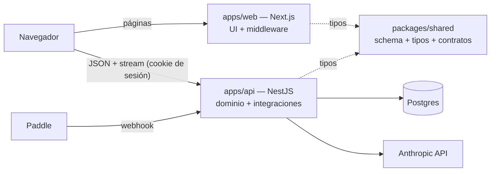

# ADR-001: Backend en NestJS, front en Next.js, dominio en un paquete compartido

**Status**: Accepted
**Date**: 2026-07-28
**Decision makers**: Backend, Product
**Context PRDs**: PRD-002
**Supersedes**: None

---

## 1. Context

`platform` es hoy un único repositorio Next.js 15 (App Router) que sirve front y back en el mismo proceso: ~3.900 LOC de TypeScript, de los cuales la superficie de backend son 4 route handlers (~320 LOC) y `src/lib` (~1.607 LOC, de los que 575 son el parser de currículo y 203 el esquema de Drizzle). Se despliega como un solo contenedor en Railway (`next.config.mjs`, `output: "standalone"`). El `pnpm-workspace.yaml` que existe en la raíz no declara `packages:` — solo `allowBuilds`, así que no hay monorepo real todavía.

Dos señales fuerzan la decisión. La primera es de alcance: el producto se dirige a un LMS completo —la organización es `OSL-LMS` y PRD-002 § 5 ya anticipa *"el día que el generador de exámenes sea una capacidad del LMS"*—, lo que implica cargas que un route handler no cubre (trabajo largo y diferido: corrección en lote, generación de certificados, notificaciones de cohorte) y, más adelante, consumidores que no son el navegador (LTI, móvil, integraciones institucionales). La segunda es de mantenimiento: la lógica de negocio vive hoy dentro del framework web, y el equipo quiere que la frontera entre dominio y presentación sea explícita y no dependa de la disciplina de quien importa.

**Debilidad conocida de esta decisión, registrada a propósito**: `ROADMAP.md` contiene hoy un solo item (`ROADMAP-001`) y está `Shipped`. No hay items `Candidate` ni `Committed` que dimensionen la carga futura. La decisión se toma sobre alcance *anticipado*, no *medido*. Eso es lo que hace que la § 6 sea la sección más importante de este documento.

## 2. Decision

Dividiremos `platform` en un workspace pnpm de tres paquetes, **todos nuevos**: `apps/web` (Next.js 15 — UI, páginas, middleware de sesión), `apps/api` (NestJS — lógica de dominio, acceso a Postgres, integraciones externas) y `packages/shared` (esquema Drizzle, tipos de dominio y contratos de la API).

El navegador seguirá pidiendo páginas a `apps/web`; `apps/api` servirá los endpoints de negocio bajo su propio origen, autenticando con **el mismo JWT de sesión de Auth.js** que ya se emite hoy, en lugar de introducir una segunda identidad.

## 3. Alternatives Considered

### Option A — Monolito modular dentro de Next

Reorganizar `src/lib` en `src/modules/<dominio>/` con un `index.ts` por módulo como API pública, y hacer cumplir la frontera con una regla `no-restricted-imports` de ESLint. Sin procesos nuevos, sin paquetes nuevos.

**Pros**:
- Coste casi nulo: un `git mv` y ~6 líneas de configuración de lint.
- Sin puente de sesión, sin CORS, sin proxy de stream, sin segundo despliegue.
- Da la mayor parte del beneficio buscado —fronteras explícitas, dominio testeable sin Next— de inmediato.
- Deja la extracción posterior como trabajo mecánico: un módulo aislado ya tiene contrato público.

**Cons**:
- La frontera la impone el lint, no el runtime: un import decidido la salta, y una regla se desactiva con un comentario.
- La lógica de dominio sigue atada al ciclo de build y release de Next.
- No produce ninguna superficie de API para consumidores que no sean la web.
- No impide que idiomas de Next (`next/headers`, `cookies()`, `"use server"`) se filtren al dominio.

### Option B — Next + proceso worker, sin API separada

Mantener Next como está (con o sin la modularización de A) y añadir un segundo proceso `node worker.ts` en el mismo repositorio, consumiendo una cola y reutilizando los mismos módulos.

**Pros**:
- Resuelve lo primero que se rompe de verdad en un LMS —el trabajo largo y diferido— sin frontera HTTP ni re-autenticación.
- Comparte código por import directo: cero duplicación de tipos, cero contrato que versionar.
- Un servicio más en Railway y nada más.

**Cons**:
- No atiende la objeción de fondo: el dominio sigue viviendo dentro del framework web.
- No aporta superficie de API pública.
- Dos puntos de entrada sobre el mismo `package.json` pueden divergir en configuración de runtime sin que nada lo señale.

### Option C — NestJS + Next.js + `packages/shared` *(elegida)*

La descrita en § 2.

**Pros**:
- La frontera es un proceso, no una convención: no se puede saltar por descuido.
- `apps/api` se despliega, versiona y escala sin reconstruir el front.
- NestJS aporta de serie la estructura que la Opción A pide mantener a mano: módulos, inyección de dependencias, pipes de validación, y `Test.createTestingModule` para probar el dominio sin levantar Next.
- El worker de la Opción B se convierte en un tercer punto de entrada de `apps/api` reutilizando sus módulos — la Opción B queda contenida dentro de esta.
- La superficie para LTI, móvil o terceros pasa a ser incremental en vez de un proyecto.
- `packages/shared` elimina por construcción la deriva de tipos entre front y back.

**Cons**: los enumerados en § 4 *Negative*.

## 4. Consequences

**Positive**:

- La frontera dominio/presentación deja de depender de la disciplina de quien escribe el import.
- El dominio se prueba sin arrancar Next ni un navegador.
- Añadir un worker para trabajo diferido —lo primero que hará falta en el camino a LMS— ya no es una decisión de arquitectura, es un `main` más en `apps/api`.
- Un consumidor no-web (LTI, móvil) consume la misma API que la web, no un camino paralelo.
- Front y API pueden escalar por separado: servir vídeo o correr correcciones no compite con servir páginas.

**Negative**:

- **La sesión cruza un límite que hoy no existe.** `auth()` es hoy una llamada de función en el mismo proceso (`src/auth.ts:38`), y la sesión es un JWT en cookie (`src/auth.ts:53`, `session: { strategy: "jwt" }`). `apps/api` tendrá que decodificar ese mismo token con `AUTH_SECRET`. Es el puente más barato —evita un segundo sistema de identidad— pero acopla `apps/api` al formato de token de Auth.js y obliga a que ambos servicios compartan dominio de cookie.
- **El stream del tutor es lo más afectado.** `src/app/api/chat/route.ts` construye un `ReadableStream` sobre `client.messages.stream` y persiste la conversación al cerrarlo. Al mudarse, o el navegador llama directo a `apps/api` (CORS + cookie de dominio compartido) o `apps/web` proxya el stream, añadiendo un hop en la ruta más sensible a latencia del producto.
- **Dos superficies de despliegue donde hay una**: `apps/api` necesita su propio servicio en Railway, sus propias variables de entorno y su propio healthcheck.
- **Dos pools contra la misma Postgres.** `src/lib/db.ts:26` abre un único `Pool` de `pg` para el servidor de larga vida. Con dos servicios hay que revisar el `max` de conexiones del plugin de Postgres de Railway.
- **`scripts/` (2.069 LOC) se rompe si no se cuida.** Seis checks de `curriculum:check` importan `../src/lib/schema.ts` **con extensión**, un arreglo deliberado que depende de `allowImportingTsExtensions` y de que `drizzle.config.ts` apunte a `./src/lib/schema.ts` (ver PRD-002 § 9). Mover el esquema a `packages/shared` obliga a rehacer esa resolución o los checks dejan de correr.
- **La autorización queda repartida.** `src/middleware.ts` valida el JWT en el runtime Edge de Next para proteger `/chat`; eso no puede vivir en NestJS. Habrá dos lugares donde se decide quién pasa.
- **Coste de oportunidad**: es trabajo de infraestructura que no entrega ninguna capacidad de LMS. Con ~800 LOC de lógica de negocio real es el momento más barato para hacerlo, y a la vez el momento con menos evidencia de que haga falta.

## 5. Trade-offs Accepted

- Aceptamos un hop de red y un puente de sesión a cambio de una frontera que el lint no puede saltarse.
- Aceptamos pagar hoy un coste de infraestructura contra un roadmap que aún no está escrito, a cambio de no pagar una extracción mayor cuando lo esté.
- Aceptamos duplicar configuración (tsconfig, lint, CI, variables de entorno, conexión a base de datos) a cambio de ciclos de release independientes.
- Aceptamos que la ruta con streaming —la más crítica del producto— sea la que más riesgo asume en la migración.
- Aceptamos la estructura de NestJS (módulos, DI, decoradores) sabiendo que a 800 LOC excede lo que el código pide hoy: se compra por lo que viene, no por lo que hay.
- Aceptamos que el middleware de Next siga siendo un segundo punto de autorización, en lugar de perseguir un único guardián.

## 6. Signals to Reconsider

| Signal | Action |
|---|---|
| Pasan 3 meses y `ROADMAP.md` sigue sin items `Committed` que necesiten API fuera de la web | Congelar la migración donde esté; no extraer más módulos |
| La latencia p95 hasta el primer token de `/api/chat` sube más de 200 ms tras mover el stream | Devolver el endpoint de chat a `apps/web`; `apps/api` conserva el resto |
| El puente de JWT obliga a emitir tokens propios y gestionar refresh | Reabrir el ADR: la frontera cuesta más que la estructura que compra |
| A los 6 meses `apps/api` y `apps/web` se despliegan siempre juntos | La independencia de release no se está usando; evaluar volver a la Opción A |
| Llega el primer consumidor no-web (LTI, móvil, institución) | Decisión validada; acelerar el resto de la migración |
| El equipo sigue siendo de una persona a los 6 meses y la migración no ha terminado | Parar y consolidar en el estado actual; una migración a medias es peor que cualquiera de los dos extremos |

## 7. Cost to Reverse

**Volver a la Opción A: 1-2 semanas para una persona.** La vuelta es más barata que la ida, porque lo que se deshace es la frontera (endpoints HTTP, puente de auth, segundo despliegue) y no la organización del código: los módulos de `apps/api` vuelven a ser carpetas importables tal cual.

La parte cara de revertir es `packages/shared`. Una vez el esquema Drizzle vive ahí y `drizzle.config.ts` más los seis checks de `scripts/` apuntan a él, deshacerlo toca la configuración de migraciones. Recomendación derivada: **migrar `packages/shared` en último lugar, no en primero**, para que el punto de no retorno llegue lo más tarde posible.

---

## Related Documents

- [PRD-002: El currículo como dato jerárquico](002-curriculo-como-dato.md) — § 9 documenta la resolución de `schema.ts` desde `scripts/` que esta decisión pone en riesgo.
- [`ROADMAP.md`](ROADMAP.md) — hoy sin items que dimensionen esta decisión; ver § 1.
- Los PRD de fase que implementen esta migración declararán este ADR en su cabecera.
